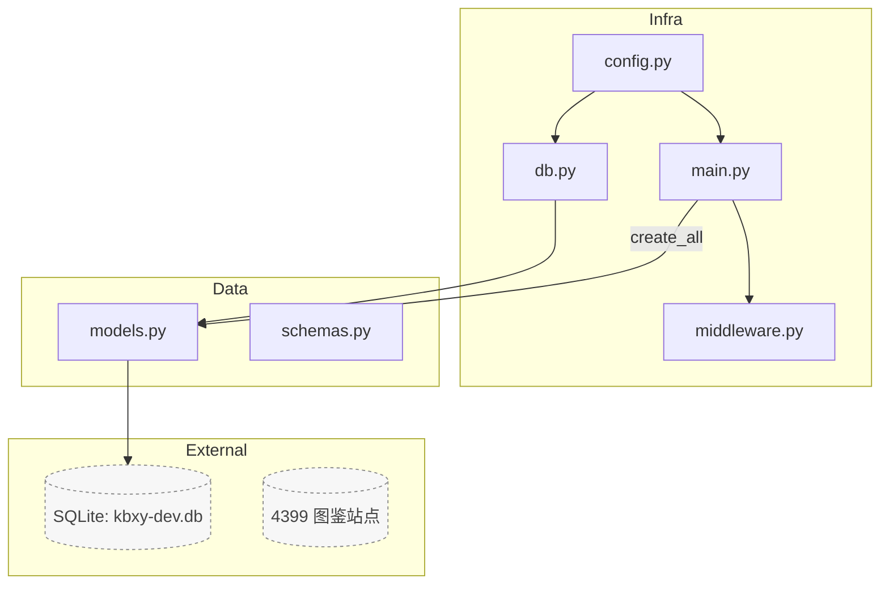
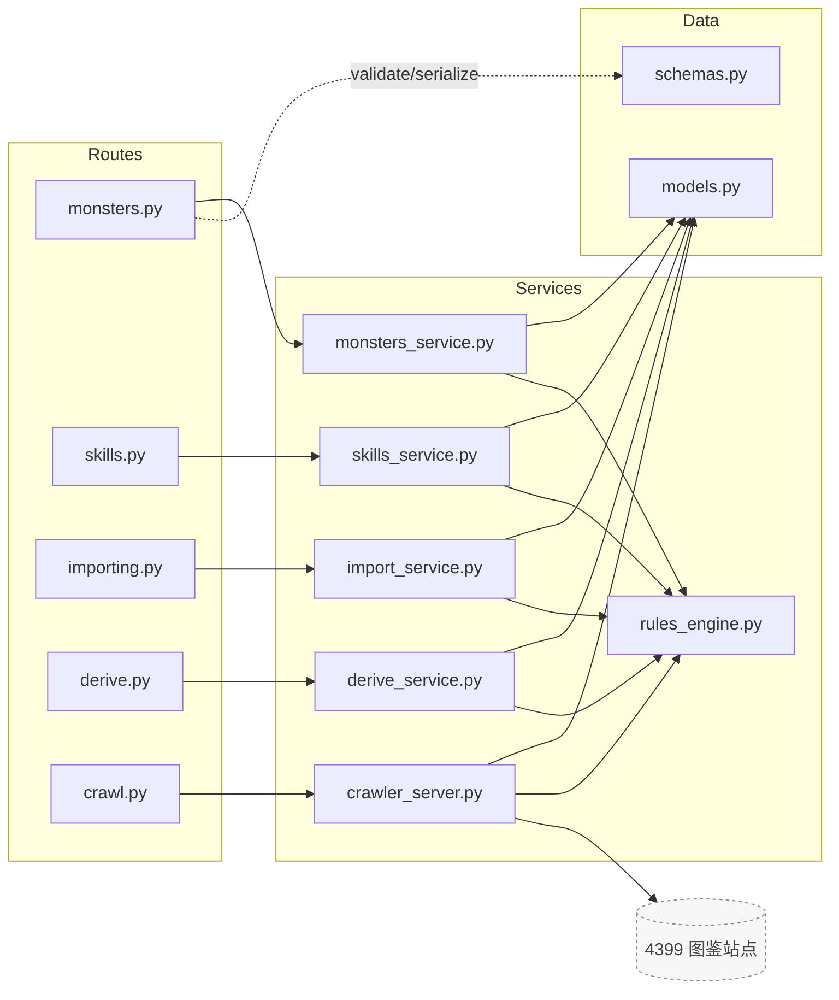
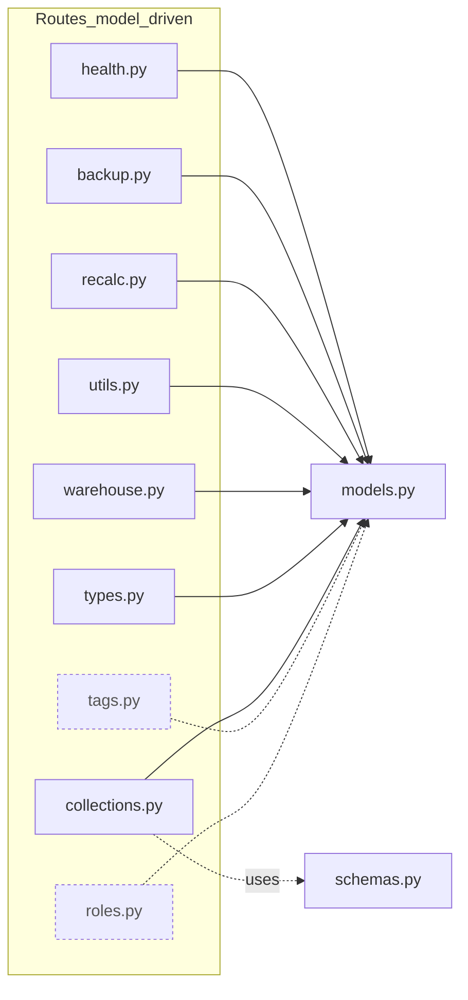

好的，这是**完整可读**的文件关系图合集（Mermaid v11 兼容）＋**逐文件关系说明**。图都做成小而清晰的块，并配套文字把所有依赖/调用关系说清楚。

---

## 小图 1 · 核心装配（Infra / Data / External）

---

## 小图 2A · 成对映射（路由 → 服务 → 数据）

---

## 小图 2B · 直接走模型的路由（更紧凑）

---

# 文字说明 · 文件与文件的关系（全量）

> 记号：**→** 表示“依赖/调用”；**⇢** 表示“被……使用”；**（可选）**为存在即挂载、缺失不报错的模块。

## Infra 层
- `config.py`
  - 提供：`Settings`/`settings`
  - **被使用**：`db.py`（构造数据库 URL 路径）、`main.py`（设置 app 名称/CORS）
- `db.py`
  - 依赖：`config.py`
  - 提供：`engine`、`SessionLocal`、`Base`；连接时设置 `WAL/NORMAL/foreign_keys=ON`
  - **被使用**：`models.py`（继承 `Base`）、`main.py`（`create_all`）、各服务/路由打开会话
- `middleware.py`
  - 提供：`TraceIDMiddleware`（注入/回传 `x-trace-id`）
  - **被使用**：`main.py`（`app.add_middleware`），路由/服务可读取 `request.state.trace_id`
- `main.py`
  - 依赖：`config.py`、`db.py`、`middleware.py`
  - 提供：`app`，集中 `include_router(...)`；执行一次性 `Base.metadata.create_all(bind=engine)`
  - **被使用**：作为 Uvicorn 入口 `server.app.main:app`

## Data 层
- `models.py`
  - 依赖：`db.py` 的 `Base`
  - 提供：ORM（`Monster`、`MonsterDerived`、`Tag`、`Skill`、`MonsterSkill`、`Collection`、`CollectionItem`、`ImportJob`、`Task`）与 `ensure_collections_tables`
  - **被使用**：所有服务层（CRUD/查询/派生）、部分路由（直接读写/导出/建表）
  - 外部：持久化到 **SQLite** 文件
- `schemas.py`
  - 提供：Pydantic v2 请求/响应模型（`MonsterIn/Out/...`、`SkillIn/Out`、`Collection*` 等）
  - **被使用**：所有路由做校验与序列化；服务层可作类型提示

## Services 层
- `rules_engine.py`
  - 提供：派生规则/技能规范化映射/标签派生等
  - **被使用**：`monsters_service.py`、`skills_service.py`、`import_service.py`、`derive_service.py`、`crawler_server.py`
- `monsters_service.py`
  - 依赖：`models.py`、`rules_engine.py`
  - 提供：怪物列表/筛选/CRUD、批删、仓库 possess 相关操作
  - **被使用**：`routes/monsters.py`、`routes/warehouse.py`
- `skills_service.py`
  - 依赖：`models.py`、`rules_engine.py`
  - 提供：怪物技能的 upsert/去重/规范化绑定
  - **被使用**：`routes/skills.py`
- `import_service.py`
  - 依赖：`models.py`、`rules_engine.py`
  - 提供：CSV/TSV 导入预览、单事务提交、幂等键处理、落库与标签/技能合并
  - **被使用**：`routes/importing.py`
- `derive_service.py`
  - 依赖：`models.py`、`rules_engine.py`
  - 提供：派生五维计算、批量派生接口
  - **被使用**：`routes/derive.py`、`routes/recalc.py`
- `crawler_server.py`
  - 依赖：`rules_engine.py`
  - 提供：4399 图鉴抓取（单页/全站）、字段规范化（技能 element/kind 等）
  - **被使用**：`routes/crawl.py`；（部分导入测试在 `routes/importing.py` 也可能透传调用）
  - 外部：访问 **4399 图鉴站点**

## Routes 层（按是否主要经由服务层）
- 经由服务层的路由（见小图 2A）
  - `routes/monsters.py` → `monsters_service.py` → `models.py`（使用 `schemas.py`）
  - `routes/skills.py` → `skills_service.py` → `models.py`（使用 `schemas.py`）
  - `routes/importing.py` → `import_service.py` → `models.py`（使用 `schemas.py`）
  - `routes/derive.py` → `derive_service.py` → `models.py`（使用 `schemas.py`）
  - `routes/crawl.py` → `crawler_server.py` → `models.py`（使用 `schemas.py`；外部 4399）
- 直接走模型/工具的路由（见小图 2B）
  - `routes/health.py` →（通常无需模型；若做 DB 探活可触达 `models.py`）
  - `routes/backup.py` → `models.py`（统计、导出 CSV、备份/恢复 JSON）
  - `routes/recalc.py` → `derive_service.py` 或 `models.py`（重算示例）
  - `routes/utils.py` → `models.py`（工具/临时接口）
  - `routes/warehouse.py` → `monsters_service.py` 或直接 `models.py`（仓库清单/批量 possess）
  - `routes/types.py` → `models.py`（元数据/枚举/选项）
  - `routes/collections.py` → `models.py` + `schemas.py`（收藏夹 CRUD 与批量成员）
  - `routes/tags.py`（可选）→ `models.py`（标签聚合/维护）
  - `routes/roles.py`（可选）→ `models.py`（角色/定位相关）
- 路由注册与可选模块
  - `main.py` **include_router**：`health, monsters, importing, backup, utils, skills, recalc, derive, crawl, warehouse, types, collections`
  - 可选挂载（**存在才挂**）：`tags, roles`

---

# 端到端调用示例

1) **列出怪物（GET /monsters）**  
`monsters.py` → `monsters_service.list(filters...)` → 读 `models.Monster`（可 `selectinload` 关联）→ 返回 `schemas.MonsterList`

2) **覆盖技能（PUT /monsters/{id}/skills）**  
`skills.py`（接收 `List[schemas.SkillIn]`） → `skills_service.upsert_skills(monster_id, skills)`（内部做名称去重与 element/kind 规范化，写 `MonsterSkill`/`Skill`）→ 返回 `List[schemas.SkillOut]`

3) **导入（POST /import/commit，单事务 + 幂等）**  
`importing.py` → `import_service.commit(file, idempotency_key)`（解析/映射/规则派生/单事务 upsert）→ 写入 `Monster/Tag/Skill/MonsterSkill` → 返回 `schemas.ImportResult`

4) **抓取单页（POST /api/v1/crawl/fetch_one）**  
`crawl.py` → `crawler_server.fetch_one(url)`（请求 4399，解析 + 规范化）→ 产出结构体（可直接落 `models` 或回传客户端）→ `schemas` 序列化

5) **收藏夹批量设置（POST /collections/bulk_set）**  
`collections.py`（接收 `schemas.BulkSetMembersIn`）→ 读写 `Collection/CollectionItem`（必要时 `ensure_collections_tables(engine)` 惰性建表）→ 回传 `schemas.BulkSetMembersOut`

---

# 一致性与演进建议（与关系强相关）
- **数据库优先级**：建议在 `db.py` 支持 `DATABASE_URL` 优先于 `KBXY_DB_PATH`，便于将来切换 Postgres；关系不变，依赖点集中在 `db.py`。
- **Trace 贯通**：`middleware.py` 注入的 `trace_id` 建议在全局异常处理器与服务层日志统一打印，方便从任一路由回溯到具体 SQL/规则执行。
- **可选路由的导入粒度**：`main.py` 的 `try/except` 最好只捕 `ImportError`，避免掩盖真实运行时错误，保证关系图中“可选依赖”不会误伤必选依赖。
- **收藏夹按需启用**：通过 `ensure_collections_tables` 把收藏相关表的创建与其路由/服务解耦，保证核心关系不受非核心功能影响。

如果你希望把这三张图直接合成到项目 README 的某个章节，我可以帮你给出“嵌入片段 + 折叠详情”的排版版本。