# kbxy-monsters-pro 数据流设计

## 系统数据流总览

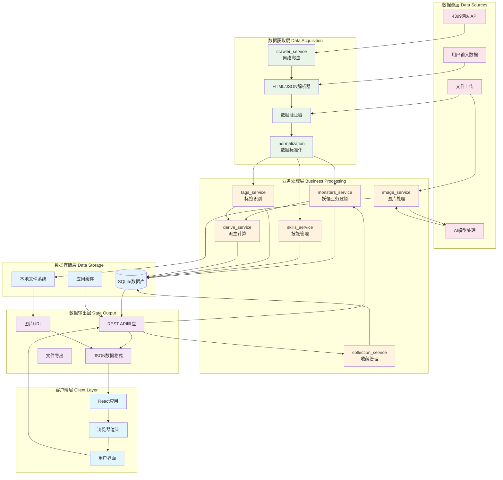

## 核心数据流程详解

### 1. 数据获取与入库流程

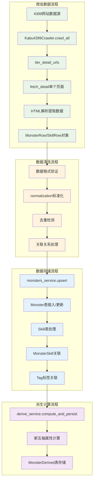

### 2. 用户查询与展示流程

```mermaid
graph LR
    subgraph "用户交互"
        A[用户界面操作] --> B[React组件事件]
        B --> C[React Query请求]
    end
    
    subgraph "API处理"
        C --> D[FastAPI路由匹配]
        D --> E[参数验证解析]
        E --> F[业务服务调用]
    end
    
    subgraph "数据查询"
        F --> G[SQLAlchemy查询构建]
        G --> H[复杂WHERE条件]
        H --> I[JOIN关联查询]
        I --> J[排序分页处理]
        J --> K[SQLite执行查询]
    end
    
    subgraph "结果处理"
        K --> L[ORM对象转换]
        L --> M[Pydantic序列化]
        M --> N[JSON响应构建]
        N --> O[HTTP响应返回]
    end
    
    subgraph "前端渲染"
        O --> P[React Query缓存]
        P --> Q[组件状态更新]
        Q --> R[虚拟DOM渲染]
        R --> S[浏览器界面更新]
    end
```

### 3. 图片上传与AI处理流程

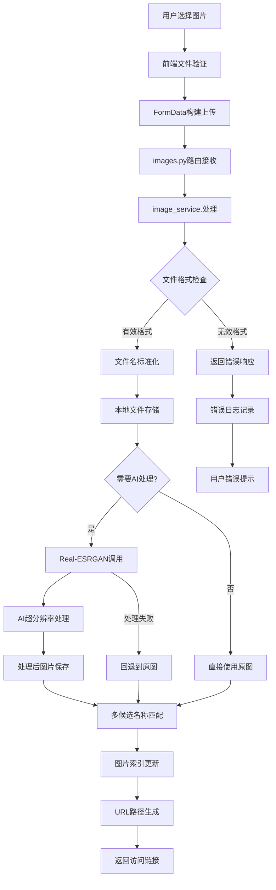

### 4. 标签智能识别流程

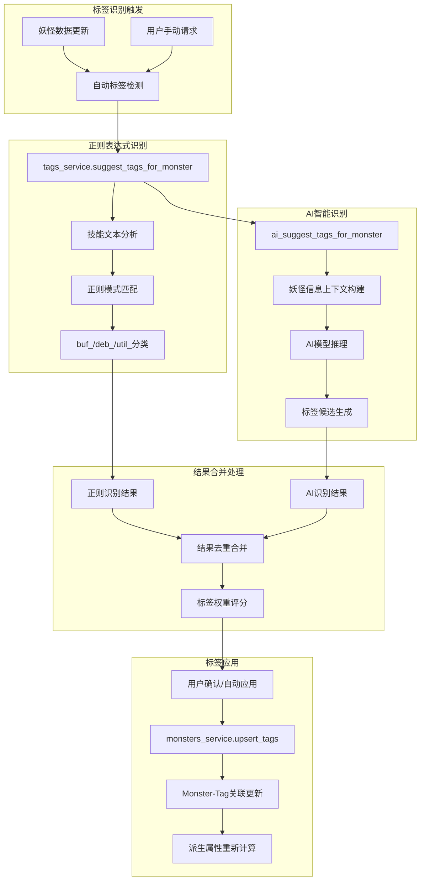

### 5. 派生属性计算流程

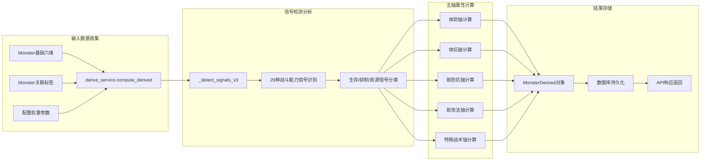

### 6. 收藏夹管理流程

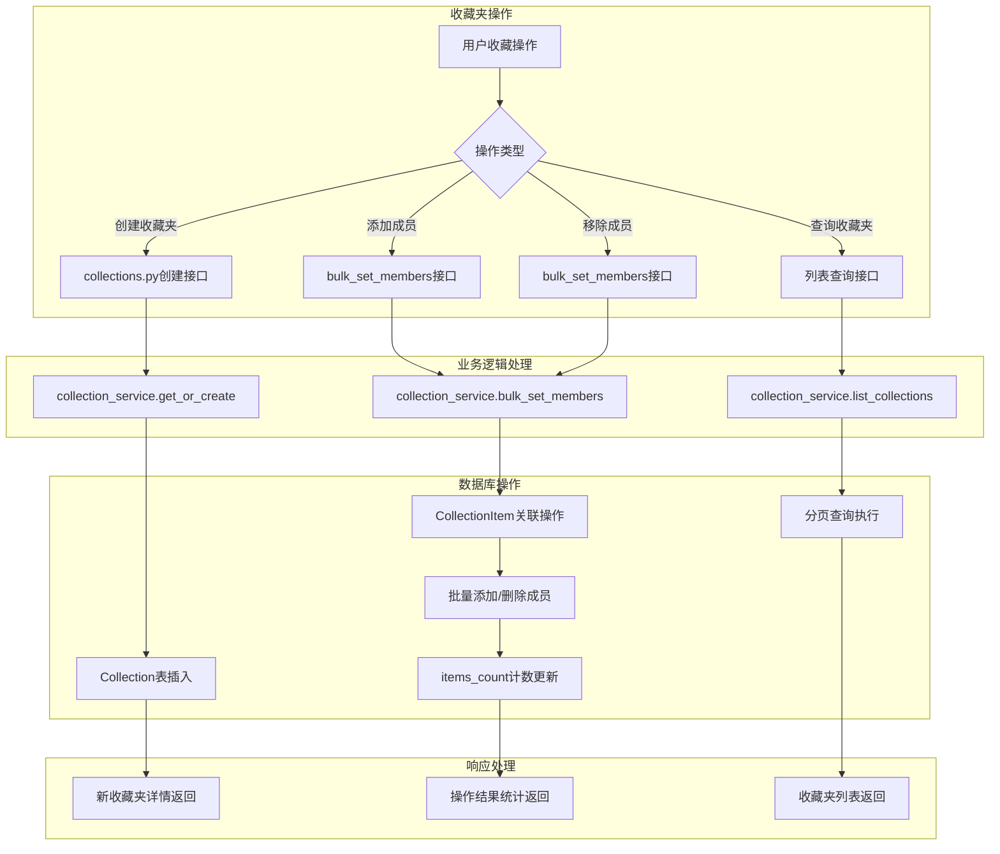

## 数据一致性保证机制

### 1. 事务管理流程

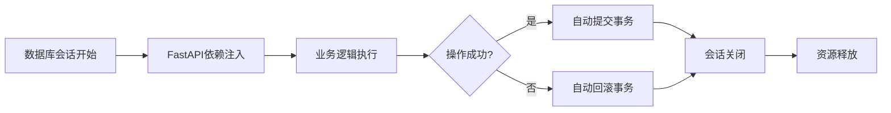

### 2. 数据验证流程

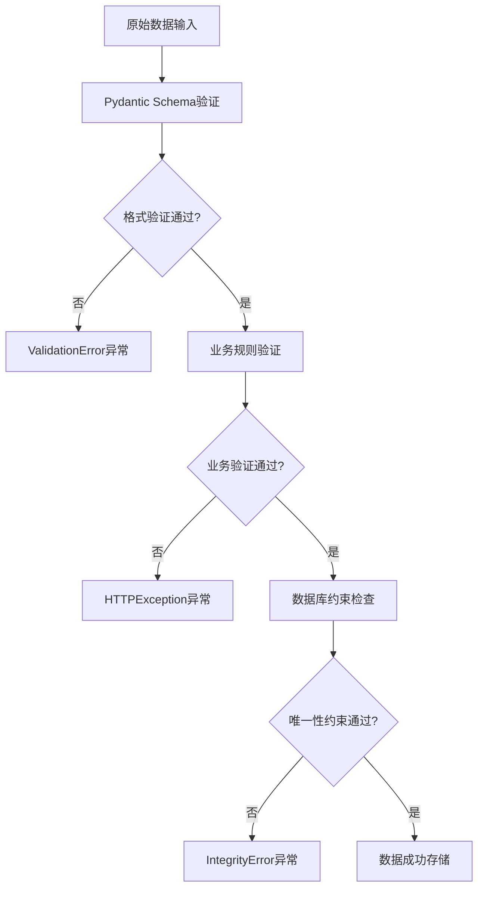

### 3. 缓存同步流程

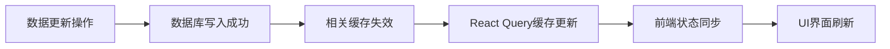

## 性能优化数据流

### 1. 查询优化流程

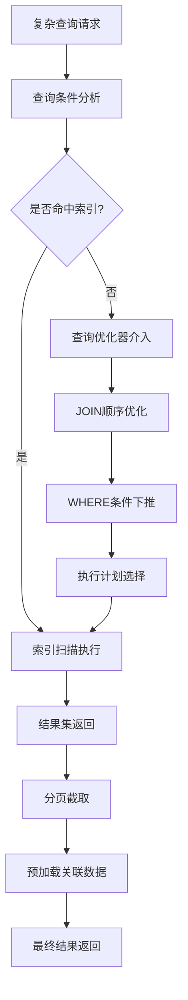

### 2. 批量处理优化

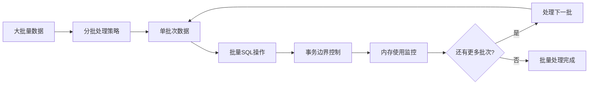

### 3. 图片处理优化

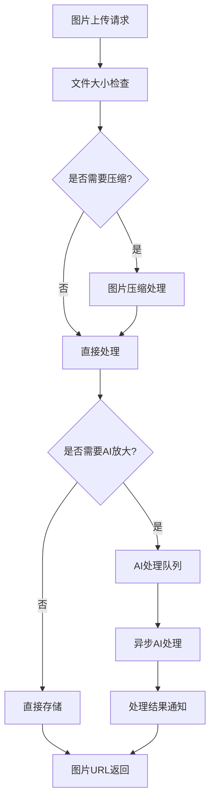

## 数据安全流程

### 1. 输入安全验证

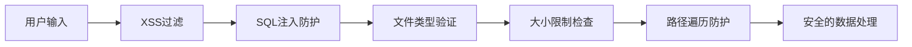

### 2. 数据备份流程

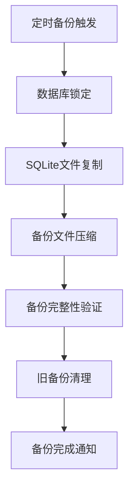

### 3. 错误处理与恢复

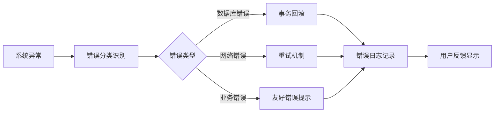

## 数据格式规范

### API数据交换格式

```json
{
  "妖怪查询响应": {
    "items": [
      {
        "id": "integer",
        "name": "string",
        "element": "string",
        "role": "string",
        "hp": "float",
        "speed": "float",
        "attack": "float",
        "defense": "float",
        "magic": "float",
        "resist": "float",
        "possess": "boolean",
        "tags": ["string"],
        "skills": [
          {
            "id": "integer",
            "name": "string",
            "element": "string",
            "kind": "string",
            "power": "integer",
            "description": "string"
          }
        ],
        "derived": {
          "body_defense": "integer",
          "body_resist": "integer", 
          "debuff_def_res": "integer",
          "debuff_atk_mag": "integer",
          "special_tactics": "integer"
        },
        "image_url": "string|null"
      }
    ],
    "total": "integer",
    "page": "integer",
    "page_size": "integer"
  }
}
```

### 数据库存储格式

- **Monster表**: 妖怪基础信息和六维属性
- **MonsterDerived表**: 计算得出的五轴派生属性
- **Skill表**: 技能基础信息
- **MonsterSkill表**: 妖怪-技能多对多关联
- **Tag表**: 标签分类信息
- **Collection表**: 收藏夹信息
- **CollectionItem表**: 收藏夹-妖怪关联

### 文件存储格式

- **图片文件**: `images/monsters/{normalized_name}.{ext}`
- **备份文件**: `backups/{timestamp}_backup.db`
- **导出文件**: `exports/{timestamp}_monsters.{csv|json}`
- **日志文件**: `logs/{date}.log`