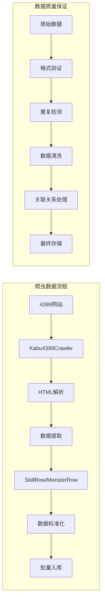
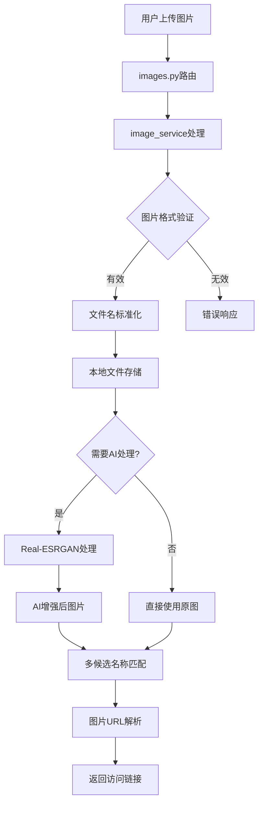
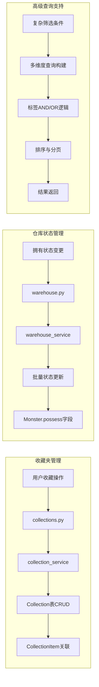
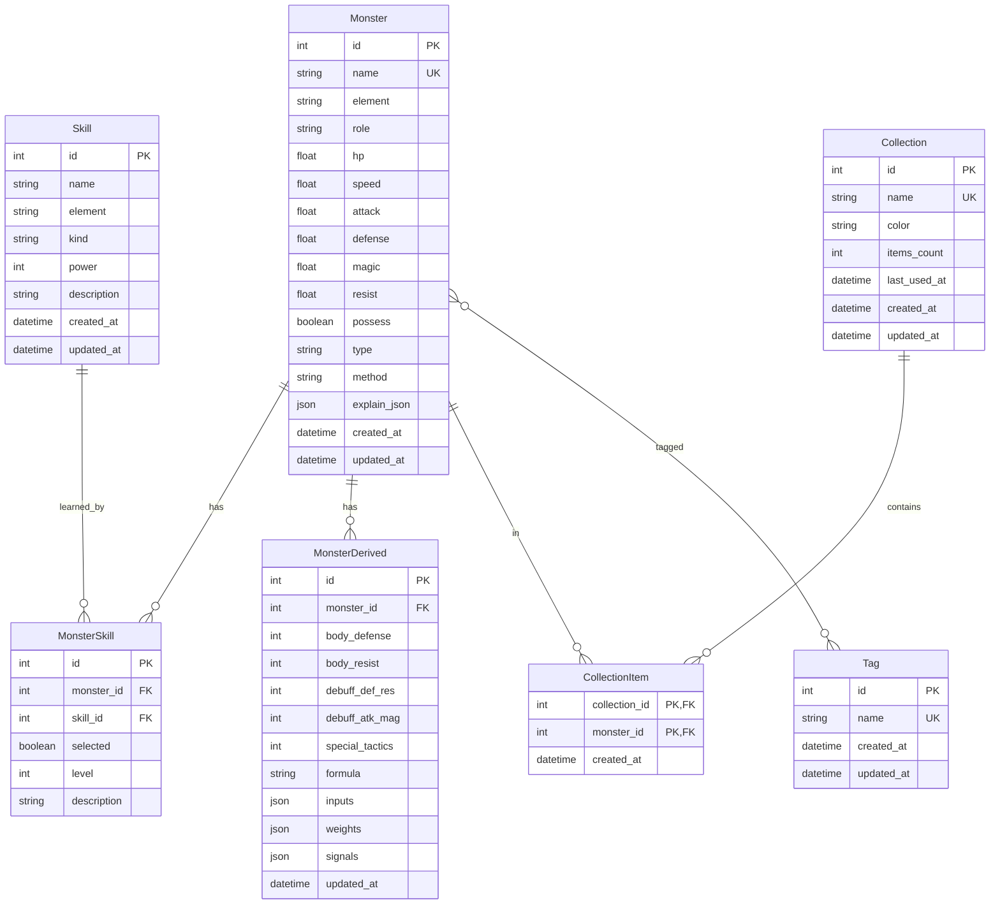

# kbxy-monsters-pro 系统架构概述

## 系统整体架构流程图

```mermaid
graph TB
    subgraph "Client Layer 客户端层"
        UI[React Frontend UI]
        Browser[Web Browser]
    end
    
    subgraph "Application Layer 应用层"
        subgraph "Entry Point 应用入口"
            Main[main.py<br/>FastAPI Application]
            MW[middleware.py<br/>TraceID, CORS]
        end
        
        subgraph "API Routes Layer 路由层"
            Routes{API Routes}
            MonstersR[monsters.py<br/>妖怪CRUD API]
            CrawlR[crawl.py<br/>数据爬取API]
            SkillsR[skills.py<br/>技能管理API]
            SkillsAdminR[skills_admin.py<br/>技能管理员API]
            TypesR[types.py<br/>属性系统API]
            WarehouseR[warehouse.py<br/>仓库API]
            CollectionsR[collections.py<br/>收藏API]
            DeriveR[derive.py<br/>派生属性API]
            ImagesR[images.py<br/>图片API]
            HealthR[health.py<br/>健康检查API]
            TagsR[tags.py<br/>标签API]
            RolesR[roles.py<br/>角色API]
            UtilsR[utils.py<br/>工具API]
        end
        
        subgraph "Business Services Layer 业务服务层"
            Services{Business Services}
            MonstersS[monsters_service.py<br/>妖怪核心业务逻辑]
            CrawlerS[crawler_service.py<br/>网络爬虫服务]
            DeriveS[derive_service.py<br/>派生属性计算]
            SkillsS[skills_service.py<br/>技能管理服务]
            TypesS[types_service.py<br/>属性系统服务]
            TagsS[tags_service.py<br/>标签体系服务]
            WarehouseS[warehouse_service.py<br/>仓库管理服务]
            CollectionS[collection_service.py<br/>收藏管理服务]
            ImageS[image_service.py<br/>图片处理服务]
            NormS[normalization.py<br/>数据标准化服务]
        end
    end
    
    subgraph "Data Layer 数据层"
        subgraph "Data Models 数据模型"
            Models[models.py<br/>SQLAlchemy Models]
            Schemas[schemas.py<br/>Pydantic Schemas]
        end
        
        subgraph "Database 数据库"
            DB[db.py<br/>Database Connection]
            SQLite[(SQLite Database)]
        end
        
        subgraph "Configuration 配置"
            Config[config.py<br/>Application Config]
        end
    end
    
    subgraph "External Resources 外部资源"
        WebSource[4399网站数据源]
        FileSystem[本地文件系统<br/>图片存储]
        AI[Real-ESRGAN<br/>AI图片处理]
    end
    
    %% 主要数据流向
    UI --> Main
    Main --> MW
    MW --> Routes
    
    Routes --> MonstersR
    Routes --> CrawlR
    Routes --> SkillsR
    Routes --> SkillsAdminR
    Routes --> TypesR
    Routes --> WarehouseR
    Routes --> CollectionsR
    Routes --> DeriveR
    Routes --> ImagesR
    Routes --> HealthR
    Routes --> TagsR
    Routes --> RolesR
    Routes --> UtilsR
    
    %% 修复：添加缺失的连接
    Routes --> Services 
    
    Services --> MonstersS
    Services --> CrawlerS
    Services --> DeriveS
    Services --> SkillsS
    Services --> TypesS
    Services --> TagsS
    Services --> WarehouseS
    Services --> CollectionS
    Services --> ImageS
    Services --> NormS
    
    MonstersR --> MonstersS
    CrawlR --> CrawlerS
    SkillsR --> SkillsS
    SkillsAdminR --> SkillsS
    TypesR --> TypesS
    WarehouseR --> WarehouseS
    CollectionsR --> CollectionS
    DeriveR --> DeriveS
    ImagesR --> ImageS
    TagsR --> TagsS
    
    MonstersS --> Models
    MonstersS --> Schemas
    CrawlerS --> Models
    CrawlerS --> Schemas
    DeriveS --> Models
    DeriveS --> Schemas
    
    Models --> DB
    Schemas --> DB
    DB --> SQLite
    Config --> DB
    
    CrawlerS --> WebSource
    ImageS --> FileSystem
    ImageS --> AI
    
    %% 关键业务流程连接
    MonstersS --> DeriveS
    MonstersS --> TagsS
    MonstersS --> NormS
    DeriveS --> TagsS
    SkillsS --> NormS
    
    %% 样式设置
    classDef clientLayer fill:#e1f5fe
    classDef routeLayer fill:#f3e5f5  
    classDef serviceLayer fill:#fff3e0
    classDef dataLayer fill:#e8f5e8
    classDef externalLayer fill:#fce4ec
    
    class UI,Browser clientLayer
    class Routes,MonstersR,CrawlR,SkillsR,SkillsAdminR,TypesR,WarehouseR,CollectionsR,DeriveR,ImagesR,HealthR,TagsR,RolesR,UtilsR routeLayer
    class Services,MonstersS,CrawlerS,DeriveS,SkillsS,TypesS,TagsS,WarehouseS,CollectionS,ImageS,NormS serviceLayer
    class Models,Schemas,DB,SQLite,Config dataLayer
    class WebSource,FileSystem,AI externalLayer
```

## 核心业务流程架构

### 1. 妖怪数据管理流程

```mermaid
graph TB
    subgraph "数据获取与处理"
        A[HTTP请求] --> B[monsters.py路由]
        B --> C[参数验证]
        C --> D[monsters_service业务逻辑]
        D --> E[数据库查询/更新]
        E --> F[models SQLAlchemy ORM]
        F --> G[SQLite数据库]
        
        H[爬虫数据源] --> I[crawler_service爬取]
        I --> J[数据清洗标准化]
        J --> K[normalization处理]
        K --> L[数据验证存储]
        L --> G
    end
    
    subgraph "派生属性计算"
        M[基础六维属性] --> N[derive_service]
        N --> O[标签信号检测]
        O --> P[新五轴计算]
        P --> Q[体防/体抗/削防抗/削攻法/特殊]
        Q --> R[MonsterDerived表存储]
    end
    
    subgraph "标签处理流程"
        S[标签识别需求] --> T[tags_service]
        T --> U[正则表达式匹配]
        T --> V[AI智能建议]
        U --> W[标签关联更新]
        V --> W
        W --> X[重新计算派生属性]
    end
```

### 2. 数据爬取与处理流程

### 3. 图片处理与AI增强流程

### 4. 收藏与仓库管理流程

## 数据库实体关系图

## 技术架构特点

### 分层架构设计
- **表现层**: React前端 + FastAPI路由层
- **业务层**: 独立的服务模块，封装核心业务逻辑
- **数据层**: SQLAlchemy ORM + SQLite数据库
- **基础层**: 配置管理 + 中间件 + 依赖注入

### 核心设计原则
- **单一职责**: 每个服务专注特定业务域
- **依赖注入**: FastAPI依赖系统管理数据库会话
- **数据驱动**: 基于Pydantic的严格数据验证
- **异步优先**: 支持高并发的异步处理模式
- **类型安全**: 完整的类型注解和验证

### 关键技术组件

#### 后端核心技术栈
- **FastAPI**: 现代Python Web框架，自动API文档
- **SQLAlchemy**: 强大的Python ORM框架
- **Pydantic**: 数据验证和序列化
- **SQLite**: 轻量级关系数据库，支持ACID事务
- **Real-ESRGAN**: AI图片超分辨率处理

#### 前端技术栈
- **React 18**: 现代化前端框架，支持并发特性
- **TypeScript**: 类型安全的JavaScript超集
- **Vite**: 下一代前端构建工具
- **TailwindCSS**: 实用优先的CSS框架
- **React Query**: 强大的数据获取和状态管理

### 数据处理能力

#### 爬虫系统特性
- **多策略解析**: BeautifulSoup + 正则表达式
- **智能容错**: 多重备选方案和错误恢复
- **数据标准化**: 统一的格式转换和清洗
- **批量处理**: 支持大规模数据导入

#### 派生属性计算
- **新五轴评估**: 从传统六围转换为战术维度
- **信号检测**: 基于标签的29种战斗能力识别
- **权重配置**: 灵活的计算权重和公式系统
- **实时更新**: 数据变更时自动重新计算

#### 标签智能系统
- **自动识别**: 正则表达式 + AI模型双重识别
- **分类体系**: buf_/deb_/util_三类标签体系
- **批量处理**: 支持全库标签自动更新
- **人工审核**: 提供建议机制支持人工确认

### 系统边界和约束

#### 技术约束
- **单机架构**: 基于SQLite的单节点部署
- **文件存储**: 本地文件系统存储图片  
- **内存限制**: AI图片处理需要GPU/大内存支持
- **并发限制**: SQLite的写并发限制

#### 业务约束  
- **数据一致性**: 严格的数据验证和标准化流程
- **用户体验**: 响应式设计，支持多设备访问
- **扩展性**: 模块化设计，支持新功能扩展
- **维护性**: 清晰的代码结构和文档支持

### 部署和运维

#### 开发环境
- **后端**: Python虚拟环境 + FastAPI开发服务器
- **前端**: Vite开发服务器 + HMR热更新  
- **数据库**: 本地SQLite文件
- **调试**: 完整的日志系统和错误追踪

#### 生产环境
- **后端部署**: Uvicorn ASGI服务器
- **前端部署**: 静态文件部署（Nginx/Apache）
- **数据管理**: SQLite 数据库
- **进程管理**: start-bg.sh/stop-bg.sh脚本

#### 扩展选项
- **容器化**: Docker支持（可选）
- **反向代理**: Nginx前置代理
- **监控**: 健康检查API + 日志系统
