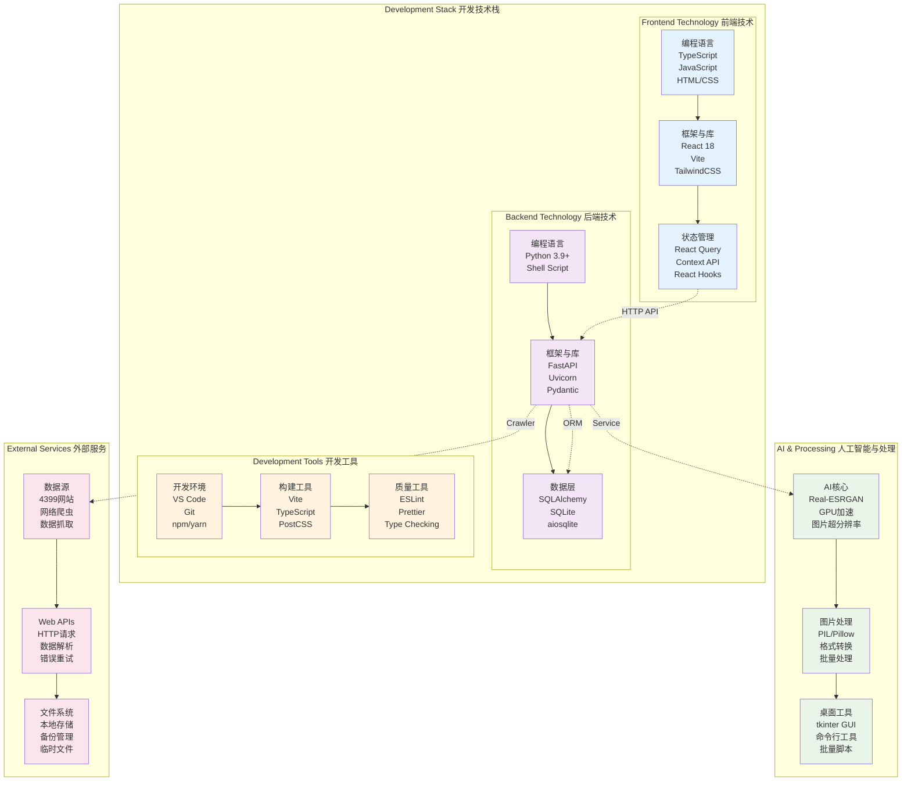
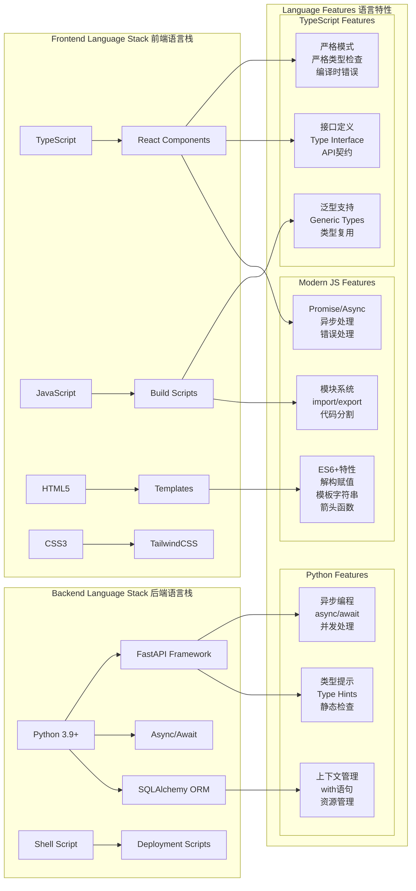
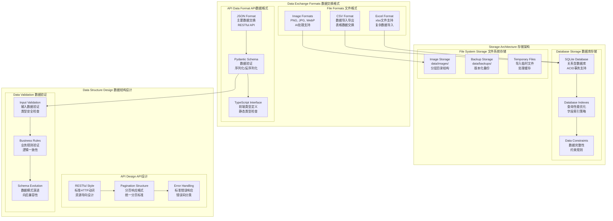

# kbxy-monsters-pro 技术栈架构图

## 技术栈整体架构



## 编程语言与框架架构



## 架构模式设计图

```mermaid
graph TB
    subgraph "Backend Architecture Patterns 后端架构模式"
        subgraph "Layered Architecture 分层架构"
            ROUTE_LAYER[Route Layer<br/>路由层<br/>HTTP端点定义]
            SERVICE_LAYER[Service Layer<br/>业务逻辑层<br/>核心业务规则]
            MODEL_LAYER[Model Layer<br/>数据模型层<br/>ORM映射]
            
            ROUTE_LAYER --> SERVICE_LAYER
            SERVICE_LAYER --> MODEL_LAYER
        end
        
        subgraph "Design Patterns 设计模式"
            DI[Dependency Injection<br/>依赖注入<br/>FastAPI依赖系统]
            DAO[Data Access Object<br/>数据访问对象<br/>SQLAlchemy ORM]
            STRATEGY[Strategy Pattern<br/>策略模式<br/>数据处理策略]
            FACTORY[Factory Pattern<br/>工厂模式<br/>导入导出工厂]
        end
    end
    
    subgraph "Frontend Architecture Patterns 前端架构模式"
        subgraph "Component Architecture 组件架构"
            COMP_HIER[Component Hierarchy<br/>组件层次<br/>单一职责原则]
            FUNC_COMP[Functional Components<br/>函数式组件<br/>React Hooks]
            COMP_STATE[Component State<br/>组件状态<br/>本地状态管理]
        end
        
        subgraph "State Management 状态管理"
            CONTEXT[Context Pattern<br/>上下文模式<br/>全局状态共享]
            PROVIDER[Provider Pattern<br/>提供者模式<br/>上下文提供者]
            HOOK[Hook Pattern<br/>Hook模式<br/>自定义逻辑封装]
            PORTAL[Portal Pattern<br/>传送门模式<br/>DOM渲染控制]
        end
        
        subgraph "React Patterns React模式"
            OBSERVER[Observer Pattern<br/>观察者模式<br/>状态更新监听]
            ADAPTER[Adapter Pattern<br/>适配器模式<br/>API数据适配]
            RENDER_PROP[Render Props<br/>渲染属性<br/>逻辑共享]
        end
    end
    
    %% 模式间的关系
    DI -."注入".-> SERVICE_LAYER
    DAO -."访问".-> MODEL_LAYER
    
    CONTEXT -."状态".-> PROVIDER
    HOOK -."逻辑".-> FUNC_COMP
    PORTAL -."渲染".-> COMP_HIER
    
    %% 跨端交互
    ROUTE_LAYER -."API".-> ADAPTER
    SERVICE_LAYER -."数据".-> OBSERVER
```



## 数据格式与存储架构



## 依赖管理与配置架构

```mermaid
graph TB
    subgraph "Dependencies Management 依赖管理"
        subgraph "Python Dependencies Python依赖"
            FASTAPI_ECO[FastAPI生态<br/>uvicorn<br/>pydantic<br/>sqlalchemy]
            ASYNC_LIBS[异步库<br/>aiofiles<br/>aiohttp<br/>异步IO处理]
            DATA_LIBS[数据处理<br/>pandas<br/>requests<br/>数据分析工具]
            IMG_LIBS[图片处理<br/>PIL/Pillow<br/>Real-ESRGAN<br/>AI处理库]
        end
        
        subgraph "Frontend Dependencies 前端依赖"
            REACT_ECO[React生态<br/>@tanstack/react-query<br/>react-dom<br/>状态管理]
            UI_LIBS[UI框架<br/>tailwindcss<br/>lucide-react<br/>图标组件]
            DEV_TOOLS_FE[开发工具<br/>vite<br/>typescript<br/>postcss]
            TYPE_DEFS[类型定义<br/>@types/*<br/>类型安全包]
        end
        
        subgraph "Version Strategy 版本策略"
            SEMVER[语义化版本<br/>SemVer规范<br/>版本兼容性]
            LOCK_FILES[锁定文件<br/>package-lock.json<br/>环境一致性]
            GRADUAL_UPGRADE[渐进升级<br/>分阶段升级<br/>依赖版本管理]
        end
    end
    
    subgraph "Configuration Management 配置管理"
        subgraph "Environment Configuration 环境配置"
            CONFIG_PY[config.py<br/>集中配置管理<br/>环境变量支持]
            ENV_SEPARATION[环境分离<br/>开发/测试/生产<br/>配置隔离]
            SECRETS_MGR[敏感信息<br/>环境变量<br/>密钥管理]
        end
        
        subgraph "Frontend Configuration 前端配置"
            VITE_CONFIG[vite.config.ts<br/>构建工具配置<br/>开发服务器]
            TAILWIND_CONFIG[tailwind.config.ts<br/>UI样式配置<br/>主题定制]
            POSTCSS_CONFIG[postcss.config.cjs<br/>CSS处理配置<br/>样式优化]
        end
        
        subgraph "Runtime Configuration 运行时配置"
            DYNAMIC_CONFIG[动态配置<br/>SettingsContext<br/>用户可配置项]
            LOCAL_STORAGE[本地存储<br/>localStorage<br/>设置持久化]
            CONTEXT_PROVIDER[上下文提供者<br/>配置分发<br/>全局访问]
        end
    end
    
    %% 依赖关系
    FASTAPI_ECO --> CONFIG_PY
    ASYNC_LIBS --> ENV_SEPARATION
    DATA_LIBS --> SECRETS_MGR
    
    REACT_ECO --> VITE_CONFIG
    UI_LIBS --> TAILWIND_CONFIG
    DEV_TOOLS_FE --> POSTCSS_CONFIG
    
    SEMVER --> LOCK_FILES
    LOCK_FILES --> GRADUAL_UPGRADE
    
    CONFIG_PY --> DYNAMIC_CONFIG
    VITE_CONFIG --> LOCAL_STORAGE
    DYNAMIC_CONFIG --> CONTEXT_PROVIDER
```

## 部署与性能优化架构

```mermaid
graph TB
    subgraph "Deployment Architecture 部署架构"
        subgraph "Development Environment 开发环境"
            DEV_PYTHON[Python虚拟环境<br/>依赖隔离<br/>版本管理]
            DEV_SERVERS[开发服务器<br/>FastAPI热重载<br/>Vite HMR]
            DEV_PARALLEL[并行开发<br/>前后端独立<br/>API Mock]
        end
        
        subgraph "Production Deployment 生产部署"
            PROD_ASGI[ASGI服务器<br/>Uvicorn<br/>多进程部署]
            PROD_STATIC[静态文件服务<br/>构建产物<br/>CDN集成]
            PROD_PROCESS[进程管理<br/>Shell脚本<br/>生命周期管理]
            PROD_DATA[数据持久化<br/>SQLite文件<br/>备份策略]
        end
        
        subgraph "Scalability Options 扩展性选项"
            CONTAINER[容器化支持<br/>Docker部署<br/>可选方案]
            LOAD_BALANCE[负载均衡<br/>Nginx代理<br/>反向代理]
            MONITORING[监控集成<br/>健康检查API<br/>日志系统]
        end
    end
    
    subgraph "Performance Optimization 性能优化"
        subgraph "Frontend Optimization 前端优化"
            FE_BUILD[构建优化<br/>Vite构建<br/>Tree Shaking]
            FE_SPLIT[代码分割<br/>懒加载<br/>动态导入]
            FE_CACHE[缓存策略<br/>React Query<br/>客户端缓存]
        end
        
        subgraph "Backend Optimization 后端优化"
            BE_ASYNC[异步处理<br/>并发请求<br/>非阻塞IO]
            BE_INDEX[数据库索引<br/>查询优化<br/>性能提升]
            BE_POOL[连接池<br/>资源复用<br/>并发控制]
        end
        
        subgraph "Resource Optimization 资源优化"
            IMG_OPT[图片优化<br/>AI放大<br/>压缩处理]
            MEMORY_MGR[内存管理<br/>垃圾回收<br/>资源释放]
            DISK_OPT[磁盘优化<br/>文件分层<br/>清理策略]
        end
    end
    
    %% 部署流程
    DEV_PYTHON --> PROD_ASGI
    DEV_SERVERS --> PROD_STATIC
    DEV_PARALLEL --> PROD_PROCESS
    
    PROD_ASGI --> CONTAINER
    PROD_STATIC --> LOAD_BALANCE
    PROD_PROCESS --> MONITORING
    
    %% 优化关系
    FE_BUILD --> FE_SPLIT
    FE_SPLIT --> FE_CACHE
    
    BE_ASYNC --> BE_INDEX
    BE_INDEX --> BE_POOL
    
    IMG_OPT --> MEMORY_MGR
    MEMORY_MGR --> DISK_OPT
    
    %% 跨层优化
    FE_CACHE -."减少请求".-> BE_ASYNC
    BE_POOL -."提升性能".-> PROD_ASGI
    MONITORING -."性能监控".-> MEMORY_MGR