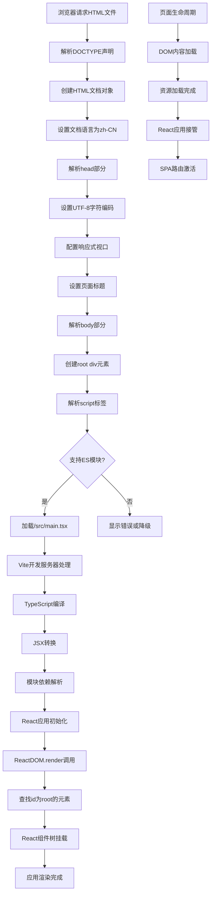

# 文件分析报告：client/index.html

## 文件概述

`client/index.html` 是React应用程序的主入口HTML文件，提供了单页应用(SPA)的基础HTML结构。该文件采用HTML5标准，配置了中文语言环境，设置了响应式视口，并提供了React应用挂载点。作为Vite构建工具的入口文件，通过ES模块加载TypeScript React应用，体现了现代前端开发的最佳实践。

## 代码结构分析

### 导入依赖

```html
<!doctype html>
<html lang="zh-CN">
```

- **HTML5文档类型**：使用标准的HTML5 DOCTYPE声明
- **语言属性**：指定中文简体语言环境，有利于搜索引擎和可访问性

### 全局变量和常量

该HTML文件为静态文档，不包含JavaScript变量定义。

### 配置和设置

#### 文档头部配置
```html
<head>
  <meta charset="UTF-8" />
  <meta name="viewport" content="width=device-width, initial-scale=1.0" />
  <title>卡布妖怪图鉴 Pro</title>
</head>
```

- **字符编码**：UTF-8支持多语言字符
- **视口设置**：响应式设计的标准视口配置
- **页面标题**：应用名称"卡布妖怪图鉴 Pro"

#### 文档主体配置
```html
<body>
  <div id="root"></div>
  <script type="module" src="/src/main.tsx"></script>
</body>
```

- **React挂载点**：id为"root"的div元素
- **模块加载**：ES模块方式加载TypeScript React入口文件

## 函数详细分析

### 函数概览表

| 元素/功能 | 类型 | 作用 | 重要性 |
|---------|------|------|--------|
| DOCTYPE声明 | HTML声明 | 定义HTML5文档类型 | 核心 |
| html元素 | HTML元素 | 文档根元素，设置语言 | 核心 |
| meta charset | 元数据 | 定义字符编码 | 核心 |
| meta viewport | 元数据 | 配置响应式视口 | 核心 |
| title元素 | 文档标题 | 设置页面标题 | 重要 |
| root div | 容器元素 | React应用挂载点 | 核心 |
| script元素 | 脚本加载 | 加载主应用模块 | 核心 |

### 函数详细说明

#### DOCTYPE声明
```html
<!doctype html>
```

**功能特性**：
- **标准模式**：确保浏览器使用标准模式渲染
- **HTML5兼容**：启用所有HTML5特性
- **跨浏览器一致性**：统一不同浏览器的渲染行为

#### html根元素
```html
<html lang="zh-CN">
```

**语言配置**：
- **语言标识**：zh-CN指定中文简体
- **可访问性**：辅助屏幕阅读器正确发音
- **SEO优化**：帮助搜索引擎理解内容语言

#### meta字符编码
```html
<meta charset="UTF-8" />
```

**编码设置**：
- **Unicode支持**：UTF-8支持全球所有字符
- **中文显示**：确保中文字符正确显示
- **数据传输**：与服务器字符编码保持一致

#### meta视口配置
```html
<meta name="viewport" content="width=device-width, initial-scale=1.0" />
```

**响应式配置**：
- **设备宽度适配**：width=device-width使用设备真实宽度
- **缩放控制**：initial-scale=1.0设置初始缩放比例
- **移动端优化**：确保在移动设备上正确显示

#### title页面标题
```html
<title>卡布妖怪图鉴 Pro</title>
```

**标题功能**：
- **浏览器标签**：显示在浏览器标签页
- **书签标题**：用户收藏时的默认标题
- **搜索引擎**：作为搜索结果的主要标题

#### React挂载点
```html
<div id="root"></div>
```

**容器特性**：
- **唯一标识**：id="root"作为React应用的挂载点
- **DOM操作目标**：React.render()的目标容器
- **应用边界**：定义React应用的DOM边界

#### 模块脚本加载
```html
<script type="module" src="/src/main.tsx"></script>
```

**加载特性**：
- **ES模块**：type="module"启用ES模块支持
- **TypeScript入口**：加载.tsx文件，支持TypeScript和JSX
- **Vite集成**：与Vite构建工具的默认配置兼容
- **开发模式**：开发时支持热更新和模块替换

## 类详细分析

### 类概览表
HTML文档为标记语言，不包含类定义。

### 类详细说明
不适用。

## 函数调用流程图



## 变量作用域分析

### 全局HTML作用域
- **document对象**：整个HTML文档在浏览器中的表示
- **window对象**：全局JavaScript执行环境
- **DOM元素**：所有HTML元素在DOM树中的表示

### 文档元数据作用域
- **charset设置**：影响整个文档的字符解析
- **viewport配置**：影响整个页面的视觉视口
- **title内容**：影响浏览器标签和书签显示

### React应用作用域
- **root元素**：React应用的DOM挂载边界
- **模块作用域**：ES模块的独立作用域
- **组件层次**：React组件树的作用域层次

## 函数依赖关系

### 外部依赖
- **浏览器引擎**：HTML解析和渲染引擎
- **Vite开发服务器**：开发时的模块加载和热更新
- **React库**：通过main.tsx间接依赖
- **TypeScript编译器**：通过Vite集成

### 内部依赖图
```
index.html
├── DOCTYPE (HTML5标准)
├── html[lang="zh-CN"]
│   ├── head
│   │   ├── meta[charset="UTF-8"]
│   │   ├── meta[name="viewport"]
│   │   └── title
│   └── body
│       ├── div#root (React挂载点)
│       └── script[type="module"] → /src/main.tsx
│           └── 依赖链
│               ├── React库
│               ├── ReactDOM
│               ├── 应用组件
│               └── CSS样式
```

### 数据流分析

#### 加载阶段数据流
1. **HTTP请求** → HTML文件下载 → 浏览器解析
2. **DOM构建** → 元素创建 → 事件监听准备
3. **脚本加载** → ES模块请求 → TypeScript编译

#### 运行时数据流
1. **React初始化** → 虚拟DOM创建 → 组件树构建
2. **DOM挂载** → root元素查找 → 组件渲染
3. **事件系统** → 浏览器事件 → React合成事件

#### 用户交互数据流
1. **用户操作** → 浏览器事件 → React事件处理
2. **状态变更** → 组件重渲染 → DOM更新
3. **路由导航** → URL变化 → 组件切换

### 错误处理

#### HTML解析错误
- **字符编码错误**：UTF-8确保字符正确显示
- **视口配置错误**：标准viewport设置避免布局问题
- **语言标识错误**：正确的lang属性确保可访问性

#### 脚本加载错误
- **模块不支持**：现代浏览器都支持ES模块
- **文件路径错误**：Vite确保正确的文件路径解析
- **编译错误**：TypeScript编译错误会在开发时显示

#### React挂载错误
- **挂载点缺失**：确保root元素存在
- **重复挂载**：React防止重复挂载到同一元素
- **渲染错误**：React错误边界捕获组件错误

### 性能分析

#### 时间复杂度
- **HTML解析**：O(n) - n为HTML元素数量
- **DOM创建**：O(n) - n为DOM节点数量
- **脚本加载**：O(1) - 单个脚本文件加载

#### 空间复杂度
- **DOM内存**：O(n) - n为DOM节点和属性数量
- **脚本内存**：O(1) - 基础HTML结构内存占用
- **React内存**：取决于应用复杂度

#### 性能优化特性
- **最小HTML**：精简的HTML结构减少解析时间
- **ES模块**：支持代码分割和按需加载
- **Vite优化**：开发时快速热更新，生产时优化打包

### 算法复杂度

#### HTML解析算法
- **词法分析**：O(n) - 扫描整个HTML文本
- **语法分析**：O(n) - 构建DOM树
- **渲染树构建**：O(n) - 结合CSS创建渲染树

#### 模块加载算法
- **依赖解析**：O(d) - d为依赖深度
- **循环依赖检测**：O(n) - n为模块数量
- **缓存查找**：O(1) - 模块缓存

### 扩展性评估

#### HTML结构扩展性
- **元数据扩展**：可添加更多meta标签（SEO、PWA等）
- **预加载资源**：可添加link preload提高性能
- **第三方集成**：可集成分析、广告等第三方脚本

#### 应用集成扩展性
- **多框架支持**：可同时集成Vue、Angular等
- **微前端架构**：支持模块联邦等微前端方案
- **PWA功能**：可扩展为渐进式Web应用

#### 构建工具扩展性
- **Webpack迁移**：可替换为Webpack等其他构建工具
- **多环境配置**：支持开发、测试、生产等多环境
- **构建优化**：支持懒加载、代码分割等优化策略

### 代码质量评估

#### 可读性
- **标准HTML结构**：遵循HTML5最佳实践
- **清晰的语义**：元素用途明确
- **注释友好**：结构简单易于理解

#### 可维护性
- **标准化配置**：使用行业标准配置
- **最小化复杂度**：避免不必要的HTML元素
- **工具链集成**：与现代前端工具链完美集成

#### 健壮性
- **跨浏览器兼容**：HTML5和ES模块的广泛支持
- **错误恢复**：HTML解析的容错性
- **性能稳定**：简单结构确保稳定性能

#### 可测试性
- **E2E测试友好**：提供明确的DOM结构
- **自动化测试**：支持Cypress、Playwright等工具
- **调试支持**：开发工具友好的结构

### 文档完整性

文件结构清晰，使用标准HTML5语法，符合Web标准规范。

### 备注

这是一个设计精良的HTML入口文件，体现了现代前端开发的最佳实践。虽然结构简单，但配置完整，为React应用提供了稳定的基础环境。与Vite构建工具的集成确保了优秀的开发体验和生产性能。