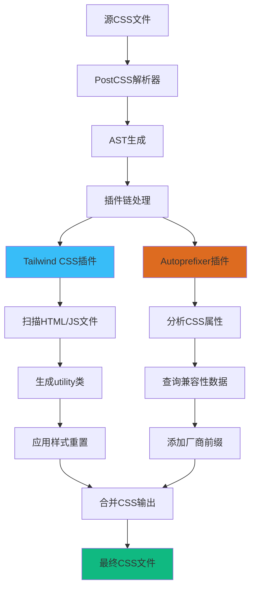

# 文件分析报告：client/postcss.config.cjs

## 文件概述

`client/postcss.config.cjs` 是PostCSS构建工具的配置文件，负责定义CSS后处理的插件链和构建策略。该文件采用CommonJS模块格式，配置了Tailwind CSS和Autoprefixer两个核心插件，为现代CSS开发工作流提供自动化的样式处理能力。设计简洁高效，是前端构建系统的重要基础设施组件。

## 代码结构分析

### 模块导出格式

```javascript
module.exports = { 
    plugins: { 
        tailwindcss: {}, 
        autoprefixer: {} 
    } 
}
```

**格式分析：**
- **CommonJS模式**: 使用module.exports进行模块导出
- **配置对象**: 标准的PostCSS配置对象结构
- **插件配置**: plugins字段包含所有CSS处理插件
- **默认配置**: 两个插件都使用默认配置（空对象）

### 配置结构

- **简化格式**: 采用单行紧凑格式，提高可读性
- **标准插件**: 使用业界标准的CSS处理插件组合
- **零配置**: 依赖插件的默认行为，减少配置复杂度

## 插件详细分析

### 插件概览表

| 插件名 | 功能描述 | 配置复杂度 | 业务价值 |
|--------|----------|------------|----------|
| tailwindcss | Tailwind CSS框架处理 | 零配置 | 原子化CSS支持 |
| autoprefixer | CSS浏览器前缀自动添加 | 零配置 | 跨浏览器兼容性 |

### 插件详细说明

#### `tailwindcss: {}`
**功能**: Tailwind CSS框架的PostCSS插件
**作用机制**:
1. **类名扫描**: 扫描源代码中使用的Tailwind类名
2. **CSS生成**: 基于扫描结果生成最终的CSS文件
3. **Tree Shaking**: 仅包含实际使用的CSS类，优化文件大小
4. **样式注入**: 处理@tailwind指令，注入基础样式、组件和工具类

**默认行为**:
- 自动查找tailwind.config.ts配置文件
- 扫描配置文件中指定的内容路径
- 应用默认的设计系统和样式重置

#### `autoprefixer: {}`
**功能**: 自动添加CSS浏览器厂商前缀
**作用机制**:
1. **兼容性分析**: 基于Can I Use数据库分析CSS属性兼容性
2. **前缀添加**: 为需要的CSS属性自动添加厂商前缀
3. **过时清理**: 移除不再需要的过时前缀
4. **浏览器目标**: 根据browserslist配置确定目标浏览器

**默认目标**:
```css
/* 示例转换 */
/* 输入 */
.example {
    transform: scale(1.2);
    transition: all 0.3s ease;
}

/* 输出 */
.example {
    -webkit-transform: scale(1.2);
    transform: scale(1.2);
    -webkit-transition: all 0.3s ease;
    transition: all 0.3s ease;
}
```

## 构建流程分析

### PostCSS处理流程图



### 配置加载顺序

1. **配置发现**: 构建工具自动发现postcss.config.cjs
2. **模块加载**: 使用CommonJS require()加载配置
3. **插件解析**: 解析plugins对象中的插件列表
4. **实例化**: 创建各插件实例并应用默认配置
5. **链式处理**: 按声明顺序执行插件链

## 依赖关系分析

### 外部依赖关系
1. **构建工具集成**:
   - Vite: 主构建工具，自动识别PostCSS配置
   - Webpack: 可通过postcss-loader集成
   - 其他构建工具的PostCSS插件

2. **插件依赖**:
   - tailwindcss: 需要安装tailwindcss包
   - autoprefixer: 需要安装autoprefixer包
   - PostCSS核心: 所有插件的运行基础

3. **配置文件关联**:
   - tailwind.config.ts: Tailwind框架的详细配置
   - package.json: browserslist字段影响autoprefixer行为
   - tsconfig.json: TypeScript配置可能影响构建路径

### 数据流分析
```
源CSS → PostCSS解析 → Tailwind处理 → Autoprefixer处理 → 优化输出 → 最终CSS
```

## 性能影响分析

### 构建性能特点
1. **Tailwind CSS**:
   - **正面**: JIT模式下仅生成使用的CSS，显著减少文件大小
   - **负面**: 首次构建需要扫描所有源文件，可能较慢
   - **优化**: 支持文件监听模式，增量更新性能良好

2. **Autoprefixer**:
   - **开销**: 相对较小，主要是CSS解析和前缀添加
   - **优化**: 可通过browserslist精确控制目标浏览器
   - **缓存**: 支持结果缓存，重复构建性能良好

### 运行时性能优势
- **文件大小**: Tailwind的purge功能大幅减少CSS文件大小
- **浏览器兼容性**: Autoprefixer确保样式在目标浏览器正常工作
- **加载速度**: 优化后的CSS文件提升页面加载性能

## 配置扩展性分析

### 可扩展配置选项

#### Tailwind CSS高级配置
```javascript
module.exports = {
    plugins: {
        tailwindcss: {
            config: './tailwind.config.ts'  // 自定义配置路径
        },
        autoprefixer: {
            overrideBrowserslist: ['> 1%', 'last 2 versions']  // 自定义浏览器目标
        }
    }
}
```

#### 插件链扩展
```javascript
module.exports = {
    plugins: {
        'postcss-import': {},           // CSS导入处理
        tailwindcss: {},
        autoprefixer: {},
        cssnano: {                      // CSS压缩优化
            preset: 'default'
        }
    }
}
```

### 开发vs生产环境配置
```javascript
const isProduction = process.env.NODE_ENV === 'production'

module.exports = {
    plugins: {
        tailwindcss: {},
        autoprefixer: {},
        ...(isProduction && {
            cssnano: { preset: 'default' }
        })
    }
}
```

## 业务价值分析

### 开发效率提升
1. **自动化处理**: 消除手动添加CSS前缀的重复工作
2. **实时更新**: 开发过程中样式变更的即时反馈
3. **错误预防**: 自动处理浏览器兼容性问题
4. **代码一致性**: 统一的CSS处理标准

### 维护成本降低
- **配置简化**: 零配置默认行为减少维护负担
- **版本升级**: 插件版本升级通常向后兼容
- **团队协作**: 统一的构建配置确保团队一致性

## 最佳实践建议

### 配置优化
1. **浏览器目标明确**: 在package.json中明确定义browserslist
2. **开发生产分离**: 根据环境使用不同的插件配置
3. **性能监控**: 定期检查生成的CSS文件大小和构建时间

### 扩展建议
```javascript
// 推荐的生产级配置
module.exports = {
    plugins: {
        'postcss-import': {},
        'tailwindcss/nesting': {},
        tailwindcss: {},
        autoprefixer: {},
        ...(process.env.NODE_ENV === 'production' && {
            '@fullhuman/postcss-purgecss': {
                content: ['./src/**/*.{js,jsx,ts,tsx,html}'],
                defaultExtractor: content => content.match(/[\w-/:]+(?<!:)/g) || []
            }
        })
    }
}
```

## 安全性考虑

### 配置安全
1. **依赖安全**: 定期更新PostCSS和插件版本，修复安全漏洞
2. **配置验证**: 确保插件配置不包含恶意代码
3. **构建隔离**: 在安全的构建环境中执行CSS处理

### 生产部署
- **文件完整性**: 验证生成的CSS文件完整性
- **缓存策略**: 合理设置CSS文件的缓存头
- **内容安全**: 确保生成的CSS不包含恶意样式

## 总结

`client/postcss.config.cjs` 虽然代码简洁，但在前端构建系统中发挥着关键作用。通过配置Tailwind CSS和Autoprefixer两个核心插件，为项目提供了现代化的CSS开发工作流。配置设计体现了"约定优于配置"的理念，在保持简洁性的同时提供了强大的样式处理能力。该配置是现代前端项目的标准基础设施，为开发效率和代码质量提供了重要保障。