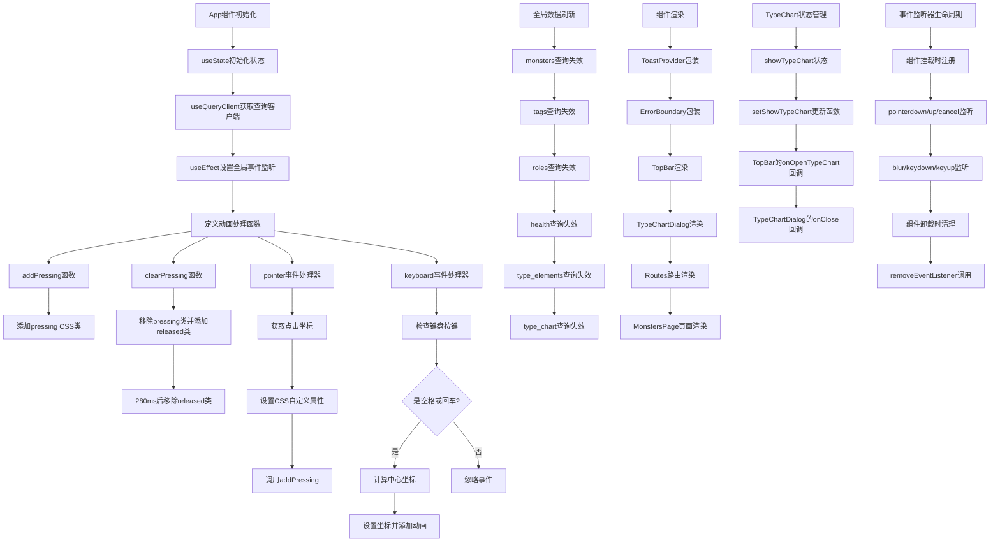

# 文件分析报告：client/src/App.tsx

## 文件概述

`client/src/App.tsx` 是React应用程序的根组件，负责整个应用的顶层架构和全局功能的初始化。该组件集成了路由管理、全局状态提供者、错误边界、交互动画系统和查询缓存管理等核心功能。通过Provider模式组织应用架构，实现了全局的数据刷新、按钮交互动画和模态对话框管理，为整个怪物图鉴应用提供了统一的用户体验基础。

## 代码结构分析

### 导入依赖

```typescript
import React, { useEffect, useState } from 'react'
import { Routes, Route } from 'react-router-dom'
import { useQueryClient } from '@tanstack/react-query'
import TopBar from './components/TopBar'
import { ToastProvider } from './components/Toast'
import { ErrorBoundary } from './components/ErrorBoundary'
import MonstersPage from './pages/MonstersPage'
import { SettingsProvider } from './context/SettingsContext'
import TypeChartDialog from './components/TypeChartDialog'
```

- **React核心**：useState和useEffect管理组件状态和副作用
- **路由系统**：react-router-dom的Routes和Route组件
- **状态管理**：TanStack Query的查询客户端
- **UI组件**：TopBar导航栏、Toast通知、ErrorBoundary错误边界
- **页面组件**：MonstersPage主要功能页面
- **Context系统**：SettingsProvider应用配置提供者
- **对话框组件**：TypeChartDialog类型图表弹窗

### 全局变量和常量

该组件内部定义了本地状态变量：
- **qc**: useQueryClient实例，用于查询缓存管理
- **showTypeChart**: boolean状态，控制类型图表对话框的显示

### 配置和设置

#### 查询缓存配置
- **invalidateQueries策略**：统一清除多个查询缓存
- **查询键标准化**：使用标准化的查询键命名规范
- **缓存失效范围**：涵盖monsters、tags、roles、health、type_elements、type_chart

#### 交互动画配置
- **按钮动画**：pressing和released状态的CSS类控制
- **动画时长**：280ms的动画持续时间
- **坐标记录**：CSS自定义属性记录点击位置
- **事件处理**：支持鼠标、触摸和键盘交互

## 函数详细分析

### 函数概览表

| 函数名 | 参数 | 返回值 | 主要功能 |
|---------|------|--------|----------|
| `App` | 无 | JSX.Element | 应用根组件 |
| `onRefresh` | 无 | void | 全局数据刷新 |
| `useEffect` | 回调函数, 依赖数组 | cleanup函数 | 全局事件监听器设置 |

### 函数详细说明

#### `App()` - 应用根组件
```typescript
export default function App() {
  const qc = useQueryClient()
  const [showTypeChart, setShowTypeChart] = useState(false)
  // ... 组件逻辑
  return (/* JSX结构 */)
}
```

**核心架构**：
- **Provider嵌套**：ToastProvider包装ErrorBoundary提供全局通知和错误处理
- **路由配置**：简单的单页面路由结构
- **状态管理**：本地状态和全局查询状态的协调
- **组件组合**：顶层UI组件和功能组件的集成

#### `onRefresh()` - 全局数据刷新函数
```typescript
const onRefresh = () => {
  qc.invalidateQueries({ queryKey: ['monsters'] })
  qc.invalidateQueries({ queryKey: ['tags'] })
  qc.invalidateQueries({ queryKey: ['roles'] })
  qc.invalidateQueries({ queryKey: ['health'] })
  qc.invalidateQueries({ queryKey: ['type_elements'] })
  qc.invalidateQueries({ queryKey: ['type_chart'] })
}
```

**刷新策略**：
- **批量失效**：一次性清除所有核心数据缓存
- **强制重新获取**：确保用户看到最新数据
- **性能优化**：避免不必要的网络请求
- **用户体验**：提供即时的数据更新反馈

#### `useEffect` - 全局交互动画系统
```typescript
useEffect(() => {
  // 事件处理函数定义
  const addPressing = (el: HTMLElement | null) => { /* ... */ }
  const clearPressing = () => { /* ... */ }
  const onPointerDown = (e: PointerEvent) => { /* ... */ }
  // ... 更多事件处理器
  
  // 事件监听器注册
  window.addEventListener('pointerdown', onPointerDown, { passive: true })
  // ... 更多事件监听
  
  // 清理函数
  return () => {
    window.removeEventListener('pointerdown', onPointerDown)
    // ... 清理所有监听器
  }
}, [])
```

**动画系统特性**：
- **全局作用域**：监听整个窗口的交互事件
- **多输入支持**：pointer、keyboard事件的统一处理
- **动画坐标**：记录点击位置用于涟漪动画效果
- **状态管理**：pressing和released状态的自动管理
- **性能优化**：passive事件监听器减少阻塞

## 类详细分析

### 类概览表

该文件主要是函数组件，不包含类定义。

### 类详细说明

不适用，该文件使用React函数组件模式。

## 函数调用流程图



## 变量作用域分析

### 组件作用域
- **qc变量**：useQueryClient返回的查询客户端实例
- **showTypeChart状态**：TypeChart对话框的显示状态
- **setShowTypeChart函数**：状态更新函数

### useEffect作用域
- **事件处理函数**：addPressing, clearPressing等局部函数
- **事件监听器引用**：注册和清理时使用的函数引用
- **DOM元素引用**：事件处理中的目标元素

### 事件处理作用域
- **事件对象**：PointerEvent和KeyboardEvent参数
- **DOM查询结果**：closest('.btn')选择器的结果
- **坐标计算**：clientX, clientY和element.getBoundingClientRect()

### 全局作用域
- **window对象**：全局事件监听器的宿主
- **document对象**：DOM查询和样式操作的上下文
- **CSS自定义属性**：--press-x和--press-y的设置

## 函数依赖关系

### 外部依赖
- **React库**：useState, useEffect等核心Hook
- **React Router**：Routes, Route路由组件
- **TanStack Query**：useQueryClient查询管理
- **自定义组件**：TopBar, Toast, ErrorBoundary等UI组件
- **Context系统**：SettingsProvider配置上下文

### 内部依赖图
```
App组件
├── React Hooks依赖
│   ├── useState (showTypeChart状态)
│   ├── useEffect (全局事件监听)
│   └── useQueryClient (查询缓存管理)
├── 组件依赖
│   ├── ToastProvider (全局通知)
│   ├── ErrorBoundary (错误处理)
│   ├── TopBar (导航栏)
│   ├── TypeChartDialog (对话框)
│   └── MonstersPage (主页面)
├── 路由依赖
│   ├── Routes (路由容器)
│   └── Route (单个路由)
├── 事件处理依赖
│   ├── PointerEvent (触摸/鼠标事件)
│   ├── KeyboardEvent (键盘事件)
│   ├── DOM API (元素查询和样式操作)
│   └── Window API (全局事件监听)
└── 查询管理依赖
    ├── invalidateQueries (缓存失效)
    └── 查询键数组 (monsters, tags, roles等)
```

### 数据流分析

#### 组件初始化数据流
1. **App组件挂载** → useState初始化 → useQueryClient获取 → useEffect设置监听器
2. **Provider嵌套** → 上下文传递 → 子组件访问

#### 用户交互数据流
1. **用户点击按钮** → pointer事件触发 → 坐标计算 → CSS变量设置 → 动画类添加
2. **键盘操作** → keyboard事件触发 → 按键检查 → 中心坐标计算 → 动画效果

#### 数据刷新数据流
1. **TopBar刷新按钮** → onRefresh调用 → 批量invalidateQueries → 缓存清除 → 重新获取数据
2. **查询失效** → React Query重新获取 → UI组件更新

#### 模态框管理数据流
1. **TopBar类型图表按钮** → setShowTypeChart(true) → TypeChartDialog显示
2. **对话框关闭** → onClose回调 → setShowTypeChart(false) → 对话框隐藏

### 错误处理

#### 组件错误边界
- **ErrorBoundary包装**：捕获子组件的JavaScript错误
- **错误UI展示**：显示友好的错误界面
- **错误隔离**：防止整个应用崩溃

#### 查询错误处理
- **React Query错误**：由查询库自动处理
- **网络错误重试**：自动重试机制
- **错误状态显示**：UI组件展示加载和错误状态

#### 事件处理错误
- **DOM元素检查**：closest('.btn')的null检查
- **事件对象验证**：target元素的安全访问
- **动画状态管理**：确保动画类的正确添加和移除

### 性能分析

#### 渲染性能
- **Provider嵌套**：最小化的重渲染触发
- **状态更新**：局部状态避免全局重渲染
- **组件分离**：功能组件的独立渲染

#### 事件处理性能
- **Passive监听器**：减少事件处理阻塞
- **事件委托**：全局监听器的高效管理
- **DOM查询优化**：closest()的高效元素查找

#### 内存管理
- **事件监听器清理**：useEffect返回的清理函数
- **查询缓存管理**：React Query的自动内存管理
- **组件卸载清理**：防止内存泄漏

### 算法复杂度

#### 事件处理算法
- **DOM查询**：O(log n) - closest()沿DOM树向上查找
- **坐标计算**：O(1) - 简单的数学运算
- **CSS操作**：O(1) - 直接属性设置

#### 查询失效算法
- **批量失效**：O(k) - k为查询键数量
- **缓存查找**：O(1) - 哈希表查找
- **更新通知**：O(m) - m为订阅组件数量

### 扩展性评估

#### 路由系统扩展性
- **新页面添加**：可轻松添加新的Route配置
- **嵌套路由**：支持复杂的路由层次结构
- **路由守卫**：可添加认证和权限控制

#### Provider系统扩展性
- **新Context添加**：可扩展更多的全局状态提供者
- **状态管理升级**：可集成Redux等状态管理库
- **主题系统**：可添加主题切换功能

#### 动画系统扩展性
- **新动画效果**：可扩展更多的交互动画
- **动画配置**：可通过Context提供动画配置
- **设备适配**：可根据设备类型调整动画效果

### 代码质量评估

#### 可读性
- **清晰的函数命名**：onRefresh, addPressing等名称明确
- **逻辑分离**：事件处理、状态管理、渲染逻辑分离
- **组件组织**：Provider嵌套结构清晰

#### 可维护性
- **单一职责**：每个函数职责明确
- **低耦合**：组件间通过props和Context通信
- **配置集中**：查询键和事件处理逻辑集中管理

#### 健壮性
- **错误边界**：ErrorBoundary提供错误恢复
- **空值检查**：事件处理中的安全检查
- **事件清理**：useEffect的完整清理函数

#### 可测试性
- **纯函数**：事件处理函数可独立测试
- **Mock友好**：查询客户端可轻易Mock
- **组件分离**：UI和逻辑分离便于测试

### 文档完整性

代码结构清晰，使用标准的React模式和现代前端最佳实践，具有良好的自文档化特性。

### 备注

这是一个设计优秀的React应用根组件，体现了现代前端开发的架构最佳实践。通过Provider模式、错误边界、全局事件管理和查询缓存等技术，构建了一个健壮、可扩展的应用基础架构。特别是全局按钮动画系统的实现，展现了对用户体验的细致考虑。