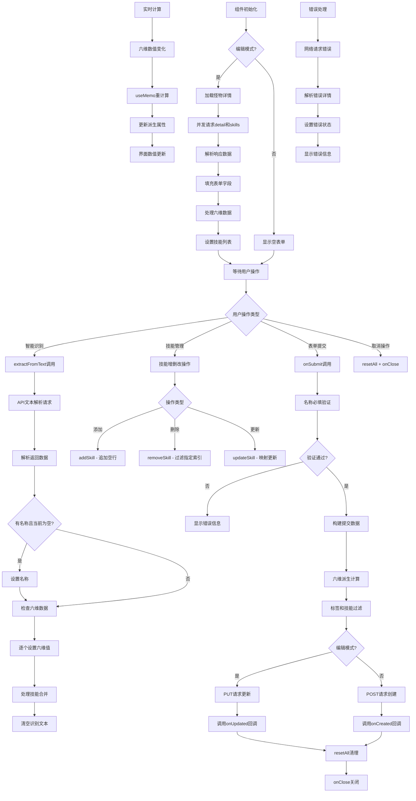

# 文件分析报告：client/src/components/AddMonsterDrawer.tsx

## 文件概述

`AddMonsterDrawer.tsx` 是一个复合功能的React组件，用于怪物数据的新增和编辑操作。该组件实现了智能文本识别、表单验证、动态技能管理和实时数据计算等高级功能。集成了侧边抽屉界面、多种输入控件和API交互，为用户提供完整的怪物数据管理工作流。支持编辑模式的数据回填和智能识别的自动数据提取。

## 代码结构分析

### 导入依赖

```typescript
import React, { useEffect, useMemo, useState } from 'react'
import SideDrawer from './SideDrawer'
import api from '../api'
```

- **React Hooks**：useEffect, useMemo, useState用于状态管理和性能优化
- **UI组件**：SideDrawer侧边抽屉提供容器界面
- **API模块**：api提供后端数据交互功能

### 全局变量和常量

```typescript
type SkillRow = { name: string; description: string }
type Props = {
  open: boolean
  editId?: number
  onClose: () => void
  onCreated?: (monsterId: number) => void
  onUpdated?: (monsterId: number) => void
}
const clamp = (v: number, min: number, max: number) => Math.max(min, Math.min(max, v))
```

- **SkillRow类型**：技能行数据结构定义
- **Props接口**：组件属性类型规范
- **clamp工具函数**：数值范围限制工具

### 配置和设置

#### 默认配置
- **六维基础值**：所有属性默认100
- **数值范围**：0-999的输入限制
- **滑动条范围**：50-150的快速调节
- **元素选项**：金、木、水、火、土五行元素
- **定位选项**：主攻、控制、辅助、坦克、通用五种定位

## 函数详细分析

### 函数概览表

| 函数名 | 参数 | 返回值 | 主要功能 |
|---------|------|--------|----------|
| `AddMonsterDrawer` | props | JSX.Element | 主组件函数 |
| `addSkill` | 无 | void | 添加技能行 |
| `removeSkill` | idx | void | 删除指定技能行 |
| `updateSkill` | idx, key, val | void | 更新技能行数据 |
| `resetAll` | 无 | void | 重置所有表单数据 |
| `onSubmit` | 无 | Promise<void> | 提交表单数据 |
| `extractFromText` | 无 | Promise<void> | 智能文本识别 |

### 函数详细说明

#### `AddMonsterDrawer(props)` - 主组件函数
```typescript
export default function AddMonsterDrawer({ open, editId, onClose, onCreated, onUpdated }: Props) {
  const isEdit = !!editId
  const [nameFinal, setNameFinal] = useState('')
  const [element, setElement] = useState('')
  const [role, setRole] = useState('')
  // ... 六维状态
  const [skills, setSkills] = useState<SkillRow[]>([{ name: '', description: '' }])
  // ... 其他状态
}
```

**核心特性**：
- **模式判断**：根据editId自动切换新增/编辑模式
- **状态管理**：完整的表单状态管理系统
- **实时计算**：六维数值的自动聚合和派生计算
- **回调支持**：创建和更新完成后的回调机制

#### `addSkill()` - 技能行管理
```typescript
const addSkill = () => setSkills(prev => [...prev, { name: '', description: '' }])
const removeSkill = (idx: number) => setSkills(prev => prev.filter((_, i) => i !== idx))
const updateSkill = (idx: number, key: keyof SkillRow, val: string) =>
  setSkills(prev => prev.map((s, i) => (i === idx ? { ...s, [key]: val } : s)))
```

**管理特性**：
- **动态添加**：不限制技能数量的灵活添加
- **安全删除**：保持至少一个技能行避免空状态
- **类型安全**：TypeScript键约束确保更新正确性
- **不可变更新**：函数式状态更新保持React优化

#### `resetAll()` - 表单重置
```typescript
const resetAll = () => {
  setNameFinal(''); setElement(''); setRole('')
  setHp(100); setSpeed(100); setAttack(100); setDefense(100); setMagic(100); setResist(100)
  setTagsInput(''); setSkills([{ name: '', description: '' }]); setErr(null); setExtractRaw('')
}
```

**重置策略**：
- **全量重置**：所有表单字段回到初始状态
- **默认值恢复**：六维数值恢复到100基础值
- **错误清理**：清除所有错误状态
- **技能重置**：恢复到单个空技能行

#### `onSubmit()` - 表单提交
```typescript
const onSubmit = async () => {
  if (!nameFinal.trim()) { setErr('请填写名称'); return }
  setSubmitting(true); setErr(null)
  try {
    const payload = {
      name_final: nameFinal.trim(),
      element: element || null,
      role: role || null,
      base_offense, base_survive, base_control, base_tempo, base_pp,
      tags: tagsInput.split(/[\s,，、;；]+/).map(s => s.trim()).filter(Boolean),
      skills: skills
        .filter(s => s.name.trim())
        .map(s => ({ name: s.name.trim(), description: s.description?.trim() || '' })),
    }
    if (isEdit && editId) {
      const res = await api.put(`/monsters/${editId}`, payload)
      onUpdated?.(res.data?.id)
    } else {
      const res = await api.post('/monsters', payload)
      onCreated?.(res.data?.id)
    }
    resetAll()
    onClose()
  } catch (e: any) {
    setErr(e?.response?.data?.detail || '提交失败')
  } finally {
    setSubmitting(false)
  }
}
```

**提交流程**：
1. **必填验证**：名称字段的空值检查
2. **数据清理**：字符串trim和数组过滤
3. **派生计算**：六维数值转换为游戏属性
4. **模式路由**：根据编辑模式选择API端点
5. **错误处理**：网络和业务错误的统一处理
6. **状态清理**：成功后重置表单和关闭抽屉

#### `extractFromText()` - 智能识别
```typescript
const extractFromText = async () => {
  if (!extractRaw.trim()) return
  setExtracting(true)
  try {
    const { data } = await api.post('/utils/extract', { text: extractRaw })
    if (data?.name && !nameFinal) setNameFinal(data.name)
    if (data?.stats) {
      const s = data.stats
      if (typeof s.hp === 'number') setHp(s.hp)
      // ... 其他属性设置
    }
    const arr: SkillRow[] = (data?.skills || []).filter((s:any)=>s?.name)
    if (arr.length) {
      setSkills(prev => {
        const names = new Set(prev.map(p => p.name.trim()))
        const merged = [...prev]
        arr.forEach(it => {
          if (names.has(it.name.trim())) {
            merged.forEach(m => { if (m.name.trim() === it.name.trim()) m.description = it.description || m.description })
          } else {
            merged.push({ name: it.name.trim(), description: it.description || '' })
          }
        })
        return merged
      })
    }
    setExtractRaw('')
  } catch (e:any) {
    setErr(e?.response?.data?.detail || '识别失败')
  } finally {
    setExtracting(false)
  }
}
```

**识别算法**：
1. **API调用**：后端智能解析原始文本
2. **条件填充**：仅在字段为空时自动填入
3. **数值验证**：检查数据类型确保安全
4. **技能合并**：智能合并避免重复，更新描述
5. **错误容错**：解析失败不影响已有数据

## 类详细分析

### 类概览表
该组件采用函数式设计，不包含类定义。

### 类详细说明
不适用。

## 函数调用流程图



## 变量作用域分析

### 组件主作用域
- **模式状态**：isEdit判断编辑/新增模式
- **基础信息状态**：nameFinal, element, role
- **六维数值状态**：hp, speed, attack, defense, magic, resist
- **复合数据状态**：tagsInput, skills数组
- **UI控制状态**：submitting, err, extractRaw, extracting

### 计算衍生作用域
- **sum**：六维总和的useMemo计算
- **base_*属性**：游戏属性的实时派生计算
- **payload构建**：提交时的临时数据组装

### 事件处理作用域
- **异步函数内**：try-catch错误处理块
- **循环遍历**：技能数组映射和过滤操作
- **条件分支**：编辑模式和数据验证的分支逻辑

### useEffect作用域
- **加载函数**：异步数据获取和状态设置
- **依赖数组**：[open, isEdit, editId]的变化监听
- **清理机制**：组件卸载时的资源清理

## 函数依赖关系

### 外部依赖
- **React Hooks**：useState, useEffect, useMemo状态管理
- **SideDrawer**：侧边抽屉容器组件
- **api模块**：后端数据交互服务

### 内部依赖图
```
AddMonsterDrawer
├── useState × 12 (各种状态)
├── useMemo(sum, base_*)
├── useEffect(编辑数据加载)
├── clamp() 工具函数
├── 技能管理函数组
│   ├── addSkill()
│   ├── removeSkill()
│   └── updateSkill()
├── resetAll()
├── onSubmit()
│   ├── api.put() / api.post()
│   ├── onUpdated() / onCreated()
│   ├── resetAll()
│   └── onClose()
├── extractFromText()
│   └── api.post('/utils/extract')
└── SideDrawer
    └── 表单UI渲染
```

### 数据流分析

#### 初始化数据流
1. **组件挂载** → useEffect触发 → 编辑模式检查
2. **数据加载** → API并发请求 → 状态批量更新
3. **表单渲染** → 受控组件绑定 → 用户交互准备

#### 用户交互数据流
1. **表单输入** → onChange事件 → setState更新 → 重新渲染
2. **六维调节** → 滑动条/输入框 → clamp限制 → 派生计算
3. **技能管理** → 增删改操作 → 数组状态更新

#### 提交数据流
1. **表单验证** → 必填检查 → 数据清理和转换
2. **API请求** → 网络传输 → 响应处理
3. **状态清理** → resetAll → onClose → 父组件通知

#### 智能识别数据流
1. **文本提取** → API解析 → 结构化数据返回
2. **智能填充** → 条件判断 → 状态选择性更新
3. **技能合并** → 去重逻辑 → 描述更新策略

### 错误处理

#### 网络请求错误
- **API异常**：统一的try-catch包装
- **错误提示**：用户友好的错误信息显示
- **状态恢复**：失败后UI状态恢复

#### 表单验证错误
- **必填验证**：名称字段的空值检查
- **数值范围**：clamp函数限制输入范围
- **数据格式**：字符串trim和数组过滤

#### 状态一致性错误
- **编辑冲突**：编辑模式下的数据同步
- **技能管理**：最少保持一个技能行
- **重置清理**：表单重置时的完整状态清理

### 性能分析

#### 时间复杂度
- **组件渲染**：O(n) - n为技能数量
- **状态更新**：O(1) - 直接状态设置
- **技能合并**：O(n×m) - n为现有技能，m为新技能

#### 空间复杂度
- **状态存储**：O(n) - n为技能和标签数量
- **临时变量**：O(1) - 固定的计算变量
- **API响应**：O(n) - 响应数据大小

#### 优化特性
- **useMemo缓存**：六维总和和派生属性计算
- **条件更新**：智能识别仅在空值时填充
- **批量状态**：合并多个setState减少重渲染

### 算法复杂度

#### 技能合并算法
- **去重检测**：Set数据结构O(1)查找
- **更新策略**：遍历 + 条件更新O(n)
- **新增逻辑**：数组追加O(1)

#### 数据验证算法
- **字符串处理**：trim和split正则匹配
- **数值限制**：Math.max/min边界检查
- **数组过滤**：filter和map函数式处理

### 扩展性评估

#### 表单字段扩展性
- **新字段添加**：易于添加新的状态和输入控件
- **验证规则**：可扩展复杂的字段验证逻辑
- **布局适配**：响应式网格布局支持字段扩展

#### 智能识别扩展性
- **解析能力**：后端API支持更复杂的文本结构
- **字段映射**：可扩展更多字段的自动识别
- **数据源**：支持图片OCR、文件导入等输入方式

#### 功能模块扩展性
- **批量操作**：可扩展批量导入、批量编辑功能
- **模板系统**：可添加怪物模板和快速创建功能
- **历史记录**：可集成编辑历史和版本对比

### 代码质量评估

#### 可读性
- **清晰的函数命名**：函数名准确反映功能用途
- **合理的代码组织**：状态、计算、事件处理分层清晰
- **类型注解完整**：TypeScript提供完整类型信息

#### 可维护性
- **模块化设计**：技能管理、表单验证、数据提交分离
- **错误处理统一**：一致的错误处理和用户反馈
- **状态管理清晰**：单一数据源和可预测的状态变更

#### 健壮性
- **完善的错误处理**：网络、验证、状态错误的全面覆盖
- **数据一致性**：编辑模式和新增模式的状态同步
- **用户体验**：加载状态、错误提示、操作反馈完整

#### 可测试性
- **纯函数设计**：工具函数和计算逻辑易于单元测试
- **Mock友好**：API调用和组件依赖可轻易Mock
- **状态隔离**：组件状态独立，便于测试验证

### 文档完整性

组件包含详细的TypeScript类型定义和清晰的Props接口，代码结构自说明性强。

### 备注

这是一个功能完备的表单组件，实现了复杂的数据管理和用户交互。代码设计优良，类型安全性强，特别是智能识别和技能管理功能展现了良好的用户体验设计。采用现代React最佳实践，具有良好的可维护性和扩展性。