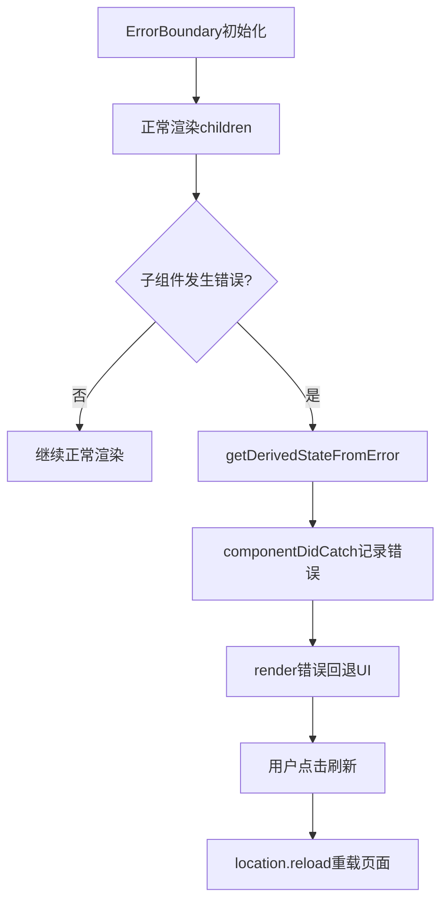

# 文件分析报告：ErrorBoundary.tsx

## 文件概述
ErrorBoundary.tsx是一个React错误边界组件，用于捕获和处理子组件树中的JavaScript错误。组件采用类组件实现，提供优雅的错误回退UI和页面刷新功能，确保应用在出现错误时不会完全崩溃。

## 代码结构分析

### 导入依赖
```typescript
import React from 'react'
```

### 全局变量和常量
```typescript
type State = { hasError: boolean, message?: string }
```

### 配置和设置
- **错误状态管理**：hasError和message状态
- **错误回退UI**：友好的错误提示界面
- **恢复机制**：刷新页面按钮

## 函数详细分析

### 函数概览表
| 函数名 | 类型 | 参数 | 返回值 | 作用 |
|--------|------|------|--------|------|
| constructor | 构造函数 | props | void | 初始化组件状态 |
| getDerivedStateFromError | 静态方法 | error | State | 错误状态派生 |
| componentDidCatch | 生命周期方法 | error, info | void | 错误日志记录 |
| render | 渲染方法 | 无 | JSX.Element | 渲染组件或错误UI |

### 函数详细说明
- **getDerivedStateFromError**: 静态方法，从错误对象派生新状态
- **componentDidCatch**: 捕获错误并记录到控制台
- **render**: 根据hasError状态渲染错误UI或正常子组件

## 函数调用流程图


## 变量作用域分析

### 组件状态
- **hasError**: 布尔值，标识是否发生错误
- **message**: 字符串，错误消息内容

### 生命周期方法
- **构造函数作用域**: 初始化state
- **静态方法作用域**: 处理错误对象
- **实例方法作用域**: 访问props和state

## 函数依赖关系

### React生命周期
```
ErrorBoundary生命周期
├── constructor (初始化)
├── getDerivedStateFromError (错误捕获)
├── componentDidCatch (错误处理)
└── render (UI渲染)
```

### 错误处理流程
```
错误处理机制
├── 错误捕获 (React内置)
├── 状态更新 (getDerivedStateFromError)
├── 错误记录 (componentDidCatch)
└── UI回退 (render错误界面)
```

## 特性分析
- **错误隔离**: 防止错误传播到整个应用
- **优雅降级**: 提供友好的错误提示
- **错误记录**: 控制台日志便于调试
- **用户恢复**: 刷新页面重新开始