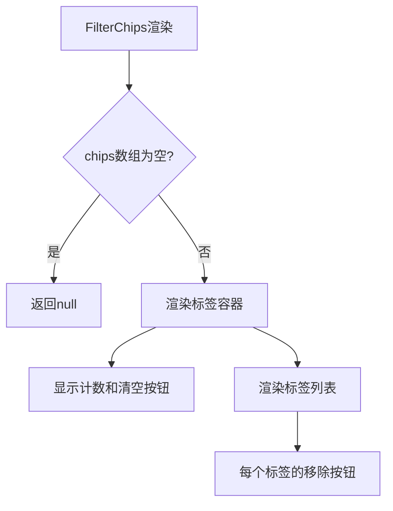

# 文件分析报告：FilterChips.tsx

## 文件概述
FilterChips.tsx是一个过滤标签组件，用于显示和管理当前激活的过滤条件。组件以标签形式展示过滤器，支持单个移除和全部清空功能，提供直观的过滤状态管理界面。

## 代码结构分析

### 导入依赖
```typescript
import React from 'react'
```

### 全局变量和常量
定义了Chip和Props类型接口，用于类型安全。

### 配置和设置
- **响应式布局**：支持水平滚动的标签容器
- **交互设计**：悬停效果和点击移除功能

## 函数详细分析

### 函数概览表
| 函数名 | 类型 | 参数 | 返回值 | 作用 |
|--------|------|------|--------|------|
| FilterChips | 函数组件 | Props | JSX.Element \| null | 渲染过滤标签列表 |

### 函数详细说明
FilterChips组件接收chips数组和onClearAll回调，当chips为空时返回null，否则渲染标签列表和清空按钮。

## 类详细分析
无类定义，使用函数式组件和TypeScript接口。

## 函数调用流程图


## 变量作用域分析
- **Props作用域**: chips(标签数组)、onClearAll(清空回调)
- **Chip接口**: label(标签文本)、onRemove(移除回调)

## 函数依赖关系
纯UI组件，依赖外部提供的数据和回调函数进行状态管理。