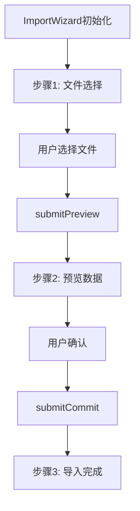

# 文件分析报告：ImportWizard.tsx

## 文件概述
ImportWizard.tsx是一个多步骤的数据导入向导组件，提供文件上传、预览和确认提交的完整导入流程。组件支持CSV/Excel文件导入，具备错误处理和加载状态管理功能。

## 代码结构分析

### 导入依赖
```typescript
import React, { useState } from 'react'
import api from '../api'
import type { ImportPreviewResp, ImportCommitResp, ImportPreviewRow } from '../types'
```

### 全局变量和常量
组件使用多个useState管理状态：file、step、preview、result、loading、error。

### 配置和设置
- **三步流程**：文件选择 → 预览确认 → 导入完成
- **文件类型**：支持CSV和Excel文件格式
- **错误追踪**：包含trace_id的错误信息

## 函数详细分析

### 函数概览表
| 函数名 | 类型 | 参数 | 返回值 | 作用 |
|--------|------|------|--------|------|
| ImportWizard | 函数组件 | 无 | JSX.Element | 主导入向导组件 |
| submitPreview | 异步函数 | 无 | Promise\<void\> | 提交文件预览 |
| submitCommit | 异步函数 | 无 | Promise\<void\> | 确认导入数据 |

### 函数详细说明
- **submitPreview**: 上传文件到/import/preview端点获取预览数据
- **submitCommit**: 提交最终导入请求到后端
- **状态管理**: 使用useState管理多步骤流程状态

## 函数调用流程图


## 变量作用域分析
- **文件状态**: file存储用户选择的文件
- **流程状态**: step控制当前步骤(1-3)
- **数据状态**: preview和result存储API响应
- **UI状态**: loading和error管理加载和错误状态

## 函数依赖关系
组件依赖api模块进行HTTP请求，依赖types模块获取TypeScript类型定义。