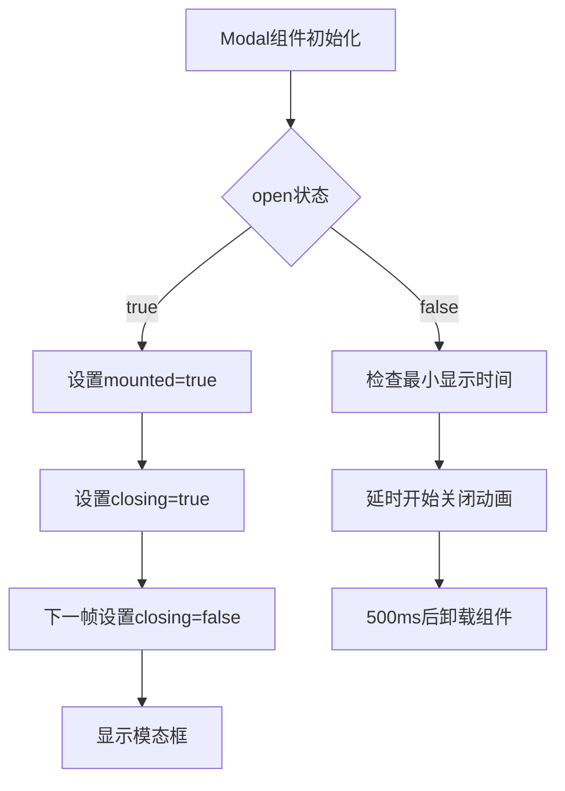

# 文件分析报告：Modal.tsx

## 文件概述
Modal.tsx是一个通用的模态框组件，提供Portal渲染、动画控制、键盘支持等完整的弹窗功能。组件具有最小显示时间控制、平滑的进入/退出动画，支持自定义最大宽度和ESC键关闭。

## 代码结构分析

### 导入依赖
```typescript
import React, { useEffect, useRef, useState } from 'react'
import ReactDOM from 'react-dom'
```

### 全局变量和常量
```typescript
const MIN_VISIBLE_MS = 1000        // 最短显示时间
const CLOSE_DURATION_MS = 500      // 关闭动画时长
```

### 配置和设置
- **Portal渲染**：使用ReactDOM.createPortal渲染到body
- **动画控制**：支持淡入淡出和缩放动画
- **响应式设计**：支持自定义最大宽度

## 函数详细分析

### 函数概览表
| 函数名 | 类型 | 参数 | 返回值 | 作用 |
|--------|------|------|--------|------|
| Modal | 函数组件 | ModalProps | JSX.Element \| null | 渲染模态框 |
| 动画控制useEffect | Effect Hook | [open, mounted] | cleanup | 控制显示/隐藏动画 |
| 键盘监听useEffect | Effect Hook | [mounted, onClose] | cleanup | ESC键监听 |

### 函数详细说明
Modal组件管理复杂的动画状态，包括mounted(挂载状态)、closing(动画状态)和最小显示时间控制，确保良好的用户体验。

## 函数调用流程图


## 变量作用域分析

### 组件状态
- **mounted**: 控制组件DOM挂载
- **closing**: 控制CSS动画类
- **shownAtRef**: 记录显示时间戳

### Props参数
- **open**: 控制显示/隐藏
- **onClose**: 关闭回调
- **children**: 模态框内容
- **maxWidth**: 最大宽度(默认560px)

## 函数依赖关系

### 外部依赖
```
Modal
├── React (useState, useEffect, useRef)
└── ReactDOM (createPortal)
```

### 内部机制
```
动画控制系统
├── 最小显示时间控制
├── 进入/退出动画
├── 定时器管理
└── 键盘事件处理
```

## 特性分析
- **Portal渲染**: 避免z-index层级问题
- **动画优化**: 使用requestAnimationFrame确保流畅动画
- **用户体验**: 最小显示时间防止闪烁
- **无障碍**: 支持ESC键关闭和aria属性