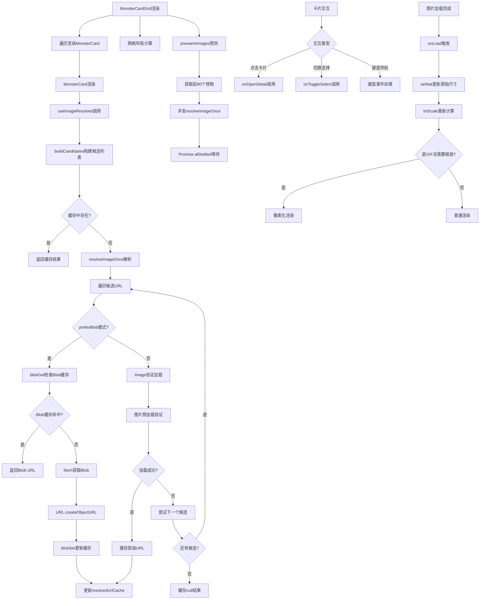

# 文件分析报告：client/src/components/MonsterCardGrid.tsx

## 文件概述

`MonsterCardGrid.tsx` 是一个高性能的React组件，用于以网格形式展示怪物卡片列表。该组件实现了智能图片预加载、Blob缓存优化、响应式网格布局和GIF像素化处理等高级功能。集成了选择状态管理、详情查看和自适应布局，为用户提供流畅的浏览体验。采用模块级缓存和LRU算法优化图片加载性能，支持大量数据的高效渲染。

## 代码结构分析

### 导入依赖

```typescript
import React, { useEffect, useMemo, useRef, useState } from 'react'
import type { Monster } from '../types'
```

- **React Hooks**：useEffect, useMemo, useRef, useState用于状态管理和性能优化
- **类型定义**：Monster类型接口确保类型安全

### 全局变量和常量

```typescript
const resolvedUrlCache = new Map<string, string | null>()
const resolvingCache = new Map<string, Promise<string | null>>()
const BLOB_LIMIT_DEFAULT = 300
let BLOB_LIMIT = BLOB_LIMIT_DEFAULT
const blobLRU = new Map<string, string>()
```

- **URL缓存**：已解析图片URL的永久缓存
- **解析缓存**：防止重复请求的Promise缓存
- **Blob缓存**：LRU算法管理的Blob URL缓存
- **缓存限制**：可配置的缓存大小限制

### 配置和设置

#### 组件Props接口
```typescript
type Props = {
  items: Monster[]
  selectedIds: Set<number>
  onToggleSelect: (id: number) => void
  onOpenDetail: (m: Monster) => void
  showRawSummary?: boolean
  getImageUrl?: (m: Monster) => string | null
  computeRibbon?: (m: Monster) => Ribbon
  minCardWidthPx?: number
  mediaHeightCss?: string
  className?: string
}
```

#### 默认配置
- **最小卡片宽度**：160px
- **图片高度**：clamp(110px, 18vw, 180px)
- **预热图片数量**：80张
- **Blob缓存限制**：300个URL

## 函数详细分析

### 函数概览表

| 函数名 | 参数 | 返回值 | 主要功能 |
|---------|------|--------|----------|
| `blobGet` | url | string/null | 获取Blob URL并更新LRU顺序 |
| `blobSet` | url, objUrl | void | 设置Blob URL并维护缓存限制 |
| `placeholderDataUri` | label | string | 生成占位符SVG图片 |
| `normalizeName` | raw | string | 标准化怪物名称 |
| `buildCandidates` | m, override | object | 构建图片URL候选列表 |
| `resolveImageOnce` | cacheKey, candidates, preferBlob | Promise<string/null> | 解析单张图片URL |
| `useImageResolved` | m, override | string/null | 图片解析Hook |
| `prewarmImages` | monsters, override, count | Promise<void> | 预热图片缓存 |
| `MonsterCard` | props | JSX.Element | 单个怪物卡片组件 |
| `MonsterCardGrid` | props | JSX.Element | 主网格容器组件 |

### 函数详细说明

#### `blobGet(url)` - LRU缓存获取
```typescript
function blobGet(url: string) {
  const v = blobLRU.get(url)
  if (v) { blobLRU.delete(url); blobLRU.set(url, v) }
  return v || null
}
```

**核心特性**：
- **LRU更新**：访问时更新缓存顺序
- **原子操作**：删除后重新插入实现LRU语义
- **空值处理**：未找到时返回null

#### `blobSet(url, objUrl)` - LRU缓存设置
```typescript
function blobSet(url: string, objUrl: string) {
  if (blobLRU.has(url)) blobLRU.delete(url)
  blobLRU.set(url, objUrl)
  while (blobLRU.size > BLOB_LIMIT) {
    const oldestKey = blobLRU.keys().next().value as string | undefined
    if (!oldestKey) break
    const o = blobLRU.get(oldestKey)
    if (o) URL.revokeObjectURL(o)
    blobLRU.delete(oldestKey)
  }
}
```

**算法特性**：
- **重复处理**：删除已存在的URL避免重复
- **容量控制**：超出限制时淘汰最老条目
- **资源清理**：撤销Blob URL释放内存

#### `placeholderDataUri(label)` - 占位符生成
```typescript
function placeholderDataUri(label = '无图'): string {
  const svg = `<svg xmlns='http://www.w3.org/2000/svg' width='400' height='300'>
    <rect width='100%' height='100%' fill='#f3f4f6'/>
    <text x='50%' y='50%' dominant-baseline='middle' text-anchor='middle'
          font-family='-apple-system,BlinkMacSystemFont,Segoe UI,Roboto,Helvetica,Arial' font-size='22'
          fill='#9ca3af'>${label}</text>
  </svg>`.replace(/\n+/g,'').trim()
  return `data:image/svg+xml;utf8,${encodeURIComponent(svg)}`
}
```

**设计特点**：
- **矢量图形**：SVG格式保证清晰度
- **系统字体**：使用原生字体栈保证兼容性
- **Data URI**：内联编码减少网络请求

#### `buildCandidates(m, override)` - URL候选构建
```typescript
function buildCandidates(m: Monster, override?: (m: Monster) => string | null) {
  const list: string[] = []
  const ov = override?.(m)
  if (ov) list.push(ov)
  
  const ex = (m as any)?.explain_json?.image_url
  if (typeof ex === 'string' && ex) list.push(String(ex))
  
  const names = Array.from(new Set([m.name, (m as any).name_final].filter(Boolean).map(normalizeName)))
  const exts = ['gif', 'jpg', 'png', 'jpeg', 'webp']
  
  for (const base of [BASE_A, BASE_B]) {
    for (const n of names) {
      for (const ext of exts) {
        list.push(`${base}/${encodeURIComponent(n)}.${ext}`)
        list.push(`${base}/${encodeURIComponent('G'+n)}.${ext}`)
      }
    }
  }
  return { list, cacheKey: `${(m as any)?.id ?? ''}::${names.join('|')}` }
}
```

**构建策略**：
1. **优先级顺序**：自定义URL > explain_json > 基于名称的URL
2. **名称标准化**：去除特殊字符生成文件名
3. **多格式支持**：尝试gif, jpg, png, jpeg, webp格式
4. **路径变体**：支持普通名称和'G'前缀变体
5. **缓存键**：基于ID和名称生成唯一标识

#### `resolveImageOnce(cacheKey, candidates, preferBlob)` - 图片解析
```typescript
async function resolveImageOnce(
  cacheKey: string,
  candidates: string[],
  preferBlob = true
): Promise<string | null> {
  if (resolvedUrlCache.has(cacheKey)) return resolvedUrlCache.get(cacheKey) ?? null
  const existing = resolvingCache.get(cacheKey)
  if (existing) return existing
  
  const p = (async () => {
    for (const url of candidates) {
      try {
        if (preferBlob) {
          const cachedBlob = blobGet(url)
          if (cachedBlob) { resolvedUrlCache.set(cacheKey, cachedBlob); return cachedBlob }
          const resp = await fetch(url, { cache: 'force-cache' })
          if (!resp.ok) throw new Error(`HTTP ${resp.status}`)
          const blob = await resp.blob()
          if (blob.size === 0) throw new Error('empty blob')
          const objUrl = URL.createObjectURL(blob)
          blobSet(url, objUrl)
          resolvedUrlCache.set(cacheKey, objUrl)
          return objUrl
        } else {
          await new Promise<void>((resolve, reject) => {
            const img = new Image()
            img.onload = () => resolve()
            img.onerror = () => reject(new Error('load fail'))
            img.src = url
          })
          resolvedUrlCache.set(cacheKey, url)
          return url
        }
      } catch {}
    }
    resolvedUrlCache.set(cacheKey, null)
    return null
  })()
  
  resolvingCache.set(cacheKey, p)
  const ret = await p.finally(() => resolvingCache.delete(cacheKey))
  return ret
}
```

**解析算法**：
1. **缓存检查**：优先使用已解析的结果
2. **重复请求防护**：防止同时发起多个相同请求
3. **Blob优先模式**：获取Blob数据创建Object URL
4. **降级模式**：直接验证图片可加载性
5. **异常处理**：任何候选URL失败时继续尝试下一个
6. **缓存更新**：成功解析后更新缓存，失败时缓存null

#### `useImageResolved(m, override)` - 图片解析Hook
```typescript
function useImageResolved(m: Monster, override?: (m: Monster) => string | null) {
  const [src, setSrc] = useState<string | null>(null)
  useEffect(() => {
    let cancelled = false
    const { list, cacheKey } = buildCandidates(m, override)
    if (resolvedUrlCache.has(cacheKey)) {
      const v = resolvedUrlCache.get(cacheKey) ?? null
      setSrc(v)
      if (v) return
    }
    resolveImageOnce(cacheKey, list, true).then((v) => { if (!cancelled) setSrc(v) })
    return () => { cancelled = true }
  }, [m, override])
  return src
}
```

**Hook特性**：
- **状态管理**：维护当前怪物的图片URL状态
- **缓存优先**：先检查缓存避免重复请求
- **取消机制**：组件卸载时取消异步操作
- **依赖追踪**：怪物或覆盖函数变化时重新解析

#### `MonsterCard` - 单卡片组件
```typescript
function MonsterCard(props: {
  m: Monster
  selected: boolean
  onToggleSelect: (id: number) => void
  onOpenDetail: (m: Monster) => void
  showRawSummary: boolean
  getImageUrl?: (m: Monster) => string | null
  ribbon: Ribbon
  mediaHeightCss: string
}) {
  const imgUrl = useImageResolved(m, getImageUrl) || placeholderDataUri()
  const [wrapSize, setWrapSize] = useState({ w: 0, h: 0 })
  const [nat, setNat] = useState({ w: 0, h: 0 })
  const isGif = /\.gif($|\?)/i.test(imgUrl)
  
  const intScale = useMemo(() => {
    if (!isGif || !nat.w || !nat.h || !wrapSize.w || !wrapSize.h) return 1
    const byH = Math.floor(wrapSize.h / nat.h)
    const byW = Math.floor(wrapSize.w / nat.w)
    return Math.max(1, Math.min(byH, byW, 3))
  }, [isGif, nat, wrapSize])
  // ...
}
```

**核心功能**：
- **图片处理**：智能解析和像素化处理
- **尺寸监控**：ResizeObserver监控容器尺寸变化
- **GIF优化**：整数倍缩放保持像素艺术效果
- **交互支持**：键盘导航和点击事件
- **状态显示**：选中状态、徽章和统计信息

## 类详细分析

### 类概览表
该组件采用函数式设计，不包含类定义。

### 类详细说明
不适用。

## 函数调用流程图



## 变量作用域分析

### 模块作用域
- **resolvedUrlCache**：全局图片URL解析缓存
- **resolvingCache**：全局Promise缓存防重复请求
- **blobLRU**：全局Blob URL的LRU缓存
- **BLOB_LIMIT**：可配置的缓存大小限制

### MonsterCardGrid组件作用域
- **gridStyle**：useMemo计算的网格样式
- **预热效果**：useEffect管理的图片预热逻辑

### MonsterCard组件作用域
- **imgUrl**：当前卡片的图片URL
- **wrapSize, nat**：容器和原始图片尺寸状态
- **intScale**：GIF整数缩放比例
- **wrapRef**：图片容器的DOM引用

### useImageResolved Hook作用域
- **src**：图片解析状态
- **cancelled**：取消标志防止内存泄漏

## 函数依赖关系

### 外部依赖
- **React**：useState, useEffect, useMemo, useRef
- **Web APIs**：fetch, URL.createObjectURL, ResizeObserver, Image
- **类型系统**：Monster类型定义

### 内部依赖图
```
MonsterCardGrid
├── prewarmImages()
│   └── resolveImageOnce()
│       ├── blobGet()
│       ├── blobSet()
│       └── buildCandidates()
│           └── normalizeName()
├── useMemo(gridStyle)
└── MonsterCard × N
    ├── useImageResolved()
    │   ├── buildCandidates()
    │   └── resolveImageOnce()
    ├── placeholderDataUri()
    ├── ResizeObserver
    └── useMemo(intScale)
```

### 数据流分析

#### 图片解析数据流
1. **触发解析** → buildCandidates构建候选 → resolveImageOnce解析
2. **缓存查询** → 命中返回/未命中请求 → 更新缓存
3. **Blob处理** → fetch获取 → createObjectURL → LRU缓存

#### 缓存管理数据流
1. **写入缓存** → blobSet检查容量 → 淘汰最老条目 → 插入新条目
2. **读取缓存** → blobGet获取 → LRU顺序更新
3. **清理缓存** → revokeObjectURL释放内存

#### 渲染数据流
1. **组件初始化** → 图片预热 → 网格样式计算
2. **卡片渲染** → 图片解析 → 尺寸监控 → 样式应用
3. **交互处理** → 事件冒泡控制 → 回调函数调用

### 错误处理

#### 图片加载错误
- **候选机制**：多个URL候选确保加载成功率
- **异常捕获**：try-catch包装所有网络请求
- **降级处理**：所有候选失败时使用占位符

#### 缓存错误
- **空值缓存**：失败结果也会缓存避免重复尝试
- **Promise清理**：确保resolvingCache不会泄漏
- **Blob清理**：LRU淘汰时正确释放Object URL

#### 组件错误
- **取消机制**：组件卸载时取消异步操作
- **边界检查**：尺寸计算中的零值和空值处理

### 性能分析

#### 时间复杂度
- **图片解析**：O(n) - n为候选URL数量
- **缓存操作**：O(1) - Map操作为常数时间
- **LRU更新**：O(1) - 删除和插入操作
- **渲染复杂度**：O(n) - n为怪物数量

#### 空间复杂度
- **URL缓存**：O(k) - k为不同怪物数量
- **Blob缓存**：O(BLOB_LIMIT) - 受限制的固定大小
- **组件状态**：O(n) - n为渲染的卡片数量

#### 优化特性
- **模块级缓存**：跨组件实例共享缓存
- **智能预热**：requestIdleCallback空闲时间预热
- **LRU算法**：最优的缓存淘汰策略
- **Blob缓存**：减少重复网络请求

### 算法复杂度

#### LRU缓存算法
- **访问操作**：O(1) - Map的删除和插入
- **淘汰操作**：O(1) - 固定的单次淘汰
- **空间效率**：严格控制缓存大小

#### 图片解析算法
- **并发控制**：Promise缓存防止重复请求
- **失败重试**：顺序尝试候选URL
- **缓存策略**：永久缓存成功和失败结果

### 扩展性评估

#### 缓存策略扩展性
- **缓存大小**：可通过环境变量配置
- **缓存策略**：可扩展LFU、TTL等算法
- **存储后端**：可扩展IndexedDB持久化

#### 图片处理扩展性
- **格式支持**：easily添加新的图片格式
- **处理策略**：可扩展WebP转换、压缩等
- **CDN集成**：可扩展多CDN负载均衡

#### 布局扩展性
- **响应式设计**：CSS Grid自适应不同屏幕
- **虚拟滚动**：可集成react-window处理大列表
- **布局模式**：可扩展瀑布流、表格等布局

### 代码质量评估

#### 可读性
- **清晰的函数命名**：函数名准确反映功能用途
- **合理的代码组织**：缓存、工具、组件分层清晰
- **详细的类型注解**：TypeScript提供完整类型信息

#### 可维护性
- **模块化设计**：功能分离，职责明确
- **配置外部化**：关键参数可配置
- **错误边界**：完善的错误处理和降级策略

#### 健壮性
- **缓存一致性**：多级缓存的一致性保证
- **内存安全**：正确的Blob URL清理
- **异步安全**：组件卸载时的取消机制

#### 可测试性
- **纯函数设计**：工具函数易于单元测试
- **Mock友好**：网络请求和DOM API可轻易Mock
- **状态隔离**：组件状态和全局缓存分离

### 文档完整性

组件包含详细的TypeScript类型定义和内联注释，代码结构清晰自说明。

### 备注

这是一个高度优化的React组件，实现了复杂的图片缓存和渲染策略。代码设计精良，性能优化充分，特别是在处理大量图片和GIF动画方面表现出色。采用现代React Hooks和Web API，具有良好的可维护性和扩展性。