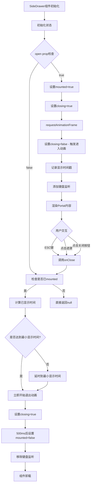

# 文件分析报告：SideDrawer.tsx

## 文件概述
SideDrawer.tsx是一个高级的React抽屉组件，提供了从右侧滑入的侧边栏功能。该组件实现了复杂的动画控制系统，包括平滑的进入/退出动画、最小显示时间控制、背景模糊效果等高级用户体验特性。组件使用ReactDOM Portal技术渲染到body，确保在页面最高层级显示。支持键盘快捷键（ESC关闭）、点击遮罩关闭、内容缓存等功能，提供了企业级应用所需的完整抽屉解决方案。

## 代码结构分析

### 导入依赖
```typescript
import React, { useEffect, useRef, useState } from 'react'
import ReactDOM from 'react-dom'
```

主要依赖：
- **React核心**：useState、useEffect、useRef hooks
- **ReactDOM**：createPortal方法实现Portal渲染

### 全局变量和常量
```typescript
// 最小显示时间常量
const MIN_VISIBLE_MS = 50
```

该常量确保抽屉至少显示50毫秒，避免闪烁效果，提供更好的用户体验。

### 配置和设置
- **动画时长**：500ms的进入/退出动画
- **层级设置**：z-40背景遮罩，z-50抽屉主体
- **响应式设计**：420px宽度，最大96vw适配移动端
- **无障碍支持**：完整的ARIA属性配置

## 函数详细分析

### 函数概览表
| 函数名 | 类型 | 参数 | 返回值 | 作用 |
|--------|------|------|--------|------|
| SideDrawer | 函数组件 | SideDrawerProps | JSX.Element \| null | 主抽屉组件 |
| onKey | 事件处理器 | KeyboardEvent | void | 键盘事件处理 |
| 动画控制useEffect | Effect Hook | dependencies | cleanup | 控制显示/隐藏动画 |
| 键盘监听useEffect | Effect Hook | dependencies | cleanup | ESC键监听 |

### 函数详细说明

#### SideDrawer (主组件)
- **功能**：渲染可控制的侧边抽屉
- **Props接口**：
  ```typescript
  {
    open: boolean           // 控制显示/隐藏
    onClose: () => void     // 关闭回调
    children: React.ReactNode // 抽屉内容
    title?: string          // 可选标题
  }
  ```
- **状态管理**：
  - `mounted`: 控制组件挂载/卸载
  - `closing`: 控制动画状态
  - `shownAtRef`: 记录显示时间戳

#### 动画控制机制
- **进入动画**：mounted→true, closing→false 触发淡入+滑入
- **退出动画**：检查最小显示时间，触发淡出+滑出，延时卸载
- **时间控制**：确保至少显示MIN_VISIBLE_MS毫秒

#### 键盘事件处理
- **ESC键监听**：全局键盘事件监听
- **条件执行**：仅在mounted状态下生效
- **清理机制**：组件卸载时移除监听器

## 类详细分析

### 类概览表
该文件采用函数式组件设计，没有ES6类定义。

### 类详细说明
组件使用现代React Hooks模式，通过TypeScript接口定义Props类型，确保类型安全。

## 函数调用流程图


## 变量作用域分析

### 组件级状态
- **mounted**: 控制组件DOM挂载状态
- **closing**: 控制CSS动画类切换
- **shownAtRef**: useRef存储显示时间戳，避免重渲染

### Props作用域
- **open**: 外部控制的显示状态
- **onClose**: 外部提供的关闭回调
- **children**: 动态内容，支持任意React节点
- **title**: 可选标题文本

### 缓存机制
- **lastChildrenRef**: 缓存children内容，关闭动画期间保持显示
- **lastTitleRef**: 缓存title内容，避免文字在动画中消失

### 定时器作用域
- **t1**: 最小显示时间延时器
- **t2**: 退出动画延时器
- **raf**: requestAnimationFrame引用

## 函数依赖关系

### 外部依赖
```
SideDrawer
├── React.useState (状态管理)
├── React.useEffect (副作用处理)
├── React.useRef (引用管理)
└── ReactDOM.createPortal (Portal渲染)
```

### 内部依赖关系
```
组件生命周期管理
├── 动画控制useEffect
│   ├── mounted状态管理
│   ├── closing状态管理
│   └── 定时器管理
├── 键盘监听useEffect
│   ├── 事件绑定
│   └── 事件清理
└── 内容缓存机制
    ├── lastChildrenRef
    └── lastTitleRef
```

### 数据流分析
1. **Props变化** → useEffect触发 → 状态更新 → 动画执行
2. **用户交互** → 事件处理 → onClose回调 → 父组件状态更新
3. **内容缓存** → 关闭期间保持内容 → 动画完成后清理

### 错误处理
- **定时器清理**：useEffect清理函数确保定时器正确清理
- **事件监听清理**：组件卸载时移除键盘监听
- **条件渲染**：mounted状态控制，避免不必要的渲染

### 性能分析
- **Portal渲染**：避免层级问题，提升渲染性能
- **requestAnimationFrame**：确保动画在正确时机执行
- **useRef缓存**：避免不必要的重渲染
- **条件监听**：仅在需要时添加事件监听器

### 算法复杂度
- **时间复杂度**：O(1) - 所有操作都是常数时间
- **空间复杂度**：O(1) - 固定的状态和引用存储

### 扩展性评估
**优势**：
- 高度可配置的Props接口
- 完整的动画生命周期控制
- 良好的无障碍支持
- 响应式设计适配

**改进建议**：
- 可以提取动画配置为Props
- 支持自定义动画缓动函数
- 考虑添加尺寸配置选项
- 可以支持左侧抽屉变体

### 代码质量评估
- **可读性**：高 - 清晰的状态管理和注释
- **可维护性**：高 - 良好的关注点分离
- **可测试性**：中等 - 可以通过mock DOM API进行测试
- **复用性**：高 - 通用的抽屉组件，无业务逻辑耦合

### 文档完整性
- **组件文档**：代码注释详细，说明了关键逻辑
- **Props文档**：TypeScript类型定义清晰
- **动画文档**：动画逻辑有详细注释说明

### 备注
这是一个设计精良的企业级抽屉组件，展示了React高级模式的最佳实践。组件考虑了用户体验的各个方面，包括平滑动画、最小显示时间、内容缓存、键盘支持等。Portal渲染确保了组件在复杂布局中的正确显示。该组件可以作为设计系统中的基础组件使用。