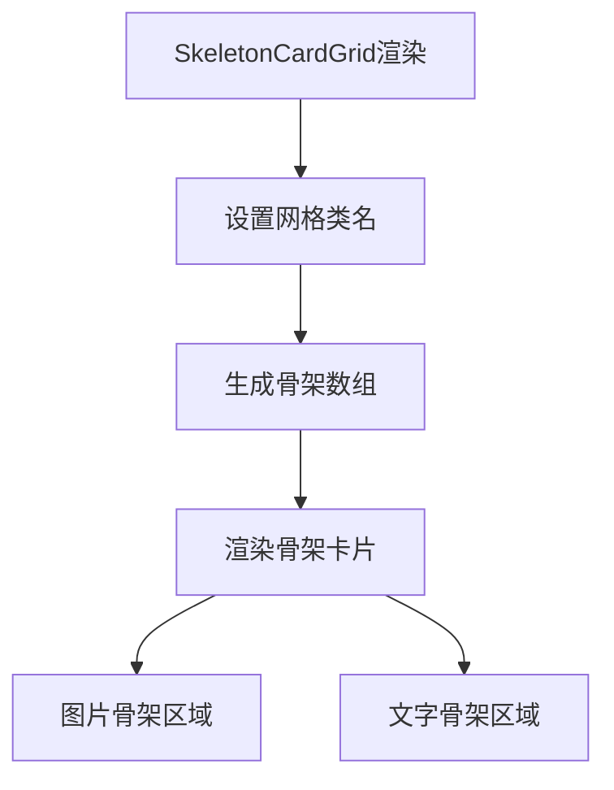

# 文件分析报告：SkeletonCardGrid.tsx

## 文件概述
SkeletonCardGrid.tsx是一个骨架屏组件，用于在数据加载期间显示占位符网格。该组件模拟了MonsterCardGrid的布局结构，提供平滑的加载体验。组件支持自定义骨架数量和CSS类名，使用Tailwind CSS的animate-pulse类实现加载动画效果。

## 代码结构分析

### 导入依赖
```typescript
import React from 'react'
```

### 全局变量和常量
```typescript
const gridClassesDefault = 'grid grid-cols-2 sm:grid-cols-3 md:grid-cols-4 xl:grid-cols-6 gap-4'
```

### 配置和设置
- **响应式网格**：2列到6列的自适应布局
- **默认数量**：12个骨架卡片
- **动画效果**：animate-pulse脉冲动画

## 函数详细分析

### 函数概览表
| 函数名 | 类型 | 参数 | 返回值 | 作用 |
|--------|------|------|--------|------|
| SkeletonCardGrid | 函数组件 | Props | JSX.Element | 渲染骨架屏网格 |

### 函数详细说明
SkeletonCardGrid组件接收count和className参数，生成指定数量的骨架卡片，每个卡片包含图片区域、标题区域、标签区域和描述区域的占位符。

## 类详细分析
无类定义，使用函数式组件。

## 函数调用流程图


## 变量作用域分析
- **Props作用域**: count(数量)、className(自定义样式)
- **组件作用域**: gridCls(合并的网格类名)

## 函数依赖关系
该组件为纯UI组件，无外部依赖，仅依赖React和Tailwind CSS类名。