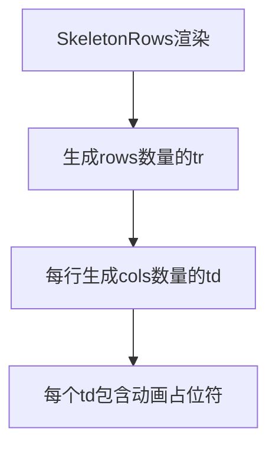

# 文件分析报告：SkeletonRows.tsx

## 文件概述
SkeletonRows.tsx是一个表格骨架屏组件，用于在表格数据加载期间显示占位符行。组件生成指定数量的行和列，每个单元格包含脉冲动画效果的占位符。

## 代码结构分析

### 导入依赖
```typescript
import React from 'react'
```

### 配置和设置
- **默认参数**：rows=5, cols=8
- **动画效果**：animate-pulse脉冲动画

## 函数详细分析

### 函数概览表
| 函数名 | 类型 | 参数 | 返回值 | 作用 |
|--------|------|------|--------|------|
| SkeletonRows | 函数组件 | {rows?, cols?} | JSX.Element | 渲染表格骨架行 |

### 函数详细说明
SkeletonRows组件使用Array.from生成指定数量的行和列，每个td包含一个带动画的灰色占位符div。

## 函数调用流程图


## 变量作用域分析
- **Props**: rows(行数，默认5)、cols(列数，默认8)
- **渲染逻辑**: 嵌套Array.from生成二维表格结构

## 函数依赖关系
纯UI组件，无外部依赖，仅使用React和Tailwind CSS类名。