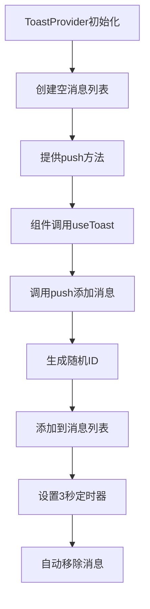

# 文件分析报告：Toast.tsx

## 文件概述
Toast.tsx是一个轻量级的消息提示系统，提供Context-based的全局Toast消息管理。组件包含ToastProvider上下文提供者和useToast自定义Hook，支持自动消失的消息提示功能。

## 代码结构分析

### 导入依赖
```typescript
import React, { createContext, useContext, useState, ReactNode, useCallback } from 'react'
```

### 全局变量和常量
```typescript
type ToastMsg = { id: string, text: string }
const Ctx = createContext<{push:(t:string)=>void}>({ push: () => {} })
```

### 配置和设置
- **自动消失时间**：3000ms (3秒)
- **随机ID生成**：Math.random().toString(36).slice(2)

## 函数详细分析

### 函数概览表
| 函数名 | 类型 | 参数 | 返回值 | 作用 |
|--------|------|------|--------|------|
| useToast | 自定义Hook | 无 | {push} | 获取Toast操作方法 |
| ToastProvider | 组件 | {children} | JSX.Element | 提供Toast上下文 |
| push | 回调函数 | text: string | void | 添加新消息 |

### 函数详细说明
- **useToast**: 返回push方法用于添加消息
- **ToastProvider**: 管理消息列表状态，渲染消息容器
- **push**: 添加消息到列表，3秒后自动移除

## 函数调用流程图


## 变量作用域分析

### Context作用域
- **Ctx**: React Context，提供push方法
- **全局访问**: 通过useToast Hook在任意组件中使用

### 组件状态
- **list**: 当前显示的消息列表
- **push**: useCallback优化的添加消息方法

## 函数依赖关系

### 架构模式
```
Toast系统
├── ToastProvider (Context提供者)
├── useToast (Hook接口)
├── ToastMsg (类型定义)
└── 自动清理机制
```

### 使用流程
```
1. 应用根组件包裹ToastProvider
2. 子组件使用useToast获取push方法
3. 调用push(message)显示消息
4. 3秒后消息自动消失
```

## 特性分析
- **轻量级设计**: 代码简洁，功能专一
- **Context模式**: 全局状态管理
- **自动清理**: 防止内存泄漏
- **类型安全**: TypeScript类型定义