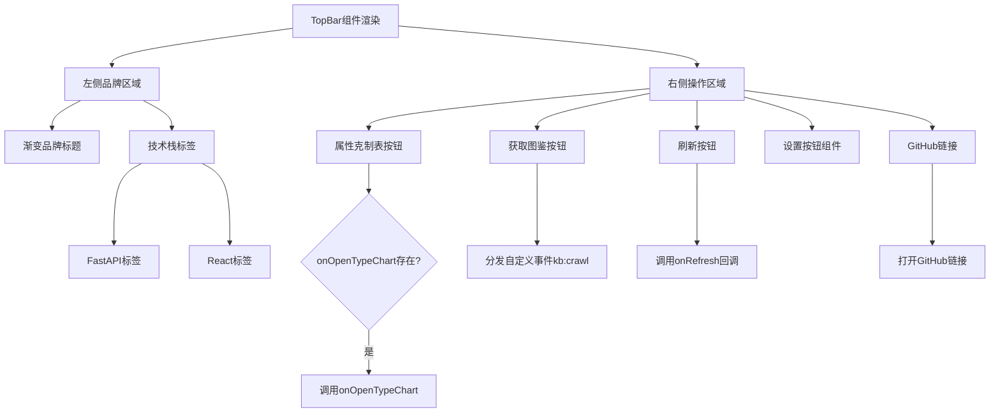

# 文件分析报告：TopBar.tsx

## 文件概述
TopBar.tsx是应用程序的顶部导航栏组件，提供了完整的应用header功能。该组件集成了品牌展示、技术栈标签、多个操作按钮（属性克制表、获取图鉴、刷新、设置、GitHub链接）等功能。组件采用sticky定位和毛玻璃效果，具备现代化的视觉设计。支持响应式布局，在不同屏幕尺寸下提供适配的显示效果。

## 代码结构分析

### 导入依赖
```typescript
import React from 'react'
import { Github, RefreshCw, Grid2x2, Globe } from 'lucide-react'
import SettingsButton from './SettingsButton'
```

主要依赖：
- **React核心**：基础React功能
- **lucide-react图标库**：Github、RefreshCw、Grid2x2、Globe图标
- **SettingsButton组件**：设置按钮子组件

### 全局变量和常量
该文件中没有定义全局常量，所有配置通过props和内联样式处理。

### 配置和设置
- **粘性定位**：sticky top-0，固定在页面顶部
- **毛玻璃效果**：backdrop-blur背景模糊效果
- **渐变品牌标题**：from-indigo-600 via-fuchsia-500 to-pink-500
- **技术栈标签**：FastAPI、React标签展示

## 函数详细分析

### 函数概览表
| 函数名 | 类型 | 参数 | 返回值 | 作用 |
|--------|------|------|--------|------|
| TopBar | 函数组件 | TopBarProps | JSX.Element | 渲染顶部导航栏 |
| 内联事件处理器 | 箭头函数 | - | void | 处理各种按钮点击事件 |

### 函数详细说明

#### TopBar (主组件)
- **功能**：渲染应用程序顶部导航栏
- **Props接口**：
  ```typescript
  {
    onRefresh: () => void          // 刷新回调
    onOpenImport?: () => void      // 打开导入功能（可选）
    onOpenTypeChart?: () => void   // 打开属性克制表（可选）
  }
  ```
- **特殊功能**：
  - 自定义事件分发：`window.dispatchEvent(new Event('kb:crawl'))`
  - 键盘快捷键提示：刷新按钮显示快捷键C

## 类详细分析

### 类概览表
该文件采用函数式组件设计，没有类定义。

### 类详细说明
组件使用现代React函数式组件模式，通过TypeScript接口定义Props类型安全。

## 函数调用流程图


## 变量作用域分析

### Props作用域
- **onRefresh**: 必需的刷新回调函数
- **onOpenImport**: 可选的导入功能回调
- **onOpenTypeChart**: 可选的属性克制表回调

### 事件处理作用域
- **自定义事件**: kb:crawl事件用于触发图鉴获取功能
- **外部链接**: GitHub链接在新标签页打开

### 响应式作用域
- **hidden sm:inline**: 小屏幕隐藏文本，大屏幕显示
- **hidden sm:flex**: 小屏幕隐藏技术标签

## 函数依赖关系

### 外部依赖
```
TopBar
├── React (核心库)
├── lucide-react (图标库)
│   ├── Github
│   ├── RefreshCw
│   ├── Grid2x2
│   └── Globe
└── SettingsButton (子组件)
```

### 功能模块依赖
```
TopBar功能区域
├── 品牌展示模块
│   ├── 渐变标题
│   └── 技术栈标签
└── 操作按钮模块
    ├── 属性克制表
    ├── 获取图鉴
    ├── 刷新功能
    ├── 设置组件
    └── GitHub链接
```

### 数据流分析
1. **Props传入** → 组件接收回调函数
2. **用户交互** → 按钮点击 → 回调执行/事件分发
3. **自定义事件** → 全局事件系统 → 其他组件响应

### 错误处理
- **可选回调检查**: onOpenTypeChart和onOpenImport的存在性检查
- **类型安全**: TypeScript确保Props类型正确
- **默认行为**: 外部链接提供rel="noreferrer"安全属性

### 性能分析
- **静态内容**: 品牌和标签为静态内容，渲染开销小
- **事件处理**: 简单的回调调用，性能开销最小
- **响应式类**: Tailwind CSS类的条件应用

### 算法复杂度
- **时间复杂度**: O(1) - 固定的UI渲染和事件处理
- **空间复杂度**: O(1) - 无状态存储

### 扩展性评估
**优势**：
- 清晰的Props接口，易于扩展新功能
- 模块化的按钮布局，便于添加新操作
- 响应式设计适配多设备
- 现代化的视觉效果

**改进建议**：
- 可以提取按钮配置为数组，便于维护
- 考虑添加更多自定义事件支持
- 可以优化移动端的按钮布局

### 代码质量评估
- **可读性**: 高 - 清晰的组件结构和布局
- **可维护性**: 高 - 良好的模块分离
- **可测试性**: 高 - 简单的Props和事件处理
- **复用性**: 中等 - 特定于应用header场景

### 文档完整性
- **组件文档**: 代码注释详细，特别是onOpenTypeChart的说明
- **Props文档**: TypeScript接口清晰
- **交互说明**: 各按钮功能说明完整

### 备注
TopBar是一个设计精良的导航栏组件，展示了现代web应用的header最佳实践。组件集成了品牌展示、导航功能、用户操作等多个方面，同时保持了代码的简洁性和可维护性。毛玻璃效果和渐变文字等视觉设计提升了用户体验。