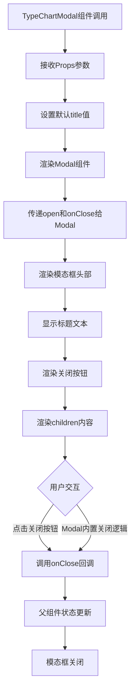

# 文件分析报告：TypeChartModal.tsx

## 文件概述
TypeChartModal.tsx是一个专门用于显示属性克制表的模态框组件。该组件是Modal组件的特化版本，专门用于展示口袋妖怪游戏中的属性相克关系。组件提供了预设的标题（"属性克制表"）和标准化的布局结构，简化了属性克制表的显示逻辑。作为一个轻量级的包装组件，它封装了通用的模态框功能，并为属性相关的内容展示提供了特定的UI框架。

## 代码结构分析

### 导入依赖
```typescript
import React from 'react'
import Modal from './Modal'
```

主要依赖：
- **React核心**：基础React功能
- **Modal组件**：底层模态框组件，提供基础的弹窗功能

### 全局变量和常量
该文件中没有定义全局变量或常量，所有配置都通过Props传递。

### 配置和设置
- **默认标题**：'属性克制表' - 为属性相关内容提供预设标题
- **布局结构**：标准化的头部和内容区域布局
- **样式配置**：使用Tailwind CSS进行样式设置

## 函数详细分析

### 函数概览表
| 函数名 | 类型 | 参数 | 返回值 | 作用 |
|--------|------|------|--------|------|
| TypeChartModal | 函数组件 | TypeChartModalProps | JSX.Element | 渲染属性克制表模态框 |

### 函数详细说明

#### TypeChartModal (主组件)
- **功能**：渲染专门用于属性克制表的模态框
- **Props接口**：
  ```typescript
  {
    open: boolean              // 控制模态框显示/隐藏
    onClose: () => void        // 关闭回调函数
    children: React.ReactNode  // 模态框内容
    title?: string            // 可选标题，默认为"属性克制表"
  }
  ```
- **默认行为**：提供属性相关的默认标题和布局
- **组合模式**：基于Modal组件进行功能扩展

#### 渲染逻辑
1. **Modal包装**：使用底层Modal组件提供基础弹窗功能
2. **头部渲染**：显示标题和关闭按钮
3. **内容渲染**：将children内容渲染到模态框主体

## 类详细分析

### 类概览表
该文件采用函数式组件设计，没有类定义。

### 类详细说明
组件使用现代React函数式组件模式，通过TypeScript接口定义严格的类型约束。

## 函数调用流程图


## 变量作用域分析

### Props作用域
- **open**: 布尔值，控制模态框的显示状态
- **onClose**: 函数引用，关闭事件的回调处理
- **children**: React节点，模态框的主要内容
- **title**: 可选字符串，模态框标题

### 默认值处理
- **title默认值**: '属性克制表' - 为属性相关内容提供语义化的默认标题
- **解构赋值**: 使用ES6解构语法提取Props并设置默认值

### 传递作用域
- **Modal组件**: 将open和onClose直接传递给底层Modal
- **子组件渲染**: children在JSX中直接渲染

## 函数依赖关系

### 外部依赖
```
TypeChartModal
├── React (核心库)
└── Modal (本地组件)
    ├── 模态框基础功能
    ├── 显示/隐藏控制
    └── 事件处理机制
```

### 组件关系
```
TypeChartModal (特化组件)
└── Modal (通用组件)
    ├── 基础弹窗功能
    ├── 遮罩层处理
    ├── 键盘事件支持
    └── 动画效果
```

### 数据流分析
1. **Props传入** → 组件接收 → 处理默认值
2. **用户交互** → Modal处理 → onClose回调 → 父组件状态更新
3. **内容渲染** → children直接传递 → Modal内部渲染

### 错误处理
- **类型安全**: TypeScript确保Props类型正确
- **默认值**: title提供合理的默认值，避免undefined
- **事件传递**: 依赖Modal组件的错误处理机制

### 性能分析
- **渲染性能**: 极简的组件结构，渲染开销最小
- **重渲染优化**: 无内部状态，仅依赖Props变化
- **组件复用**: 基于Modal的组合模式，复用底层功能

### 算法复杂度
- **时间复杂度**: O(1) - 简单的Props传递和JSX渲染
- **空间复杂度**: O(1) - 无状态存储，仅有Props引用

### 扩展性评估
**优势**：
- 简洁的API设计，易于使用
- 基于组合模式，复用底层Modal功能
- 类型安全的TypeScript实现
- 语义化的默认配置

**改进建议**：
- 可以添加更多属性相关的预设配置
- 考虑支持不同尺寸的属性表显示
- 可以添加属性表的快捷操作功能

### 代码质量评估
- **可读性**: 高 - 代码简洁，意图明确
- **可维护性**: 高 - 单一职责，依赖清晰
- **可测试性**: 高 - 无复杂逻辑，易于测试
- **复用性**: 高 - 专门用途但可扩展

### 文档完整性
- **组件文档**: 代码中有简洁的注释说明
- **类型定义**: TypeScript接口清晰完整
- **使用示例**: 需要补充使用示例文档

### 备注
TypeChartModal是一个设计良好的特化组件，体现了React组件组合模式的优势。通过基于通用Modal组件进行特化，既保持了代码的简洁性，又提供了特定业务场景的便利性。该组件适合在需要频繁显示属性克制表的游戏应用中使用，为用户提供一致的交互体验。