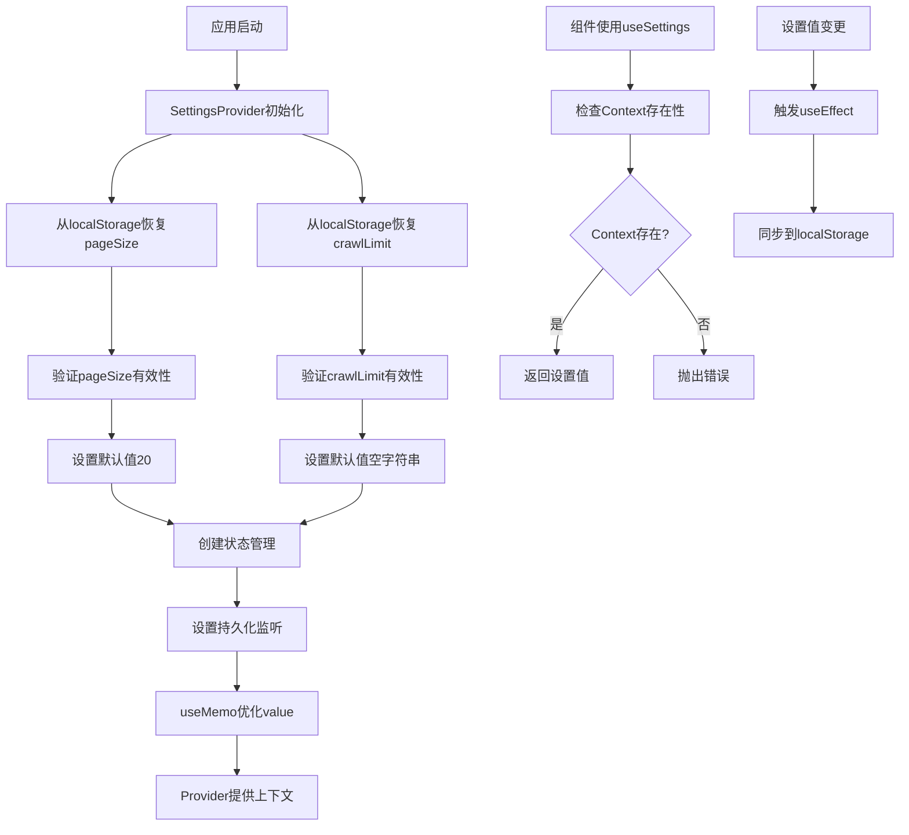

# 文件分析报告：client/src/context/SettingsContext.tsx

## 文件概述

`SettingsContext.tsx` 是一个React Context组件，负责管理应用的全局设置状态。该文件实现了设置数据的持久化存储、状态管理和跨组件共享功能，主要管理分页大小和爬虫数量限制两个核心设置项。

## 代码结构分析

### 导入依赖

```typescript
import React, { createContext, useContext, useEffect, useMemo, useState } from 'react';
```

- **React核心模块**：createContext, useContext, useEffect, useMemo, useState
- **功能模块**：状态管理、上下文创建、副作用处理、性能优化

### 全局变量和常量

```typescript
const SettingsContext = createContext<SettingsContextValue | undefined>(undefined);
```

- **SettingsContext**：全局设置上下文实例

### 配置和设置

#### 类型定义
```typescript
type SettingsContextValue = {
  pageSize: number;
  setPageSize: (n: number) => void;
  crawlLimit: string;
  setCrawlLimit: (s: string) => void;
};
```

#### 默认配置
- **pageSize默认值**：20条/页
- **crawlLimit默认值**：空字符串（表示无限制）

## 函数详细分析

### 函数概览表

| 函数名 | 参数 | 返回值 | 主要功能 |
|---------|------|--------|----------|
| `SettingsProvider` | children: ReactNode | JSX.Element | 设置状态提供者组件 |
| `useSettings` | 无 | SettingsContextValue | 获取设置上下文钩子 |
| useState初始化函数 | 无 | number/string | localStorage恢复逻辑 |

### 函数详细说明

#### `SettingsProvider({ children })`
```typescript
export function SettingsProvider({ children }: { children: React.ReactNode }) {
  const [pageSize, setPageSize] = useState<number>(() => {
    const v = Number(localStorage.getItem('pageSize'));
    return Number.isFinite(v) && v > 0 ? v : 20;
  });

  const [crawlLimit, setCrawlLimit] = useState<string>(() => {
    return localStorage.getItem('crawlLimit') || '';
  });
  // ...
}
```

- **功能**：提供设置状态的Context Provider组件
- **状态管理**：
  - pageSize：分页大小（数字类型，默认20）
  - crawlLimit：爬虫限制（字符串类型，默认空值）
- **持久化**：使用localStorage进行数据持久化
- **性能优化**：使用useMemo优化value对象创建

#### `useSettings()`
```typescript
export function useSettings() {
  const ctx = useContext(SettingsContext);
  if (!ctx) throw new Error('useSettings must be used within SettingsProvider');
  return ctx;
}
```

- **功能**：获取设置上下文的自定义Hook
- **错误处理**：检查组件是否在SettingsProvider包裹内使用
- **类型安全**：确保返回值类型正确性

#### 初始化状态函数

##### pageSize初始化
```typescript
const [pageSize, setPageSize] = useState<number>(() => {
  const v = Number(localStorage.getItem('pageSize'));
  return Number.isFinite(v) && v > 0 ? v : 20;
});
```
- **恢复逻辑**：从localStorage读取数值
- **验证逻辑**：确保值为有限正数
- **默认值**：20条/页

##### crawlLimit初始化  
```typescript
const [crawlLimit, setCrawlLimit] = useState<string>(() => {
  return localStorage.getItem('crawlLimit') || '';
});
```
- **恢复逻辑**：从localStorage读取字符串
- **默认值**：空字符串（表示无限制）

## 类详细分析

### 类概览表
该文件为函数式组件设计，不包含类定义。

### 类详细说明
不适用。

## 函数调用流程图



## 变量作用域分析

### 模块作用域
- **SettingsContext**：模块级别的React Context实例
- **SettingsContextValue类型**：TypeScript类型定义

### SettingsProvider组件作用域
- **pageSize状态**：分页大小状态
- **crawlLimit状态**：爬虫限制状态
- **value对象**：useMemo优化的上下文值
- **useEffect副作用**：持久化监听器

### useSettings钩子作用域
- **ctx变量**：从useContext获取的上下文值

## 函数依赖关系

### 外部依赖
- **React Hooks**：useState, useEffect, useMemo, useContext, createContext
- **Browser API**：localStorage（Web Storage API）

### 内部依赖图
```
SettingsProvider
├── useState (pageSize)
│   └── localStorage.getItem('pageSize')
├── useState (crawlLimit)  
│   └── localStorage.getItem('crawlLimit')
├── useEffect (pageSize持久化)
│   └── localStorage.setItem('pageSize')
├── useEffect (crawlLimit持久化)
│   └── localStorage.setItem('crawlLimit')
├── useMemo (value优化)
└── Context.Provider

useSettings
├── useContext(SettingsContext)
└── 错误边界检查
```

### 数据流分析

#### 初始化数据流
1. **组件挂载** → localStorage读取 → 数据验证 → 状态初始化
2. **默认值应用** → 有效数据使用/无效数据默认值

#### 更新数据流  
1. **用户操作** → 状态更新函数调用 → 状态变更
2. **useEffect触发** → localStorage同步 → 持久化完成

#### 消费数据流
1. **useSettings调用** → Context读取 → 数据返回
2. **组件重渲染** → 新数据应用

### 错误处理

#### Context使用检查
```typescript
if (!ctx) throw new Error('useSettings must be used within SettingsProvider');
```
- **检查位置**：useSettings钩子内部
- **错误类型**：运行时错误
- **错误信息**：明确的使用指导

#### localStorage访问处理
- **静默处理**：localStorage访问异常不会中断应用
- **降级处理**：访问失败时使用默认值
- **兼容性处理**：支持localStorage不可用的环境

### 性能分析

#### 时间复杂度
- **初始化**：O(1) - 固定时间localStorage访问
- **状态更新**：O(1) - 简单状态变更
- **持久化**：O(1) - 单次localStorage写入

#### 空间复杂度
- **内存占用**：O(1) - 固定的状态变量存储
- **存储占用**：O(1) - localStorage中两个键值对

#### 优化特性
- **useMemo优化**：避免不必要的value对象重创建
- **懒初始化**：useState使用函数初始化减少重复计算
- **依赖优化**：useEffect精确依赖减少不必要执行

### 算法复杂度

#### 数据恢复算法
- **数值验证**：Number.isFinite() + 正数检查
- **字符串处理**：简单的空值合并运算

#### 持久化算法
- **同步策略**：值变更即时同步到localStorage
- **存储格式**：简单的字符串序列化

### 扩展性评估

#### 配置扩展性
- **新设置项**：易于添加新的state和对应的localStorage逻辑
- **类型安全**：TypeScript类型系统保证新增项的类型安全
- **向后兼容**：localStorage读取支持默认值机制

#### 功能扩展性
- **验证逻辑**：可扩展复杂的数据验证规则
- **持久化策略**：可扩展到其他存储方案（如IndexedDB）
- **状态管理**：可结合Redux等状态管理库

#### 组件扩展性
- **Provider模式**：标准的React Context模式易于理解和维护
- **钩子模式**：自定义钩子提供清晰的API接口

### 代码质量评估

#### 可读性
- **清晰的命名**：函数和变量名称明确表达意图
- **良好的结构**：逻辑分层清晰，代码组织合理
- **类型注解**：TypeScript提供完整的类型信息

#### 可维护性
- **单一职责**：每个函数职责明确
- **低耦合度**：组件间依赖关系简单清晰
- **高内聚性**：相关功能集中在同一模块

#### 健壮性
- **错误边界**：useSettings包含使用检查
- **数据验证**：localStorage数据恢复包含验证逻辑
- **默认值策略**：确保应用在任何情况下都能正常工作

#### 可测试性
- **纯函数特性**：状态更新逻辑清晰可测试
- **Mock友好**：localStorage可以轻易Mock
- **隔离性**：Context可独立测试

### 文档完整性

代码包含清晰的TypeScript类型定义，函数名称具有自说明性。

### 备注

这是一个设计良好的React Context组件，实现了用户设置的全局状态管理。采用标准的React模式，具有良好的性能优化和错误处理机制。