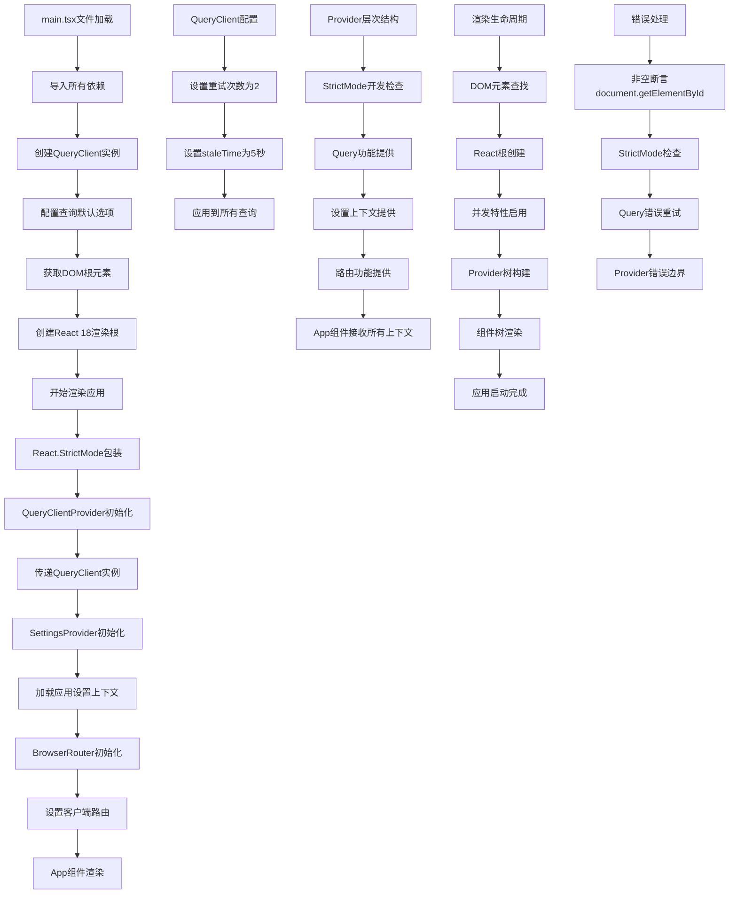

# 文件分析报告：client/src/main.tsx

## 文件概述

`client/src/main.tsx` 是React应用程序的启动入口文件，负责应用程序的初始化、Provider配置和DOM渲染。该文件集成了React Query查询客户端、路由系统、应用设置上下文等核心功能，通过Provider模式构建了完整的应用架构基础。作为应用的引导程序，它确保了所有全局依赖和配置在应用启动时正确初始化，为整个React应用提供了统一的运行环境。

## 代码结构分析

### 导入依赖

```typescript
import React from 'react'
import ReactDOM from 'react-dom/client'
import { QueryClient, QueryClientProvider } from '@tanstack/react-query'
import { BrowserRouter } from 'react-router-dom'
import { SettingsProvider } from './context/SettingsContext'
import App from './App'
import './styles.css'
```

- **React核心**：React和ReactDOM.createRoot用于应用渲染
- **查询管理**：TanStack Query的QueryClient和Provider
- **路由系统**：react-router-dom的BrowserRouter
- **应用上下文**：自定义的SettingsProvider设置管理
- **根组件**：主要的App组件
- **样式导入**：全局CSS样式文件

### 全局变量和常量

```typescript
const qc = new QueryClient({
  defaultOptions: {
    queries: { retry: 2, staleTime: 5_000 },
  }
})
```

- **qc常量**：QueryClient实例，配置了全局查询选项
- **retry配置**：查询失败时最多重试2次
- **staleTime配置**：数据被认为过时的时间为5秒

### 配置和设置

#### React Query配置
- **重试策略**：失败请求自动重试2次，提高可靠性
- **缓存策略**：5秒的staleTime平衡性能和数据新鲜度
- **全局配置**：所有查询默认继承这些配置选项

#### Provider嵌套结构
- **外层到内层**：StrictMode → QueryClientProvider → SettingsProvider → BrowserRouter → App
- **职责分离**：每个Provider负责特定的功能领域
- **上下文传递**：确保所有子组件都能访问相应的功能

## 函数详细分析

### 函数概览表

| 函数名 | 参数 | 返回值 | 主要功能 |
|---------|------|--------|----------|
| `ReactDOM.createRoot` | Element | Root | 创建React 18并发渲染根 |
| `render` | JSX.Element | void | 渲染应用到DOM |

### 函数详细说明

#### `ReactDOM.createRoot()` - React 18渲染根创建
```typescript
ReactDOM.createRoot(document.getElementById('root')!)
```

**核心特性**：
- **并发特性**：启用React 18的并发渲染功能
- **DOM挂载点**：获取id为'root'的HTML元素作为挂载点
- **非空断言**：使用!操作符断言元素存在
- **现代API**：替代React 17的ReactDOM.render

#### `render()` - 应用渲染函数
```typescript
.render(
  <React.StrictMode>
    <QueryClientProvider client={qc}>
      <SettingsProvider>
        <BrowserRouter>
          <App />
        </BrowserRouter>
      </SettingsProvider>
    </QueryClientProvider>
  </React.StrictMode>
)
```

**Provider架构**：
1. **React.StrictMode**：开发模式下的额外检查和警告
2. **QueryClientProvider**：提供React Query功能
3. **SettingsProvider**：提供应用设置上下文
4. **BrowserRouter**：提供客户端路由功能
5. **App组件**：应用的主要逻辑组件

## 类详细分析

### 类概览表

该文件主要使用函数式API，不包含类定义。

### 类详细说明

虽然不包含自定义类，但使用了以下重要的类实例：
- **QueryClient**：React Query的核心查询管理类
- **React.Root**：React 18的并发渲染根实例

## 函数调用流程图



## 变量作用域分析

### 模块作用域
- **qc常量**：QueryClient实例，在模块级别定义
- **导入的组件**：React, ReactDOM, Provider组件等
- **样式导入**：全局CSS样式的模块级导入

### 函数调用作用域
- **document.getElementById**：全局DOM API的调用
- **ReactDOM.createRoot**：React DOM API的调用
- **render方法**：渲染根实例的方法调用

### Provider作用域
- **QueryClientProvider**：为整个应用提供查询功能
- **SettingsProvider**：为整个应用提供设置上下文
- **BrowserRouter**：为整个应用提供路由上下文
- **React.StrictMode**：为整个应用提供开发检查

### 应用作用域
- **全局配置**：QueryClient的默认选项影响所有查询
- **上下文传递**：所有Provider的值向下传递给子组件
- **样式作用域**：全局CSS样式影响整个应用

## 函数依赖关系

### 外部依赖
- **React库**：React核心和DOM渲染功能
- **TanStack Query**：数据获取和缓存管理
- **React Router**：客户端路由管理
- **浏览器DOM API**：document.getElementById等

### 内部依赖图
```
main.tsx入口文件
├── React依赖
│   ├── React (核心库)
│   └── ReactDOM (DOM渲染)
├── 查询管理依赖
│   ├── QueryClient (查询客户端)
│   └── QueryClientProvider (上下文提供者)
├── 路由依赖
│   └── BrowserRouter (浏览器路由)
├── 应用依赖
│   ├── SettingsProvider (设置上下文)
│   ├── App (根组件)
│   └── styles.css (全局样式)
└── DOM依赖
    ├── document.getElementById (元素查找)
    └── HTML root元素 (挂载点)
```

### 数据流分析

#### 应用启动数据流
1. **模块加载** → 依赖导入 → QueryClient创建 → 配置应用
2. **DOM准备** → 根元素查找 → React根创建 → 渲染准备

#### Provider数据流
1. **StrictMode** → 开发检查启用 → 额外警告和验证
2. **QueryClientProvider** → 查询功能注入 → 全局数据管理
3. **SettingsProvider** → 设置上下文注入 → 应用配置管理
4. **BrowserRouter** → 路由功能注入 → 页面导航管理

#### 渲染数据流
1. **Provider嵌套** → 上下文层叠 → App组件接收 → 功能可用
2. **并发渲染** → React 18特性 → 性能优化 → 用户体验提升

### 错误处理

#### DOM操作错误
- **元素不存在**：document.getElementById('root')可能返回null
- **非空断言风险**：!操作符在运行时可能抛出错误
- **渲染失败**：DOM挂载点不可用时的处理

#### Provider配置错误
- **QueryClient配置**：无效配置选项的处理
- **Context提供错误**：Provider嵌套错误的影响
- **路由配置错误**：BrowserRouter初始化失败

#### React应用错误
- **StrictMode检查**：开发模式下的额外错误检测
- **组件渲染错误**：App组件渲染失败的处理
- **并发渲染错误**：React 18特性相关的错误

### 性能分析

#### 启动性能
- **模块加载**：ES模块的异步加载优化
- **依赖解析**：打包工具的依赖分析和优化
- **初始化开销**：Provider创建和配置的性能影响

#### 运行时性能
- **QueryClient缓存**：5秒staleTime平衡性能和新鲜度
- **重试策略**：2次重试避免过度的网络请求
- **并发渲染**：React 18的时间切片和优先级调度

#### 内存性能
- **Provider实例**：单例模式避免重复创建
- **查询缓存**：自动的内存管理和垃圾回收
- **组件树优化**：Provider嵌套的内存效率

### 算法复杂度

#### 应用初始化算法
- **依赖加载**：O(n) - n为依赖模块数量
- **Provider创建**：O(1) - 固定数量的Provider实例
- **DOM操作**：O(1) - 单个元素查找和根创建

#### 渲染算法
- **组件树构建**：O(n) - n为组件数量
- **Provider链遍历**：O(p) - p为Provider层数
- **上下文传递**：O(d) - d为组件树深度

### 扩展性评估

#### Provider系统扩展性
- **新Provider添加**：可轻松添加新的上下文提供者
- **配置扩展**：可扩展QueryClient和其他Provider的配置
- **功能模块化**：每个Provider负责独立的功能领域

#### 配置系统扩展性
- **环境配置**：可通过环境变量配置不同的选项
- **动态配置**：可支持运行时配置更新
- **多环境支持**：可根据环境调整配置参数

#### 架构扩展性
- **微前端支持**：可扩展为微前端架构的主应用
- **插件系统**：可添加插件化的功能扩展
- **国际化支持**：可添加i18n Provider支持多语言

### 代码质量评估

#### 可读性
- **清晰的导入结构**：依赖导入组织良好
- **Provider嵌套层次**：逻辑清晰的嵌套结构
- **配置集中**：QueryClient配置集中管理

#### 可维护性
- **单一职责**：每个Provider职责明确
- **配置外部化**：查询选项可配置化
- **模块化设计**：功能模块化组织

#### 健壮性
- **错误边界**：StrictMode提供开发时错误检测
- **重试机制**：QueryClient的自动重试功能
- **类型安全**：TypeScript提供编译时类型检查

#### 可测试性
- **Provider隔离**：每个Provider可独立测试
- **配置Mock**：QueryClient等可轻易Mock
- **组件分离**：渲染逻辑与业务逻辑分离

### 文档完整性

代码结构简洁明了，使用标准的React 18模式和现代前端最佳实践，具有良好的自文档化特性。注释虽然简洁但指明了关键的配置意图。

### 备注

这是一个设计优秀的React应用入口文件，体现了现代React开发的最佳实践。通过合理的Provider嵌套、QueryClient配置和React 18特性的使用，构建了一个高性能、可扩展的应用基础架构。特别是查询配置的staleTime和retry设置，展现了对用户体验和性能的深入考虑。