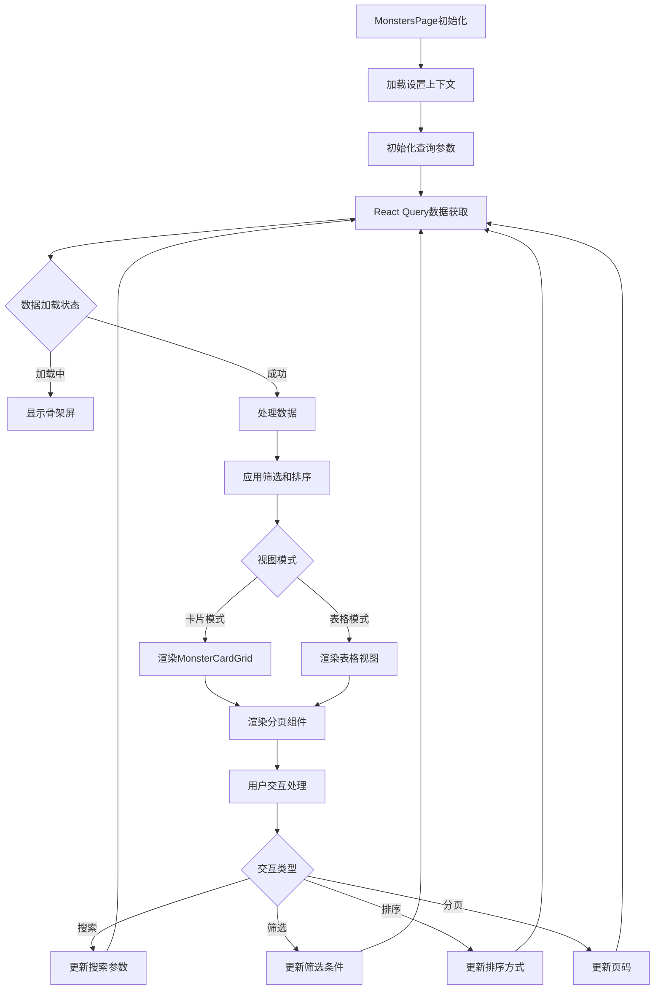

# 文件分析报告：MonstersPage.tsx

## 文件概述
MonstersPage.tsx是口袋妖怪图鉴应用的主页面组件，负责展示和管理怪物列表数据。该文件是整个应用的核心页面，集成了数据获取、筛选、排序、分页等关键功能。组件使用React Query进行数据管理，支持多种视图模式（卡片/表格），提供了丰富的搜索和筛选能力，包括属性筛选、技能筛选、标签系统等。该组件还适配了新的后端API结构，支持新的五维属性系统和标签体系。

## 代码结构分析

### 导入依赖
```typescript
import React, { useEffect, useMemo, useRef, useState } from 'react'
import { useQuery, useQueryClient } from '@tanstack/react-query'
import api from '../api'
import { Monster, MonsterListResp, TagCount } from '../types'
import SkeletonRows from '../components/SkeletonRows'
import Pagination from '../components/Pagination'
import SideDrawer from '../components/SideDrawer'
import { useSettings } from '../context/SettingsContext'
import MonsterCardGrid from '../components/MonsterCardGrid'
import SkeletonCardGrid from '../components/SkeletonCardGrid'
```

主要依赖：
- **React核心**：hooks用于状态管理和生命周期
- **React Query**：数据获取和缓存管理
- **自定义API模块**：与后端通信
- **类型定义**：TypeScript接口
- **UI组件**：骨架屏、分页、侧边栏、卡片网格等
- **设置上下文**：全局设置管理

### 全局变量和常量
```typescript
// 交互效果样式常量
const BTN_FX = 'transition active:bg-blue-100 focus:outline-none focus:ring-2 focus:ring-blue-300'

// 标签显示限制
const LIMIT_TAGS_PER_CELL = 3

// 元素映射表
const ELEMENTS: Record<string, string> = {
  huoxi: '火系', jinxi: '金系', muxi: '木系', shuixi: '水系', tuxi: '土系', yixi: '翼系',
  guaixi: '怪系', moxi: '魔系', yaoxi: '妖系', fengxi: '风系', duxi: '毒系', leixi: '雷系',
  huanxi: '幻系', bing: '冰系', lingxi: '灵系', jixie: '机械', huofengxi: '火风系'
}
```

### 配置和设置
- **排序选项**：支持时间、属性值、派生值等多种排序方式
- **元素系统**：完整的属性元素映射
- **标签体系**：buf_/deb_/util_ 前缀的新标签系统
- **UI配置**：响应式布局、动画效果等

## 函数详细分析

### 函数概览表
| 函数名 | 类型 | 参数 | 返回值 | 作用 |
|--------|------|------|--------|------|
| MonstersPage | 函数组件 | 无 | JSX.Element | 主页面组件，渲染怪物列表 |
| getDerivedValue | 工具函数 | monster, key | number | 获取怪物派生属性值 |
| isMeaningfulDesc | 工具函数 | text | boolean | 判断描述文本是否有意义 |
| isValidSkillName | 工具函数 | name | boolean | 验证技能名称有效性 |
| bucketizeTags | 工具函数 | tags | TagBuckets | 将标签按类型分组 |
| tagEmoji | 工具函数 | code | string | 根据标签代码返回对应emoji |
| toURLParams | 工具函数 | object | URLSearchParams | 对象转换为URL参数 |

### 函数详细说明

#### MonstersPage (主组件)
- **功能**：渲染怪物列表主页面
- **状态管理**：
  - 搜索参数状态
  - 视图模式切换
  - 分页状态
  - 筛选条件

#### getDerivedValue
- **功能**：获取怪物的派生属性值，提供向后兼容
- **逻辑**：优先使用新五轴属性，回退到旧属性系统
- **兼容性**：确保新旧API数据结构的平滑过渡

#### 标签处理函数组
- **bucketizeTags**：按buf_/deb_/util_前缀分类标签
- **tagEmoji**：为不同类型标签提供视觉标识
- **工具性**：支持新的标签体系展示

## 类详细分析

### 类概览表
该文件使用TypeScript接口定义，没有ES6类：

| 接口名 | 作用 | 主要字段 |
|--------|------|----------|
| SkillDTO | 技能数据传输对象 | id, name, element, kind, power, description |
| StatsDTO | 统计信息 | total, with_skills, tags_total |
| WarehouseStatsDTO | 仓库统计 | total, owned_total, not_owned_total |
| TagBuckets | 标签分组 | buf, deb, util |

### 类详细说明
组件采用函数式设计，通过TypeScript接口定义数据结构，确保类型安全和数据一致性。

## 函数调用流程图


## 变量作用域分析

### 组件级状态
- **查询参数**：搜索、筛选、排序条件
- **UI状态**：视图模式、侧边栏开关、加载状态
- **分页状态**：当前页码、页面大小

### 上下文状态
- **设置状态**：从SettingsContext获取的全局配置
- **查询缓存**：React Query管理的数据缓存

### 局部作用域
- **事件处理器**：各种用户交互的回调函数
- **计算值**：useMemo优化的派生数据

## 函数依赖关系

### 外部依赖树
```
MonstersPage
├── React (核心hooks)
├── @tanstack/react-query (数据管理)
├── ../api (API调用)
├── ../types (类型定义)
├── 子组件
│   ├── SkeletonRows
│   ├── Pagination
│   ├── SideDrawer
│   ├── MonsterCardGrid
│   └── SkeletonCardGrid
└── ../context/SettingsContext (设置管理)
```

### 内部函数依赖
```
工具函数层
├── getDerivedValue (属性计算)
├── isMeaningfulDesc (文本验证)
├── isValidSkillName (技能验证)
├── bucketizeTags (标签分组)
├── tagEmoji (标签展示)
└── toURLParams (URL处理)
```

### 数据流分析
1. **查询参数** → API调用 → React Query缓存
2. **用户输入** → 状态更新 → 重新查询
3. **全局设置** → 组件配置 → UI渲染

### 错误处理
- **API错误**：React Query自动重试和错误状态管理
- **数据验证**：工具函数确保数据有效性
- **向后兼容**：getDerivedValue处理新旧API差异

### 性能分析
- **数据缓存**：React Query提供自动缓存和后台更新
- **计算优化**：useMemo缓存昂贵计算
- **渲染优化**：条件渲染减少不必要的DOM操作
- **虚拟化**：大列表使用骨架屏提升感知性能

### 算法复杂度
- **筛选操作**：O(n) - 线性扫描数据
- **排序操作**：O(n log n) - 标准排序算法
- **分页计算**：O(1) - 常数时间切片

### 扩展性评估
**优势**：
- 模块化设计，组件职责清晰
- 类型安全的TypeScript实现
- React Query提供强大的数据管理能力
- 新旧API兼容性处理

**改进建议**：
- 可以提取复杂的筛选逻辑到自定义hooks
- 考虑实现虚拟滚动优化大数据集性能
- 可以优化移动端响应式体验

### 代码质量评估
- **可读性**：高 - 良好的代码组织和注释
- **可维护性**：高 - 清晰的模块分离
- **可测试性**：中等 - 可以通过mock进行单元测试
- **复用性**：中等 - 与特定业务逻辑耦合

### 文档完整性
- **组件文档**：代码注释较完整
- **API文档**：类型定义清晰
- **业务逻辑**：复杂筛选逻辑需要更多说明

### 备注
这是一个功能完整、设计良好的React页面组件。该组件展示了现代React开发的最佳实践，包括hooks使用、性能优化、类型安全等。组件处理了复杂的数据交互场景，同时保持了良好的用户体验。新旧API的兼容性处理体现了良好的工程实践。