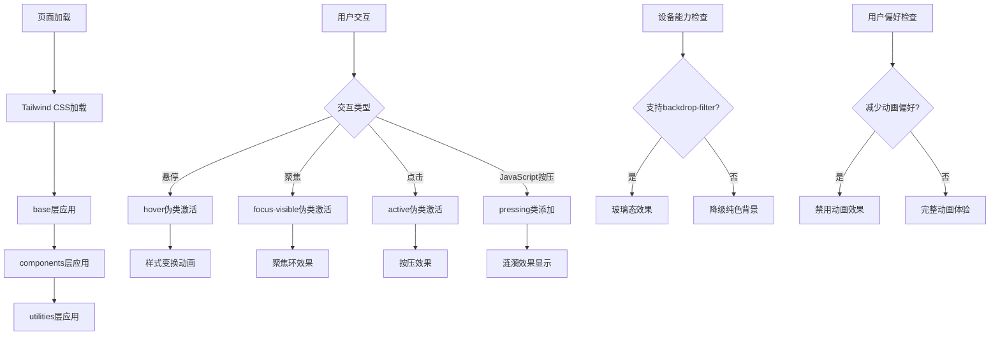

# 文件分析报告：client/src/styles.css

## 文件概述

`styles.css` 是项目的核心样式文件，基于Tailwind CSS框架构建。该文件实现了现代玻璃态设计风格，包含完整的UI组件样式系统、视觉效果优化和无障碍访问支持。文件采用分层架构，提供了按钮、表单、表格等组件的统一视觉语言。

## 代码结构分析

### 导入依赖

```css
@tailwind base;
@tailwind components;
@tailwind utilities;
```

- **Tailwind CSS层级**：按照官方推荐的三层结构导入
- **base层**：重置样式和基础元素样式
- **components层**：组件级别的复用样式
- **utilities层**：原子化工具类

### 全局变量和常量

```css
:root {
  color-scheme: light;
  --press-x: 50%;
  --press-y: 50%;
  --blue-overlay-a: 0.10;
  --blue-overlay-a-hover: 0.12;
  --blue-overlay-a-press: 0.14;
  --primary-ripple-a: 0.20;
}
```

#### CSS自定义属性
- **色彩模式**：light主题配置
- **交互变量**：涟漪效果位置坐标
- **透明度限制**：蓝色叠加层透明度控制
- **涟漪透明度**：主按钮涟漪效果透明度

### 配置和设置

#### 基础样式配置
- **body样式**：白色背景，深灰色文字
- **容器样式**：最大宽度7xl，居中对齐，水平内边距
- **卡片样式**：圆角、阴影、边框的卡片组件

## 函数详细分析

### 函数概览表

CSS文件不包含函数，但包含以下主要样式类：

| 样式类 | 用途 | 特性 |
|--------|------|------|
| `.btn` | 基础按钮样式 | 玻璃态效果，浅蓝悬停，弹性动画 |
| `.btn-primary` | 主要按钮样式 | 持续蓝色主题，白色涟漪 |
| `.select` | 下拉选择框样式 | 玻璃态效果，自定义箭头 |
| `.input` | 输入框样式 | 简洁设计，聚焦效果 |
| `.table` | 表格样式 | 悬停效果，边框分隔 |

### 函数详细说明

#### `.btn` - 基础按钮样式类
```css
.btn {
  @apply inline-flex items-center justify-center rounded-xl px-3 py-2 text-sm font-medium
         select-none disabled:opacity-50 disabled:cursor-not-allowed
         focus:outline-none;

  position: relative;
  color: #111827;
  border: 1px solid rgba(255,255,255,0.50);
  
  background-image:
    linear-gradient(180deg, rgba(59,130,246, calc(var(--blue-overlay-a) - 0.04)), rgba(37,99,235, calc(var(--blue-overlay-a) - 0.06))),
    linear-gradient(180deg, rgba(255,255,255,0.38), rgba(255,255,255,0.32));
    
  -webkit-backdrop-filter: blur(10px);
  backdrop-filter: blur(10px);
  // ...
}
```

**核心特性**：
- **玻璃态效果**：backdrop-filter模糊和多层渐变
- **交互状态**：hover、focus、active的完整状态管理
- **性能优化**：硬件加速的变换和过渡动画
- **无障碍支持**：focus-visible和键盘导航

#### `.btn-primary` - 主按钮样式类
```css
.btn.primary, .btn-primary {
  color: #fff;
  border-color: rgba(99,102,241,0.55);
  background-image:
    linear-gradient(180deg, rgba(99,102,241,0.78), rgba(79,70,229,0.72)),
    linear-gradient(180deg, rgba(255,255,255,0.20), rgba(255,255,255,0.16));
  // ...
}
```

**设计理念**：
- **色彩稳定性**：避免hover状态过度叠加蓝色
- **视觉层次**：通过brightness和saturate微调实现层次感
- **白色涟漪**：避免与主色叠加导致的过曝效果

#### `.select` - 选择框样式类
```css
.select {
  @apply h-9 w-full rounded-xl text-sm px-3 pr-9 border shadow-md
         focus:outline-none;
         
  background-image:
    url("data:image/svg+xml,%3Csvg..."), // 自定义箭头
    linear-gradient(...), // 玻璃态背景
    linear-gradient(...);
  // ...
}
```

**技术特点**：
- **自定义箭头**：SVG data URL实现的下拉箭头
- **样式重置**：appearance: none移除浏览器默认样式
- **统一视觉**：与按钮相同的玻璃态效果

## 类详细分析

### 类概览表

| 样式类别 | 包含类 | 主要功能 |
|----------|--------|----------|
| 按钮类 | `.btn`, `.btn-primary`, `.btn-lg` | 交互按钮样式系统 |
| 表单类 | `.input`, `.select`, `.label` | 表单控件样式 |
| 布局类 | `.container`, `.card` | 页面布局组件 |
| 表格类 | `.table`, `th`, `td` | 数据表格样式 |
| 反馈类 | `.toast`, `.modal`, `.badge` | 用户反馈组件 |

### 类详细说明

#### 按钮类系统
- **继承关系**：`.btn-primary`继承`.btn`基础样式
- **状态管理**：`:hover`, `:focus-visible`, `:active`完整状态
- **动画系统**：`pressing`, `released`类配合JavaScript实现弹性动画

#### 表单类系统  
- **一致性设计**：统一的高度、圆角、字体大小
- **交互反馈**：focus状态的边框和阴影变化
- **无障碍性**：合理的对比度和键盘导航支持

#### 布局类系统
- **响应式设计**：max-w-7xl和px-4的响应式容器
- **视觉层次**：卡片组件的阴影和边框系统

## 函数调用流程图



## 变量作用域分析

### 全局作用域（:root）
- **CSS自定义属性**：所有组件可访问的全局变量
- **色彩主题**：light色彩方案声明
- **交互参数**：涟漪位置和透明度控制

### 组件作用域
- **按钮变量**：按钮特定的样式属性
- **表单变量**：表单控件的尺寸和样式参数
- **动画变量**：过渡和变换的时间参数

### 媒体查询作用域
- **无障碍性**：`@media (prefers-reduced-motion: reduce)`
- **兼容性**：`@supports not (backdrop-filter: blur(0))`

## 函数依赖关系

### 外部依赖
- **Tailwind CSS**：核心样式框架
- **CSS3特性**：backdrop-filter, CSS Grid, Flexbox
- **浏览器API**：CSS自定义属性，媒体查询

### 内部依赖关系
```
样式系统架构
├── Tailwind基础层
│   ├── Reset样式
│   ├── 基础元素样式
│   └── 默认字体和颜色
├── 组件层 (@layer components)
│   ├── 按钮系统
│   │   ├── .btn (基础)
│   │   ├── .btn-primary (主要)
│   │   └── .btn-lg (大尺寸)
│   ├── 表单系统
│   │   ├── .input
│   │   ├── .select
│   │   └── .label
│   └── 布局系统
│       ├── .container
│       ├── .card
│       └── .table
└── 工具层
    ├── 响应式工具
    ├── 间距工具
    └── 颜色工具
```

### 数据流分析

#### 样式加载流程
1. **base层加载** → 浏览器默认样式重置
2. **components层加载** → 自定义组件样式应用
3. **utilities层加载** → 原子化工具类生效

#### 交互状态流程
1. **用户操作** → 伪类状态变化 → CSS属性更新
2. **JavaScript增强** → 类名切换 → 动画效果触发
3. **性能优化** → GPU加速 → 流畅视觉反馈

#### 主题适配流程
1. **浏览器能力检测** → 特性支持判断 → 样式策略选择
2. **用户偏好检测** → 媒体查询匹配 → 体验模式切换

### 错误处理

#### 浏览器兼容性处理
```css
@supports not ((-webkit-backdrop-filter: blur(0)) or (backdrop-filter: blur(0))) {
  .btn {
    background: rgba(255,255,255,0.96);
    border-color: rgba(229,231,235,1);
    box-shadow: inset 0 1px 0 rgba(255,255,255,0.9);
  }
}
```
- **降级策略**：不支持backdrop-filter的浏览器使用纯色背景
- **功能保持**：核心功能在降级情况下仍然可用

#### 无障碍性处理
```css
@media (prefers-reduced-motion: reduce) {
  .btn, .select { 
    transition: border-color 150ms ease, background 150ms ease, box-shadow 150ms ease !important; 
  }
  .btn, .btn:active { transform: none !important; }
  .btn::after { display: none !important; }
}
```
- **动画减少**：尊重用户的动画偏好设置
- **功能保留**：禁用动画但保持基础交互效果

### 性能分析

#### 渲染性能
- **硬件加速**：transform和opacity动画使用GPU加速
- **重绘优化**：避免触发layout的属性变更
- **层级管理**：合理使用z-index避免层级冲突

#### 内存占用
- **CSS文件大小**：约10KB的样式文件
- **运行时开销**：最小化的JavaScript交互增强
- **缓存策略**：静态CSS文件支持长期缓存

#### 加载优化
- **关键路径**：CSS文件优先加载保证首屏渲染
- **分层加载**：Tailwind的分层结构支持选择性加载
- **压缩优化**：生产环境自动压缩和优化

### 算法复杂度

#### 样式计算复杂度
- **选择器权重**：O(1) - 简单的类选择器
- **级联计算**：O(n) - n为应用的样式规则数量
- **重排重绘**：O(1) - 优化的属性变更避免全页面重排

#### 动画计算复杂度
- **CSS动画**：硬件加速，不占用主线程
- **过渡计算**：浏览器原生优化，性能表现良好

### 扩展性评估

#### 主题扩展性
- **CSS变量**：支持动态主题切换
- **色彩系统**：基于HSL的可扩展色彩方案
- **组件变体**：易于创建新的按钮和表单变体

#### 组件扩展性
- **基础类复用**：新组件可复用现有基础样式
- **命名约定**：BEM风格的类命名支持扩展
- **模块化结构**：清晰的样式分层便于维护

#### 响应式扩展性
- **断点系统**：Tailwind的响应式断点系统
- **容器查询**：未来支持容器查询的架构准备
- **设备适配**：支持不同设备类型的样式适配

### 代码质量评估

#### 可读性
- **清晰的结构**：合理的代码分组和注释
- **语义化命名**：组件类名表达明确含义
- **一致性**：统一的编码风格和命名约定

#### 可维护性
- **模块化设计**：组件样式独立可维护
- **变量管理**：CSS自定义属性集中管理主题参数
- **版本控制**：样式变更易于跟踪和回滚

#### 健壮性
- **兼容性处理**：完善的浏览器兼容性方案
- **降级策略**：优雅的功能降级处理
- **错误恢复**：样式错误不会影响页面功能

#### 可测试性
- **视觉回归测试**：样式变更可通过截图测试验证
- **交互测试**：动画和过渡效果可自动化测试
- **无障碍测试**：支持无障碍性自动化检查

### 文档完整性

文件包含详细的内联注释，解释了设计理念和技术实现细节。

### 备注

这是一个现代化的CSS样式系统，采用玻璃态设计风格，具有出色的视觉效果和用户体验。代码结构清晰，性能优化充分，兼容性和无障碍性处理完善。