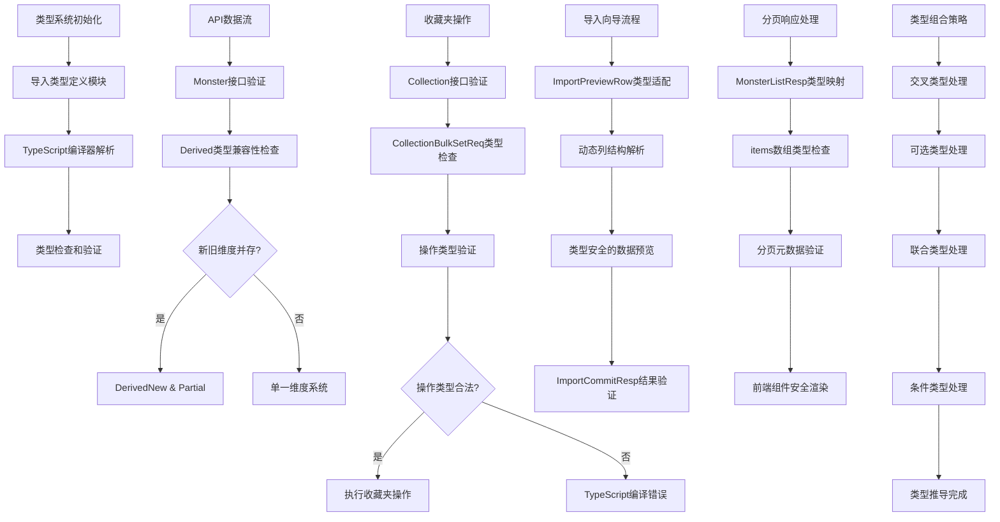

# 文件分析报告：client/src/types.ts

## 文件概述

`client/src/types.ts` 是React应用程序的TypeScript类型定义模块，为整个前端应用提供了完整的类型系统。该文件定义了怪物图鉴应用的核心数据结构，包括怪物实体、派生维度、收藏夹管理、数据导入导出等功能的类型接口。通过强类型系统确保了数据一致性和API契约的严格执行，支持新旧两套派生维度系统的兼容性迁移。

## 代码结构分析

### 导入依赖

该文件为纯TypeScript类型定义模块，不包含运行时依赖导入。

### 全局变量和常量

该文件定义了类型接口和类型别名，不包含运行时变量或常量。

### 配置和设置

#### 派生维度系统配置
- **新五轴系统**：body_defense, body_resist, debuff_def_res, debuff_atk_mag, special_tactics
- **旧五轴系统**：offense, survive, control, tempo, pp_pressure
- **向后兼容**：通过交叉类型和Partial实现新旧系统共存

#### API响应结构配置
- **分页响应**：items, total, has_more, etag标准分页格式
- **批量操作**：支持add, remove, set三种操作模式
- **错误处理**：统一的错误信息结构

## 函数详细分析

### 函数概览表

该文件为类型定义模块，不包含函数实现。

### 函数详细说明

不适用，该文件只包含类型声明。

## 类详细分析

### 类概览表

| 接口名 | 类型 | 主要功能 | 重要性 |
|---------|------|----------|---------|
| DerivedNew | interface | 新派生维度系统 | 核心 |
| DerivedLegacy | interface | 旧派生维度系统 | 兼容 |
| Derived | type alias | 派生维度联合类型 | 核心 |
| Monster | interface | 怪物实体类型 | 核心 |
| MonsterListResp | interface | 怪物列表响应 | 重要 |
| Collection | interface | 收藏夹实体类型 | 重要 |
| ImportPreviewRow | type alias | 导入预览行类型 | 功能 |

### 类详细说明

#### `DerivedNew` - 新派生维度接口
```typescript
export interface DerivedNew {
  body_defense?: number
  body_resist?: number
  debuff_def_res?: number
  debuff_atk_mag?: number
  special_tactics?: number
}
```

**设计特性**：
- **五轴维度**：定义了新的五个派生维度指标
- **可选属性**：所有属性都是可选的，支持部分数据
- **数值类型**：使用number类型确保数值计算
- **语义化命名**：属性名清晰表达了各维度的含义

#### `DerivedLegacy` - 旧派生维度接口
```typescript
export interface DerivedLegacy {
  offense?: number
  survive?: number
  control?: number
  tempo?: number
  pp_pressure?: number
}
```

**兼容性设计**：
- **历史兼容**：保留旧系统的五个维度指标
- **可选属性**：与新系统保持一致的可选性
- **平滑迁移**：支持数据系统的渐进式升级

#### `Derived` - 派生维度联合类型
```typescript
export type Derived = DerivedNew & Partial<DerivedLegacy>
```

**类型组合**：
- **交叉类型**：结合新旧两套维度系统
- **Partial包装**：旧维度作为可选补充
- **向前兼容**：确保新系统数据的完整性

#### `Monster` - 怪物实体核心接口
```typescript
export interface Monster {
  id: number
  name: string
  element?: string | null
  role?: string | null
  
  // 原始六维属性
  hp: number
  speed: number
  attack: number
  defense: number
  magic: number
  resist: number
  
  // 拥有/获取相关
  possess?: boolean
  new_type?: boolean | null
  type?: string | null
  method?: string | null
  
  // 图片和扩展信息
  image_url?: string | null
  tags: string[]
  explain_json?: Record<string, any>
  
  // 派生维度和时间戳
  derived?: Derived
  created_at?: string | null
  updated_at?: string | null
}
```

**数据模型特性**：
- **标识和基本信息**：id, name为必需属性
- **游戏属性**：六维数值(hp, speed, attack等)为核心数据
- **分类系统**：element, role, tags提供多维度分类
- **状态管理**：possess, new_type等标记拥有状态
- **扩展性**：explain_json支持任意结构化数据
- **审计字段**：created_at, updated_at支持数据追踪

#### `MonsterListResp` - 分页响应接口
```typescript
export interface MonsterListResp {
  items: Monster[]
  total: number
  has_more: boolean
  etag: string
}
```

**分页设计**：
- **数据项**：items数组包含具体的怪物数据
- **计数信息**：total提供总数统计
- **分页控制**：has_more指示是否有更多数据
- **缓存优化**：etag支持HTTP缓存验证

#### `Collection` - 收藏夹实体接口
```typescript
export interface Collection {
  id: number
  name: string
  color?: string | null
  items_count: number
  last_used_at?: string | null
  created_at: string
  updated_at: string
}
```

**收藏夹特性**：
- **基础信息**：id, name为核心标识
- **个性化**：color支持视觉定制
- **统计信息**：items_count提供收藏数量
- **使用追踪**：last_used_at记录最后使用时间
- **完整审计**：创建和更新时间为必需字段

#### 导入系统类型
```typescript
export type ImportPreviewRow = Record<string, string | number | boolean | null | undefined>

export interface ImportPreviewResp {
  columns: string[]
  total_rows: number
  hints?: string[]
  sample: ImportPreviewRow[]
}
```

**导入流程支持**：
- **灵活行结构**：Record类型支持任意列结构
- **元数据**：columns, total_rows提供导入概览
- **用户指导**：hints提供导入建议
- **数据预览**：sample数组展示实际数据

## 函数调用流程图



## 变量作用域分析

### 模块作用域
- **导出类型**：所有interface和type声明都在模块级别导出
- **类型命名空间**：避免与其他模块的类型冲突
- **全局可见性**：通过export关键字对整个应用可见

### 类型作用域
- **接口属性作用域**：每个interface内部的属性具有局部作用域
- **泛型作用域**：Record<string, any>等泛型类型的作用域限制
- **继承链作用域**：交叉类型和联合类型的作用域传播

### 编译时作用域
- **TypeScript编译器**：类型仅在编译时存在，运行时擦除
- **类型推导作用域**：IDE和编译器的类型推导范围
- **类型检查作用域**：静态分析的覆盖范围

### 应用层作用域
- **组件prop类型**：React组件中使用的类型约束
- **API响应类型**：HTTP请求响应的类型安全
- **状态管理类型**：应用状态的类型定义

## 函数依赖关系

### 外部依赖
- **TypeScript编译器**：类型系统的运行环境
- **JavaScript运行时**：类型擦除后的运行时环境

### 内部依赖图
```
types.ts类型系统
├── 基础类型依赖
│   ├── DerivedNew (独立接口)
│   ├── DerivedLegacy (独立接口)
│   └── Derived (组合类型: DerivedNew & Partial<DerivedLegacy>)
├── 实体类型依赖
│   ├── Monster (依赖: Derived, Record<string, any>)
│   ├── Collection (独立接口)
│   └── TagCount (独立接口)
├── 响应类型依赖
│   ├── MonsterListResp (依赖: Monster)
│   ├── CollectionListResp (依赖: Collection)
│   └── StatsDTO (独立接口)
├── 导入系统依赖
│   ├── ImportPreviewRow (依赖: Record<string, primitive>)
│   ├── ImportPreviewResp (依赖: ImportPreviewRow)
│   └── ImportCommitResp (依赖: Record<string, unknown>)
└── 收藏夹操作依赖
    ├── CollectionAction (字面量联合类型)
    ├── CollectionBulkSetReq (依赖: CollectionAction)
    └── CollectionBulkSetResp (依赖: CollectionAction)
```

### 数据流分析

#### 类型定义数据流
1. **基础类型定义** → 组合类型构建 → 复杂类型组装
2. **接口继承关系** → 类型兼容性检查 → 运行时类型擦除

#### API契约数据流
1. **后端API响应** → TypeScript类型验证 → 前端类型安全
2. **请求参数类型** → 编译时检查 → HTTP请求发送

#### 组件数据流
1. **Props类型定义** → 组件类型约束 → 渲染时类型安全
2. **State类型定义** → 状态管理类型检查 → 数据变更验证

### 错误处理

#### 类型定义错误
- **接口属性缺失**：必需属性未定义会导致编译错误
- **类型不匹配**：属性类型与使用场景不符会被捕获
- **循环引用**：类型定义中的循环依赖检测

#### 兼容性错误
- **新旧类型冲突**：派生维度新旧系统的兼容性问题
- **API契约变更**：后端接口变更导致的类型不匹配
- **版本升级影响**：TypeScript版本升级的兼容性问题

#### 运行时类型错误
- **API响应验证**：实际响应与类型定义不符
- **动态数据处理**：Record<string, any>的类型安全风险
- **空值处理**：可选属性和null值的处理逻辑

### 性能分析

#### 编译时性能
- **类型检查开销**：复杂类型的编译时间影响
- **类型推导性能**：深层嵌套类型的推导成本
- **增量编译**：类型变更的增量编译优化

#### 运行时性能
- **类型擦除**：TypeScript类型在运行时完全擦除，无性能影响
- **内存占用**：类型定义不占用运行时内存
- **代码体积**：类型信息不影响最终bundle大小

#### 开发体验性能
- **IDE响应速度**：复杂类型对IDE性能的影响
- **错误检测速度**：类型错误的实时检测能力
- **代码补全性能**：类型提示的响应速度

### 算法复杂度

#### 类型检查算法
- **结构性类型检查**：O(n) - n为属性数量
- **联合类型检查**：O(m) - m为联合成员数量
- **交叉类型检查**：O(n×m) - 属性交集计算

#### 类型推导算法
- **属性访问推导**：O(1) - 直接属性查找
- **泛型实例化**：O(k) - k为泛型参数数量
- **条件类型推导**：O(log n) - 条件分支树遍历

### 扩展性评估

#### 类型系统扩展性
- **新维度添加**：可轻松扩展新的派生维度属性
- **接口组合**：支持通过交叉类型组合新功能
- **泛型抽象**：可抽象出通用的类型模式

#### API契约扩展性
- **版本化支持**：可通过命名空间支持多版本API
- **渐进式迁移**：新旧接口可以并存和逐步迁移
- **向后兼容**：通过可选属性保持向后兼容性

#### 功能模块扩展性
- **新业务实体**：可按相同模式定义新的实体类型
- **操作类型扩展**：可扩展更多的收藏夹操作类型
- **响应格式标准化**：统一的响应格式便于扩展

### 代码质量评估

#### 可读性
- **清晰的命名**：接口和属性名称语义明确
- **注释文档**：关键类型有详细的注释说明
- **逻辑分组**：相关类型按功能模块组织

#### 可维护性
- **单一职责**：每个接口职责明确，易于维护
- **松耦合设计**：类型间依赖关系简单清晰
- **版本兼容**：新旧系统的平滑过渡机制

#### 健壮性
- **严格类型约束**：防止运行时类型错误
- **空值安全**：合理使用可选属性和null类型
- **错误边界**：类型系统提供的编译时错误检测

#### 可测试性
- **类型Mock**：类型定义便于创建测试数据
- **契约测试**：类型定义支持API契约测试
- **类型断言**：支持运行时类型验证

### 文档完整性

类型定义包含了详细的注释说明，特别是派生维度系统的新旧兼容性说明，为开发者提供了清晰的使用指导。

### 备注

这是一个设计优秀的TypeScript类型系统，体现了现代前端开发的类型安全最佳实践。通过合理的类型组合和兼容性设计，既保证了新功能的扩展性，又维护了与历史数据的兼容性。类型定义覆盖了应用的所有核心功能，为整个前端应用提供了坚实的类型基础。