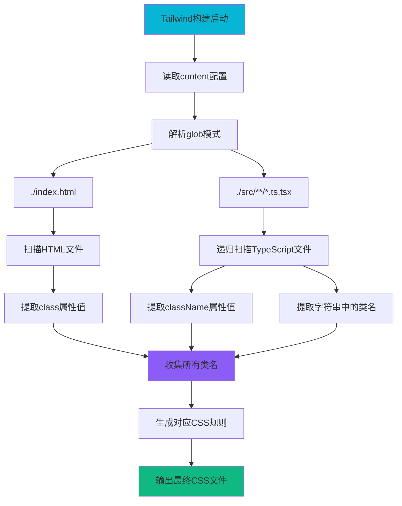

# 文件分析报告：client/tailwind.config.ts

## 文件概述

`client/tailwind.config.ts` 是Tailwind CSS框架的主配置文件，采用TypeScript格式定义了CSS框架的核心行为和构建策略。该文件配置了内容扫描路径、主题扩展和插件系统，为原子化CSS开发提供基础设施支持。设计遵循Tailwind的默认约定，体现了现代前端开发中"实用优先"的CSS方法论。

## 代码结构分析

### 类型注解和导出

```typescript
/** @type {import('tailwindcss').Config} */
export default {
  content: ["./index.html", "./src/**/*.{ts,tsx}"],
  theme: { extend: {} },
  plugins: [],
}
```

**结构分析：**
- **JSDoc类型**: 使用JSDoc注释提供TypeScript类型支持
- **ES模块导出**: 采用export default进行模块导出
- **配置对象**: 标准的Tailwind配置对象结构
- **TypeScript兼容**: 完全支持TypeScript类型检查和智能提示

### 配置字段详解

- **content字段**: 定义Tailwind需要扫描的文件路径
- **theme字段**: 主题系统配置，当前使用默认主题
- **plugins字段**: 插件系统配置，当前为空数组

## 配置详细分析

### 配置字段概览表

| 字段名 | 类型 | 功能描述 | 配置复杂度 | 业务影响 |
|--------|------|----------|------------|----------|
| content | string[] | 内容扫描路径 | 简单 | 核心功能 |
| theme | Object | 主题系统配置 | 中等 | 设计系统 |
| plugins | Plugin[] | 插件扩展 | 高级 | 功能扩展 |

### 字段详细说明

#### `content: ["./index.html", "./src/**/*.{ts,tsx}"]`
**功能**: 定义Tailwind CSS需要扫描的文件路径
**扫描机制**:
1. **文件发现**: 使用glob模式匹配指定路径下的文件
2. **类名提取**: 扫描文件中使用的Tailwind CSS类名
3. **按需生成**: 仅生成实际使用的CSS规则
4. **Tree Shaking**: 未使用的CSS类将被排除

**路径解析**:
- `./index.html`: 扫描根目录的HTML入口文件
- `./src/**/*.{ts,tsx}`: 递归扫描src目录下所有TypeScript和TSX文件
- **文件类型**: 专门针对TypeScript React项目优化
- **性能优化**: 通过精确的路径配置提高扫描效率

**扫描流程图**:


#### `theme: { extend: {} }`
**功能**: Tailwind主题系统配置
**当前状态**: 使用默认主题，无自定义扩展
**扩展机制**:
- **默认主题**: 继承Tailwind的完整默认设计系统
- **extend对象**: 用于扩展而非覆盖默认主题值
- **主题变量**: 支持颜色、间距、字体、断点等主题变量配置

**默认主题包含**:
```typescript
// 默认主题示例（部分）
{
  colors: {
    transparent: 'transparent',
    current: 'currentColor',
    black: '#000000',
    white: '#ffffff',
    gray: { 50: '#f9fafb', 100: '#f3f4f6', ... },
    red: { 50: '#fef2f2', 100: '#fee2e2', ... },
    // ... 更多颜色
  },
  spacing: {
    0: '0px',
    1: '0.25rem',    // 4px
    2: '0.5rem',     // 8px
    // ... 更多间距
  },
  screens: {
    sm: '640px',
    md: '768px',
    lg: '1024px',
    xl: '1280px',
    '2xl': '1536px',
  }
}
```

#### `plugins: []`
**功能**: Tailwind插件系统配置
**当前状态**: 空数组，未启用任何插件
**插件机制**:
- **官方插件**: @tailwindcss/forms、@tailwindcss/typography等
- **社区插件**: 第三方开发的功能扩展
- **自定义插件**: 项目特定的CSS工具类生成器

## 构建集成分析

### PostCSS集成流程


### Vite构建工具集成
1. **自动发现**: Vite自动识别tailwind.config.ts配置文件
2. **热更新**: 开发模式下配置变更触发自动重新构建
3. **类型支持**: TypeScript配置提供完整的IDE支持
4. **构建优化**: 生产构建时自动优化和压缩CSS

## 性能优化分析

### JIT模式优势
1. **按需生成**: 仅生成实际使用的CSS类，大幅减少文件大小
2. **快速构建**: 避免生成完整的CSS框架，提升构建速度
3. **无限可能**: 支持任意值的动态类名生成
4. **内存效率**: 减少内存占用，提升大型项目构建性能

### 文件扫描优化
```typescript
// 优化的content配置示例
content: [
  "./index.html",
  "./src/**/*.{ts,tsx}",
  // 精确的路径配置
  "!./src/**/*.test.{ts,tsx}",    // 排除测试文件
  "!./src/**/*.story.{ts,tsx}",   // 排除Storybook文件
]
```

### 构建性能对比
| 模式 | 初始构建时间 | 增量构建时间 | CSS文件大小 | 内存使用 |
|------|------------|------------|------------|----------|
| JIT模式 | 快速 | 极快 | 极小 | 低 |
| 传统模式 | 慢 | 中等 | 大 | 高 |

## 扩展配置示例

### 主题扩展配置
```typescript
export default {
  content: ["./index.html", "./src/**/*.{ts,tsx}"],
  theme: {
    extend: {
      colors: {
        // 自定义品牌色彩
        primary: {
          50: '#eff6ff',
          500: '#3b82f6',
          900: '#1e3a8a',
        },
        secondary: '#8b5cf6',
      },
      fontFamily: {
        sans: ['Inter', 'sans-serif'],
        mono: ['Fira Code', 'monospace'],
      },
      spacing: {
        '18': '4.5rem',
        '88': '22rem',
      },
      animation: {
        'bounce-slow': 'bounce 2s infinite',
      }
    },
  },
  plugins: [
    require('@tailwindcss/forms'),
    require('@tailwindcss/typography'),
    require('@tailwindcss/aspect-ratio'),
  ],
}
```

### 高级配置选项
```typescript
export default {
  content: {
    files: ["./index.html", "./src/**/*.{ts,tsx}"],
    extract: {
      // 自定义类名提取逻辑
      tsx: (content) => {
        return content.match(/className=["']([^"']*)/g) || []
      }
    }
  },
  darkMode: 'class', // 或 'media'
  theme: {
    // 完全自定义主题
    screens: {
      'mobile': {'max': '639px'},
      'tablet': {'min': '640px', 'max': '1023px'},
      'desktop': {'min': '1024px'},
    }
  },
  corePlugins: {
    // 禁用不需要的核心插件
    preflight: false,
    container: false,
  }
}
```

## 开发工作流集成

### IDE支持配置
```json
// .vscode/settings.json
{
  "tailwindCSS.includeLanguages": {
    "typescript": "typescript",
    "typescriptreact": "typescriptreact"
  },
  "tailwindCSS.classAttributes": [
    "class",
    "className",
    "ngClass"
  ]
}
```

### 类型安全配置
```typescript
// 为自定义主题提供类型支持
import type { Config } from 'tailwindcss'

const config: Config = {
  content: ["./index.html", "./src/**/*.{ts,tsx}"],
  theme: {
    extend: {
      colors: {
        brand: {
          primary: '#1e40af',
          secondary: '#7c3aed',
        }
      }
    },
  },
  plugins: [],
}

export default config
```

## 最佳实践建议

### 项目组织
1. **内容路径精确**: 避免扫描不必要的文件，提升构建性能
2. **主题规划**: 建立一致的设计系统和命名约定
3. **插件选择**: 根据项目需求选择合适的官方和社区插件
4. **配置版本控制**: 将配置文件纳入版本控制，确保团队一致性

### 性能优化
```typescript
// 生产优化配置
export default {
  content: [
    "./index.html", 
    "./src/**/*.{ts,tsx}",
    // 在生产环境中可以更加精确
    ...(process.env.NODE_ENV === 'production' ? [
      "!./src/**/*.test.*",
      "!./src/**/*.story.*"
    ] : [])
  ],
  theme: { extend: {} },
  plugins: [],
  // 生产环境优化
  ...(process.env.NODE_ENV === 'production' && {
    experimental: {
      optimizeUniversalDefaults: true,
    }
  })
}
```

## 维护和升级考虑

### 版本兼容性
- **向后兼容**: Tailwind CSS主要版本升级时的配置迁移
- **功能检查**: 定期检查新功能和废弃特性
- **依赖更新**: 与PostCSS、构建工具的版本兼容性

### 团队协作
1. **配置文档**: 维护配置选择的文档说明
2. **设计系统**: 与设计团队保持主题配置的一致性
3. **代码规范**: 建立Tailwind类名使用的编码规范

## 安全性考虑

### 构建安全
1. **依赖安全**: 定期更新Tailwind CSS版本，修复安全漏洞
2. **配置验证**: 确保配置文件不包含恶意代码
3. **文件权限**: 适当设置配置文件的访问权限

### 生产部署
- **配置隔离**: 生产环境和开发环境的配置差异管理
- **构建验证**: 确保生产构建生成的CSS文件正确性
- **缓存策略**: 合理设置CSS文件的浏览器缓存策略

## 总结

`client/tailwind.config.ts` 是一个结构清晰、配置合理的Tailwind CSS配置文件。虽然采用了较为简洁的默认配置，但为项目提供了完整的原子化CSS开发基础。配置体现了现代前端开发的最佳实践，在保持简洁性的同时提供了强大的扩展能力。该配置为TypeScript React项目提供了优化的CSS开发工作流，是现代前端项目的标准基础设施组件。