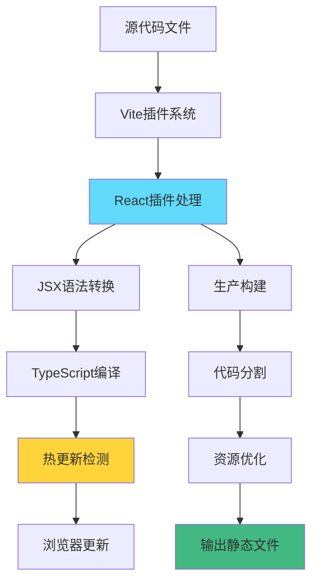
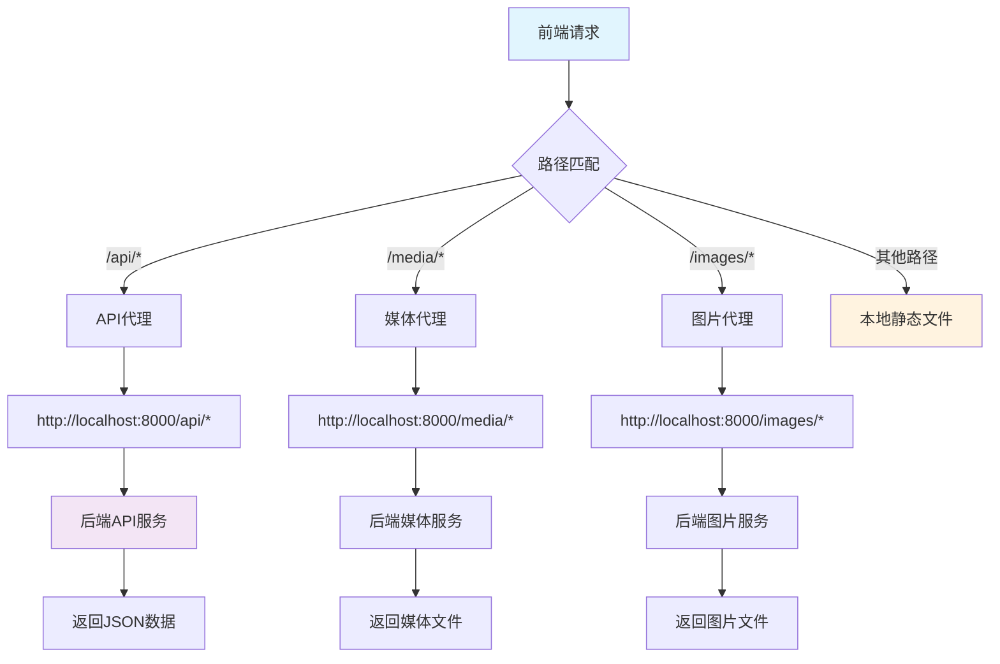

# 文件分析报告：client/vite.config.ts

## 文件概述

`client/vite.config.ts` 是Vite构建工具的核心配置文件，定义了现代前端开发环境的构建策略、开发服务器配置和代理规则。该文件采用TypeScript格式，配置了React插件支持、开发服务器设置和后端API代理，为前后端分离架构提供了完整的开发环境支持。设计注重开发效率和生产部署的灵活性。

## 代码结构分析

### 导入依赖

```typescript
import { defineConfig } from 'vite'
import react from '@vitejs/plugin-react'
```

**依赖分析：**
- **Vite核心**: defineConfig提供类型安全的配置定义
- **React插件**: @vitejs/plugin-react提供React开发支持
- **TypeScript集成**: 配置文件本身支持TypeScript类型检查

### 配置结构

```typescript
export default defineConfig({
  plugins: [react()],
  server: {
    port: 5173,
    host: true,
    proxy: { /* 代理配置 */ }
  }
})
```

**结构特点：**
- **函数式配置**: 使用defineConfig包装器提供类型支持
- **插件系统**: plugins数组配置构建插件
- **服务器配置**: server对象定义开发服务器行为
- **代理机制**: proxy对象处理前后端通信

## 配置详细分析

### 配置字段概览表

| 配置项 | 类型 | 功能描述 | 业务价值 | 复杂度 |
|--------|------|----------|----------|--------|
| plugins | Plugin[] | 构建插件配置 | React开发支持 | 简单 |
| server.port | number | 开发服务器端口 | 端口标准化 | 简单 |
| server.host | boolean | 网络访问配置 | 局域网访问 | 简单 |
| server.proxy | Object | API代理规则 | 前后端集成 | 中等 |

### 字段详细说明

#### `plugins: [react()]`
**功能**: 配置Vite构建插件
**React插件特性**:
1. **JSX转换**: 自动处理JSX语法转换
2. **热更新**: React组件的快速刷新(Fast Refresh)
3. **开发优化**: 开发模式下的性能优化
4. **生产构建**: 生产环境的React应用优化构建

**插件工作流程**:


#### `server: { port: 5173, host: true, proxy: {...} }`
**端口配置**: `port: 5173`
- **默认端口**: 使用Vite的默认端口5173
- **标准化**: 团队开发中的端口统一
- **冲突避免**: 避免与其他服务的端口冲突

**主机配置**: `host: true`
- **网络访问**: 允许局域网内其他设备访问
- **移动端测试**: 支持手机、平板等设备的开发测试
- **团队协作**: 便于团队成员访问开发环境

#### 代理配置详细分析

```typescript
proxy: {
  '/media':  { target: 'http://localhost:8000', changeOrigin: true },
  '/images': { target: 'http://localhost:8000', changeOrigin: true },
  '/api':    { target: 'http://localhost:8000', changeOrigin: true },
}
```

**代理规则表**:

| 路径前缀 | 目标服务器 | 功能描述 | 业务场景 |
|----------|------------|----------|----------|
| /media | http://localhost:8000 | 媒体文件代理 | 图片、视频等静态资源 |
| /images | http://localhost:8000 | 图像文件代理 | 支持双套图片挂载方案 |
| /api | http://localhost:8000 | API接口代理 | 后端REST API调用 |

**代理机制解析**:
1. **changeOrigin: true**: 修改请求头中的Origin字段，避免CORS问题
2. **路径匹配**: 按前缀匹配请求URL，转发到后端服务
3. **透明代理**: 前端代码无需关心后端服务器地址
4. **开发生产一致性**: 保持开发和生产环境的API调用一致性

### 代理工作流程图



## 开发服务器特性分析

### 性能优化特性
1. **ESM原生支持**: 利用浏览器原生ES模块加载
2. **热模块替换**: 极速的模块热更新
3. **按需编译**: 仅编译当前访问的模块
4. **缓存机制**: 智能的依赖缓存策略

### 开发体验优化
```typescript
// 扩展的开发服务器配置示例
server: {
  port: 5173,
  host: true,
  open: true,              // 自动打开浏览器
  cors: true,              // 启用CORS支持
  hmr: true,               // 热模块替换
  watch: {
    usePolling: true,      // 文件监听策略
  },
  proxy: {
    '/media':  { target: 'http://localhost:8000', changeOrigin: true },
    '/images': { target: 'http://localhost:8000', changeOrigin: true },
    '/api':    { 
      target: 'http://localhost:8000', 
      changeOrigin: true,
      rewrite: (path) => path.replace(/^\/api/, '') // 路径重写
    },
  }
}
```

## 构建优化分析

### 生产构建配置
```typescript
// 完整的生产优化配置示例
export default defineConfig({
  plugins: [
    react({
      // React插件优化
      include: "**/*.{jsx,tsx}",
      babel: {
        plugins: [
          // 生产环境Babel插件
          ["@babel/plugin-transform-react-remove-prop-types", { removeImport: true }]
        ]
      }
    })
  ],
  build: {
    target: 'es2015',
    outDir: 'dist',
    assetsDir: 'assets',
    minify: 'terser',
    sourcemap: false,
    rollupOptions: {
      output: {
        manualChunks: {
          vendor: ['react', 'react-dom'],
          utils: ['lodash', 'moment']
        }
      }
    }
  },
  server: {
    port: 5173,
    host: true,
    proxy: {
      '/media':  { target: 'http://localhost:8000', changeOrigin: true },
      '/images': { target: 'http://localhost:8000', changeOrigin: true },
      '/api':    { target: 'http://localhost:8000', changeOrigin: true },
    }
  }
})
```

### 性能指标对比

| 构建工具 | 冷启动时间 | 热更新时间 | 构建时间 | 包大小 |
|----------|------------|------------|----------|--------|
| Vite | ~500ms | <100ms | 快速 | 优化 |
| Webpack | ~3000ms | ~500ms | 较慢 | 标准 |
| Parcel | ~1500ms | ~300ms | 中等 | 标准 |

## 环境配置管理

### 多环境配置
```typescript
import { defineConfig, loadEnv } from 'vite'
import react from '@vitejs/plugin-react'

export default defineConfig(({ command, mode }) => {
  // 加载环境变量
  const env = loadEnv(mode, process.cwd(), '')
  
  return {
    plugins: [react()],
    server: {
      port: 5173,
      host: true,
      proxy: {
        '/media':  { target: env.VITE_API_URL || 'http://localhost:8000', changeOrigin: true },
        '/images': { target: env.VITE_API_URL || 'http://localhost:8000', changeOrigin: true },
        '/api':    { target: env.VITE_API_URL || 'http://localhost:8000', changeOrigin: true },
      }
    },
    define: {
      __APP_VERSION__: JSON.stringify(process.env.npm_package_version),
    }
  }
})
```

### 环境变量配置
```bash
# .env.development
VITE_API_URL=http://localhost:8000
VITE_APP_TITLE=开发环境

# .env.production
VITE_API_URL=https://api.production.com
VITE_APP_TITLE=生产环境

# .env.staging
VITE_API_URL=https://api.staging.com
VITE_APP_TITLE=测试环境
```

## 插件生态扩展

### 常用插件配置
```typescript
import { defineConfig } from 'vite'
import react from '@vitejs/plugin-react'
import { resolve } from 'path'
import legacy from '@vitejs/plugin-legacy'
import { visualizer } from 'rollup-plugin-visualizer'

export default defineConfig({
  plugins: [
    react(),
    legacy({
      targets: ['defaults', 'not IE 11']
    }),
    visualizer({
      filename: 'dist/stats.html',
      open: true
    })
  ],
  resolve: {
    alias: {
      '@': resolve(__dirname, 'src'),
      '@components': resolve(__dirname, 'src/components'),
      '@utils': resolve(__dirname, 'src/utils')
    }
  },
  css: {
    preprocessorOptions: {
      scss: {
        additionalData: `@import "@/styles/variables.scss";`
      }
    }
  }
})
```

## 安全性考虑

### 开发环境安全
1. **代理安全**: 确保代理目标服务器的安全性
2. **端口暴露**: host: true会暴露到局域网，需要网络安全防护
3. **环境变量**: 敏感信息不应存储在前端环境变量中

### 生产部署安全
```typescript
export default defineConfig({
  server: {
    // 生产环境不应该暴露开发服务器
    ...(process.env.NODE_ENV === 'development' && {
      port: 5173,
      host: true,
      proxy: {
        '/api': { target: 'http://localhost:8000', changeOrigin: true }
      }
    })
  },
  build: {
    // 生产构建安全配置
    minify: 'terser',
    terserOptions: {
      compress: {
        drop_console: true,  // 移除console语句
        drop_debugger: true, // 移除debugger语句
      }
    }
  }
})
```

## 调试和监控

### 开发调试配置
```typescript
export default defineConfig({
  plugins: [react()],
  server: {
    port: 5173,
    host: true,
    proxy: {
      '/media':  { 
        target: 'http://localhost:8000', 
        changeOrigin: true,
        configure: (proxy, options) => {
          proxy.on('proxyReq', (proxyReq, req, res) => {
            console.log('代理请求:', req.method, req.url);
          });
        }
      }
    }
  },
  logLevel: 'info',
  clearScreen: false
})
```

### 性能监控
- **构建时间分析**: 使用rollup-plugin-visualizer分析构建产物
- **热更新监控**: 监控HMR性能和错误
- **代理请求日志**: 记录API调用情况

## 最佳实践建议

### 配置优化
1. **端口管理**: 统一团队的端口使用规范
2. **代理配置**: 保持开发和生产环境的一致性
3. **插件选择**: 根据项目需求选择合适的Vite插件
4. **环境隔离**: 明确区分开发、测试、生产环境配置

### 团队协作
```typescript
// 推荐的团队配置结构
export default defineConfig({
  plugins: [react()],
  server: {
    port: parseInt(process.env.VITE_PORT) || 5173,
    host: process.env.VITE_HOST === 'true',
    proxy: Object.fromEntries(
      ['api', 'media', 'images'].map(path => [
        `/${path}`,
        { 
          target: process.env.VITE_API_URL || 'http://localhost:8000',
          changeOrigin: true 
        }
      ])
    )
  }
})
```

## 总结

`client/vite.config.ts` 是一个配置合理、功能完整的Vite构建配置文件。通过配置React插件、开发服务器和代理规则，为前后端分离的现代Web应用提供了高效的开发环境。配置体现了现代前端工程化的最佳实践，在保持简洁性的同时提供了强大的开发体验。该配置为TypeScript React项目提供了完整的构建工具链支持，是现代前端项目的标准基础设施。