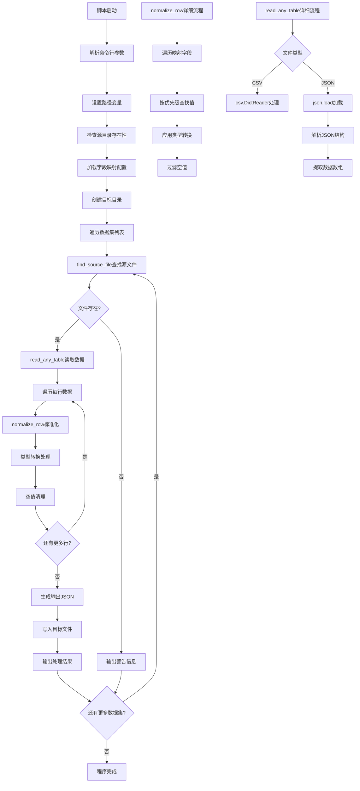

# 文件分析报告：scripts/seed_from_export.py

## 文件概述

`seed_from_export.py` 是一个数据处理和转换脚本，负责将导出的CSV/JSON数据文件转换为标准化的种子数据格式。该脚本实现了灵活的字段映射机制、多格式数据读取和标准化输出功能，主要用于数据导入和初始化场景，支持怪物、技能、类型和收藏等多种数据集的处理。

## 代码结构分析

### 导入依赖

```python
from __future__ import annotations
import json, csv, sys, os
from pathlib import Path
import argparse
```

- **annotations**：启用延迟注解评估，支持前向引用类型
- **标准库**：json, csv用于数据处理，sys, os用于系统操作
- **路径处理**：pathlib.Path提供现代化的路径操作
- **命令行**：argparse支持命令行参数解析

### 全局变量和常量

```python
PROJECT_ROOT = Path(__file__).resolve().parents[1]
DEFAULT_SRC = PROJECT_ROOT / "exports"
DEFAULT_DST = PROJECT_ROOT / "seed"
DATASETS = ["types", "monsters", "skills", "collections"]
```

- **项目路径**：基于脚本位置计算的项目根目录
- **默认路径**：源数据和目标数据的默认目录
- **数据集定义**：支持的四种核心数据类型

### 配置和设置

#### 字段映射配置
```python
DEFAULT_MAPPING = {
    "types": {
        "id": ["id", "type_id"],
        "name": ["name", "type_name"],
    },
    "monsters": {
        "id": ["id", "monster_id"],
        "name": ["name", "monster_name"],
        "type_id": ["type_id", "element_id", "category_id"],
        "rarity": ["rarity", "star", "stars"],
    },
    # ... 更多映射配置
}
```

- **多别名支持**：每个标准字段支持多个可能的源字段名
- **数据集特化**：不同数据集有独立的字段映射配置
- **优先级机制**：按数组顺序确定字段优先级

## 函数详细分析

### 函数概览表

| 函数名 | 参数 | 返回值 | 主要功能 |
|---------|------|--------|----------|
| `load_mapping` | mapping_path | dict | 加载字段映射配置 |
| `_coerce_int` | v | int/原值 | 类型强制转换为整数 |
| `normalize_row` | row, mapping, dataset | dict | 标准化单行数据 |
| `read_any_table` | path | list[dict] | 读取CSV/JSON表格数据 |
| `find_source_file` | src_dir, name | Path/None | 查找源数据文件 |
| `main` | 无 | None | 主程序入口 |

### 函数详细说明

#### `load_mapping(mapping_path)` - 映射配置加载
```python
def load_mapping(mapping_path: Path | None) -> dict:
    if mapping_path and mapping_path.exists():
        with mapping_path.open("r", encoding="utf-8") as f:
            return json.load(f)
    return DEFAULT_MAPPING
```

**核心特性**：
- **条件加载**：文件存在时加载自定义映射，否则使用默认映射
- **UTF-8编码**：确保支持多语言字符
- **容错设计**：文件不存在时自动降级到默认配置

#### `_coerce_int(v)` - 类型转换工具
```python
def _coerce_int(v):
    try:
        if v is None or v == "":
            return None
        return int(v)
    except Exception:
        return v
```

**设计理念**：
- **空值处理**：None和空字符串返回None
- **异常安全**：转换失败时返回原值而非抛出异常
- **灵活转换**：支持字符串到整数的智能转换

#### `normalize_row(row, mapping, dataset)` - 数据标准化
```python
def normalize_row(row: dict, mapping: dict[str, list[str]], dataset: str) -> dict:
    out = {}
    for std_key, aliases in mapping.items():
        # 按优先级取第一个存在的列
        value = None
        for a in aliases:
            if a in row and row[a] not in (None, ""):
                value = row[a]
                break
        # 类型粗转换
        if std_key in ("id", "type_id", "monster_id", "power", "rarity"):
            value = _coerce_int(value)
        out[std_key] = value
    # 清理全空的键
    return {k: v for k, v in out.items() if v is not None}
```

**算法流程**：
1. **字段映射**：根据优先级查找源字段值
2. **类型转换**：ID和数值字段自动转换为整数
3. **空值清理**：移除所有空值字段

#### `read_any_table(path)` - 多格式数据读取
```python
def read_any_table(path: Path) -> list[dict]:
    # 支持 .csv / .json
    if path.suffix.lower() == ".csv":
        with path.open("r", encoding="utf-8-sig", newline="") as f:
            return list(csv.DictReader(f))
    elif path.suffix.lower() == ".json":
        with path.open("r", encoding="utf-8") as f:
            data = json.load(f)
            # 允许顶层为 list 或 { data: [...] } 或 { items: [...] }
            if isinstance(data, list):
                return data
            if isinstance(data, dict):
                for key in ("data", "items", "list", "rows"):
                    if key in data and isinstance(data[key], list):
                        return data[key]
                # 否则尝试把 dict 视为单条
                return [data]
    else:
        raise SystemExit(f"Unsupported file type: {path}")
    return []
```

**多格式支持**：
- **CSV处理**：使用utf-8-sig编码处理BOM
- **JSON灵活性**：支持数组和对象包装的多种JSON结构
- **错误处理**：不支持的格式直接退出程序

#### `find_source_file(src_dir, name)` - 源文件发现
```python
def find_source_file(src_dir: Path, name: str) -> Path | None:
    for ext in (".json", ".csv"):
        p = src_dir / f"{name}{ext}"
        if p.exists():
            return p
    return None
```

**查找策略**：
- **扩展名优先级**：优先查找JSON文件，然后CSV文件
- **存在性检查**：返回第一个存在的文件路径
- **返回None**：所有格式都不存在时返回None

## 类详细分析

### 类概览表
该脚本为纯函数式设计，不包含类定义。

### 类详细说明
不适用。

## 函数调用流程图



## 变量作用域分析

### 模块作用域
- **PROJECT_ROOT**：项目根路径常量
- **DEFAULT_SRC/DST**：默认源和目标目录路径
- **DEFAULT_MAPPING**：默认字段映射配置
- **DATASETS**：支持的数据集名称列表

### main函数作用域
- **args**：命令行参数对象
- **src_dir, dst_dir**：源和目标目录Path对象
- **mapping_path**：映射配置文件路径
- **mapping_all**：加载的字段映射配置
- **generated**：成功生成的文件列表

### 函数局部作用域

#### normalize_row函数
- **out**：输出字典对象
- **std_key, aliases**：标准字段名和别名列表
- **value**：当前处理的字段值

#### read_any_table函数
- **data**：JSON加载的原始数据
- **key**：JSON对象中查找的键名

## 函数依赖关系

### 外部依赖
- **标准库**：json, csv, pathlib, argparse
- **文件系统**：文件读写操作
- **命令行接口**：参数解析和程序退出

### 内部依赖图
```
main()
├── argparse.ArgumentParser() (外部)
├── Path.resolve() (外部)
├── load_mapping()
│   └── json.load() (外部)
├── Path.mkdir() (外部)
├── find_source_file()
│   └── Path.exists() (外部)
├── read_any_table()
│   ├── csv.DictReader() (外部)
│   └── json.load() (外部)
├── normalize_row()
│   └── _coerce_int()
│       └── int() (内置)
└── json.dump() (外部)
```

### 数据流分析

#### 数据加载流程
1. **命令行解析** → 路径参数获取 → Path对象创建
2. **映射加载** → JSON解析 → 字典对象构建
3. **文件发现** → 存在性检查 → 路径返回

#### 数据转换流程
1. **原始数据读取** → 格式检测 → 统一字典列表
2. **逐行标准化** → 字段映射 → 类型转换 → 空值过滤
3. **批量输出** → JSON序列化 → 文件写入

#### 错误处理流程
1. **输入验证** → 目录存在检查 → 错误退出
2. **文件处理** → 格式支持检查 → 异常捕获
3. **数据转换** → 类型转换容错 → 原值保留

### 错误处理

#### 文件系统错误
- **源目录不存在**：SystemExit退出程序
- **文件格式不支持**：SystemExit退出程序
- **目标目录创建**：parents=True确保父目录存在

#### 数据处理错误
- **类型转换失败**：_coerce_int函数返回原值
- **字段缺失**：映射机制优雅降级到下一个别名
- **空数据处理**：空值过滤确保输出数据质量

### 性能分析

#### 时间复杂度
- **文件读取**：O(n) - n为文件行数
- **数据标准化**：O(n×m) - n为行数，m为字段数
- **文件写入**：O(n) - JSON序列化时间

#### 空间复杂度
- **内存占用**：O(n) - 所有数据加载到内存
- **临时存储**：O(1) - 逐行处理减少内存峰值

#### 优化特性
- **惰性处理**：逐数据集处理减少内存占用
- **早期退出**：源目录不存在时快速失败
- **批量写入**：一次性写入完整JSON减少IO操作

### 算法复杂度

#### 字段映射算法
- **查找复杂度**：O(k) - k为别名数量
- **空间复杂度**：O(1) - 固定大小的映射字典

#### 文件发现算法
- **时间复杂度**：O(1) - 固定数量的扩展名检查
- **空间复杂度**：O(1) - 单个路径对象

### 扩展性评估

#### 数据格式扩展性
- **新格式支持**：read_any_table函数易于扩展新格式
- **自定义解析**：JSON结构解析支持多种嵌套模式
- **编码兼容**：UTF-8和BOM处理确保国际化支持

#### 数据集扩展性
- **新数据集**：DATASETS列表和DEFAULT_MAPPING易于扩展
- **字段映射**：映射配置支持任意字段数量和别名
- **类型系统**：类型转换规则可配置化扩展

#### 配置扩展性
- **外部配置**：支持自定义映射文件覆盖默认配置
- **命令行参数**：argparse支持更多配置选项
- **环境变量**：可扩展环境变量配置支持

### 代码质量评估

#### 可读性
- **清晰的函数命名**：函数名准确反映功能用途
- **合理的代码结构**：逻辑分层清晰，职责分离明确
- **类型注解**：完整的类型提示提高代码可读性

#### 可维护性
- **模块化设计**：每个函数职责单一，便于单独修改
- **配置外部化**：映射配置支持外部定制
- **错误信息清晰**：便于问题诊断和调试

#### 健壮性
- **多重错误处理**：文件、格式、数据转换的全面错误处理
- **优雅降级**：映射失败时的别名机制
- **输入验证**：命令行参数和文件路径的有效性检查

#### 可测试性
- **纯函数设计**：大部分函数无副作用，易于单元测试
- **Mock友好**：文件IO操作可轻易Mock
- **数据驱动**：映射配置和测试数据分离

### 文档完整性

脚本包含清晰的函数签名和类型注解，代码结构自说明性强。

### 备注

这是一个设计良好的数据转换脚本，实现了灵活的字段映射和多格式支持。代码健壮性强，错误处理完善，适用于数据导入和初始化场景。采用现代Python特性，具有良好的可维护性和扩展性。