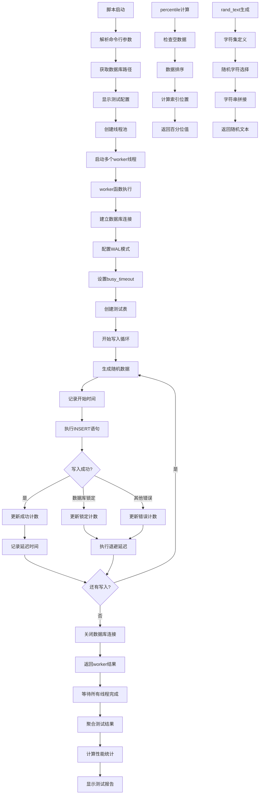

# 文件分析报告：scripts/sqlite_stress_write.py

## 文件概述

`sqlite_stress_write.py` 是一个SQLite数据库压力测试工具，专门用于测试数据库在高并发写入场景下的性能表现。该脚本通过多线程并发写入、统计延迟分布和错误类型，评估数据库的并发处理能力和稳定性。集成了项目配置系统，支持WAL模式和busy_timeout优化，为数据库性能调优提供量化数据。

## 代码结构分析

### 导入依赖

```python
from __future__ import annotations
import os, sqlite3, time, random, string, argparse, sys
from pathlib import Path
from concurrent.futures import ThreadPoolExecutor, as_completed
from statistics import mean
```

- **annotations**：启用延迟注解评估，支持类型前向引用
- **标准库**：sqlite3数据库操作，time性能计时，random随机数据生成
- **并发库**：ThreadPoolExecutor实现多线程并发测试
- **统计库**：statistics.mean用于延迟均值计算
- **系统库**：os环境变量，sys路径操作，argparse命令行解析

### 全局变量和常量

```python
PROJECT_ROOT = Path(__file__).resolve().parents[1]
sys.path.insert(0, str(PROJECT_ROOT))
from server.app.config import settings  # noqa
```

- **项目根路径**：基于脚本位置计算的项目根目录
- **模块路径注入**：动态添加项目根目录到Python路径
- **配置导入**：集成项目配置系统获取数据库路径

### 配置和设置

#### 默认配置参数
- **并发线程数**：默认8个worker线程
- **每线程写入次数**：默认500次写入操作
- **busy_timeout**：默认4000毫秒（可通过环境变量配置）
- **连接超时**：默认5秒（可通过环境变量配置）

## 函数详细分析

### 函数概览表

| 函数名 | 参数 | 返回值 | 主要功能 |
|---------|------|--------|----------|
| `rand_text` | n=16 | str | 生成随机文本数据 |
| `worker` | db_path, writes, busy_ms, connect_timeout_s | dict | 执行并发写入测试 |
| `percentile` | data, p | float | 计算百分位数统计 |
| `main` | 无 | None | 主程序入口和协调器 |

### 函数详细说明

#### `rand_text(n=16)` - 随机文本生成器
```python
def rand_text(n=16) -> str:
    return "".join(random.choice(string.ascii_letters + string.digits) for _ in range(n))
```

**核心特性**：
- **字符集合**：包含大小写字母和数字的62字符集
- **可配置长度**：默认16字符，支持自定义长度
- **高随机性**：每次调用生成不同的随机字符串
- **性能优化**：使用列表推导和join优化字符串拼接

#### `worker(db_path, writes, busy_ms, connect_timeout_s)` - 并发写入工作线程
```python
def worker(db_path: Path, writes: int, busy_ms: int, connect_timeout_s: float) -> dict:
    ok = locked = other = 0
    latencies = []
    conn = sqlite3.connect(str(db_path), timeout=connect_timeout_s, check_same_thread=False)
    cur = conn.cursor()
    cur.execute("PRAGMA journal_mode=WAL;")
    cur.execute(f"PRAGMA busy_timeout={int(busy_ms)};")
    # ... 写入循环和错误处理
```

**核心算法**：
1. **数据库连接配置**：WAL模式和busy_timeout优化
2. **表创建**：stress_log表的幂等性创建
3. **写入循环**：指定次数的INSERT操作
4. **性能统计**：延迟测量和错误分类
5. **错误处理**：数据库锁定和其他错误的分类统计

**性能优化特性**：
- **WAL模式**：提高并发性能，减少锁定冲突
- **busy_timeout**：配置数据库忙等待时间
- **check_same_thread=False**：允许多线程使用连接
- **退避策略**：锁定错误时的随机延迟重试

#### `percentile(data, p)` - 百分位数计算
```python
def percentile(data, p):
    if not data:
        return 0.0
    data = sorted(data)
    k = int(round((p/100.0) * (len(data)-1)))
    return float(data[k])
```

**算法实现**：
- **边界处理**：空数据集返回0.0
- **排序操作**：对数据进行升序排列
- **索引计算**：基于百分比和数据长度计算位置
- **类型转换**：确保返回浮点数类型

#### `main()` - 主程序协调器
```python
def main():
    ap = argparse.ArgumentParser()
    ap.add_argument("--workers", type=int, default=8, help="并发线程数")
    ap.add_argument("--writes", type=int, default=500, help="每线程写入次数")
    # ... 参数解析和测试执行
```

**执行流程**：
1. **参数解析**：命令行参数和环境变量配置
2. **数据库路径获取**：通过项目配置系统获取数据库位置
3. **并发测试执行**：ThreadPoolExecutor管理worker线程
4. **结果聚合**：收集所有线程的测试结果
5. **统计报告**：计算总体性能指标和延迟分布

## 类详细分析

### 类概览表
该脚本为纯函数式设计，不包含类定义。

### 类详细说明
不适用。

## 函数调用流程图



## 变量作用域分析

### 模块作用域
- **PROJECT_ROOT**：项目根路径常量
- **settings**：导入的项目配置对象

### main函数作用域
- **ap**：ArgumentParser命令行解析器
- **args**：解析后的命令行参数
- **db_path**：数据库文件路径
- **results**：所有worker线程的测试结果列表
- **统计变量**：total_ok, total_locked, total_other等聚合统计

### worker函数作用域
- **计数器变量**：ok, locked, other错误分类计数
- **latencies**：延迟时间记录列表
- **conn, cur**：数据库连接和游标对象
- **t0**：性能计时起始点

### 临时变量作用域
- **循环变量**：_用于写入循环计数
- **异常变量**：e用于异常信息处理
- **时间变量**：t0用于性能测量

## 函数依赖关系

### 外部依赖
- **sqlite3**：数据库操作核心库
- **concurrent.futures**：并发执行框架
- **statistics**：统计计算库
- **项目配置**：server.app.config.settings

### 内部依赖图
```
main()
├── argparse.ArgumentParser() (外部)
├── settings.resolved_local_db_path() (项目配置)
├── ThreadPoolExecutor() (外部)
├── worker() × N
│   ├── sqlite3.connect() (外部)
│   ├── rand_text()
│   ├── time.perf_counter() (外部)
│   ├── time.time() (外部)
│   └── time.sleep() (外部)
├── percentile()
│   └── sorted() (内置)
└── mean() (外部)
```

### 数据流分析

#### 初始化数据流
1. **命令行解析** → 测试参数获取 → 配置验证
2. **数据库路径获取** → settings配置读取 → 路径解析
3. **线程池创建** → 并发控制初始化

#### 测试执行数据流
1. **worker启动** → 数据库连接建立 → WAL模式配置
2. **写入循环** → 随机数据生成 → INSERT执行 → 延迟记录
3. **结果收集** → 统计信息聚合 → 性能指标计算

#### 错误处理数据流
1. **异常捕获** → 错误类型分类 → 计数器更新
2. **退避策略** → 随机延迟 → 重试继续
3. **连接清理** → 资源释放 → 优雅退出

### 错误处理

#### 数据库操作错误
- **OperationalError处理**：区分数据库锁定和其他操作错误
- **连接错误**：timeout参数控制连接超时时间
- **资源清理**：try-finally确保连接正确关闭

#### 并发控制错误
- **线程安全**：check_same_thread=False允许多线程访问
- **死锁避免**：busy_timeout和退避策略减少死锁概率
- **资源竞争**：WAL模式提高并发读写性能

#### 数据完整性
- **事务管理**：每次INSERT后立即commit确保数据持久化
- **错误分类**：准确统计不同类型错误的发生频率

### 性能分析

#### 时间复杂度
- **单worker执行**：O(n) - n为写入次数
- **并发执行**：O(n/p) - p为并发线程数
- **结果聚合**：O(p) - 线程数量级别的聚合操作

#### 空间复杂度
- **延迟记录**：O(n) - 每个写入操作的延迟时间
- **结果存储**：O(p) - 每个线程的结果对象
- **数据库存储**：O(n×p) - 总写入记录数

#### 优化特性
- **WAL模式**：显著提升并发写入性能
- **连接复用**：每个worker复用单个数据库连接
- **批量统计**：延迟数据批量计算减少开销

### 算法复杂度

#### 百分位数计算算法
- **排序复杂度**：O(n log n) - 快速排序延迟数据
- **查找复杂度**：O(1) - 直接索引访问
- **空间复杂度**：O(n) - 排序需要额外空间

#### 随机文本生成算法
- **时间复杂度**：O(n) - n为文本长度
- **空间复杂度**：O(n) - 生成字符串的存储空间
- **随机性**：基于系统随机数生成器的均匀分布

### 扩展性评估

#### 测试场景扩展性
- **负载模式**：可扩展不同的写入模式和数据分布
- **测试表结构**：可配置复杂表结构和索引测试
- **事务模式**：可扩展批量事务和单条事务测试

#### 并发模型扩展性
- **进程级并发**：可扩展多进程并发测试
- **异步并发**：可集成async/await异步并发模式
- **分布式测试**：可扩展多机器分布式压力测试

#### 监控集成扩展性
- **实时监控**：可集成实时性能监控和报警
- **历史趋势**：可扩展测试结果的历史记录和趋势分析
- **自动化集成**：可集成CI/CD自动化性能回归测试

### 代码质量评估

#### 可读性
- **清晰的函数命名**：函数名准确反映功能用途
- **合理的代码结构**：逻辑分层清晰，职责分离明确
- **详细的统计报告**：用户友好的测试结果展示

#### 可维护性
- **模块化设计**：每个函数职责单一，便于独立修改
- **配置外部化**：参数通过命令行和环境变量配置
- **错误信息清晰**：详细的错误分类便于问题诊断

#### 健壮性
- **完善的错误处理**：数据库、并发、资源管理的全面错误处理
- **优雅降级**：连接失败和锁定错误的合理处理策略
- **资源管理**：确保数据库连接正确关闭

#### 可测试性
- **纯函数设计**：percentile和rand_text函数易于单元测试
- **Mock友好**：数据库操作可轻易Mock进行测试
- **结果可验证**：详细的性能统计支持自动化验证

### 文档完整性

脚本包含清晰的命令行帮助信息和丰富的输出统计，代码结构自说明性强。

### 备注

这是一个专业的数据库压力测试工具，实现了多线程并发写入测试和详细的性能统计。代码健壮性强，性能优化充分，适用于数据库性能评估和调优场景。采用现代Python并发特性，具有良好的可扩展性和维护性。