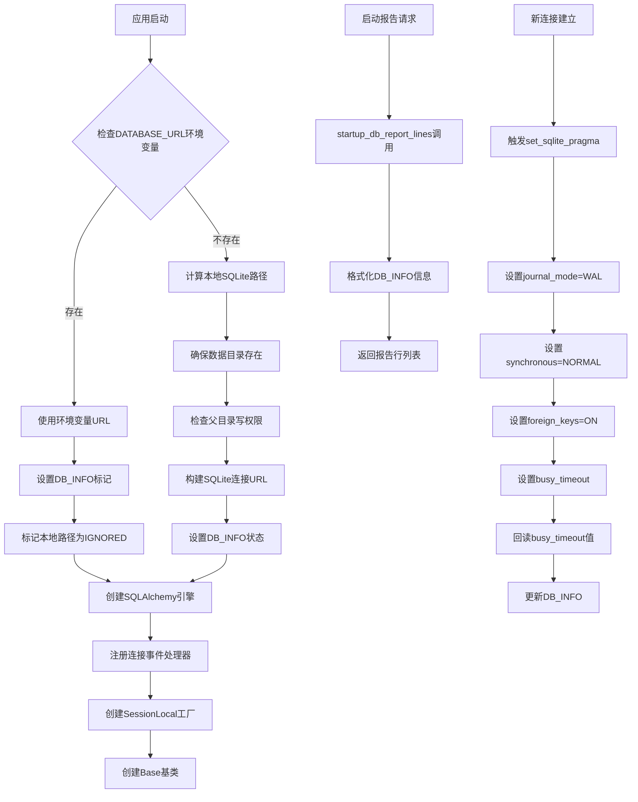

# 文件分析报告：server/app/db.py

## 文件概述

`server/app/db.py` 是项目的数据库配置和连接管理模块，负责SQLite数据库的初始化、配置和连接管理。该文件实现了数据库连接的优先级策略（环境变量优先于本地文件），集成了SQLite性能优化配置，并提供了完整的数据库状态监控和启动报告功能。

## 代码结构分析

### 导入依赖

```python
from __future__ import annotations
import os
import logging
from pathlib import Path
from sqlalchemy import create_engine, event
from sqlalchemy.orm import sessionmaker, declarative_base
from .config import settings
```

**依赖分析：**
- **标准库**: os用于环境变量访问，logging用于日志记录，Path用于路径操作
- **SQLAlchemy**: create_engine用于数据库引擎创建，event用于连接事件处理
- **ORM**: sessionmaker用于会话工厂，declarative_base用于模型基类
- **项目配置**: 依赖本地settings模块获取配置参数

### 全局变量和常量

```python
logger = logging.getLogger("kbxy")
DB_INFO: dict[str, str | bool | int | float | None] = {
    "using_database_url": False,
    "db_file_abs_path": None,
    "db_parent_dir": None,
    "writable": None,
    "busy_timeout_ms": None,
    "connect_timeout_s": settings.sqlite_connect_timeout_s,
    "note": "",
}
FINAL_DATABASE_URL: str
engine: Engine
SessionLocal: sessionmaker
Base: declarative_base
```

### 配置和设置

- **连接优先级**: DATABASE_URL环境变量 > 本地SQLite文件
- **SQLite优化**: WAL模式、外键约束、同步模式、繁忙超时
- **连接参数**: 跨线程使用、连接超时设置
- **路径管理**: 自动创建数据目录，权限检查

## 函数详细分析

### 函数概览表

| 函数名 | 类型 | 主要功能 | 参数数量 | 返回类型 |
|--------|------|----------|----------|----------|
| `set_sqlite_pragma` | 事件处理器 | 设置SQLite PRAGMA参数 | 2 | None |
| `startup_db_report_lines` | 工具函数 | 生成启动报告信息 | 0 | List[str] |

### 函数详细说明

#### `set_sqlite_pragma(dbapi_connection, connection_record)`
**功能**: SQLAlchemy连接事件处理器，为每个新连接设置SQLite优化参数
**触发时机**: 每次建立新的数据库连接时自动调用
**设置的PRAGMA**:
- `journal_mode=WAL`: 使用Write-Ahead Logging提升并发性能
- `synchronous=NORMAL`: 平衡性能和数据安全的同步模式
- `foreign_keys=ON`: 启用外键约束检查
- `busy_timeout`: 设置写锁等待超时时间

**回读机制**: 执行PRAGMA设置后回读busy_timeout实际值，更新DB_INFO用于启动报告

#### `startup_db_report_lines() -> List[str]`
**功能**: 生成用于启动日志的数据库状态信息
**返回信息**:
- 数据库类型（环境变量 vs 本地文件）
- 数据库文件绝对路径
- 父目录路径和写权限状态
- 繁忙超时和连接超时配置
- 可选的说明信息

## 类详细分析

### 类概览表

本文件主要包含全局配置和函数，不包含自定义类定义，但创建了重要的SQLAlchemy对象：

| 对象名 | 类型 | 主要功能 | 配置特点 |
|--------|------|----------|----------|
| `engine` | SQLAlchemy Engine | 数据库连接引擎 | 支持跨线程，配置超时 |
| `SessionLocal` | sessionmaker | 会话工厂 | 禁用自动flush/commit |
| `Base` | declarative_base | ORM模型基类 | 所有模型的基础类 |

## 函数调用流程图



## 变量作用域分析

### 全局作用域
- `logger`: 模块级日志记录器
- `DB_INFO`: 数据库状态信息字典，供启动报告使用
- `FINAL_DATABASE_URL`: 最终确定的数据库连接URL
- `engine`: SQLAlchemy数据库引擎，全局共享
- `SessionLocal`: 会话工厂，供依赖注入使用
- `Base`: ORM模型基类，供模型定义继承

### 函数作用域
- **`set_sqlite_pragma`**: 
  - `cursor`: 数据库游标，用于执行PRAGMA命令
  - `row`: 查询结果，用于回读PRAGMA值
- **初始化代码块**: 
  - `_database_url_env`: 环境变量值
  - `p`: Path对象，数据库文件路径
  - `writable_ok`: 权限检查结果

### 配置依赖
- `settings.sqlite_connect_timeout_s`: 连接超时配置
- `settings.sqlite_busy_timeout_ms`: 繁忙超时配置
- `settings.resolved_local_db_path()`: 本地数据库路径解析

## 函数依赖关系

### 内部依赖关系
```
模块初始化 → 路径计算 → 权限检查 → 引擎创建 → 事件注册
startup_db_report_lines → DB_INFO (依赖全局状态)
set_sqlite_pragma → DB_INFO (更新全局状态)
```

### 外部依赖关系
1. **config模块**: 
   - 获取超时配置参数
   - 解析本地数据库路径
2. **SQLAlchemy**: 
   - 数据库引擎和会话管理
   - 事件系统和ORM基础
3. **操作系统**: 
   - 环境变量读取
   - 文件系统操作和权限检查

### 数据流分析
```
环境配置 → 路径解析 → 权限验证 → 连接创建 → PRAGMA设置 → 状态记录 → 报告生成
```

## 错误处理和健壮性

### 错误处理机制
1. **目录创建异常**: 使用try-except处理mkdir失败情况
2. **PRAGMA回读异常**: 使用try-except处理PRAGMA查询失败
3. **路径访问异常**: 使用os.access安全检查目录权限

### 健壮性特征
- **环境变量优先**: 生产环境可通过DATABASE_URL覆盖本地配置
- **自动目录创建**: 确保数据目录存在，支持首次运行
- **权限检查**: 启动时检查写权限，提前发现配置问题
- **连接参数优化**: 支持跨线程使用和连接超时控制

### 配置验证
- **路径有效性**: 验证数据库文件路径的父目录可写
- **参数回读**: 验证PRAGMA设置是否生效
- **状态记录**: 完整记录配置状态便于问题排查

## 性能分析

### 性能优化配置
1. **WAL模式**: 提升读写并发性能，减少锁冲突
2. **NORMAL同步**: 平衡数据安全和写入性能
3. **繁忙超时**: 避免立即失败，适当等待写锁释放
4. **连接池**: 通过SQLAlchemy连接池复用连接

### 潜在性能影响
1. **外键检查**: 启用外键约束会增加写入开销
2. **PRAGMA设置**: 每个新连接都需要执行PRAGMA命令
3. **路径解析**: 启动时的文件系统操作开销

### 扩展性考虑
- **数据库切换**: 支持通过环境变量切换到其他数据库
- **连接参数**: 可通过配置调整超时和连接行为
- **监控集成**: DB_INFO提供了丰富的状态信息

## 代码质量评估

### 优点
1. **配置灵活**: 支持环境变量和本地文件双重配置方式
2. **监控完善**: 提供详细的数据库状态信息和启动报告
3. **性能优化**: 集成了SQLite最佳实践配置
4. **错误处理**: 合理的异常处理和容错机制
5. **文档清晰**: 详细的注释说明配置作用

### 改进建议
1. **类型注解**: 可为FINAL_DATABASE_URL等变量增加类型注解
2. **配置验证**: 可增加配置参数的有效性验证
3. **日志增强**: 可增加更详细的配置和错误日志
4. **测试支持**: 可增加测试环境的特殊配置支持

## 安全性考虑

### 安全特性
1. **路径验证**: 检查数据库文件路径的合法性
2. **权限检查**: 验证目录写权限，避免运行时错误
3. **外键约束**: 启用外键检查保证数据完整性
4. **连接隔离**: 每个会话独立，避免数据泄露

### 潜在安全风险
1. **路径注入**: DATABASE_URL环境变量可能包含恶意路径
2. **权限提升**: 数据目录创建可能影响文件系统权限
3. **信息泄露**: DB_INFO包含敏感路径信息

## 总结

`server/app/db.py` 是一个设计精良的数据库配置管理模块，成功地将数据库连接管理、性能优化、监控报告和错误处理整合在一起。代码体现了对SQLite数据库特性的深度理解和最佳实践的应用，特别是在WAL模式配置、连接管理和状态监控方面表现出色。该模块为整个项目提供了稳定可靠的数据库基础设施。