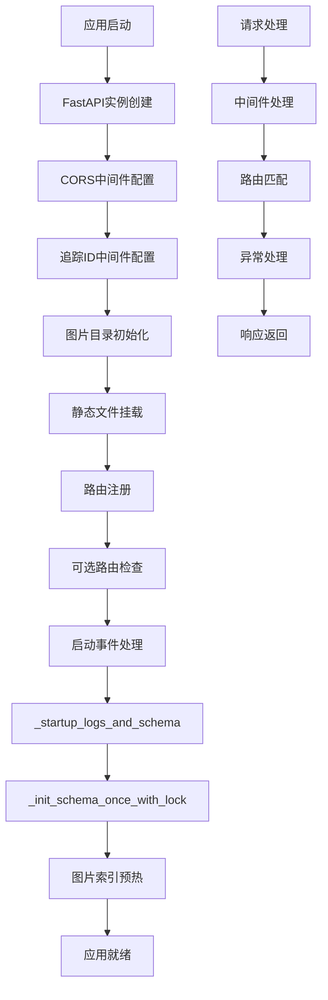
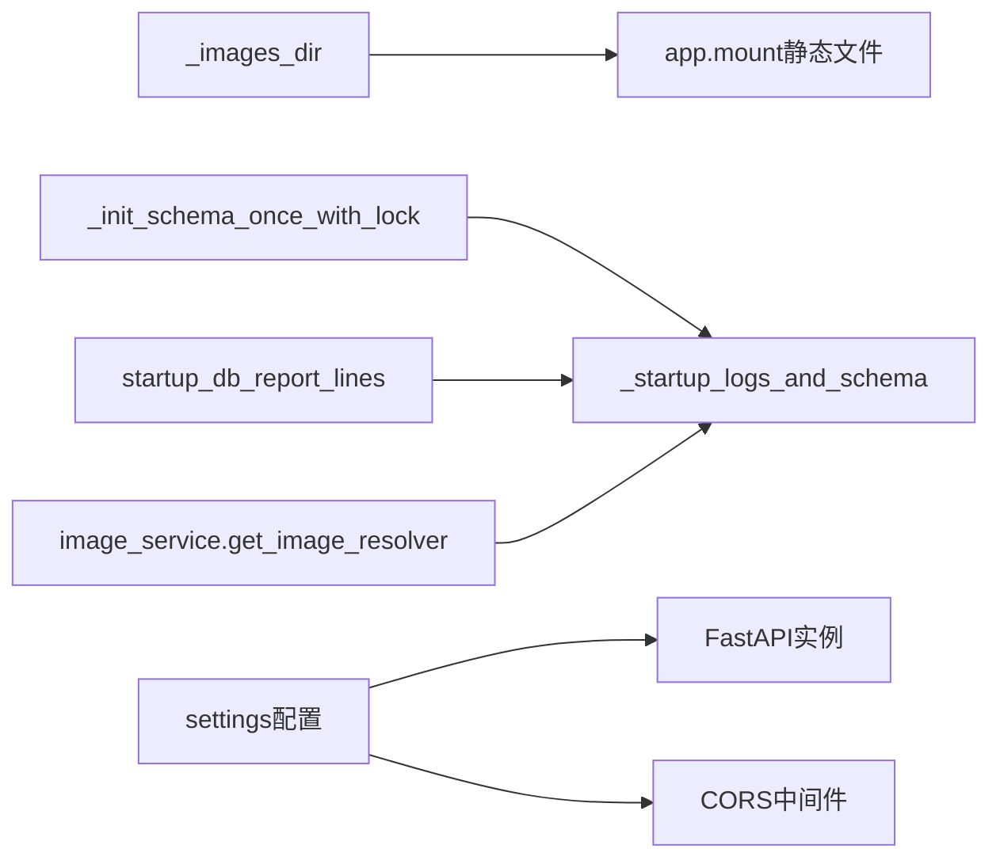

# 文件分析报告：server/app/main.py

## 文件概述
这是一个基于FastAPI框架的主应用程序入口文件，负责初始化Web应用、配置中间件、注册路由模块，以及管理数据库连接和静态文件服务。文件实现了完整的应用程序启动流程，包括CORS配置、数据库初始化、路由注册和异常处理。

## 代码结构分析

### 导入依赖
```python
from __future__ import annotations  # Python版本兼容性
import logging                       # 日志记录
import os                           # 操作系统接口
from pathlib import Path            # 文件路径处理

from fastapi import FastAPI, Request, HTTPException  # FastAPI核心组件
from fastapi.middleware.cors import CORSMiddleware   # CORS中间件
from fastapi.responses import JSONResponse           # JSON响应
from fastapi.staticfiles import StaticFiles         # 静态文件服务

from .config import settings                        # 应用配置
from .db import Base, engine, startup_db_report_lines, DB_INFO  # 数据库组件
from .middleware import TraceIDMiddleware           # 自定义追踪中间件
```

### 全局变量和常量
```python
logger = logging.getLogger("kbxy")  # 应用程序日志器
app = FastAPI(title=settings.app_name)  # FastAPI应用实例
HAS_TAGS = True/False              # 标签路由可用性标志
HAS_ROLES = True/False             # 角色路由可用性标志
```

### 配置和设置
- **CORS配置**: 允许跨域请求，支持所有方法和头部
- **中间件**: 配置CORS和自定义TraceID中间件
- **静态文件**: 挂载怪物图片静态文件服务到 `/media/monsters`
- **数据库**: 使用文件锁机制避免schema初始化竞态条件

## 函数详细分析

### 函数概览表
| 函数名 | 类型 | 参数 | 返回值 | 功能描述 |
|--------|------|------|--------|----------|
| `_images_dir()` | 私有函数 | 无 | str | 获取怪物图片目录路径 |
| `_init_schema_once_with_lock()` | 私有函数 | 无 | None | 使用文件锁初始化数据库schema |
| `_startup_logs_and_schema()` | 异步函数 | 无 | None | 应用启动时的日志记录和初始化 |
| `http_exception_handler()` | 异步异常处理器 | request, exc | JSONResponse | 处理HTTP异常 |
| `unhandled_exception_handler()` | 异步异常处理器 | request, exc | JSONResponse | 处理未捕获异常 |

### 函数详细说明

#### `_images_dir() -> str`
**功能**: 确定怪物图片存储目录路径
- 优先检查环境变量 `MONSTERS_MEDIA_DIR`
- 默认使用 `server/images/monsters` 目录
- 确保目录存在，不存在则创建

#### `_init_schema_once_with_lock()`
**功能**: 安全地初始化数据库schema
- 仅在开发/测试环境执行
- 使用文件锁避免多进程竞态条件
- 支持checkfirst=True的安全初始化

#### `_startup_logs_and_schema()`
**功能**: 应用启动时的初始化流程
- 记录应用环境和数据库信息
- 执行数据库schema初始化
- 预热图片索引解析器

#### 异常处理器
- **http_exception_handler**: 处理FastAPI HTTP异常，返回标准JSON错误格式
- **unhandled_exception_handler**: 处理所有未捕获异常，返回500错误

## 类详细分析

### 类概览表
本文件没有定义类，主要基于函数式编程和FastAPI的声明式配置。

### 类详细说明
无类定义。

## 函数调用流程图


## 变量作用域分析
- **模块级变量**: `logger`, `app`, `HAS_TAGS`, `HAS_ROLES` - 全局可访问
- **函数局部变量**: 各函数内部变量，作用域限制在函数内
- **环境变量依赖**: `MONSTERS_MEDIA_DIR` - 外部配置影响应用行为

## 函数依赖关系


**依赖关系说明**:
- 图片目录配置影响静态文件挂载
- 数据库初始化依赖于配置和锁机制
- 启动流程集成多个初始化步骤
- 路由模块采用可选导入模式提高容错性

**架构特点**:
- 模块化路由设计，支持可选功能
- 安全的数据库初始化机制
- 完善的异常处理体系
- 灵活的静态文件服务配置