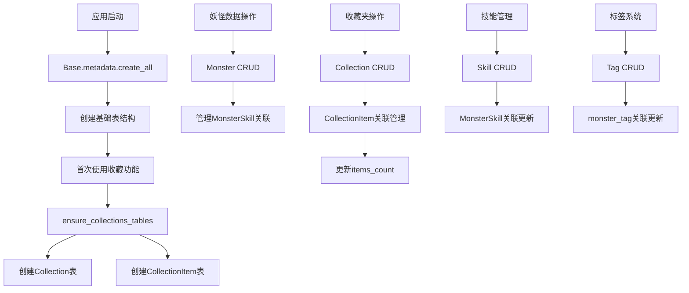

# 文件分析报告：server/app/models.py

## 文件概述
这是应用程序的核心数据模型定义文件，使用SQLAlchemy ORM框架定义了卡布西游妖怪管理系统的完整数据库模型。该文件建立了一个复杂的关系型数据库架构，涵盖妖怪信息、技能系统、标签分类、收藏夹管理、任务追踪等功能模块，是整个应用的数据层基础。

## 代码结构分析

### 导入依赖
```python
from datetime import datetime
from sqlalchemy import (
    Column, Integer, String, Float, DateTime, Table, ForeignKey, JSON, Text,
    UniqueConstraint, Boolean, Index
)
from sqlalchemy.orm import relationship, Mapped, mapped_column
from sqlalchemy.ext.associationproxy import association_proxy
from .db import Base
```

### 全局变量和常量
- `monster_tag`: 怪物-标签多对多关联表，定义了怪物与标签之间的关联关系

### 配置和设置
- 使用SQLAlchemy 2.0的现代化语法，采用`Mapped`和`mapped_column`进行类型注解
- 统一使用`DateTime`字段记录创建和更新时间
- 采用CASCADE删除策略确保数据一致性

## 函数详细分析

### 函数概览表
| 函数名 | 用途 | 输入参数 | 返回值 | 复杂度 |
|--------|------|----------|--------|--------|
| `ensure_collections_tables` | 惰性创建收藏夹相关表 | `bind` | `None` | O(1) |
| `__repr__` (各模型类) | 对象字符串表示 | `self` | `str` | O(1) |

### 函数详细说明

**ensure_collections_tables函数：**
- 功能：惰性建表工具函数，在首次使用收藏夹功能前调用
- 参数：`bind` - 数据库连接对象
- 实现：使用`Base.metadata.create_all()`仅为Collection和CollectionItem表执行建表操作
- 特点：幂等操作，重复调用安全

**__repr__方法（各模型类）：**
- 为每个模型类提供友好的字符串表示
- 包含关键字段信息，便于调试和日志记录
- 统一格式：`<ClassName key1=value1 key2=value2>`

## 类详细分析

### 类概览表
| 类名 | 用途 | 主要属性 | 关系类型 | 索引设计 |
|------|------|----------|----------|----------|
| `Monster` | 妖怪主实体 | `name, element, hp, speed, attack, defense, magic, resist` | 一对多、多对多 | 名称唯一索引 |

| `Tag` | 标签分类 | `name` | 多对多 | 名称唯一索引 |
| `Skill` | 技能信息 | `name, element, kind, power, description` | 多对多 | 复合唯一约束 |
| `MonsterSkill` | 妖怪-技能关联 | `selected, level, description` | 关联对象 | 复合唯一约束 |
| `Collection` | 收藏夹 | `name, color, items_count` | 一对多 | 名称唯一索引 |
| `CollectionItem` | 收藏项 | `collection_id, monster_id` | 关联对象 | 复合主键 |
| `ImportJob` | 导入任务 | `key, status, result_json` | 独立实体 | 键唯一索引 |
| `Task` | 异步任务 | `type, status, progress, total` | 独立实体 | 主键UUID |

### 类详细说明

**Monster 核心妖怪类：**
- 功能：存储妖怪的基础信息和属性
- 核心属性：
  - `name`: 妖怪名称，作为唯一标识
  - `element`: 系别属性（火系、水系等）
  - `role`: 角色定位
  - `possess`: 本地拥有状态
  - `new_type`: 当前获取可用性
  - `type`/`method`: 获取渠道分类和具体方式
  - 六围属性：`hp, speed, attack, defense, magic, resist`
- 关系设计：
  - 与Tag多对多关系（通过monster_tag表）
  - 与Skill多对多关系（通过MonsterSkill关联对象）

  - 一对多关系到CollectionItem（收藏关系）


**Skill 技能类：**
- 功能：定义妖怪技能的属性和效果
- 唯一约束：`(name, element, kind, power)`四元组确保技能唯一性
- 属性设计：
  - `name`: 技能名称
  - `element`: 技能元素（火、水、土等）
  - `kind`: 技能类型（物理/法术/特殊）
  - `power`: 技能威力值
  - `description`: 技能效果描述

**MonsterSkill 关联对象类：**
- 功能：管理妖怪与技能的多对多关系
- 关系级属性：
  - `selected`: 是否为精选技能
  - `level`: 技能可选等级
  - `description`: 关系级描述信息
- 约束：`(monster_id, skill_id)`复合唯一约束防止重复关联

**Collection 收藏夹系统：**
- 功能：用户自定义的妖怪分组管理
- 特性：
  - `name`: 收藏夹名称（全局唯一）
  - `color`: 标识颜色
  - `items_count`: 冗余计数字段（性能优化）
  - `last_used_at`: 最近使用时间
- 扩展性：预留多用户支持（注释中提到可添加user_id）

**CollectionItem 收藏项类：**
- 功能：收藏夹与妖怪的多对多关联
- 设计：使用复合主键`(collection_id, monster_id)`确保唯一性
- 索引：额外添加monster_id索引优化查询性能

**任务管理类（ImportJob, Task）：**
- `ImportJob`: 专门处理数据导入作业，使用字符串key作为唯一标识
- `Task`: 通用异步任务，使用UUID作为主键，支持进度追踪

## 函数调用流程图


## 变量作用域分析

**模块级作用域：**
- `monster_tag`: 全局关联表定义，用于Monster和Tag的多对多关系
- 各模型类定义：全局可访问的数据模型类

**类级作用域：**
- `__tablename__`: 表名定义，每个模型类的表映射
- `__table_args__`: 表级约束和索引定义
- 字段定义：使用`Mapped`类型注解的字段映射
- 关系定义：`relationship`和`association_proxy`定义的对象关系

**实例级作用域：**
- 各字段的实际数据值
- 关系对象的实例引用
- 计算属性和动态属性

**函数级作用域：**
- `ensure_collections_tables`中的`bind`参数
- `__repr__`方法中的格式化字符串构建

## 函数依赖关系

**核心依赖链：**
1. `Base` → 所有模型类 → SQLAlchemy ORM框架
2. 关联表(`monster_tag`) → Monster/Tag多对多关系
3. 关联对象(MonsterSkill, CollectionItem) → 复杂多对多关系管理

**数据完整性依赖：**

- Monster → MonsterSkill（一对多级联删除）
- Collection → CollectionItem（一对多级联删除）
- 外键约束确保引用完整性

**索引优化依赖：**
- 唯一约束防止数据重复
- 复合索引优化查询性能
- 外键索引加速关联查询

**业务逻辑依赖：**

- CollectionItem的创建/删除需要维护Collection的items_count
- MonsterSkill的selected字段影响技能推荐逻辑

**扩展性考虑：**
- 使用JSON字段存储灵活的扩展数据
- 预留多用户支持的架构设计
- 惰性建表机制支持功能模块化

该文件展现了成熟的ORM设计思路，通过合理的关系设计、索引优化、约束定义等技术，构建了一个高性能、可扩展的数据模型架构，为应用的各项功能提供了坚实的数据基础。