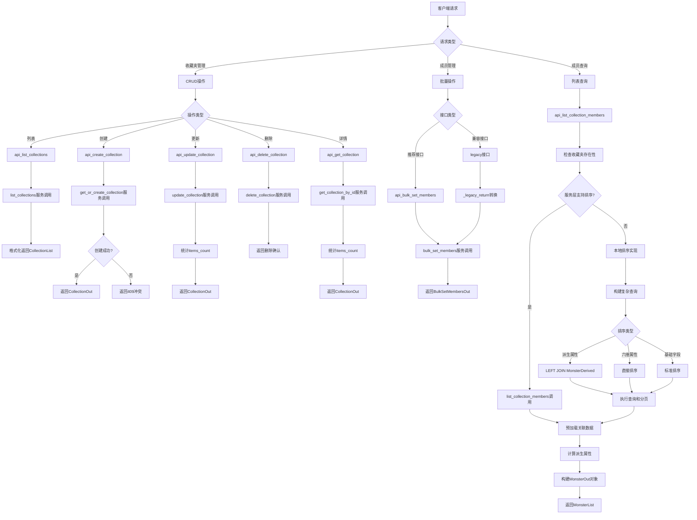

# 文件分析报告：server/app/routes/collections.py

## 文件概述

`server/app/routes/collections.py` 是一个功能完整的收藏夹管理API路由模块，提供了收藏夹的完整生命周期管理功能。该文件实现了收藏夹的创建、更新、删除、成员管理以及高级查询功能，支持复杂的排序算法（包括派生属性排序）、分页查询和批量操作，是项目中收藏系统的核心控制层。

## 代码结构分析

### 导入依赖

```python
from __future__ import annotations
from typing import Optional, List
from fastapi import APIRouter, Depends, HTTPException, Body, Query
from pydantic import BaseModel
from sqlalchemy import select, func, asc, desc
from sqlalchemy.orm import Session, selectinload
from ..db import SessionLocal
from ..models import Collection, CollectionItem, Monster, MonsterSkill, MonsterDerived
from ..schemas import (
    CollectionCreateIn, CollectionUpdateIn,
    CollectionOut, CollectionList,
    BulkSetMembersIn, BulkSetMembersOut,
    MonsterOut, MonsterList,
)
from ..services.collection_service import (
    list_collections, get_or_create_collection, update_collection, delete_collection,
    bulk_set_members, list_collection_members, get_collection_by_id,
)
from ..services.derive_service import compute_derived_out
```

**依赖分析：**
- **Web框架**: FastAPI用于构建REST API接口
- **数据库**: SQLAlchemy用于复杂查询和ORM操作
- **数据模型**: Pydantic用于请求/响应数据验证
- **服务层**: collection_service、derive_service提供核心业务逻辑
- **数据模型**: 涉及Collection、Monster、Tag等多个实体关系

### 全局变量和常量

```python
router = APIRouter(prefix="/collections", tags=["collections"])
```

### 配置和设置

- **路由前缀**: `/collections`
- **API标签**: `collections`
- **支持操作**: CRUD操作 + 成员管理 + 高级查询

## 函数详细分析

### 函数概览表

| 函数名 | 类型 | 主要功能 | 参数数量 | 返回类型 |
|--------|------|----------|----------|----------|
| `get_db` | 依赖函数 | 数据库会话管理 | 0 | Generator[Session] |
| `api_list_collections` | API路由 | 收藏夹列表查询 | 6 | CollectionList |
| `api_create_collection` | API路由 | 创建收藏夹 | 2 | CollectionOut |
| `api_update_collection` | API路由 | 更新收藏夹 | 3 | CollectionOut |
| `api_delete_collection` | API路由 | 删除收藏夹 | 2 | Dict |
| `api_bulk_set_members` | API路由 | 批量设置成员 | 2 | BulkSetMembersOut |
| `_legacy_return` | 工具函数 | 兼容性返回格式 | 1 | BulkSetMembersOut |
| `api_add_members_legacy` | API路由 | 兼容-添加成员 | 3 | BulkSetMembersOut |
| `api_remove_members_legacy` | API路由 | 兼容-移除成员 | 3 | BulkSetMembersOut |
| `api_set_members_legacy` | API路由 | 兼容-设置成员 | 3 | BulkSetMembersOut |
| `api_get_collection` | API路由 | 获取收藏夹详情 | 2 | CollectionOut |
| `api_list_collection_members` | API路由 | 收藏夹成员列表 | 6 | MonsterList |

### 函数详细说明

#### `get_db() -> Generator[Session]`
**功能**: FastAPI依赖注入的数据库会话管理器
**特点**: 标准的会话管理模式，确保资源正确释放

#### 收藏夹基础管理API

**`api_list_collections()`**
- **路径**: `GET /collections`
- **功能**: 获取收藏夹列表，支持多种排序和分页
- **支持参数**:
  - `q`: 名称模糊搜索
  - `sort`: updated_at/created_at/name/items_count/last_used_at
  - `order`: asc/desc
  - `page`, `page_size`: 分页控制
- **返回**: 带统计信息的收藏夹列表

**`api_create_collection(payload: CollectionCreateIn)`**
- **路径**: `POST /collections`
- **功能**: 创建新收藏夹（名称唯一性检查）
- **验证**: 名称必填，重复名称返回409冲突
- **返回**: 新创建的收藏夹详情

**`api_update_collection(collection_id: int, payload: CollectionUpdateIn)`**
- **路径**: `PATCH /collections/{collection_id}`
- **功能**: 更新收藏夹名称和颜色
- **特性**: 实时更新items_count统计
- **返回**: 更新后的收藏夹详情

**`api_delete_collection(collection_id: int)`**
- **路径**: `DELETE /collections/{collection_id}`
- **功能**: 删除收藏夹及相关数据
- **清理**: 自动清理相关的CollectionItem记录

**`api_get_collection(collection_id: int)`**
- **路径**: `GET /collections/{collection_id}`
- **功能**: 获取单个收藏夹的详细信息
- **包含**: 实时统计的成员数量

#### 成员管理API

**`api_bulk_set_members(payload: BulkSetMembersIn)`**
- **路径**: `POST /collections/bulk_set`
- **功能**: 推荐的批量成员管理接口
- **支持操作**:
  - `add`: 添加成员到收藏夹
  - `remove`: 从收藏夹移除成员
  - `set`: 覆盖设置收藏夹成员
- **特性**: 
  - 支持按名称或ID查找收藏夹
  - 自动创建不存在的收藏夹
  - 详细的操作统计反馈

#### 兼容性API

**`api_add_members_legacy()`, `api_remove_members_legacy()`, `api_set_members_legacy()`**
- **路径**: `/collections/{id}/add|remove|set`
- **功能**: 保持向后兼容的成员管理接口
- **处理**: 内部调用bulk_set_members实现

**`_legacy_return(res: dict) -> BulkSetMembersOut`**
- **功能**: 将服务层返回格式转换为API响应格式
- **确保**: 类型安全的数据转换

#### 高级查询API

**`api_list_collection_members()`**
- **路径**: `GET /collections/{collection_id}/members`
- **功能**: 收藏夹成员列表，支持高级排序和分页
- **支持排序**:
  - **基础字段**: id, name, element, role, updated_at, created_at
  - **六维属性**: hp, speed, attack, defense, magic, resist
  - **六维总和**: raw_sum
  - **新五轴派生**: body_defense, body_resist, debuff_def_res, debuff_atk_mag, special_tactics

**排序策略**:
1. **优先使用服务层**: 尝试调用collection_service的排序功能
2. **本地回退机制**: 服务层不支持时使用本地实现
3. **派生属性排序**: 通过LEFT JOIN MonsterDerived处理
4. **NULL值处理**: 统一的NULL值排序逻辑

## 类详细分析

### 类概览表

| 类名 | 类型 | 主要功能 | 字段数量 | 继承关系 |
|------|------|----------|----------|----------|
| `IdsIn` | Pydantic模型 | 兼容接口ID列表输入 | 1 | BaseModel |

### 类详细说明

#### `IdsIn`
**功能**: 为兼容性API定义的简单ID列表输入模型
**字段**: `ids: List[int]` - 怪物ID列表

## 函数调用流程图



## 变量作用域分析

### 全局作用域
- `router`: FastAPI路由器实例，模块级共享

### 函数作用域
- **CRUD函数**: 简单的请求/响应处理变量
- **批量操作函数**: 服务调用结果和格式转换变量
- **`api_list_collection_members`**: 
  - 复杂查询构建变量
  - 排序配置映射
  - 分页计算变量
  - 响应对象构建循环变量

### 数据库会话作用域
- 通过FastAPI依赖注入管理
- 每个请求独立的会话实例
- 自动处理事务边界和异常清理

### 服务调用作用域
- **collection_service**: 收藏夹核心业务逻辑
- **derive_service**: 派生属性计算
- 清晰的服务边界和职责分离

## 函数依赖关系

### 内部依赖关系
```
所有API路由 → get_db (依赖注入)
兼容性API → _legacy_return → 对应的推荐API
api_list_collection_members → 本地排序实现 (回退机制)
```

### 外部服务依赖
1. **collection_service**: 
   - 收藏夹CRUD操作
   - 成员批量管理
   - 高级查询和排序
   - 统计信息计算

2. **derive_service**: 
   - 派生属性计算
   - 数据格式化输出

3. **数据库层**: 
   - 复杂关联查询
   - 统计查询和聚合
   - 事务管理和一致性

### 数据流分析
```
请求参数 → 参数验证 → 服务层调用 → 数据库操作 → 结果处理 → 格式化响应 → 返回客户端
```

## 高级功能分析

### 排序系统设计
1. **多层次排序策略**: 
   - 优先使用服务层实现
   - 服务层不支持时本地实现
   - 确保功能完整性

2. **排序字段支持**:
   - 基础字段: 数据库直接排序
   - 六维属性: 标准数值排序
   - 派生属性: LEFT JOIN处理NULL值
   - 计算字段: 如六维总和

3. **NULL值处理**: 统一的升序/降序NULL值排序逻辑

### 批量操作设计
1. **统一接口**: bulk_set_members支持多种操作模式
2. **详细反馈**: 提供added/removed/skipped等详细统计
3. **错误处理**: missing_monsters列表记录不存在的怪物
4. **兼容性**: 保持旧接口的向后兼容

### 查询优化技术
1. **预加载策略**: 使用selectinload避免N+1问题
2. **分页优化**: 先计数后查询的高效分页
3. **索引利用**: 合理构建WHERE和ORDER BY子句
4. **回退机制**: 服务层和路由层的双重保障

## 性能分析

### 性能优化点
1. **服务层委托**: 核心逻辑在服务层，路由层保持轻量
2. **预加载优化**: 批量预加载关联数据
3. **查询优化**: 智能选择查询策略
4. **分页控制**: 合理的分页大小限制

### 潜在性能瓶颈
1. **复杂排序**: 派生属性排序需要JOIN操作
2. **统计查询**: 实时items_count计算可能较慢
3. **关联查询**: 深度关联可能产生复杂查询
4. **重复计算**: 派生属性的重复计算开销

### 扩展性考虑
- **缓存层**: 可为统计信息添加缓存
- **异步处理**: 批量操作可考虑异步处理
- **搜索引擎**: 复杂查询可集成Elasticsearch
- **分页优化**: 大数据集可使用cursor分页

## 架构设计评估

### 设计优点
1. **完整功能**: 涵盖收藏夹管理的完整生命周期
2. **兼容性**: 新旧接口的平滑过渡
3. **灵活排序**: 支持多种排序字段和策略
4. **服务分离**: 清晰的分层架构
5. **错误处理**: 完善的异常处理和用户反馈

### 架构特色
1. **双重保障**: 服务层 + 路由层的回退机制
2. **统一响应**: 标准化的API响应格式
3. **批量优化**: 高效的批量成员管理
4. **实时统计**: 动态计算的统计信息

## 代码质量评估

### 优点
1. **结构清晰**: 功能分组明确，代码组织良好
2. **类型安全**: 完整的类型注解和Pydantic验证
3. **文档完善**: 详细的API文档和函数说明
4. **异常处理**: 全面的错误处理机制
5. **兼容性**: 良好的向后兼容设计

### 改进建议
1. **代码复用**: 可提取通用的排序和分页逻辑
2. **配置化**: 排序字段映射可外部化配置
3. **监控增强**: 添加性能监控和慢查询告警
4. **测试覆盖**: 需要增加复杂查询场景的测试

## 总结

`server/app/routes/collections.py` 是一个功能完整、设计精良的收藏夹管理系统。它成功地将复杂的收藏夹管理需求、高级排序功能、批量操作和向后兼容性整合在一个统一的接口中。代码体现了良好的架构设计原则，特别是在服务分层、错误处理和扩展性方面表现出色。该模块为项目提供了强大而灵活的收藏系统管理能力，是用户数据组织和管理的重要基础设施。