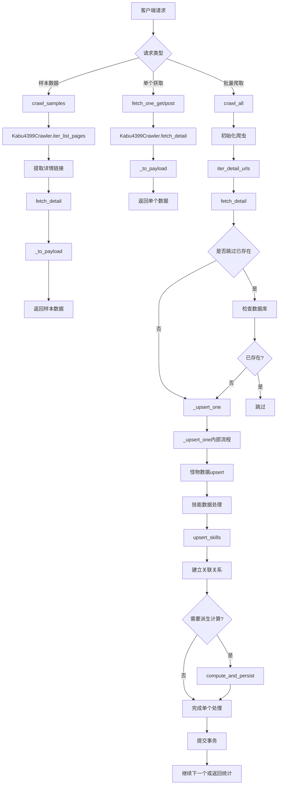

# 文件分析报告：server/app/routes/crawl.py

## 文件概述

`server/app/routes/crawl.py` 是一个FastAPI路由模块，负责处理从4399网站爬取怪物数据的相关API接口。该文件提供了完整的爬虫功能，包括样本数据获取、单个怪物详情抓取、批量爬取和数据库持久化等核心功能。

## 代码结构分析

### 导入依赖

```python
from __future__ import annotations
import logging
from typing import Dict, List, Optional, Tuple
from fastapi import APIRouter, Query
from pydantic import BaseModel
from sqlalchemy.orm import Session
from ..db import SessionLocal
from .. import models as M
from ..services.crawler_service import (
    Kabu4399Crawler, MonsterRow, SkillRow,
    normalize_skill_element, normalize_skill_kind
)
from ..services.skills_service import upsert_skills
from ..services.derive_service import compute_and_persist
```

**依赖分析：**
- **Web框架**: FastAPI用于构建REST API接口
- **数据模型**: SQLAlchemy ORM和Pydantic用于数据建模
- **爬虫服务**: 依赖crawler_service提供核心爬取功能
- **数据处理**: 依赖skills_service和derive_service处理技能和派生数据

### 全局变量和常量

```python
router = APIRouter(prefix="/api/v1/crawl", tags=["crawl_4399"])
log = logging.getLogger(__name__)
```

### 配置和设置

- **路由前缀**: `/api/v1/crawl`
- **标签**: `crawl_4399`
- **日志记录器**: 使用模块级别的日志记录

## 函数详细分析

### 函数概览表

| 函数名 | 类型 | 主要功能 | 参数数量 | 返回类型 |
|--------|------|----------|----------|----------|
| `_skill_public` | 私有工具函数 | 技能数据标准化输出 | 1 | Dict[str, object] |
| `_to_payload` | 私有工具函数 | 怪物数据格式化 | 1 | Dict[str, object] |
| `_upsert_one` | 私有工具函数 | 单个怪物数据写入数据库 | 4 | Tuple[bool, int] |
| `crawl_samples` | API路由 | 获取样本数据 | 1 | List[Dict] |
| `fetch_one_get` | API路由 | GET方式获取单个怪物 | 1 | Dict |
| `fetch_one_post` | API路由 | POST方式获取单个怪物 | 1 | Dict |
| `crawl_all` | API路由 | 批量爬取所有数据 | 1 | Dict |

### 函数详细说明

#### `_skill_public(s: SkillRow) -> Dict[str, object]`
**功能**: 将内部技能数据结构转换为对外API标准格式
**核心逻辑**: 
- 标准化技能属性(element)和类型(kind)
- 清理和格式化技能名称和描述
- 确保数据格式的一致性

#### `_to_payload(m: MonsterRow) -> Dict[str, object]`
**功能**: 将怪物数据转换为API响应格式
**核心逻辑**:
- 提取怪物基础属性（六维属性、获取方式等）
- 过滤和处理技能列表，排除无效技能
- 返回结构化的怪物数据

#### `_upsert_one(db: Session, mon: MonsterRow, overwrite: bool, do_derive: bool) -> Tuple[bool, int]`
**功能**: 将单个怪物数据持久化到数据库
**核心逻辑**:
1. **怪物数据upsert**: 以name为唯一键进行插入或更新
2. **技能数据处理**: 全局去重，建立怪物-技能关联
3. **派生计算**: 可选地计算和存储派生属性
4. **事务管理**: 确保数据一致性

**技能处理流程**:
- 对技能列表进行去重和标准化
- 使用`upsert_skills`服务批量处理技能
- 建立`MonsterSkill`关联关系
- 避免数据库唯一约束冲突

#### API路由函数分析

**`crawl_samples(limit: int)`**
- **用途**: 开发测试用，获取少量样本数据
- **参数**: limit限制返回数量(1-100)
- **返回**: 带有完整技能信息的怪物列表

**`fetch_one_get/post(url: str)`**
- **用途**: 获取指定URL的单个怪物详情
- **支持**: GET和POST两种请求方式
- **返回**: 单个怪物的完整信息

**`crawl_all(body: CrawlAllBody)`**
- **用途**: 生产环境的批量爬取接口
- **功能**: 
  - 全量或增量数据爬取
  - 灵活的覆盖和跳过策略
  - 可选的派生属性计算
  - 详细的执行统计

## 类详细分析

### 类概览表

| 类名 | 类型 | 主要功能 | 字段数量 | 继承关系 |
|------|------|----------|----------|----------|
| `CrawlAllBody` | Pydantic模型 | 批量爬取请求参数 | 5 | BaseModel |
| `FetchOneBody` | Pydantic模型 | 单个获取请求参数 | 1 | BaseModel |

### 类详细说明

#### `CrawlAllBody`
**功能**: 定义批量爬取API的请求参数结构
**字段说明**:
- `limit`: 限制爬取数量
- `overwrite`: 是否覆盖已存在的数据
- `skip_existing`: 是否跳过已存在的怪物
- `slugs`: 可选的特定爬取目标列表
- `derive`: 是否计算派生属性

#### `FetchOneBody`
**功能**: 定义单个获取API的请求参数
**字段**: `url` - 目标怪物详情页URL

## 函数调用流程图



## 变量作用域分析

### 全局作用域
- `router`: FastAPI路由器实例，整个模块共享
- `log`: 日志记录器，用于模块级日志输出

### 函数作用域
- **`_skill_public`**: 局部变量用于数据转换和清理
- **`_to_payload`**: skills列表用于技能过滤和处理
- **`_upsert_one`**: 
  - `is_insert`: 标记是否为新插入记录
  - `uniq_map`: 技能去重字典
  - `linked_local`: 防止重复关联的本地集合
- **API路由函数**: 各自的请求参数和响应数据

### 数据库会话作用域
- `_upsert_one`函数通过参数接收数据库会话
- `crawl_all`使用context manager管理会话生命周期

## 函数依赖关系

### 内部依赖
```
crawl_samples → _to_payload → _skill_public
fetch_one_get/post → _to_payload → _skill_public  
crawl_all → _upsert_one → _skill_public
_upsert_one → upsert_skills (外部服务)
_upsert_one → compute_and_persist (外部服务)
```

### 外部服务依赖
1. **crawler_service**: 提供核心爬虫功能和数据标准化
2. **skills_service**: 处理技能数据的批量upsert操作
3. **derive_service**: 计算和持久化怪物派生属性
4. **数据库层**: 通过SQLAlchemy ORM进行数据持久化

### 数据流向
```
4399网站数据 → crawler_service → 本模块路由处理 → 数据标准化 → 数据库持久化 → API响应
```

## 错误处理和健壮性

### 错误处理机制
1. **爬取失败**: 通过检查返回值处理爬取失败情况
2. **数据库异常**: 使用事务确保数据一致性
3. **重复数据**: 通过唯一约束和本地去重避免冲突
4. **无效数据**: 过滤空白和无效的技能名称

### 健壮性特征
- **幂等性**: 支持重复执行而不产生副作用
- **增量处理**: 支持跳过已存在数据的增量爬取
- **批量优化**: 使用批量操作提高数据库写入效率
- **事务管理**: 确保每个怪物的数据完整性

## 性能分析

### 性能优化点
1. **批量技能处理**: 使用`upsert_skills`批量处理技能数据
2. **本地去重**: 使用字典和集合进行内存级去重
3. **会话管理**: 合理使用数据库会话和事务
4. **分页处理**: 支持限制爬取数量避免内存溢出

### 潜在性能瓶颈
1. **网络I/O**: 爬虫操作受网络延迟影响
2. **数据库写入**: 大量数据写入可能影响性能
3. **重复查询**: 存在性检查可能产生额外查询

## 扩展性评估

### 扩展点
1. **新数据源**: 可扩展支持其他怪物数据网站
2. **数据处理**: 可增加更多的数据清理和转换逻辑
3. **缓存机制**: 可添加Redis等缓存层提升性能
4. **异步处理**: 可改造为异步操作提高并发能力

### 架构灵活性
- **服务分离**: 爬虫、技能处理、派生计算等服务独立
- **配置灵活**: 支持多种爬取策略和参数配置
- **数据标准化**: 统一的数据格式便于后续扩展

## 代码质量评估

### 优点
1. **职责清晰**: 路由、数据处理、持久化职责明确分离
2. **错误处理**: 具备基本的错误处理和数据验证
3. **代码复用**: 公共功能抽取为独立函数
4. **文档完善**: 函数和类有详细的docstring说明

### 改进建议
1. **异常处理**: 可增加更详细的异常捕获和处理
2. **日志记录**: 可增加更多的操作日志用于调试和监控
3. **参数验证**: 可增加更严格的输入参数验证
4. **测试覆盖**: 需要增加单元测试和集成测试

## 文档完整性

### 现有文档
- **函数文档**: 主要函数都有详细的docstring
- **类型注解**: 使用了完整的类型提示
- **注释说明**: 关键逻辑部分有注释说明

### 建议补充
- **API文档**: 可使用FastAPI自动生成的API文档
- **使用示例**: 可添加API调用示例
- **配置说明**: 可添加配置参数的详细说明

## 总结

`server/app/routes/crawl.py` 是一个功能完善的爬虫API路由模块，提供了从数据获取到持久化的完整流程。代码结构清晰，职责分离良好，具备良好的扩展性和维护性。主要承担了项目中怪物数据采集的核心功能，是整个数据处理链路的重要入口。