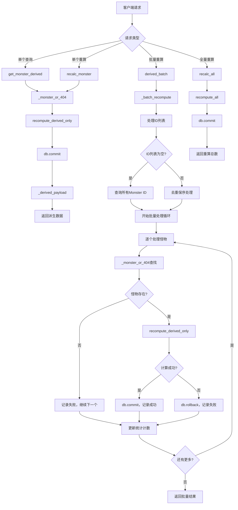

# 文件分析报告：server/app/routes/derive.py

## 文件概述

`server/app/routes/derive.py` 是一个专门负责怪物派生属性计算和管理的API路由模块。该文件专注于"新五轴"派生属性的计算、重算和批量处理功能，提供了完整的派生数据生命周期管理接口。模块设计简洁明确，职责单一，是项目中派生属性系统的核心控制层。

## 代码结构分析

### 导入依赖

```python
from __future__ import annotations
from typing import Dict, List, Optional
from fastapi import APIRouter, Depends, HTTPException, Body
from sqlalchemy.orm import Session
from sqlalchemy import select
from ..db import SessionLocal
from ..models import Monster
from ..services.derive_service import (
    compute_derived_out,
    recompute_derived_only,
    recompute_all,
)
```

**依赖分析：**
- **Web框架**: FastAPI用于构建REST API接口
- **数据库**: SQLAlchemy用于数据库操作和查询
- **数据模型**: Pydantic用于请求数据验证
- **派生服务**: 完全依赖derive_service提供核心计算功能
- **专注单一**: 仅处理派生属性，不涉及标签或定位功能

### 全局变量和常量

```python
router = APIRouter()
```

### 配置和设置

- **路由前缀**: 无前缀，直接挂载到主路由
- **功能范围**: 仅处理新五轴派生属性计算
- **服务集成**: 统一依赖derive_service服务

## 函数详细分析

### 函数概览表

| 函数名 | 类型 | 主要功能 | 参数数量 | 返回类型 |
|--------|------|----------|----------|----------|
| `get_db` | 工具函数 | 数据库会话管理 | 0 | Generator[Session] |
| `_monster_or_404` | 私有工具函数 | 怪物查找和404处理 | 2 | Monster |
| `_derived_payload` | 私有工具函数 | 派生数据格式化 | 1 | Dict[str, object] |
| `get_monster_derived` | API路由 | 获取怪物派生属性 | 2 | Dict |
| `get_derived_compat` | API路由 | 兼容性路径 | 2 | Dict |
| `recalc_monster` | API路由 | 单个怪物重算 | 2 | Dict |
| `recalc_monster_compat` | API路由 | 兼容性重算路径 | 2 | Dict |
| `_batch_recompute` | 私有工具函数 | 批量重算逻辑 | 2 | Dict[str, object] |
| `derived_batch` | API路由 | 批量重算接口 | 2 | Dict |
| `derived_batch_api_v1` | API路由 | API v1兼容接口 | 2 | Dict |
| `recalc_all` | API路由 | 全量重算接口 | 1 | Dict |

### 函数详细说明

#### `get_db() -> Generator[Session]`
**功能**: FastAPI依赖注入的数据库会话管理器
**特点**: 标准的会话管理模式，确保资源正确释放

#### `_monster_or_404(db: Session, monster_id: int) -> Monster`
**功能**: 怪物实体查找和404错误处理
**核心逻辑**:
- 使用session.get()方法查找怪物
- 如果不存在则抛出HTTP 404异常
- 返回有效的Monster实体

#### `_derived_payload(m: Monster) -> Dict[str, object]`
**功能**: 统一的派生属性响应格式化
**输出结构**: 
- body_defense (体防)
- body_resist (体抗)
- debuff_def_res (削防抗)
- debuff_atk_mag (削攻法)
- special_tactics (特殊)
**数值范围**: 0~120的整数

#### 单个怪物操作API

**`get_monster_derived(monster_id: int, db: Session)`**
- **路径**: `/monsters/{monster_id}/derived`
- **方法**: GET
- **功能**: 读取并返回派生属性，确保数据为最新
- **处理流程**: 
  1. 查找怪物实体
  2. 调用recompute_derived_only重算
  3. 提交数据库事务
  4. 返回格式化结果

**`get_derived_compat(monster_id: int, db: Session)`**
- **路径**: `/derive/{monster_id}` 
- **功能**: 兼容旧路径的派生属性获取
- **处理**: 与get_monster_derived完全相同

**`recalc_monster(monster_id: int, db: Session)`**
- **路径**: `/monsters/{monster_id}/derived/recompute`
- **方法**: POST
- **功能**: 强制重算并落库派生属性
- **特点**: 不做自动定位和标签处理

**`recalc_monster_compat(monster_id: int, db: Session)`**
- **路径**: `/derive/recalc/{monster_id}`
- **功能**: 兼容旧路径的重算接口

#### 批量操作API

**`_batch_recompute(ids: Optional[List[int]], db: Session)`**
**功能**: 批量重算的核心逻辑实现
**处理流程**:
1. **参数处理**: 空列表则处理全部Monster
2. **去重保序**: 处理输入ID列表
3. **逐个处理**: 串行处理每个怪物
4. **错误隔离**: 单个失败不影响其他
5. **统计报告**: 返回详细的处理统计

**错误处理策略**:
- 怪物不存在: 记录为failed，继续处理其他
- 计算异常: 回滚当前事务，记录错误，继续处理
- 结果限制: 详情最多返回200条

**`derived_batch(payload: BatchIds, db: Session)`**
- **路径**: `/derived/batch`
- **方法**: POST
- **功能**: 批量重算接口（前端兼容）

**`derived_batch_api_v1(payload: BatchIds, db: Session)`**
- **路径**: `/api/v1/derived/batch`
- **功能**: API v1版本的兼容接口

**`recalc_all(db: Session)`**
- **路径**: `/derive/recalc_all`
- **方法**: POST
- **功能**: 全量重算所有怪物（无详细报告）
- **用途**: 批量维护和数据修复

## 类详细分析

### 类概览表

| 类名 | 类型 | 主要功能 | 字段数量 | 继承关系 |
|------|------|----------|----------|----------|
| `BatchIds` | Pydantic模型 | 批量操作ID列表 | 1 | BaseModel |

### 类详细说明

#### `BatchIds`
**功能**: 定义批量重算操作的请求参数
**字段说明**:
- `ids: Optional[List[int]] = None` - 目标怪物ID列表，缺省或空表示全部怪物

## 函数调用流程图



## 变量作用域分析

### 全局作用域
- `router`: FastAPI路由器实例，模块级共享

### 函数作用域
- **单个操作函数**: 简单的局部变量，主要用于数据转换
- **`_batch_recompute`**: 
  - `target_ids`: 处理后的ID列表
  - `success`, `failed`: 统计计数器
  - `details`: 详情列表，限制200条
- **工具函数**: 最小化的局部作用域

### 数据库会话作用域
- 通过FastAPI依赖注入管理
- 每个请求独立的会话实例
- 自动处理事务边界和资源清理

### 服务调用作用域
- **derive_service**: 
  - `compute_derived_out`: 计算派生属性输出
  - `recompute_derived_only`: 重算并持久化
  - `recompute_all`: 全量重算

## 函数依赖关系

### 内部依赖关系
```
所有API路由 → get_db (依赖注入)
单个操作API → _monster_or_404 → _derived_payload
批量操作API → _batch_recompute → _monster_or_404
兼容路径 → 对应的标准路径
```

### 外部服务依赖
1. **derive_service**: 
   - 派生属性计算算法
   - 数据持久化逻辑
   - 批量处理优化

2. **数据库层**: 
   - Monster实体的CRUD操作
   - 事务管理和一致性保证

### 数据流分析
```
请求输入 → 参数验证 → 实体查找 → 派生计算 → 数据库持久化 → 格式化响应 → 返回结果
```

## 错误处理和健壮性

### 错误处理机制
1. **实体不存在**: 标准HTTP 404响应
2. **计算异常**: 事务回滚，错误记录，继续处理
3. **参数验证**: Pydantic自动验证请求参数
4. **数据库异常**: SQLAlchemy自动处理数据库错误

### 健壮性特征
- **事务完整性**: 每个操作都有完整的事务边界
- **错误隔离**: 批量操作中单个失败不影响其他
- **幂等性**: 重复调用产生相同结果
- **向后兼容**: 保持旧API路径的兼容性

## 性能分析

### 性能特点
1. **轻量设计**: 专注派生计算，无额外功能负担
2. **服务委托**: 核心逻辑委托给专门的服务层
3. **事务优化**: 合理的事务边界设计
4. **批量优化**: 串行处理避免资源争用

### 潜在性能瓶颈
1. **串行处理**: 批量操作采用串行模式可能较慢
2. **重复计算**: 每次请求都重新计算可能有冗余
3. **数据库I/O**: 频繁的数据库写入操作

### 扩展性考虑
- **异步处理**: 可改造为异步API提高并发性能
- **缓存机制**: 可添加计算结果缓存
- **批量优化**: 可实现真正的批量数据库操作
- **队列处理**: 大批量操作可考虑异步队列

## 架构设计评估

### 设计优点
1. **职责单一**: 专注派生属性处理，职责明确
2. **接口简洁**: API设计简洁易用
3. **向后兼容**: 完善的兼容性路径支持
4. **错误处理**: 健全的错误处理和反馈机制
5. **服务分离**: 核心逻辑在服务层，路由层保持简洁

### 架构特色
1. **统一响应格式**: 所有接口返回一致的派生数据结构
2. **灵活批量操作**: 支持指定ID和全量处理两种模式
3. **完整兼容性**: 新旧API路径的无缝支持
4. **错误统计**: 详细的批量操作统计报告

## 代码质量评估

### 优点
1. **代码简洁**: 逻辑清晰，代码结构简单
2. **文档完善**: 函数和接口都有详细说明
3. **类型安全**: 完整的类型注解
4. **错误处理**: 全面的异常处理机制
5. **测试友好**: 简单的结构便于单元测试

### 改进建议
1. **性能优化**: 考虑异步处理和批量数据库操作
2. **监控增强**: 添加计算时间和性能指标监控
3. **配置化**: 批量处理的限制参数可配置化
4. **缓存策略**: 考虑添加适当的缓存机制

## 总结

`server/app/routes/derive.py` 是一个设计精良、职责明确的派生属性管理路由模块。它成功地将复杂的派生计算逻辑封装在服务层，保持路由层的简洁性。模块提供了完整的派生属性生命周期管理功能，包括查询、重算、批量处理等核心操作。代码设计体现了单一职责原则、良好的错误处理和向后兼容性考虑，是项目中派生属性系统的稳定可靠的控制层。