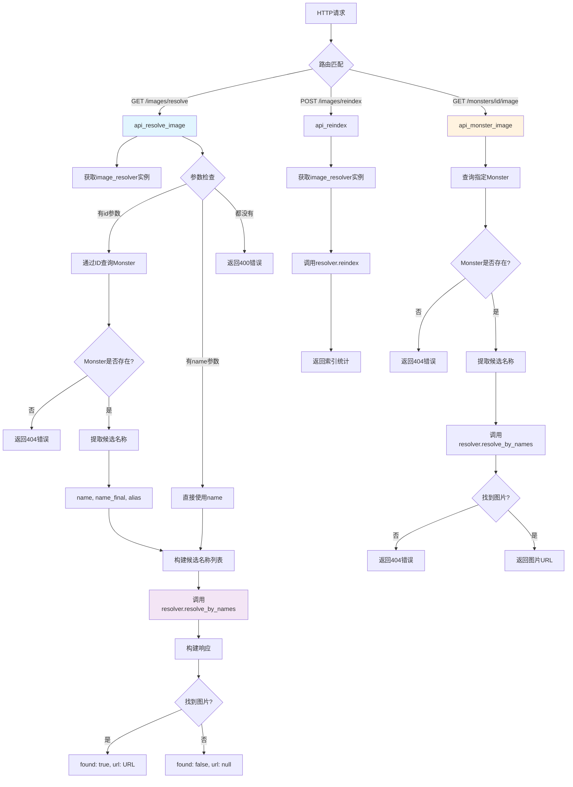

# 文件分析报告：server/app/routes/images.py

## 文件概述

`server/app/routes/images.py` 是专门处理怪物图片解析和管理的API路由模块，提供灵活的图片URL解析服务和图片资源管理功能。该文件实现了多名称候选解析、图片索引重建和怪物专属图片查询功能，支持通过ID或名称查找对应的图片资源，为前端展示提供可靠的图片服务支持。

## 代码结构分析

### 导入依赖

```python
from __future__ import annotations
from fastapi import APIRouter, Depends, Query, HTTPException
from sqlalchemy.orm import Session
from ..db import SessionLocal
from ..models import Monster
from ..services.image_service import get_image_resolver
```

**依赖分析：**
- **未来注解**: `__future__` import支持现代类型注解语法
- **Web框架**: FastAPI用于构建REST API接口和参数验证
- **数据库**: SQLAlchemy ORM用于怪物数据查询
- **图片服务**: 依赖image_service模块提供核心图片解析逻辑
- **异常处理**: HTTPException用于标准HTTP错误响应

### 全局变量和常量

```python
router = APIRouter()
```

### 配置和设置

- **路由前缀**: 无特定前缀，直接挂载到主路由
- **服务集成**: 完全依赖image_service进行实际的图片解析工作
- **灵活查询**: 支持ID和名称两种查询方式

## 函数详细分析

### 函数概览表

| 函数名 | 类型 | 主要功能 | 参数数量 | 返回类型 |
|--------|------|----------|----------|----------|
| get_db | 依赖函数 | 数据库会话管理 | 0 | Generator[Session] |
| api_resolve_image | GET路由 | 通用图片解析接口 | 3 | Dict |
| api_reindex | POST路由 | 重新索引图片资源 | 0 | Dict |
| api_monster_image | GET路由 | 特定怪物图片查询 | 2 | Dict |

### 函数详细说明

#### `get_db() -> Generator[Session]`
**功能**: 标准的FastAPI数据库会话依赖注入管理器
**特点**: 确保数据库资源的正确生命周期管理

#### `api_resolve_image(id: int | None, name: str | None, db: Session) -> Dict`
**路径**: `GET /images/resolve`
**功能**: 通过ID或名称解析图片URL的通用接口
**参数处理**:
- `id`: 可选的怪物ID参数
- `name`: 可选的怪物名称参数
- 两个参数至少需要提供一个

**解析策略**:
1. **ID查询模式**: 
   - 根据ID查找Monster记录
   - 提取name、name_final、alias作为候选名称
   - 支持多属性名称回退机制
2. **名称查询模式**:
   - 直接使用提供的name作为候选
3. **候选名称处理**:
   - 使用安全的getattr访问可能不存在的属性
   - 过滤None值，构建有效候选列表

**返回格式**:
```json
{
  "found": true/false,
  "url": "图片URL或null"
}
```

#### `api_reindex() -> Dict`
**路径**: `POST /images/reindex`
**功能**: 重新扫描图片目录并更新索引
**用途**:
- 图片资源更新后的索引重建
- 新增图片文件的发现和索引
- 修复索引不一致问题

**返回格式**:
```json
{
  "ok": true,
  "count": 索引的图片数量
}
```

#### `api_monster_image(monster_id: int, db: Session) -> Dict`
**路径**: `GET /monsters/{monster_id}/image`
**功能**: 获取特定怪物的图片URL，专用接口
**特点**:
- 直接通过怪物ID获取图片
- 如果图片不存在返回404错误
- 可扩展支持重定向到静态URL

**错误处理**:
- Monster不存在: HTTP 404 "monster not found"  
- 图片不存在: HTTP 404 "image not found"

## 类详细分析

### 类概览表

本文件不包含自定义类定义，仅使用FastAPI和SQLAlchemy的内置组件。

## 函数调用流程图



## 变量作用域分析

### 全局作用域
- `router`: FastAPI路由器实例，模块级共享

### 函数作用域
- **`api_resolve_image`**:
  - `resv`: image_resolver实例
  - `candidates`: 候选名称列表
  - `m`: Monster查询结果
  - `url`: 解析得到的图片URL
- **`api_monster_image`**:
  - `resv`: image_resolver实例
  - `m`: Monster实体
  - `url`: 图片URL

### 临时变量作用域
- 循环中的`x`: 候选名称遍历临时变量
- getattr调用的属性访问临时结果

## 函数依赖关系

### 内部依赖关系
```
所有API路由 → get_db (依赖注入)
所有API路由 → get_image_resolver (服务层)
api_resolve_image → Monster查询 (条件性)
api_monster_image → Monster查询 (必需)
```

### 外部依赖关系
1. **数据库层**:
   - Monster模型: 怪物信息查询和属性提取
   - SQLAlchemy会话: 数据库操作管理
2. **图片服务层**:
   - image_service.get_image_resolver: 核心图片解析服务
   - resolver.resolve_by_names: 多名称候选解析
   - resolver.reindex: 图片索引重建
3. **FastAPI框架**:
   - 路由管理和参数验证
   - HTTP异常处理和响应序列化

### 数据流分析
```
HTTP请求 → 参数解析 → 数据库查询(可选) → 候选名称构建 → 图片服务调用 → URL解析 → 响应返回
```

## 错误处理分析

### HTTP异常处理
1. **400 Bad Request**: 
   - `api_resolve_image`中id和name都未提供时
   - 参数验证失败的标准响应
2. **404 Not Found**:
   - Monster记录不存在
   - 图片资源不存在
   - 提供详细的错误信息描述

### 异常处理策略
```python
# Monster不存在的处理
if not m:
    raise HTTPException(status_code=404, detail="monster not found")

# 图片不存在的处理  
if not url:
    raise HTTPException(status_code=404, detail="image not found")
```

### 健壮性设计
- 使用getattr安全访问可能不存在的属性
- 过滤None值确保候选列表有效性
- 服务层封装降低直接文件系统操作风险

## 性能分析

### 查询优化
1. **数据库查询**:
   - 简单的主键查询，性能良好
   - 仅在需要时执行数据库操作
2. **图片解析**:
   - 服务层缓存和优化由image_service负责
   - 多候选名称提高解析成功率

### 扩展性考虑
- **缓存策略**: 图片URL解析结果适合缓存
- **批量操作**: 可扩展支持批量图片查询
- **重定向优化**: 可直接重定向到静态资源服务器

## 业务价值分析

### 核心功能价值
1. **灵活查询**: 支持ID和名称两种查询模式
2. **容错机制**: 多候选名称提高图片匹配成功率
3. **资源管理**: 支持图片索引的动态维护
4. **统一接口**: 为前端提供标准化的图片服务

### 应用场景
- **怪物展示**: 前端根据怪物信息动态加载图片
- **图片管理**: 管理员进行图片资源的维护和更新
- **容错处理**: 处理名称变更或图片缺失的情况
- **性能优化**: 避免前端直接访问文件系统

## 代码质量评估

### 优点
1. **接口设计**: 清晰的RESTful API设计
2. **参数验证**: 完善的输入参数检查
3. **错误处理**: 标准的HTTP状态码和错误信息
4. **服务分离**: 图片解析逻辑委托给专门的服务层
5. **容错机制**: 多候选名称和安全属性访问

### 改进建议
1. **缓存支持**: 可增加图片URL的缓存机制
2. **批量查询**: 支持多个怪物的批量图片查询
3. **图片格式**: 可支持不同尺寸和格式的图片变体
4. **监控日志**: 增加图片解析失败的详细日志

## 安全性考虑

### 安全特性
1. **路径安全**: 不直接暴露文件系统路径
2. **参数验证**: FastAPI自动进行参数类型验证
3. **权限控制**: reindex接口可考虑增加管理员权限
4. **错误信息**: 不泄露敏感的系统内部信息

### 潜在风险
1. **资源消耗**: 频繁的reindex操作可能消耗系统资源
2. **文件系统**: 图片服务依赖文件系统的可用性
3. **拒绝服务**: 大量并发图片请求的处理

## 总结

`server/app/routes/images.py` 是一个设计良好的图片服务模块，成功地实现了灵活的图片解析和管理功能。代码结构清晰，错误处理完善，通过服务层分离实现了良好的关注点分离。该模块为前端提供了可靠的图片服务支持，在用户体验和系统维护方面都表现出色，是现代Web应用中图片资源管理的优秀实现。