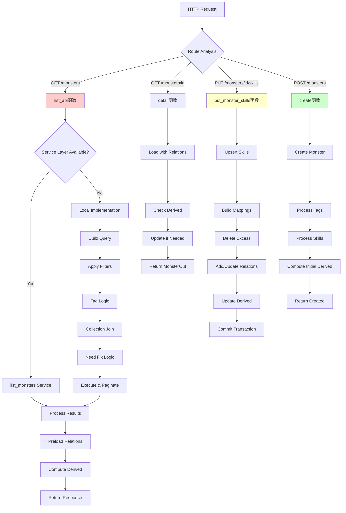
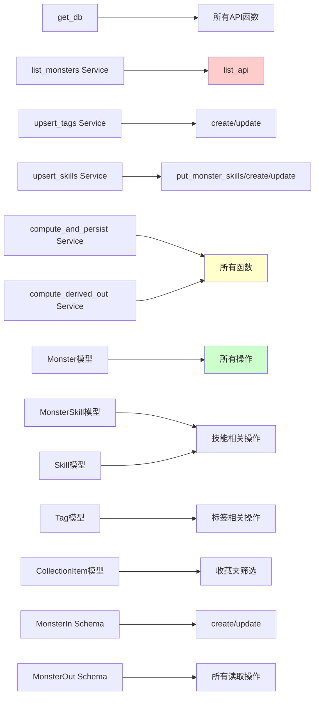

# 文件分析报告：server/app/routes/monsters.py

## 文件概述

monsters.py是整个应用的核心API路由模块，负责处理所有与怪物相关的CRUD操作和复杂查询功能。该文件实现了完整的RESTful API，包括列表查询、详情获取、创建、更新、删除等功能，同时支持高级筛选、标签管理、技能关联、收藏夹集成和派生属性计算。

## 代码结构分析

### 导入依赖

```python
from typing import Optional, List, Tuple, Dict
from fastapi import APIRouter, Depends, HTTPException, Query
from pydantic import BaseModel, Field
from sqlalchemy.orm import Session, selectinload
from sqlalchemy import select, func, or_, and_
```

该模块依赖FastAPI框架的核心组件、Pydantic数据验证、SQLAlchemy ORM，以及自定义的服务层模块。

### 全局变量和常量

```python
router = APIRouter()
```

单一的全局路由器实例，用于注册所有怪物相关的API端点。

### 配置和设置

模块使用依赖注入模式管理数据库会话，并定义了多个Pydantic模型用于请求和响应数据验证。

## 函数详细分析

### 函数概览表

| 函数名 | HTTP方法 | 路径 | 主要功能 | 复杂度 |
|--------|----------|------|----------|--------|
| get_db | 依赖注入 | - | 数据库会话管理 | 低 |
| list_api | GET | /monsters | 怪物列表查询（支持复杂筛选） | 极高 |
| detail | GET | /monsters/{id} | 单个怪物详情 | 中 |
| monster_skills | GET | /monsters/{id}/skills | 怪物技能列表 | 中 |
| put_monster_skills | PUT | /monsters/{id}/skills | 设置怪物技能 | 高 |
| save_raw_stats | PUT | /monsters/{id}/raw_stats | 保存原始六维 | 中 |
| derived_values | GET | /monsters/{id}/derived | 获取派生属性 | 中 |
| auto_match | POST | /monsters/auto_match | 批量重算派生 | 中 |
| create | POST | /monsters | 创建新怪物 | 高 |
| update | PUT | /monsters/{id} | 更新怪物信息 | 高 |
| delete | DELETE | /monsters/{id} | 删除怪物 | 中 |

### 函数详细说明

#### 核心查询函数

**list_api(...)**
- HTTP方法：GET /monsters
- 功能：提供功能强大的怪物列表查询API
- 支持参数：
  - 基础筛选：名称关键词、元素、角色
  - 标签筛选：支持AND/OR逻辑、分组标签、多标签组合
  - 获取途径筛选：包含匹配、当前可获取状态
  - 收藏夹筛选：按collection_id过滤
  - 修复筛选：need_fix参数筛选需要修复的怪物
  - 分页排序：支持多字段排序和分页
- 复杂度：O(n×m)，n为结果数量，m为平均关联数
- 特殊功能：
  - 智能回退机制：服务层不支持时使用本地实现
  - 实时派生计算：确保数据最新性
  - ETags支持：用于缓存优化

**detail(monster_id: int)**
- HTTP方法：GET /monsters/{monster_id}
- 功能：获取单个怪物的完整详细信息
- 预加载策略：使用selectinload避免N+1查询
- 自动派生更新：确保派生属性为最新值

#### 技能管理函数

**monster_skills(monster_id: int)**
- HTTP方法：GET /monsters/{monster_id}/skills
- 功能：获取怪物的所有关联技能
- 返回格式：包含技能ID、名称、元素、类型、威力、描述
- 描述优先级：关联级描述 > 全局技能描述

**put_monster_skills(monster_id: int, payload: List[SkillIn])**
- HTTP方法：PUT /monsters/{monster_id}/skills
- 功能：完全替换怪物的技能集合
- 处理流程：
  1. 使用upsert_skills确保技能存在
  2. 建立键值映射关系
  3. 删除多余关联，新增/更新目标关联
  4. 更新关联级别字段（selected、description）
  5. 重新计算派生属性
- 事务安全：所有操作在单个事务中完成

#### 数据管理函数

**save_raw_stats(monster_id: int, payload: RawStatsIn)**
- HTTP方法：PUT /monsters/{monster_id}/raw_stats
- 功能：保存怪物的原始六维属性
- 同时更新：数据库字段 + explain_json.raw_stats
- 自动重算：触发派生属性重新计算

**derived_values(monster_id: int)**
- HTTP方法：GET /monsters/{monster_id}/derived
- 功能：获取怪物的派生五维属性
- 返回字段：体防、体抗、削防抗、削攻法、特殊
- 自动更新：确保派生数据为最新计算结果

#### CRUD操作函数

**create(payload: MonsterIn)**
- HTTP方法：POST /monsters
- 功能：创建新怪物记录
- 处理流程：
  1. 创建基础怪物记录
  2. 处理标签关联（upsert_tags）
  3. 处理技能关联（如果提供）
  4. 初始化派生属性计算
- 返回：完整的怪物详情数据

**update(monster_id: int, payload: MonsterIn)**
- HTTP方法：PUT /monsters/{monster_id}
- 功能：更新现有怪物信息
- 智能更新：仅当payload明确包含skills字段时才更新技能
- 字段更新：支持所有基础字段和explain_json整体替换
- 关联更新：标签和技能的完整替换或合并

**delete(monster_id: int)**
- HTTP方法：DELETE /monsters/{monster_id}
- 功能：删除怪物及其所有关联数据
- 清理策略：显式清理关联关系，依靠级联删除清理派生数据

## 类详细分析

### 类概览表

| 类名 | 类型 | 主要功能 | 字段数量 |
|------|------|----------|----------|
| RawStatsIn | Pydantic模型 | 原始六维属性输入 | 6 |
| AutoMatchIdsIn | Pydantic模型 | 批量操作ID列表 | 1 |
| SkillOut | Pydantic模型 | 技能输出格式 | 6 |
| SkillIn | Pydantic模型 | 技能输入格式 | 6 |

### 类详细说明

**RawStatsIn(BaseModel)**
- 用途：验证原始六维属性输入
- 字段：hp、speed、attack、defense、magic、resist
- 验证：所有字段为必需的float类型
- 描述：包含中文字段描述

**SkillIn/SkillOut(BaseModel)**
- 用途：标准化技能数据的输入输出格式
- 核心字段：name（必需）、element、kind、power、description
- 扩展字段：selected（关联级别字段）
- 灵活性：支持可选字段，适应不同使用场景

**AutoMatchIdsIn(BaseModel)**
- 用途：批量操作的ID列表容器
- 简单结构：仅包含ids字段
- 类型安全：确保ID为整数列表

## 函数调用流程图



## 变量作用域分析

### 全局作用域
- `router`: 模块级路由器实例
- Pydantic模型类定义
- 导入的类型和函数

### 函数作用域
- **list_api**: 复杂的参数处理和查询构建逻辑
- **技能管理函数**: 映射字典和关联操作的局部变量
- **CRUD函数**: 数据库操作的临时变量和状态跟踪

### 数据库会话作用域
- 依赖注入的db会话在每个请求中独立
- 事务管理确保操作的原子性
- 预加载策略优化查询效率

## 函数依赖关系



### 核心依赖关系
- **服务层依赖**: 依赖monsters_service、skills_service、derive_service
- **模型依赖**: 操作Monster及其关联模型
- **Schema依赖**: 使用标准化的输入输出模型

## 数据流分析

### 查询流程
1. **参数解析**: 复杂的多标签参数汇总和兼容性处理
2. **查询构建**: 动态构建SQLAlchemy查询对象
3. **筛选应用**: 按优先级应用各种筛选条件
4. **关联预加载**: 使用selectinload优化性能
5. **派生计算**: 实时计算或验证派生属性
6. **响应格式化**: 转换为标准MonsterOut格式

### 更新流程
1. **数据验证**: Pydantic模型验证输入数据
2. **关联处理**: 复杂的多对多关系维护
3. **派生更新**: 自动触发派生属性重计算
4. **事务提交**: 确保所有操作的一致性

## 错误处理

### HTTP异常
- **404 Not Found**: 资源不存在时的标准响应
- **400 Bad Request**: 数据验证失败（通过Pydantic自动处理）
- **500 Internal Server Error**: 数据库操作异常

### 容错策略
- **服务层回退**: 当服务层不支持新特性时使用本地实现
- **可选字段处理**: 使用getattr安全访问可能不存在的属性
- **关联安全检查**: 防止空关联导致的异常

## 性能分析

### 查询优化
- **预加载策略**: selectinload避免N+1查询问题
- **分页实现**: 限制单次查询的数据量
- **索引利用**: 依赖数据库索引优化常用查询
- **ETags支持**: 客户端缓存优化

### 内存管理
- **按需加载**: 仅在需要时预加载关联数据
- **事务管理**: 及时提交避免长时间锁定
- **批量操作**: auto_match支持批量处理减少往返

### 算法复杂度
- **基础查询**: O(n)线性复杂度
- **标签筛选**: O(n×t)，t为标签数量
- **技能更新**: O(s×log(s))，s为技能数量
- **派生计算**: O(k)常数复杂度

## 扩展性评估

### 优势
- **灵活的筛选系统**: 支持多维度组合筛选
- **向后兼容性**: 新旧参数格式并存
- **模块化设计**: 服务层分离便于扩展
- **标准化接口**: RESTful API设计

### 扩展点
- **新筛选维度**: 易于添加新的查询参数
- **新关联关系**: 支持扩展到其他实体关联
- **新派生属性**: 派生计算系统可扩展
- **批量操作**: 可扩展更多批量处理功能

## 代码质量评估

### 优点
- **类型注解完整**: 提供良好的IDE支持
- **错误处理全面**: 涵盖各种异常情况
- **文档字符串详细**: API功能描述清晰
- **分离关注点**: 业务逻辑与数据访问分离

### 改进建议
- **函数复杂度**: list_api函数过于复杂，建议拆分
- **重复代码**: 派生属性计算逻辑可以进一步抽象
- **魔法数字**: 分页限制等常量可以配置化
- **测试覆盖**: 需要更全面的单元测试

## 文档完整性

### API文档
- 每个端点都有详细的docstring说明
- 参数说明包含类型和用途描述
- 复杂查询逻辑有内联注释

### 使用示例
该模块支持的典型使用场景：
- 基础CRUD操作
- 复杂条件查询
- 批量数据处理
- 实时属性计算

### 注意事项
- 技能更新会触发派生属性重计算
- 标签筛选支持多种逻辑组合
- 收藏夹筛选需要有效的collection_id
- 派生属性会在每次查询时验证更新