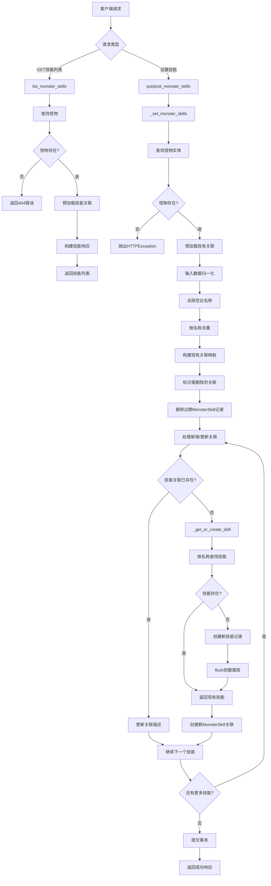

# 文件分析报告：server/app/routes/skills.py

## 文件概述

`server/app/routes/skills.py` 是一个专门负责怪物技能管理的API路由模块，提供了怪物技能的查询、设置和管理功能。该文件实现了怪物与技能的多对多关系管理，支持技能的自动创建、关联关系的批量操作，并通过MonsterSkill中间表记录额外的关联信息如描述和等级。

## 代码结构分析

### 导入依赖

```python
from __future__ import annotations
from typing import List, Optional, Dict
from fastapi import APIRouter, Depends, HTTPException, Body
from pydantic import BaseModel, Field
from sqlalchemy.orm import Session, selectinload, joinedload
from sqlalchemy import select, func
from ..db import SessionLocal
from ..models import Monster, Skill, MonsterSkill
```

**依赖分析：**
- **Web框架**: FastAPI用于构建REST API接口
- **数据验证**: Pydantic用于请求数据验证和Field约束
- **数据库**: SQLAlchemy用于ORM操作，支持预加载和连接查询
- **数据模型**: 涉及Monster、Skill、MonsterSkill三个核心实体

### 全局变量和常量

```python
router = APIRouter(prefix="", tags=["skills"])
```

### 配置和设置

- **路由前缀**: 无前缀，直接挂载
- **API标签**: `skills`
- **关系模型**: 多对多关系通过MonsterSkill中间表实现

## 函数详细分析

### 函数概览表

| 函数名 | 类型 | 主要功能 | 参数数量 | 返回类型 |
|--------|------|----------|----------|----------|
| `get_db` | 依赖函数 | 数据库会话管理 | 0 | Generator[Session] |
| `list_monster_skills` | API路由 | 获取怪物技能列表 | 2 | List[Dict] |
| `_get_or_create_skill` | 私有工具函数 | 按名称获取或创建技能 | 2 | Skill |
| `_set_monster_skills` | 私有工具函数 | 设置怪物技能集合 | 3 | None |
| `put_monster_skills` | API路由 | PUT方式设置技能 | 3 | Dict |
| `post_monster_skills` | API路由 | POST方式设置技能 | 3 | Dict |

### 函数详细说明

#### `get_db() -> Generator[Session]`
**功能**: FastAPI依赖注入的数据库会话管理器
**特点**: 标准的会话管理模式，确保资源正确释放

#### `list_monster_skills(monster_id: int, db: Session)`
**路径**: `GET /monsters/{monster_id}/skills`
**功能**: 获取指定怪物的技能列表，用于前端详情展示
**预加载策略**: 使用selectinload和joinedload避免N+1查询问题
**返回格式**:
- `id`: MonsterSkill关联ID
- `name`: 技能名称
- `element`: 技能属性（从Skill表获取）
- `kind`: 技能类型（从Skill表获取）
- `power`: 技能威力（从Skill表获取）
- `description`: 技能描述（优先使用MonsterSkill表的描述）

**关键修复**: 避免使用Monster.skills（association proxy），直接使用关系表加载

#### `_get_or_create_skill(db: Session, name: str) -> Skill`
**功能**: 根据技能名称查找或创建技能记录
**创建策略**: 
- 按名称查找现有技能
- 不存在则创建仅包含名称的基础技能记录
- 其他属性（element、kind、power等）留待后续爬虫或管理功能填充

#### `_set_monster_skills(db: Session, monster_id: int, payload: SkillSetIn)`
**功能**: 设置/覆盖怪物的技能集合，核心业务逻辑函数
**处理流程**:

1. **怪物验证**: 查找怪物实体，不存在则抛出404错误
2. **输入归一化**: 
   - 去除空白技能名称
   - 按名称去重（后出现的描述覆盖前者）
3. **现有关联分析**: 构建当前技能关联的名称映射
4. **删除过期关联**: 移除不在新列表中的技能关联
5. **新增/更新关联**: 
   - 存在的关联更新描述
   - 不存在的关联创建新的MonsterSkill记录
6. **事务提交**: 确保所有操作的原子性

**数据一致性**: 通过中间表MonsterSkill记录个性化信息（如描述），保持Skill表的通用性

#### `put_monster_skills()` & `post_monster_skills()`
**路径**: 
- `PUT /monsters/{monster_id}/skills`
- `POST /monsters/{monster_id}/skills`
**功能**: 设置怪物技能的公共API接口，支持PUT和POST两种HTTP方法
**处理**: 都调用`_set_monster_skills`执行实际逻辑
**返回**: 简单的成功确认 `{"ok": True}`

## 类详细分析

### 类概览表

| 类名 | 类型 | 主要功能 | 字段数量 | 继承关系 |
|------|------|----------|----------|----------|
| `SkillBasicIn` | Pydantic模型 | 单个技能输入 | 2 | BaseModel |
| `SkillSetIn` | Pydantic模型 | 技能集合输入 | 1 | BaseModel |

### 类详细说明

#### `SkillBasicIn`
**功能**: 定义单个技能的输入格式
**字段说明**:
- `name: str`: 技能名称，必填且最小长度为1
- `description: Optional[str]`: 技能描述，可选字段

**验证规则**: 使用Field验证确保技能名称非空

#### `SkillSetIn`
**功能**: 定义技能集合的输入格式
**字段说明**:
- `skills: List[SkillBasicIn]`: 技能列表

## 函数调用流程图



## 变量作用域分析

### 全局作用域
- `router`: FastAPI路由器实例，模块级共享

### 函数作用域
- **`list_monster_skills`**: 
  - `m`: Monster实体对象
  - `out`: 响应列表构建
  - `s`: Skill对象引用
- **`_set_monster_skills`**: 
  - `desired`: 归一化后的技能名称-描述映射
  - `existing_by_name`: 现有关联的名称映射
  - `to_delete`: 需要删除的MonsterSkill列表
- **`_get_or_create_skill`**: 
  - `sk`: Skill对象，查找或新创建

### 数据库会话作用域
- 通过FastAPI依赖注入管理
- 支持预加载优化和事务控制
- 自动处理会话生命周期

## 函数依赖关系

### 内部依赖关系
```
put_monster_skills → _set_monster_skills → _get_or_create_skill
post_monster_skills → _set_monster_skills → _get_or_create_skill
list_monster_skills → 数据库查询和预加载
所有API路由 → get_db (依赖注入)
```

### 外部依赖关系
1. **数据库层**: 
   - Monster、Skill、MonsterSkill模型的CRUD操作
   - 复杂关联查询和预加载优化
2. **FastAPI框架**: 
   - HTTP方法路由和参数绑定
   - 依赖注入和异常处理
3. **Pydantic**: 
   - 请求数据验证和序列化

### 数据流分析
```
HTTP请求 → 参数验证 → 业务逻辑处理 → 数据库操作 → 响应构建 → 返回客户端
```

## 数据模型关系分析

### 实体关系
- **Monster ↔ Skill**: 多对多关系
- **MonsterSkill**: 中间表，存储关联元数据
- **关联属性**: description（个性化描述）、selected（是否选中）、level（技能等级）

### 数据完整性
1. **技能唯一性**: Skill按名称唯一标识
2. **关联唯一性**: (monster_id, skill_id)组合唯一
3. **级联处理**: MonsterSkill删除不影响Skill实体
4. **数据分离**: 通用属性在Skill，个性化属性在MonsterSkill

## 性能分析

### 性能优化点
1. **预加载策略**: 使用selectinload和joinedload避免N+1问题
2. **批量操作**: 一次性处理整个技能集合
3. **去重优化**: 内存级别的名称去重减少数据库操作
4. **事务管理**: 合理的事务边界确保一致性

### 潜在性能瓶颈
1. **大量技能**: 怪物技能数量过多时的处理效率
2. **频繁更新**: 高频技能更新可能产生锁竞争
3. **查询复杂度**: 多表JOIN查询的复杂度

### 扩展性考虑
- **技能属性扩展**: 可在Skill表增加更多通用属性
- **关联元数据**: 可在MonsterSkill表增加更多个性化字段
- **缓存机制**: 可为频繁访问的技能数据添加缓存
- **分片策略**: 大数据量时可考虑分片存储

## 代码质量评估

### 优点
1. **关注分离**: 技能管理逻辑与其他模块解耦
2. **数据模型设计**: 合理的多对多关系和中间表设计
3. **错误处理**: 完善的HTTP异常处理
4. **代码复用**: PUT和POST接口复用核心逻辑
5. **性能优化**: 预加载策略和批量操作

### 改进建议
1. **输入验证**: 可增加技能名称的格式验证
2. **批量反馈**: 可提供更详细的操作结果反馈
3. **日志记录**: 可增加关键操作的日志记录
4. **API文档**: 可增加更详细的API使用示例

## 业务逻辑分析

### 核心业务规则
1. **技能自动创建**: 不存在的技能自动创建基础记录
2. **覆盖式更新**: 技能设置采用完全覆盖模式
3. **描述个性化**: 同一技能在不同怪物上可有不同描述
4. **原子性操作**: 技能集合更新保证事务完整性

### 业务场景支持
1. **怪物详情展示**: 支持前端显示完整技能信息
2. **技能配置管理**: 支持灵活的技能组合配置
3. **数据导入**: 支持批量导入和更新怪物技能
4. **个性化定制**: 支持针对特定怪物的技能描述定制

## 总结

`server/app/routes/skills.py` 是一个设计合理、功能完整的技能管理路由模块。它成功地实现了怪物与技能的多对多关系管理，通过中间表存储个性化信息，既保持了数据的通用性又支持了定制化需求。代码在性能优化、错误处理和业务逻辑方面都表现出色，为项目提供了稳定可靠的技能管理功能。