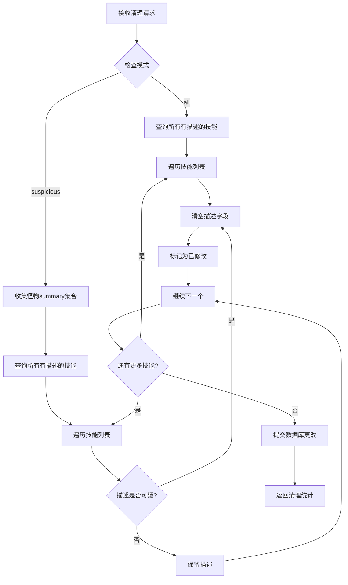
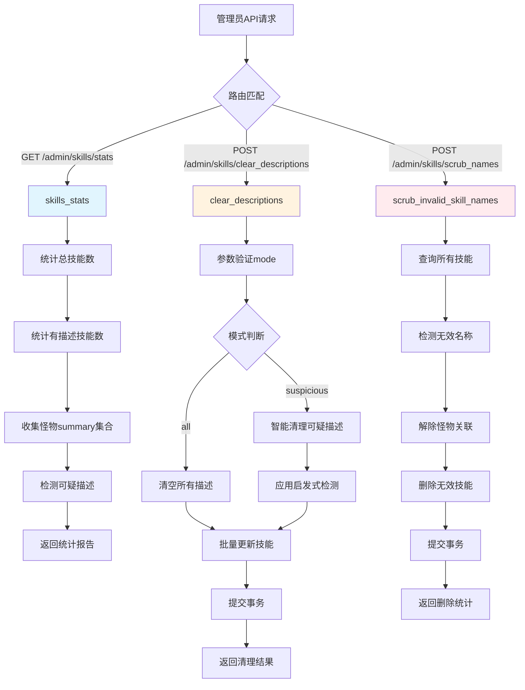

# 文件分析报告：server/app/routes/skills_admin.py

## 文件概述

`server/app/routes/skills_admin.py` 是专门用于技能数据管理和清理的管理员API路由模块。该文件提供了技能数据质量监控、自动化清理和维护功能，通过智能检测算法识别和清理无效的技能名称和疑似错误的技能描述，确保技能数据库的数据质量和一致性。设计注重数据完整性和管理效率，是数据维护工作流的重要组成部分。

## 代码结构分析

### 导入依赖

```python
from fastapi import APIRouter, Depends, Query
from sqlalchemy.orm import Session
from sqlalchemy import func
from ..db import SessionLocal
from ..models import Skill, Monster
import re
```

**依赖分析：**
- **Web框架**: FastAPI用于构建管理员API接口
- **数据库**: SQLAlchemy用于ORM操作和聚合查询
- **数据模型**: Skill和Monster模型用于技能数据管理
- **正则表达式**: re模块用于复杂的文本模式匹配和验证
- **参数控制**: Query用于API参数的模式匹配验证

### 全局变量和常量

```python
router = APIRouter()
TRIVIAL = {"", "0", "1", "-", "—", "无", "暂无", "null", "none", "n/a", "N/A"}
```

**常量分析：**
- `TRIVIAL`: 包含被视为无意义或占位符的字符串集合
- 涵盖多种语言和格式的空值表示
- 用于识别需要清理的低质量描述内容

### 配置和设置

- **管理员路径**: 所有端点都以`/admin`开头，表明管理员权限要求
- **数据质量检测**: 基于启发式算法的内容质量评估
- **批量处理**: 支持大量数据的批量清理操作

## 函数详细分析

### 函数概览表

| 函数名 | 类型 | 主要功能 | 参数数量 | 返回类型 |
|--------|------|----------|----------|----------|
| get_db | 依赖函数 | 数据库会话管理 | 0 | Generator[Session] |
| _invalid_name | 私有函数 | 检测无效技能名称 | 1 | bool |
| _is_suspicious_desc | 私有函数 | 检测可疑技能描述 | 2 | bool |
| skills_stats | GET路由 | 获取技能数据统计 | 1 | Dict |
| clear_descriptions | POST路由 | 清理技能描述 | 2 | Dict |
| scrub_invalid_skill_names | POST路由 | 清理无效技能名称 | 1 | Dict |

### 函数详细说明

#### `get_db() -> Generator[Session]`
**功能**: 标准的FastAPI数据库会话依赖注入管理器
**特点**: 确保数据库会话的正确创建、使用和清理

#### `_invalid_name(name: str) -> bool`
**功能**: 检测技能名称是否无效或无意义
**算法逻辑**:
1. 去除字符串前后空白字符
2. 检查是否为空字符串
3. 使用正则表达式 `r"[\d\-\—\s]+"` 检测是否只包含数字、破折号和空白字符
4. 返回True表示无效名称，需要清理

**实现细节**:
```python
def _invalid_name(name: str) -> bool:
    s = (name or "").strip()
    return (not s) or bool(re.fullmatch(r"[\d\-\—\s]+", s))
```

#### `_is_suspicious_desc(desc: str, summary_set: set[str]) -> bool`
**功能**: 智能检测技能描述是否可疑，需要清理
**检测策略**:
1. **空值检测**: 检查是否为空描述
2. **无意义内容**: 与TRIVIAL常量集合匹配
3. **重复内容**: 检查是否与任何怪物的summary完全相同
4. **内容质量**: 使用关键词启发式检测低质量描述

**启发式算法**:
```python
bad_kw = ("主攻", "辅助", "比较均衡", "可以", "不错", "非常", "克星", "种族值", "做一个", "生存能力")
# 包含坏关键词但不包含技能相关词汇的描述被标记为可疑
```

**技能相关正则**: `r"(命中|回合|几率|造成|伤害|提高|降低|免疫|状态|先手|消除|PP|倍|持续)"`

#### `skills_stats(db: Session) -> Dict`
**路径**: `GET /admin/skills/stats`
**功能**: 提供技能数据质量的全面统计报告
**统计指标**:
1. **总技能数**: 所有技能记录的总数
2. **有描述数**: 拥有非空描述的技能数量
3. **可疑描述数**: 通过启发式算法识别的可疑描述数量

**实现流程**:
1. 统计所有技能总数
2. 统计有描述的技能数
3. 收集所有怪物的summary用于重复检测
4. 遍历所有有描述的技能，应用可疑性检测算法
5. 返回统计结果

#### `clear_descriptions(mode: str, db: Session) -> Dict`
**路径**: `POST /admin/skills/clear_descriptions`
**功能**: 批量清理技能描述，支持不同清理模式
**参数**:
- `mode`: 清理模式，支持"suspicious"（推荐）或"all"，使用正则验证

**清理模式**:
1. **suspicious模式** (推荐):
   - 仅清理通过启发式算法检测为可疑的描述
   - 保留可能有用的技能描述
   - 更安全的清理策略

2. **all模式**:
   - 清空所有技能描述
   - 适用于准备重新导入CSV数据的场景
   - 需要谨慎使用

**处理流程**:


#### `scrub_invalid_skill_names(db: Session) -> Dict`
**路径**: `POST /admin/skills/scrub_names`
**功能**: 清理具有无效名称的技能记录
**清理策略**:
1. 查询所有技能记录
2. 使用`_invalid_name`函数检测每个技能名称
3. 对于无效名称的技能：
   - 清除所有怪物关联 (`s.monsters.clear()`)
   - 从数据库中删除技能记录
4. 提交更改并返回清理统计

**数据完整性保证**:
- 先解除关联关系再删除记录
- 避免外键约束冲突
- 原子性事务操作

## 类详细分析

### 类概览表

本文件不包含自定义类定义，主要使用SQLAlchemy模型和FastAPI组件。

## 函数调用流程图



## 变量作用域分析

### 全局作用域
- `router`: FastAPI路由器实例
- `TRIVIAL`: 无意义内容常量集合

### 函数作用域
- **统计函数**: 计数器变量和集合对象
- **清理函数**: 批量操作的循环变量和状态追踪
- **检测函数**: 字符串处理的临时变量

### 数据库会话作用域
- 通过依赖注入管理会话生命周期
- 支持事务的原子性操作
- 自动处理会话关闭和资源清理

## 函数依赖关系

### 内部依赖关系
```
skills_stats → _is_suspicious_desc
clear_descriptions → _is_suspicious_desc (suspicious模式)
scrub_invalid_skill_names → _invalid_name
所有路由函数 → get_db (依赖注入)
```

### 外部依赖关系
1. **数据库模型**:
   - Skill模型: 技能数据的CRUD操作
   - Monster模型: 获取summary数据进行重复检测
2. **SQLAlchemy**:
   - 聚合函数: func.count用于统计查询
   - ORM关系: 多对多关系的清理操作
3. **FastAPI框架**:
   - 路由管理和参数验证
   - 依赖注入系统

### 数据流分析
```
管理员请求 → 参数验证 → 数据查询 → 质量检测 → 批量处理 → 事务提交 → 结果反馈
```

## 错误处理和健壮性

### 数据安全机制
1. **关联清理**: 删除技能前先清除怪物关联
2. **事务控制**: 使用数据库事务确保操作原子性
3. **参数验证**: 通过正则表达式验证输入参数

### 异常处理考虑
- 数据库连接异常的自动处理
- 大量数据处理时的内存管理
- 并发访问时的数据一致性保护

## 性能分析

### 查询优化
1. **聚合查询**: 使用数据库原生COUNT函数提升统计性能
2. **批量操作**: 减少数据库往返次数
3. **内存优化**: 合理管理大数据集的内存使用

### 扩展性考虑
- 支持分页处理大量技能数据
- 可配置的清理策略和阈值
- 异步处理长时间运行的清理任务

## 业务价值分析

### 数据质量管理
1. **自动化清理**: 减少手动数据维护工作量
2. **质量监控**: 实时了解数据质量状况
3. **智能检测**: 基于启发式算法的精准识别

### 管理效率提升
- **批量处理**: 高效处理大量数据清理任务
- **多种模式**: 灵活的清理策略适应不同场景
- **统计报告**: 数据驱动的管理决策支持

## 代码质量评估

### 优点
1. **算法设计**: 智能的启发式检测算法
2. **数据完整性**: 完善的关联关系处理
3. **功能分离**: 私有函数职责单一，可复用性强
4. **安全性**: 多种清理模式和参数验证

### 改进建议
1. **异步处理**: 大量数据处理可考虑异步任务
2. **配置化**: 检测关键词和阈值可外部配置
3. **日志记录**: 增加详细的操作日志记录
4. **回滚机制**: 提供清理操作的回滚功能

## 安全性考虑

### 权限控制
- **管理员路径**: 通过路径前缀标识管理员功能
- **操作审计**: 记录重要的数据修改操作
- **参数验证**: 严格的输入参数格式控制

### 数据安全
- **批量删除保护**: 避免误删重要数据
- **关联完整性**: 保证数据库引用完整性
- **事务安全**: 确保操作的原子性和一致性

## 总结

`server/app/routes/skills_admin.py` 是一个功能完善、设计精良的数据管理模块。它成功地将启发式算法、批量处理和数据完整性保护结合在一起，为技能数据的质量管理提供了强大的工具支持。代码体现了对数据质量的深度理解和对管理效率的重视，是现代数据维护系统的优秀实现。