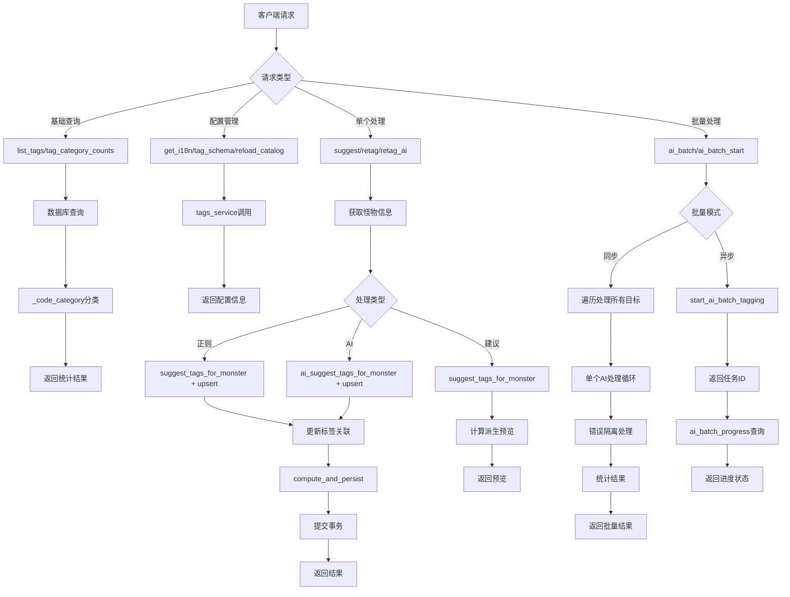

# 文件分析报告：server/app/routes/tags.py

## 文件概述

`server/app/routes/tags.py` 是一个综合性的标签管理API路由模块，负责处理怪物标签的自动识别、标注、批量处理和国际化功能。该文件集成了正则表达式匹配、AI智能识别、批量处理和多语言支持等高级功能，是项目中标签系统的核心控制层。

## 代码结构分析

### 导入依赖

```python
from __future__ import annotations
from fastapi import APIRouter, Depends, HTTPException, Query, Body
from sqlalchemy.orm import Session
from sqlalchemy import select, func
from pydantic import BaseModel
from typing import List, Dict, Optional
from ..db import SessionLocal
from ..models import Monster, Tag
from ..services.monsters_service import upsert_tags
from ..services.tags_service import (
    suggest_tags_for_monster, ai_suggest_tags_for_monster,
    start_ai_batch_tagging, get_ai_batch_progress, cancel_ai_batch,
    load_catalog, get_i18n_map
)
from ..services.derive_service import (
    compute_and_persist, compute_derived_out
)
```

**依赖分析：**
- **Web框架**: FastAPI用于构建REST API接口
- **数据库**: SQLAlchemy用于数据库操作和查询
- **数据模型**: Pydantic用于请求/响应数据验证
- **标签服务**: 依赖tags_service提供核心标签识别和处理功能
- **怪物服务**: 依赖monsters_service进行标签关联操作
- **派生服务**: 依赖derive_service计算怪物派生属性

### 全局变量和常量

```python
router = APIRouter(prefix="/tags", tags=["tags"])
```

### 配置和设置

- **路由前缀**: `/tags`
- **标签分类**: `增强类`、`削弱类`、`特殊类`
- **数据库会话管理**: 使用依赖注入模式

## 函数详细分析

### 函数概览表

| 函数名 | 类型 | 主要功能 | 参数数量 | 返回类型 |
|--------|------|----------|----------|----------|
| `get_db` | 依赖函数 | 数据库会话管理 | 0 | Generator[Session] |
| `_code_category` | 私有工具函数 | 标签代码分类 | 1 | str |
| `list_tags` | API路由 | 获取标签列表 | 2 | Dict |
| `tag_category_counts` | API路由 | 获取标签分类统计 | 1 | Dict |
| `get_i18n` | API路由 | 获取国际化映射 | 0 | Dict |
| `tag_schema` | API路由 | 获取标签架构 | 0 | Dict |
| `reload_catalog` | API路由 | 重新加载标签目录 | 0 | Dict |
| `suggest` | API路由 | 标签建议（不写库） | 2 | Dict |
| `retag` | API路由 | 正则标签识别并写库 | 2 | Dict |
| `retag_ai` | API路由 | AI标签识别并写库 | 2 | Dict |
| `ai_batch` | API路由 | 同步批量AI标签处理 | 2 | Dict |
| `ai_batch_start` | API路由 | 启动异步批量处理 | 1 | Dict |
| `ai_batch_progress` | API路由 | 查询批量处理进度 | 1 | Dict |
| `ai_batch_cancel` | API路由 | 取消批量处理 | 1 | Dict |

### 函数详细说明

#### `get_db() -> Generator[Session]`
**功能**: FastAPI依赖注入的数据库会话管理器
**核心逻辑**: 
- 创建数据库会话
- 使用生成器模式确保会话正确关闭
- 异常安全的资源管理

#### `_code_category(code: str) -> str`
**功能**: 根据标签代码前缀进行分类
**分类规则**:
- `buf_*` → "增强类"
- `deb_*` → "削弱类"  
- `util_*` → "特殊类"
- 其他 → "特殊类"

#### 基础API路由

**`list_tags(with_counts: bool, db: Session)`**
- **功能**: 获取所有标签的列表，可选包含统计信息
- **参数**: `with_counts` - 是否包含每个标签的使用次数
- **返回**: 标签代码列表或带统计的列表

**`tag_category_counts(db: Session)`**
- **功能**: 获取三大类标签的详细统计信息
- **返回**: 
  - `summary`: 各类别的总计数
  - `detail`: 每个标签的详细统计

**`get_i18n()`**
- **功能**: 获取标签代码到中文名称的映射
- **用途**: 支持前端多语言显示
- **数据源**: `tags_catalog.json`文件

**`tag_schema()`**
- **功能**: 返回标签的分类架构信息
- **返回**: 按类别组织的标签代码列表

**`reload_catalog()`**
- **功能**: 热重载标签目录配置
- **用途**: 支持运行时更新标签规则和国际化信息

#### 标签处理API路由

**`suggest(monster_id: int, db: Session)`**
- **功能**: 为指定怪物提供标签建议（仅预览，不写入数据库）
- **返回**: 
  - 建议的标签代码
  - 派生属性预览
  - 国际化映射

**`retag(monster_id: int, db: Session)`**
- **功能**: 使用正则表达式进行标签识别并写入数据库
- **流程**:
  1. 获取怪物信息
  2. 调用正则识别服务
  3. 更新怪物标签关联
  4. 计算并持久化派生属性
  5. 提交事务

**`retag_ai(monster_id: int, db: Session)`**
- **功能**: 使用AI模型进行标签识别并写入数据库
- **特色**: 
  - 内置审计和修复机制
  - 自由候选标签生成
  - 异常处理和错误恢复

#### 批量处理API路由

**`ai_batch(payload: BatchIds, db: Session)`**
- **功能**: 同步批量AI标签处理
- **特性**:
  - 支持指定怪物ID列表或处理全部怪物
  - 详细的成功/失败统计
  - 事务级别的错误隔离
  - 结果限制（最多200条详情）

**`ai_batch_start(body: BatchStartBody)`**
- **功能**: 启动异步批量处理任务
- **返回**: 任务ID用于后续进度查询

**`ai_batch_progress(job_id: str)`**
- **功能**: 查询异步批量任务的执行进度
- **支持**: 实时进度监控

**`ai_batch_cancel(job_id: str)`**
- **功能**: 取消正在执行的批量任务
- **容错**: 处理任务不存在或已完成的情况

## 类详细分析

### 类概览表

| 类名 | 类型 | 主要功能 | 字段数量 | 继承关系 |
|------|------|----------|----------|----------|
| `BatchIds` | Pydantic模型 | 批量处理怪物ID列表 | 1 | BaseModel |
| `BatchStartBody` | Pydantic模型 | 异步批量任务启动参数 | 1 | BaseModel |

### 类详细说明

#### `BatchIds`
**功能**: 定义批量操作的目标怪物ID列表
**字段说明**:
- `ids: Optional[List[int]]` - 怪物ID列表，为空时处理所有怪物

#### `BatchStartBody` 
**功能**: 异步批量任务的启动参数
**字段说明**:
- `ids: Optional[List[int]]` - 目标怪物ID列表

## 函数调用流程图



## 变量作用域分析

### 全局作用域
- `router`: FastAPI路由器实例，整个模块共享

### 函数作用域
- **`_code_category`**: 基于字符串前缀的简单分类逻辑
- **查询函数**: 数据库查询结果的临时存储
- **处理函数**: 怪物对象、标签列表、派生结果等业务数据
- **批量函数**: 
  - 循环计数器和统计变量
  - 错误处理的异常捕获
  - 详情列表的累积

### 数据库会话作用域
- 通过FastAPI依赖注入管理
- 自动处理会话生命周期
- 异常安全的资源清理

### 服务调用作用域
- `tags_service`: 标签识别和配置管理
- `monsters_service`: 标签关联操作
- `derive_service`: 派生属性计算

## 函数依赖关系

### 内部依赖关系
```
list_tags → _code_category
tag_category_counts → _code_category
suggest → compute_derived_out + get_i18n_map
retag → upsert_tags + compute_and_persist + get_i18n_map
retag_ai → upsert_tags + compute_and_persist + get_i18n_map
ai_batch → retag_ai逻辑 (批量版本)
```

### 外部服务依赖
1. **tags_service**: 
   - 正则和AI标签识别
   - 配置文件管理
   - 批量任务控制
   - 国际化支持

2. **monsters_service**: 
   - 标签关联的upsert操作

3. **derive_service**: 
   - 派生属性的计算和持久化

4. **数据库层**: 
   - Monster和Tag模型的CRUD操作
   - 复杂查询和统计分析

### 数据流分析
```
用户请求 → 参数验证 → 业务逻辑处理 → 服务层调用 → 数据库操作 → 结果聚合 → 响应返回
```

## 错误处理和健壮性

### 异常处理机制
1. **HTTP异常**: 使用FastAPI的HTTPException处理各种错误状态
2. **数据库异常**: 在批量操作中进行事务级别的错误隔离
3. **服务异常**: 捕获外部服务调用的RuntimeError
4. **参数验证**: 通过Pydantic模型自动验证请求参数

### 容错特性
- **数据库会话管理**: 自动处理会话生命周期
- **批量处理**: 单个失败不影响整体批次
- **任务管理**: 支持异步任务的启动、监控和取消
- **配置热更新**: 支持运行时重载配置而不影响服务

### 数据一致性
- **事务管理**: 标签更新和派生计算在同一事务中
- **关联完整性**: 确保怪物-标签关联的数据完整性
- **去重处理**: 防止重复标签的创建

## 性能分析

### 性能优化点
1. **批量查询**: 使用SQLAlchemy的批量查询减少数据库往返
2. **分页限制**: 批量操作结果限制在200条以内
3. **会话复用**: 在批量操作中复用数据库会话
4. **异步处理**: 提供异步批量处理选项

### 潜在性能瓶颈
1. **AI调用**: AI标签识别可能存在网络延迟
2. **同步批量**: 大量怪物的同步处理可能阻塞请求
3. **复杂查询**: 标签统计查询可能在大数据量时较慢
4. **配置重载**: 频繁的配置重载可能影响性能

### 扩展性考虑
- **缓存机制**: 可添加Redis缓存提升查询性能
- **队列系统**: 可引入消息队列优化批量处理
- **分布式处理**: 可支持分布式的标签识别任务

## 架构设计评估

### 设计优点
1. **分层架构**: 清晰的路由层、服务层、数据层分离
2. **功能完整**: 涵盖了标签管理的完整生命周期
3. **国际化支持**: 内置多语言支持机制
4. **批量优化**: 提供多种批量处理方案
5. **实时监控**: 支持异步任务的进度监控

### 扩展性分析
1. **新标签类型**: 通过配置文件可轻松添加新的标签类别
2. **新识别算法**: 服务层抽象支持插入新的识别方法
3. **新语言支持**: 国际化框架支持添加更多语言
4. **新批处理策略**: 模块化设计便于添加新的批处理方式

### 维护性评估
1. **代码组织**: 功能分组清晰，职责划分明确
2. **配置外化**: 标签规则和国际化信息外部化配置
3. **错误处理**: 完善的异常处理和错误信息
4. **文档支持**: 详细的API文档和函数说明

## 代码质量评估

### 优点
1. **类型注解**: 完整的类型提示提升代码可读性
2. **文档完善**: 所有API端点都有详细的docstring
3. **错误处理**: 全面的异常处理和错误恢复机制
4. **代码复用**: 合理的函数抽象和代码复用
5. **标准遵循**: 遵循FastAPI和Python的最佳实践

### 改进建议
1. **单元测试**: 需要增加全面的单元测试覆盖
2. **性能监控**: 可添加性能指标和监控机制
3. **日志增强**: 可增加更详细的操作日志
4. **API版本**: 考虑添加API版本管理机制

## 安全性考虑

### 安全特性
1. **参数验证**: 通过Pydantic严格验证输入参数
2. **SQL注入防护**: 使用SQLAlchemy ORM防止SQL注入
3. **会话管理**: 安全的数据库会话管理
4. **异常隔离**: 错误信息不暴露敏感内部信息

### 潜在安全风险
1. **批量操作**: 大批量操作可能被恶意利用导致资源耗尽
2. **AI调用**: AI服务调用可能存在外部依赖风险
3. **配置热更新**: 配置重载功能需要适当的权限控制

## 总结

`server/app/routes/tags.py` 是一个功能丰富、设计完善的标签管理系统。它不仅提供了基础的标签CRUD操作，还集成了先进的AI识别、批量处理、国际化支持等高级功能。代码架构清晰，职责分离良好，具备优秀的扩展性和维护性。该模块是项目中标签系统的核心控制器，为整个应用提供了强大的标签管理能力。