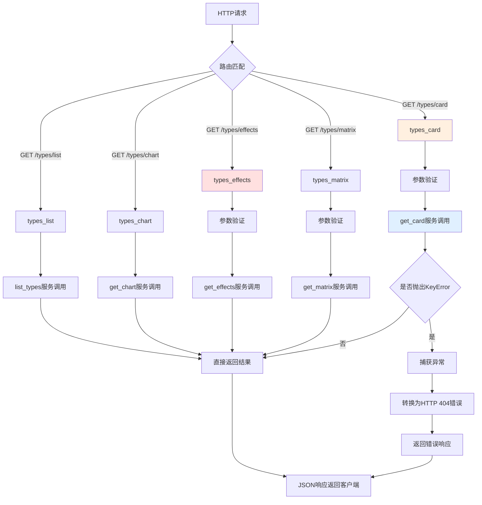

# 文件分析报告：server/app/routes/types.py

## 文件概述

`server/app/routes/types.py` 是专门处理怪物属性相克系统的API路由模块，提供全面的属性相克查询、对战分析和效果计算功能。该文件作为游戏战斗系统的核心组件，实现了属性克制关系的多维度查询，支持攻防视角切换、排序筛选和详细的相克矩阵展示，为游戏策略分析提供重要的数据支持。

## 代码结构分析

### 导入依赖

```python
from fastapi import APIRouter, Query, HTTPException
from ..services.types_service import (
    get_chart, get_effects, get_card, get_matrix, list_types
)
```

**依赖分析：**
- **Web框架**: FastAPI用于构建REST API接口和参数验证
- **异常处理**: HTTPException用于标准HTTP错误响应
- **服务层**: types_service提供所有属性相克业务逻辑的实现
- **参数验证**: Query用于URL参数的类型验证和格式约束

### 全局变量和常量

```python
router = APIRouter()
```

### 配置和设置

- **路由前缀**: 所有端点以`/types`开头
- **服务层分离**: 业务逻辑完全委托给types_service处理
- **参数验证**: 使用正则表达式模式验证输入参数格式

## 函数详细分析

### 函数概览表

| 函数名 | HTTP方法 | 路径 | 主要功能 | 复杂度 |
|--------|----------|------|----------|--------|
| types_list | GET | /types/list | 获取所有属性类型列表 | 低 |
| types_chart | GET | /types/chart | 获取属性相克关系图表 | 低 |
| types_effects | GET | /types/effects | 查询属性相克效果详情 | 中 |
| types_card | GET | /types/card | 获取单个属性的相克卡片 | 中 |
| types_matrix | GET | /types/matrix | 获取完整相克关系矩阵 | 低 |

### 函数详细说明

#### `types_list() -> Dict`
**路径**: `GET /types/list`
**功能**: 获取游戏中所有可用的属性类型列表
**返回格式**: `{"types": [...]}` 包含所有属性名称的列表
**用途**: 为前端提供属性选择器的数据源，支持下拉菜单和筛选功能

#### `types_chart() -> Dict`
**路径**: `GET /types/chart`
**功能**: 获取属性相克关系的图表数据
**特点**: 适用于可视化展示，提供图表组件所需的数据结构
**应用场景**: 属性关系的图形化展示，如网状图、关系图等

#### `types_effects(vs: str, perspective: str, sort: str) -> Dict`
**路径**: `GET /types/effects`
**功能**: 查询指定属性在特定视角下的相克效果详情
**参数详解**:
- `vs`: 对方属性类型（必需参数）
- `perspective`: 分析视角，支持"attack"（攻击）或"defense"（防御），默认"attack"
- `sort`: 排序方式，支持"asc"（升序）或"desc"（降序），可选参数

**业务逻辑**:
- **攻击视角**: 查询我方属性对指定属性的克制效果
- **防御视角**: 查询指定属性对我方各属性的克制效果
- **排序功能**: 按相克倍率对结果进行排序

**参数验证**:
```python
perspective: str = Query("attack", pattern="^(attack|defense)$")
sort: str | None = Query(None, pattern="^(asc|desc)$")
```

#### `types_card(self_type: str) -> Dict`
**路径**: `GET /types/card`
**功能**: 获取指定属性的详细相克卡片信息
**参数**: `self_type` - 我方属性类型（必需）
**异常处理**: 当属性类型不存在时，捕获KeyError并返回404错误
**返回**: 包含该属性完整相克关系的卡片数据

**错误处理模式**:
```python
try:
    return get_card(self_type)
except KeyError as e:
    raise HTTPException(404, str(e))
```

#### `types_matrix(perspective: str) -> Dict`
**路径**: `GET /types/matrix`
**功能**: 获取完整的属性相克关系矩阵
**参数**: `perspective` - 矩阵视角（"attack"或"defense"），默认"attack"
**用途**: 生成完整的相克关系表格，支持全面的属性分析

## 类详细分析

### 类概览表

本文件不包含自定义类定义，仅使用FastAPI的内置组件和类型注解。

## 函数调用流程图



## 变量作用域分析

### 全局作用域
- `router`: FastAPI路由器实例，模块级共享

### 函数作用域
- **参数验证作用域**: Query参数在函数签名中定义，具有函数作用域
- **异常处理作用域**: try-except块中的变量（如`e`）具有块级作用域
- **服务调用结果**: 各函数中调用服务层返回的数据对象

### 参数约束作用域
- Query参数的pattern验证在FastAPI框架层面生效
- 类型注解在运行时进行验证和转换

## 函数依赖关系

### 内部依赖关系
```
所有路由函数 → types_service模块中对应函数
types_card → HTTPException (异常处理)
参数验证 → FastAPI Query组件
```

### 外部依赖关系
1. **服务层依赖**:
   - `list_types`: 获取属性类型列表
   - `get_chart`: 生成关系图表数据
   - `get_effects`: 计算相克效果
   - `get_card`: 构建属性卡片
   - `get_matrix`: 生成相克矩阵

2. **FastAPI框架**:
   - APIRouter: 路由管理
   - Query: 参数验证和约束
   - HTTPException: 标准HTTP错误处理

3. **数据流模式**:
```
HTTP请求 → 参数验证 → 服务层调用 → 业务逻辑处理 → 数据返回 → JSON响应
```

## 错误处理分析

### 异常处理策略
1. **KeyError处理**: 在`types_card`函数中专门处理属性不存在的情况
2. **参数验证**: 通过Query的pattern参数进行格式验证
3. **HTTP状态码**: 使用标准的404状态码表示资源不存在

### 错误响应格式
- **404错误**: 当属性类型不存在时返回HTTP 404
- **422错误**: 参数格式不正确时由FastAPI自动处理
- **错误信息**: 将具体的KeyError信息传递给客户端

## 性能分析

### 查询性能特点
1. **轻量级路由**: 路由函数仅负责参数处理和服务调用
2. **服务层优化**: 实际的性能优化在types_service层实现
3. **无状态设计**: 路由函数无状态，支持高并发访问
4. **参数验证开销**: FastAPI参数验证的轻微性能开销

### 缓存友好性
- 属性相克关系相对静态，适合在服务层或客户端缓存
- GET请求支持HTTP缓存机制
- 无副作用操作，缓存安全性高

## 扩展性评估

### 优势
1. **服务层分离**: 业务逻辑与路由处理分离，便于扩展
2. **标准化接口**: RESTful API设计，易于客户端集成
3. **参数化查询**: 支持多种查询参数组合
4. **错误处理完善**: 标准的异常处理模式

### 扩展点
1. **新的查询维度**: 可添加更多查询参数和筛选条件
2. **批量查询**: 可支持多属性的批量相克查询
3. **高级分析**: 可扩展战斗模拟、推荐配队等功能
4. **国际化支持**: 可支持多语言的属性名称返回

## 业务价值分析

### 核心功能价值
1. **战斗策略**: 为玩家提供属性相克的核心数据支持
2. **队伍配置**: 支持基于属性相克的队伍搭配分析
3. **游戏平衡**: 为游戏设计师提供属性系统的数据洞察
4. **用户体验**: 通过多视角查询满足不同用户需求

### 应用场景
- **战斗准备**: 玩家查询对手属性的克制关系
- **策略规划**: 基于属性相克制定长期战斗策略  
- **教学系统**: 新手了解游戏的属性相克机制
- **数据分析**: 分析属性分布和平衡性

## 代码质量评估

### 优点
1. **职责清晰**: 路由层专注于HTTP处理，业务逻辑分离
2. **参数验证**: 完善的输入参数格式验证
3. **异常处理**: 合理的错误处理和HTTP状态码使用
4. **代码简洁**: 函数实现简洁明了，可读性高

### 改进建议
1. **统一异常处理**: 可考虑为所有函数添加统一的异常处理装饰器
2. **参数文档**: 可增加更详细的参数说明和示例
3. **返回格式**: 可标准化所有端点的返回格式结构
4. **版本控制**: 为API接口增加版本控制支持

## 安全性考虑

### 安全特性
1. **输入验证**: 使用正则表达式严格验证输入格式
2. **只读操作**: 所有操作都是只读查询，无数据修改风险
3. **错误信息控制**: 不暴露敏感的内部系统信息

### 潜在风险
1. **信息泄露**: 属性系统信息可能被恶意分析
2. **拒绝服务**: 复杂查询可能消耗大量计算资源
3. **参数注入**: 需要确保服务层对参数进行充分验证

## 总结

`server/app/routes/types.py` 是一个设计优良的属性系统API模块，成功实现了游戏属性相克系统的全面查询功能。代码结构清晰，职责分离良好，参数验证完善，为游戏的战斗系统和用户体验提供了坚实的基础支持。该模块体现了现代API设计的最佳实践，具有良好的扩展性和维护性。