# 文件分析报告：server/app/routes/utils.py

## 文件概述

`server/app/routes/utils.py` 是提供数据修复和维护功能的工具API路由模块。该文件实现了专门的数据迁移和修复工具，主要功能是将存储在怪物JSON字段中的原始六维属性数据回填到对应的数据库表字段中，并自动重新计算派生属性。设计用于解决数据结构演化过程中的历史数据兼容性问题。

## 代码结构分析

### 导入依赖

```python
from fastapi import APIRouter, Depends
from sqlalchemy.orm import Session
from sqlalchemy import select
from ..db import SessionLocal
from ..models import Monster
from ..services.derive_service import compute_and_persist
```

**依赖分析：**
- **Web框架**: FastAPI用于构建数据维护API接口
- **数据库**: SQLAlchemy用于ORM操作和数据查询
- **数据模型**: Monster模型用于怪物数据的读取和更新
- **业务服务**: derive_service用于派生属性的重新计算

### 全局变量和常量

```python
router = APIRouter()
```

### 配置和设置

- **工具性质**: 专门用于数据维护和修复的工具端点
- **原子性操作**: 支持批量处理，确保数据一致性
- **幂等性设计**: 多次执行相同操作不会产生副作用

## 函数详细分析

### 函数概览表

| 函数名 | 类型 | 主要功能 | 参数数量 | 返回类型 |
|--------|------|----------|----------|----------|
| get_db | 依赖函数 | 数据库会话管理 | 0 | Generator[Session] |
| backfill_raw_to_columns | POST路由 | 回填原始属性到表字段 | 1 | Dict |
| need | 内嵌函数 | 检测字段是否需要回填 | 1 | bool |

### 函数详细说明

#### `get_db() -> Generator[Session]`
**功能**: 标准的FastAPI数据库会话依赖注入管理器
**特点**: 确保数据库资源的正确管理和清理

#### `backfill_raw_to_columns(db: Session) -> Dict`
**路径**: `POST /utils/backfill_raw_to_columns`
**功能**: 将存储在`explain_json.raw_stats`中的原始属性数据回填到Monster表的对应字段中

**业务背景**:
- 解决数据结构演化过程中的历史数据问题
- 将JSON存储的属性数据迁移到专门的表字段
- 确保数据的规范化和查询性能

**处理流程**:
1. **数据获取**: 查询所有怪物记录
2. **数据提取**: 从`explain_json.raw_stats`提取原始六维数据
3. **条件判断**: 仅在表字段缺失或为0时进行回填
4. **数据回填**: 将JSON数据写入对应的表字段
5. **派生计算**: 自动重新计算派生属性
6. **统计反馈**: 返回处理的记录数量

**六维属性映射**:
```python
# JSON字段 → 表字段映射
raw["hp"]      → m.hp
raw["speed"]   → m.speed  
raw["attack"]  → m.attack
raw["defense"] → m.defense
raw["magic"]   → m.magic
raw["resist"]  → m.resist
```

#### `need(v) -> bool` (内嵌函数)
**功能**: 检测字段值是否需要回填
**判断逻辑**:
1. 字段值为None（未设置）
2. 字段值为0.0（空值或默认值）
3. 类型转换异常时返回True（数据格式问题）

**实现细节**:
```python
def need(v): 
    try: 
        return v is None or float(v) == 0.0
    except: 
        return True
```

**容错机制**: 通过try-except处理类型转换异常，确保健壮性

## 类详细分析

### 类概览表

本文件不包含自定义类定义，仅使用SQLAlchemy模型和FastAPI组件。

## 函数调用流程图

```mermaid
graph TD
    A[POST /utils/backfill_raw_to_columns] --> B[获取数据库会话]
    B --> C[查询所有Monster记录]
    C --> D[初始化touched计数器]
    D --> E[遍历怪物列表]
    
    E --> F[获取explain_json数据]
    F --> G[提取raw_stats字典]
    G --> H[初始化changed标志]
    
    H --> I{是否有raw_stats数据?}
    I -->|否| S[继续下一个怪物]
    I -->|是| J[检查hp字段]
    
    J --> K{hp需要回填?}
    K -->|是| L[回填hp值，设置changed=True]
    K -->|否| M[检查speed字段]
    L --> M
    
    M --> N{speed需要回填?}
    N -->|是| O[回填speed值]
    N -->|否| P[检查attack字段]
    O --> P
    
    P --> Q{attack需要回填?}
    Q -->|是| R[回填attack值]
    Q -->|否| T[检查defense字段]
    R --> T
    
    T --> U{defense需要回填?}
    U -->|是| V[回填defense值]
    U -->|否| W[检查magic字段]
    V --> W
    
    W --> X{magic需要回填?}
    X -->|是| Y[回填magic值]
    X -->|否| Z[检查resist字段]
    Y --> Z
    
    Z --> AA{resist需要回填?}
    AA -->|是| BB[回填resist值]
    AA -->|否| CC{changed标志是否为True?}
    BB --> CC
    
    CC -->|是| DD[调用compute_and_persist重算派生属性]
    CC -->|否| S
    DD --> EE[touched计数器加1]
    EE --> S
    
    S --> FF{还有更多怪物?}
    FF -->|是| E
    FF -->|否| GG[提交数据库事务]
    GG --> HH[返回updated_rows统计]
    
    style A fill:#e3f2fd
    style DD fill:#fff3e0
    style HH fill:#e8f5e8
```



## 变量作用域分析

### 全局作用域
- `router`: FastAPI路由器实例，模块级共享

### 函数作用域
- **`backfill_raw_to_columns`**:
  - `mons`: 所有怪物记录的列表
  - `touched`: 成功处理的记录计数器
  - 循环变量`m`: 当前处理的怪物实例

### 循环作用域
- **怪物遍历循环**:
  - `ex`: 当前怪物的explain_json数据
  - `raw`: 原始属性字典
  - `changed`: 当前记录是否被修改的标志

### 内嵌函数作用域
- **`need`函数**: 参数`v`和异常处理的局部作用域

## 函数依赖关系

### 内部依赖关系
```
backfill_raw_to_columns → get_db (依赖注入)
backfill_raw_to_columns → need (内嵌函数)
backfill_raw_to_columns → compute_and_persist (派生计算)
```

### 外部依赖关系
1. **数据库层**:
   - Monster模型: 怪物数据的读取和更新操作
   - SQLAlchemy会话: 事务管理和数据持久化
2. **业务服务层**:
   - derive_service.compute_and_persist: 派生属性计算
3. **FastAPI框架**:
   - 路由管理和依赖注入系统
   - HTTP响应的自动序列化

### 数据流分析
```
HTTP请求 → 数据库查询 → JSON数据提取 → 字段检查 → 数据回填 → 派生计算 → 事务提交 → 统计返回
```

## 错误处理和健壮性

### 健壮性设计
1. **安全转换**: 使用try-except处理float()类型转换异常
2. **条件回填**: 仅在字段缺失或为0时进行回填，避免覆盖有效数据
3. **原子性操作**: 整个批量处理在单个事务中完成
4. **幂等性**: 多次执行不会产生不同结果

### 数据完整性保护
```python
# 安全的数据检查和回填
if need(m.hp) and raw.get("hp") is not None: 
    m.hp = float(raw["hp"])
    changed = True
```

### 异常处理模式
- 类型转换异常通过need函数内部处理
- 数据库事务异常由SQLAlchemy自动处理
- 派生计算异常由compute_and_persist函数处理

## 性能分析

### 性能特点
1. **批量处理**: 一次查询所有记录，减少数据库往返
2. **条件更新**: 仅更新需要修改的字段和记录
3. **单次事务**: 整个操作在一个事务中完成，提高效率
4. **内存使用**: 一次性加载所有怪物数据，需要考虑内存消耗

### 性能优化建议
```python
# 可考虑的优化方案
def backfill_raw_to_columns_optimized(db: Session):
    # 分批处理，减少内存使用
    batch_size = 100
    offset = 0
    touched = 0
    
    while True:
        mons = db.scalars(select(Monster).offset(offset).limit(batch_size)).all()
        if not mons:
            break
        # 处理当前批次...
        offset += batch_size
        
    return {"updated_rows": touched}
```

## 数据迁移分析

### 迁移场景
1. **结构演化**: 从JSON存储迁移到专门字段
2. **性能优化**: 提高属性查询和索引性能
3. **数据规范化**: 统一数据存储格式
4. **历史修复**: 修复历史数据不一致问题

### 迁移策略
- **非破坏性**: 不删除原有JSON数据
- **条件性**: 仅在必要时进行回填
- **验证性**: 通过派生属性重计算验证数据正确性

## 业务价值分析

### 核心价值
1. **数据一致性**: 确保存储格式的统一和规范
2. **查询性能**: 提升基于属性的查询和筛选性能
3. **维护效率**: 自动化的数据修复和迁移工具
4. **质量保证**: 通过派生属性重计算确保数据准确性

### 应用场景
- **系统升级**: 数据库结构变更后的数据迁移
- **数据修复**: 修复数据导入或处理过程中的不一致
- **性能优化**: 为查询优化准备规范化数据
- **质量控制**: 定期的数据一致性检查和修复

## 代码质量评估

### 优点
1. **职责明确**: 专注于数据回填的单一功能
2. **健壮性强**: 完善的异常处理和条件检查
3. **幂等设计**: 安全的重复执行特性
4. **集成良好**: 与派生属性计算服务的良好集成

### 改进建议
1. **分批处理**: 支持大量数据的分批处理
2. **进度反馈**: 提供处理进度的实时反馈
3. **回滚机制**: 增加操作失败时的回滚功能
4. **日志记录**: 记录详细的处理日志便于问题排查

## 安全性考虑

### 数据安全
1. **条件回填**: 避免覆盖现有有效数据
2. **类型验证**: 安全的数据类型转换
3. **事务保护**: 确保操作的原子性
4. **权限控制**: 作为工具API需要适当的权限控制

### 操作安全
- **预检查机制**: 在实际修改前进行数据有效性检查
- **统计反馈**: 提供操作结果的详细统计信息
- **无副作用**: 设计为幂等操作，避免重复执行问题

## 总结

`server/app/routes/utils.py` 是一个专业的数据维护工具模块，成功地解决了数据结构演化过程中的历史数据兼容性问题。代码设计体现了对数据完整性和系统健壮性的深度考虑，通过条件回填、异常处理和派生计算集成，提供了安全可靠的数据迁移解决方案。该模块是现代数据管理系统中不可或缺的维护工具组件。