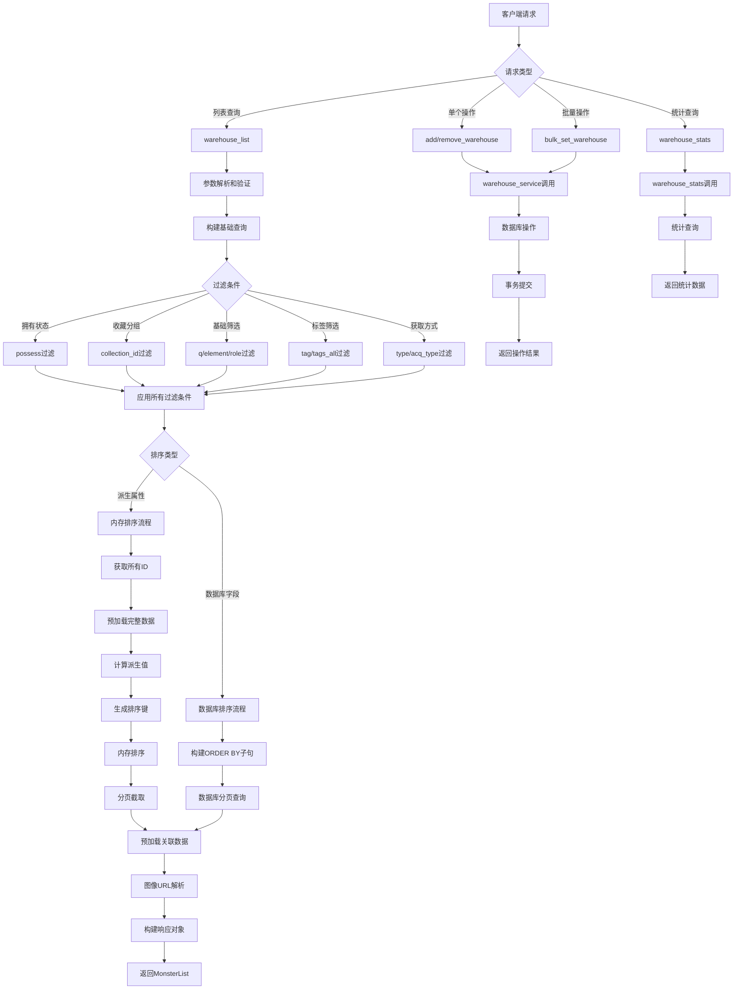

# 文件分析报告：server/app/routes/warehouse.py

## 文件概述

`server/app/routes/warehouse.py` 是一个高级怪物仓库管理API路由模块，实现了复杂的怪物列表查询、排序、过滤和仓库状态管理功能。该文件支持多维度过滤条件、高级排序算法（包括派生属性排序）、图像解析集成以及完善的拥有状态管理，是项目中怪物数据展示和管理的核心接口。

## 代码结构分析

### 导入依赖

```python
from __future__ import annotations
from typing import Optional, List, Tuple
from fastapi import APIRouter, Depends, HTTPException, Body, Query
from pydantic import BaseModel
from sqlalchemy.orm import Session, selectinload
from sqlalchemy import select, func, or_, desc, asc
from ..db import SessionLocal
from ..models import Monster, MonsterSkill, Tag, CollectionItem, MonsterDerived
from ..schemas import MonsterOut, MonsterList
from ..services.warehouse_service import (
    add_to_warehouse, remove_from_warehouse, bulk_set_warehouse,
    list_warehouse, warehouse_stats,
)
from ..services.derive_service import compute_derived_out
from ..services.image_service import get_image_resolver
```

**依赖分析：**
- **Web框架**: FastAPI用于构建REST API接口
- **数据库**: SQLAlchemy用于复杂查询和ORM操作
- **数据模型**: Pydantic用于请求/响应数据验证
- **服务层**: warehouse_service、derive_service、image_service提供核心功能
- **数据模型**: 涉及Monster、Tag、CollectionItem等多个实体

### 全局变量和常量

```python
router = APIRouter()
LEGACY_FALLBACK = {
    "body_defense": "survive",
    "special_tactics": "pp_pressure",
}
```

### 配置和设置

- **路由配置**: 无前缀，直接挂载
- **派生属性兼容**: 新旧键映射支持向后兼容
- **排序支持**: 支持六维、派生属性、总和等多种排序方式

## 函数详细分析

### 函数概览表

| 函数名 | 类型 | 主要功能 | 参数数量 | 返回类型 |
|--------|------|----------|----------|----------|
| `get_db` | 依赖函数 | 数据库会话管理 | 0 | Generator[Session] |
| `pick_derived_value` | 工具函数 | 派生值提取和兼容处理 | 2 | Optional[float] |
| `enrich_new_keys` | 工具函数 | 新键补全 | 1 | dict |
| `sort_key_for` | 工具函数 | 排序键生成 | 3 | Tuple |
| `warehouse_list` | API路由 | 仓库列表查询 | 13 | MonsterList |
| `api_add_to_warehouse` | API路由 | 单个添加到仓库 | 2 | Dict |
| `api_remove_from_warehouse` | API路由 | 单个从仓库移除 | 2 | Dict |
| `api_bulk_set` | API路由 | 批量设置仓库状态 | 2 | Dict |
| `api_warehouse_stats` | API路由 | 仓库统计信息 | 1 | Dict |

### 函数详细说明

#### `get_db() -> Generator[Session]`
**功能**: FastAPI依赖注入的数据库会话管理器
**特点**: 使用生成器模式确保资源正确释放

#### `pick_derived_value(d: dict, key: str) -> Optional[float]`
**功能**: 从派生数据中提取值，支持新旧键兼容
**核心逻辑**:
- 优先使用新键名获取数据
- 如果新键不存在，回退到旧键名
- 返回数值类型或None

#### `enrich_new_keys(d: dict) -> dict`
**功能**: 为缺失的新键补充旧键的值
**用途**: 确保前端能够访问到完整的派生数据结构

#### `sort_key_for(val: Optional[float], mid: int, is_asc: bool) -> Tuple`
**功能**: 生成用于排序的复合键
**排序策略**:
- **升序**: NULL值在前，有值在后
- **降序**: NULL值在后，有值在前  
- **二级排序**: 按ID升序保证稳定排序

#### `warehouse_list()` - 核心API路由
**功能**: 高级怪物仓库列表查询接口
**支持的查询参数**:

| 参数类型 | 参数名 | 功能描述 |
|----------|--------|----------|
| 拥有状态 | `possess` | True=已拥有, False=未拥有, None=全部 |
| 基础过滤 | `q`, `element`, `role` | 名称、属性、角色筛选 |
| 标签过滤 | `tag`, `tags_all` | 单标签或多标签AND筛选 |
| 获取方式 | `type`, `acq_type` | 获取渠道过滤 |
| 收藏分组 | `collection_id` | 按收藏分组筛选 |
| 排序控制 | `sort`, `order` | 多维排序支持 |
| 分页控制 | `page`, `page_size` | 分页查询 |

**支持的排序字段**:
1. **新五轴派生**: body_defense, body_resist, debuff_def_res, debuff_atk_mag, special_tactics
2. **六维属性**: hp, speed, attack, defense, magic, resist  
3. **六维总和**: raw_sum
4. **基础字段**: name, element, role, updated_at, created_at

**排序算法分析**:
- **派生属性排序**: 使用内存排序，支持NULL值处理和兼容性回退
- **数据库排序**: 六维和基础字段直接使用数据库排序
- **混合策略**: 根据排序字段自动选择最优排序方式

#### 仓库管理API路由

**`api_add_to_warehouse(payload: IdIn, db: Session)`**
- **功能**: 将指定怪物添加到仓库
- **流程**: 调用warehouse_service → 提交事务 → 返回结果

**`api_remove_from_warehouse(payload: IdIn, db: Session)`**  
- **功能**: 将指定怪物从仓库移除
- **流程**: 调用warehouse_service → 提交事务 → 返回结果

**`api_bulk_set(payload: BulkSetIn, db: Session)`**
- **功能**: 批量设置怪物的仓库状态
- **支持**: 批量添加或移除操作

**`api_warehouse_stats(db: Session)`**
- **功能**: 获取仓库统计信息
- **返回**: total, owned_total, not_owned_total, in_warehouse等统计数据

## 类详细分析

### 类概览表

| 类名 | 类型 | 主要功能 | 字段数量 | 继承关系 |
|------|------|----------|----------|----------|
| `IdIn` | Pydantic模型 | 单个ID输入 | 1 | BaseModel |
| `BulkSetIn` | Pydantic模型 | 批量设置输入 | 2 | BaseModel |

### 类详细说明

#### `IdIn`
**功能**: 定义单个怪物操作的请求参数
**字段**: `id: int` - 目标怪物ID

#### `BulkSetIn`
**功能**: 定义批量仓库操作的请求参数
**字段说明**:
- `ids: List[int]` - 目标怪物ID列表
- `possess: bool = True` - 设置的拥有状态

## 函数调用流程图



## 变量作用域分析

### 全局作用域
- `router`: FastAPI路由器实例
- `LEGACY_FALLBACK`: 派生属性键映射配置

### 函数作用域
- **`warehouse_list`**: 
  - 复杂的查询构建变量
  - 排序配置映射
  - 分页计算变量
  - 响应构建循环变量
- **工具函数**: 局部计算和转换变量
- **其他API函数**: 简单的请求处理变量

### 数据库会话作用域
- 通过依赖注入管理
- 自动处理事务边界
- 预加载优化避免N+1问题

## 函数依赖关系

### 内部依赖关系
```
warehouse_list → pick_derived_value, enrich_new_keys, sort_key_for
warehouse_list → compute_derived_out (服务层)
所有API路由 → get_db (依赖注入)
```

### 外部服务依赖
1. **warehouse_service**: 
   - 仓库状态管理
   - 批量操作处理
   - 统计信息计算

2. **derive_service**: 
   - 派生属性计算
   - 兼容性处理

3. **image_service**: 
   - 图像URL解析
   - 多名称匹配策略

4. **数据库层**: 
   - 复杂查询构建
   - 关联数据预加载
   - 分页和排序优化

### 数据流分析
```
请求参数 → 查询构建 → 过滤应用 → 排序处理 → 分页执行 → 数据预加载 → 派生计算 → 图像解析 → 响应构建
```

## 高级功能分析

### 排序算法优化
1. **智能策略选择**: 根据排序字段自动选择数据库或内存排序
2. **NULL值处理**: 统一的NULL值排序逻辑
3. **稳定排序**: 使用ID作为二级排序键保证稳定性
4. **兼容性支持**: 新旧派生字段的无缝切换

### 查询优化技术
1. **预加载策略**: 使用selectinload避免N+1问题
2. **分页优化**: 先计数后查询的分页策略
3. **索引利用**: 合理构建WHERE和ORDER BY子句
4. **内存管理**: 大结果集的分批处理

### 过滤系统设计
1. **多维度过滤**: 支持多种过滤条件的组合
2. **标签系统**: 单标签和多标签AND查询
3. **收藏集成**: 与收藏系统的深度集成
4. **模糊匹配**: 支持名称和获取方式的模糊搜索

## 性能分析

### 性能优化点
1. **查询优化**: 智能选择排序策略减少数据库负载
2. **预加载**: 批量加载关联数据避免重复查询
3. **分页**: 高效的分页实现控制内存使用
4. **缓存友好**: ETag支持HTTP缓存

### 潜在性能瓶颈
1. **派生排序**: 大数据集的内存排序可能较慢
2. **复杂过滤**: 多重条件组合可能影响查询效率
3. **图像解析**: 批量图像URL解析的I/O开销
4. **关联查询**: 深度关联可能产生复杂的JOIN操作

### 扩展性考虑
- **缓存层**: 可添加Redis缓存热点查询结果
- **搜索引擎**: 可集成Elasticsearch处理复杂搜索
- **分片策略**: 大数据量时可考虑数据分片
- **异步处理**: 复杂排序可考虑异步处理

## 代码质量评估

### 优点
1. **功能完整**: 涵盖了仓库管理的完整需求
2. **架构清晰**: 分层设计，职责明确
3. **兼容性好**: 新旧字段的平滑过渡
4. **性能优化**: 多种优化策略的综合运用
5. **错误处理**: 完善的异常处理机制

### 改进建议
1. **代码简化**: 可将复杂的排序逻辑提取为独立服务
2. **配置外化**: 排序字段映射可外化为配置文件
3. **监控增强**: 可添加性能监控和慢查询告警
4. **测试覆盖**: 需要增加复杂查询场景的测试用例

## 总结

`server/app/routes/warehouse.py` 是一个功能强大、设计精良的仓库管理路由模块。它成功地将复杂的查询需求、高级排序算法、多维度过滤和性能优化技术整合在一个统一的接口中。代码展现了对业务需求的深度理解和对技术架构的精心设计，特别是在向后兼容性、性能优化和可扩展性方面表现出色。该模块为项目提供了强大而灵活的怪物数据管理能力。