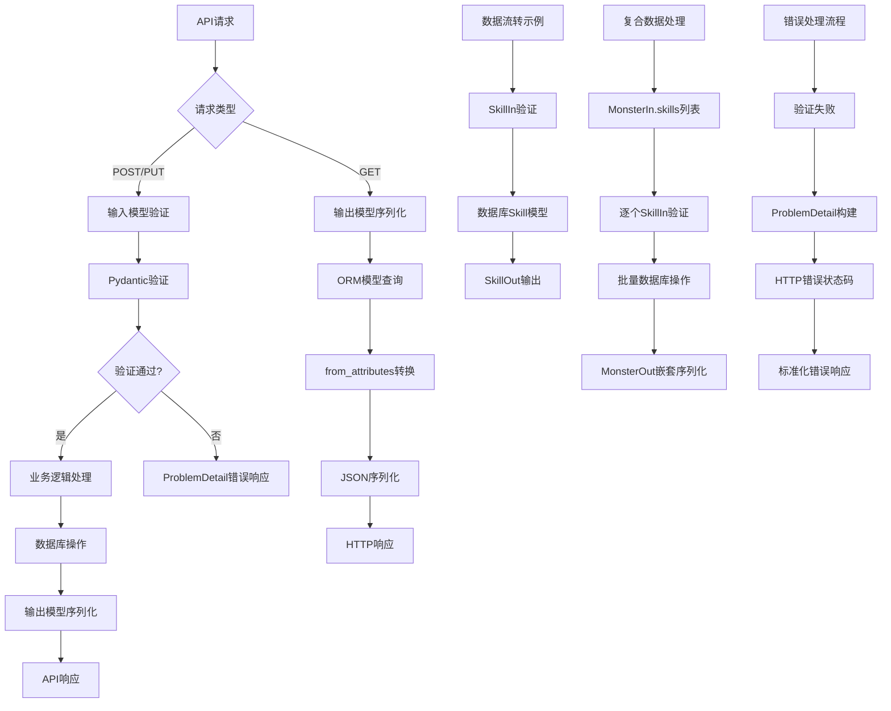

# 文件分析报告：server/app/schemas.py

## 文件概述

`server/app/schemas.py` 是FastAPI应用的数据模型定义文件，基于Pydantic框架构建了完整的API数据契约体系。该文件定义了怪物管理系统的核心数据结构，包括技能、怪物、收藏夹和自动匹配等功能模块的输入输出模型。采用类型安全的方式规范了API接口的数据格式，支持自动文档生成和数据验证。

## 代码结构分析

### 导入依赖

```python
from __future__ import annotations
from datetime import datetime
from typing import List, Optional, Dict, Any, Literal
from pydantic import BaseModel, Field
```

- **annotations**：启用延迟注解评估，支持前向类型引用
- **datetime**：时间戳字段的数据类型支持
- **typing模块**：完整的类型注解支持，包括泛型和字面量类型
- **pydantic**：数据验证和序列化框架，提供BaseModel基类和Field字段定义

### 全局变量和常量

该文件主要包含类定义，不包含全局变量定义。

### 配置和设置

#### Pydantic配置
```python
class Config:
    from_attributes = True
```

- **from_attributes**：允许从ORM对象属性创建Pydantic模型
- **自动序列化**：支持SQLAlchemy模型到Pydantic模型的自动转换

## 函数详细分析

### 函数概览表

该文件主要包含数据模型类定义，不包含独立函数。

### 函数详细说明

不适用 - 该文件为数据模型定义文件。

## 类详细分析

### 类概览表

| 类名 | 用途 | 类型 | 字段数量 | 主要功能 |
|------|------|------|----------|----------|
| `SkillIn` | 技能输入模型 | 输入类 | 5 | 技能创建和更新的数据验证 |
| `SkillOut` | 技能输出模型 | 输出类 | 6 | API响应的技能数据格式 |
| `DerivedOut` | 派生属性输出 | 输出类 | 5 | 怪物派生属性的数据结构 |
| `AutoMatchIn` | 自动匹配输入 | 输入类 | 1 | 自动匹配功能的参数 |
| `AutoMatchOut` | 自动匹配输出 | 输出类 | 4 | 自动匹配结果的数据格式 |
| `MonsterIn` | 怪物输入模型 | 输入类 | 14 | 怪物创建和更新的完整数据 |
| `MonsterOut` | 怪物输出模型 | 输出类 | 19 | API响应的怪物完整信息 |
| `MonsterList` | 怪物列表模型 | 列表类 | 4 | 分页查询的响应格式 |
| `ProblemDetail` | 错误详情模型 | 错误类 | 6 | 标准化的错误响应格式 |
| `CollectionIn` | 收藏夹输入模型 | 输入类 | 2 | 收藏夹创建的数据验证 |
| `CollectionOut` | 收藏夹输出模型 | 输出类 | 7 | 收藏夹信息的响应格式 |
| `CollectionBulkSetIn` | 批量操作输入 | 输入类 | 4 | 批量管理收藏夹成员 |

### 类详细说明

#### `SkillIn` - 技能输入模型
```python
class SkillIn(BaseModel):
    name: str = Field(..., description="技能名")
    element: Optional[str] = Field(None, description="技能属性（风/火/.../特殊）")
    kind: Optional[str] = Field(None, description="类型：物理/法术/特殊")
    power: Optional[int] = Field(None, description="威力")
    description: Optional[str] = Field("", description="技能描述")
```

**设计特点**：
- **必填字段**：name字段为必填，确保技能基本信息完整
- **可选属性**：element、kind、power等属性可选，适应不同技能类型
- **默认值**：description提供空字符串默认值
- **中文描述**：Field description使用中文，便于API文档理解

#### `MonsterIn` - 怪物输入模型
```python
class MonsterIn(BaseModel):
    name: str
    element: Optional[str] = None
    role: Optional[str] = None
    
    hp: float = 0
    speed: float = 0
    attack: float = 0
    defense: float = 0
    magic: float = 0
    resist: float = 0
    
    possess: bool = False
    new_type: Optional[bool] = None
    type: Optional[str] = None
    method: Optional[str] = None
    
    tags: List[str] = Field(default_factory=list)
    skills: List[SkillIn] = Field(default_factory=list)
```

**数据结构设计**：
- **基础信息**：name、element、role等基本属性
- **六维属性**：hp、speed、attack等数值属性，使用float类型支持小数
- **状态标记**：possess、new_type等布尔和可选字段
- **复合数据**：tags使用字符串列表，skills使用嵌套模型列表
- **默认工厂**：使用default_factory避免可变默认值陷阱

#### `MonsterOut` - 怪物输出模型
```python
class MonsterOut(BaseModel):
    id: int
    name: str
    # ... 基础字段同MonsterIn
    
    tags: List[str] = Field(default_factory=list)
    explain_json: Dict[str, Any] = Field(default_factory=dict)
    
    created_at: Optional[datetime] = None
    updated_at: Optional[datetime] = None
    
    derived: Optional[DerivedOut] = None
    image_url: Optional[str] = None
    
    class Config:
        from_attributes = True
```

**输出模型特性**：
- **标识字段**：包含id主键标识
- **时间戳**：created_at和updated_at记录时间信息
- **扩展数据**：explain_json存储额外的JSON数据
- **关联数据**：derived字段包含派生属性信息
- **媒体支持**：image_url字段支持图片关联
- **ORM集成**：Config.from_attributes支持SQLAlchemy模型转换

#### `CollectionBulkSetIn` - 批量操作输入模型
```python
class CollectionBulkSetIn(BaseModel):
    collection_id: Optional[int] = Field(None, description="收藏夹 ID（优先使用）")
    name: Optional[str] = Field(None, description="收藏夹名称（当未提供 ID 时使用；可触发按名创建）")
    ids: List[int] = Field(..., description="怪物 ID 列表（去重后处理）")
    action: Literal["add", "remove", "set"] = Field("add", description="批量操作类型")
```

**批量操作设计**：
- **灵活标识**：支持ID或名称两种方式指定收藏夹
- **操作类型**：Literal类型限制action为add/remove/set三种操作
- **数据去重**：文档说明ids列表会自动去重处理
- **默认行为**：action默认为add操作

#### `ProblemDetail` - 标准错误模型
```python
class ProblemDetail(BaseModel):
    type: str = "about:blank"
    title: str = "Bad Request"
    status: int = 400
    code: str = "BAD_REQUEST"
    detail: str = ""
    trace_id: str = ""
```

**错误处理标准**：
- **RFC 7807标准**：遵循Problem Details for HTTP APIs标准
- **默认值配置**：提供常见错误的默认值
- **链路追踪**：trace_id支持分布式系统的链路追踪
- **详细信息**：detail字段提供具体错误描述

## 函数调用流程图



## 变量作用域分析

### 模块作用域
- **导入模块**：datetime, typing, pydantic在模块级别可用
- **类定义**：所有模型类在模块作用域内定义

### 类作用域
- **字段定义**：每个类内部的字段定义和类型注解
- **Config类**：内嵌配置类定义Pydantic行为
- **Field描述**：字段级别的验证规则和文档说明

### 字段作用域
- **类型注解**：字段级别的类型约束
- **Field参数**：验证规则、默认值、描述信息
- **default_factory**：动态默认值生成函数

## 函数依赖关系

### 外部依赖
- **Pydantic框架**：BaseModel基类和Field字段定义
- **Python类型系统**：typing模块的类型注解支持
- **datetime模块**：时间戳字段的数据类型
- **FastAPI集成**：通过Pydantic与FastAPI的自动集成

### 内部依赖图
```
schemas.py模型体系
├── 基础输入输出模型
│   ├── SkillIn → SkillOut
│   ├── MonsterIn → MonsterOut
│   └── CollectionIn → CollectionOut
├── 复合模型
│   ├── MonsterIn.skills: List[SkillIn]
│   ├── MonsterOut.derived: DerivedOut
│   └── MonsterList.items: List[MonsterOut]
├── 批量操作模型
│   ├── CollectionBulkSetIn
│   ├── BulkSetMembersIn
│   └── BulkSetMembersOut
├── 自动匹配模型
│   ├── AutoMatchIn
│   └── AutoMatchOut
└── 错误处理模型
    └── ProblemDetail
```

### 数据流分析

#### API请求处理流程
1. **输入验证** → Pydantic自动验证 → 类型转换和约束检查
2. **业务处理** → 服务层逻辑 → 数据库操作
3. **输出序列化** → ORM to Pydantic → JSON响应

#### 模型继承和组合
1. **基础模型** → 通用字段定义 → 特化模型扩展
2. **嵌套模型** → 复合数据结构 → 层次化验证
3. **列表模型** → 分页和批量数据 → 统一响应格式

#### 错误处理流程
1. **验证错误** → Pydantic ValidationError → ProblemDetail转换
2. **业务错误** → 服务层异常 → 标准化错误响应
3. **系统错误** → 通用异常处理 → 错误信息脱敏

### 错误处理

#### 数据验证错误
- **类型错误**：Pydantic自动处理类型不匹配
- **必填字段缺失**：Field(...)配置强制必填验证
- **字符串长度限制**：min_length和max_length约束
- **枚举值限制**：Literal类型限制可选值范围

#### 业务逻辑错误
- **标准化响应**：ProblemDetail提供统一错误格式
- **链路追踪**：trace_id支持错误定位
- **错误分类**：code字段提供机器可读的错误类型

#### 序列化错误
- **from_attributes**：ORM对象到Pydantic模型的转换
- **JSON序列化**：复杂数据类型的JSON编码
- **时区处理**：datetime字段的时区序列化

### 性能分析

#### 时间复杂度
- **验证过程**：O(n) - n为字段数量
- **序列化过程**：O(n) - n为数据对象大小
- **嵌套验证**：O(n×m) - n为对象数量，m为字段数量

#### 空间复杂度
- **模型实例**：O(n) - n为字段数据大小
- **验证缓存**：O(1) - Pydantic内部缓存优化
- **序列化缓存**：O(1) - 模型定义级别的缓存

#### 性能优化特性
- **字段缓存**：Pydantic缓存字段定义和验证规则
- **类型检查优化**：编译时类型检查减少运行时开销
- **JSON编码优化**：orjson等高性能JSON库支持

### 算法复杂度

#### 数据验证算法
- **字段级验证**：O(1) - 单字段类型和约束检查
- **模型级验证**：O(n) - 遍历所有字段进行验证
- **嵌套模型验证**：O(n×d) - n为对象数量，d为嵌套深度

#### 序列化算法
- **属性访问**：O(1) - 直接属性访问
- **类型转换**：O(1) - 基础类型转换
- **JSON编码**：O(n) - n为数据结构大小

### 扩展性评估

#### 模型扩展性
- **继承扩展**：BaseModel支持类继承扩展
- **字段增加**：可无侵入地添加新字段
- **版本兼容**：Optional字段支持API版本演进
- **自定义验证**：validator装饰器支持自定义验证逻辑

#### 功能模块扩展性
- **新实体类型**：可快速添加新的业务实体模型
- **批量操作**：BulkSetIn模式可复用到其他实体
- **自动匹配**：AutoMatch模式可扩展到其他算法
- **收藏系统**：Collection模型可扩展到其他分类场景

#### API契约扩展性
- **自动文档**：Pydantic与FastAPI集成自动生成OpenAPI文档
- **多版本支持**：可定义多个版本的模型共存
- **向后兼容**：新字段默认值保证老版本客户端兼容
- **类型安全**：TypeScript代码生成确保前后端类型一致

### 代码质量评估

#### 可读性
- **清晰的命名**：模型名称准确反映业务含义
- **中文注释**：Field description使用中文便于理解
- **类型注解完整**：所有字段都有明确的类型定义
- **分组组织**：相关模型按业务功能分组

#### 可维护性
- **单一职责**：每个模型专注于特定的数据结构
- **松耦合设计**：模型间依赖关系清晰简洁
- **配置外部化**：验证规则通过Field参数配置
- **标准化规范**：遵循Pydantic和REST API最佳实践

#### 健壮性
- **类型安全**：静态类型检查防止类型错误
- **数据验证**：Pydantic提供运行时数据验证
- **错误处理**：ProblemDetail提供标准化错误处理
- **向后兼容**：Optional字段和默认值保证兼容性

#### 可测试性
- **模型独立**：数据模型可独立于业务逻辑测试
- **验证测试**：可轻松测试各种输入数据的验证结果
- **序列化测试**：可验证模型的JSON序列化行为
- **Mock友好**：纯数据模型易于创建测试数据

### 文档完整性

文件包含详细的Field description注释，结合Pydantic自动生成API文档，文档完整性良好。

### 备注

这是一个设计优良的API数据模型文件，充分利用了Pydantic的类型安全和验证特性。模型设计考虑了业务需求的完整性和API使用的便利性，体现了现代Python Web开发的最佳实践。特别是错误处理和批量操作的设计，展现了良好的API设计思维。