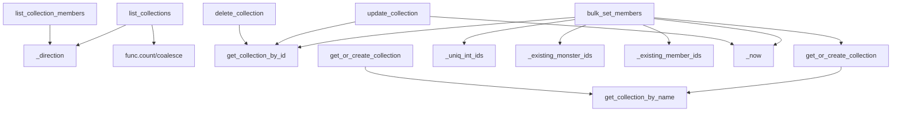

# 文件分析报告：collection_service.py

## 文件概述
collection_service.py 是一个综合性的收藏夹管理服务模块，提供了完整的收藏夹 CRUD 操作和成员管理功能。该文件实现了怪物收藏夹的创建、查询、更新、删除，以及批量成员操作（添加、移除、覆盖）等核心业务逻辑。

## 代码结构分析

### 导入依赖
```python
from __future__ import annotations
from datetime import datetime
from typing import Iterable, List, Optional, Tuple, Dict, Set
from sqlalchemy import select, func, asc, desc, delete
from sqlalchemy.exc import IntegrityError
from sqlalchemy.orm import Session, selectinload
from ..models import Monster, Collection, CollectionItem
```

### 全局变量和常量
无全局变量定义，使用函数式编程方式组织代码。

### 配置和设置
无显式配置设置，依赖数据库模型和 SQLAlchemy ORM。

## 函数详细分析

### 函数概览表

| 函数名 | 类型 | 参数数量 | 主要功能 |
|--------|------|----------|----------|
| `_direction` | 工具函数 | 1 | 排序方向转换 |
| `_uniq_int_ids` | 工具函数 | 1 | ID去重和类型转换 |
| `_now` | 工具函数 | 0 | 获取当前UTC时间 |
| `get_collection_by_id` | 查询函数 | 2 | 根据ID获取收藏夹 |
| `get_collection_by_name` | 查询函数 | 2 | 根据名称获取收藏夹 |
| `get_or_create_collection` | 创建函数 | 3 | 获取或创建收藏夹 |
| `update_collection` | 更新函数 | 4 | 更新收藏夹信息 |
| `delete_collection` | 删除函数 | 2 | 删除收藏夹 |
| `list_collections` | 列表函数 | 6 | 分页查询收藏夹列表 |
| `_existing_member_ids` | 工具函数 | 3 | 获取现有成员ID |
| `_existing_monster_ids` | 工具函数 | 2 | 验证怪物ID存在性 |
| `bulk_set_members` | 批量操作 | 6 | 批量管理收藏夹成员 |
| `list_collection_members` | 列表函数 | 6 | 分页查询收藏夹成员 |

### 函数详细说明

#### 工具函数组
- **_direction(order: str)**：将字符串排序方向转换为SQLAlchemy排序函数
- **_uniq_int_ids(ids: Iterable[int])**：对整数ID列表去重并类型转换
- **_now()**：返回当前UTC时间戳

#### CRUD操作组
- **get_collection_by_id**：通过主键ID查询单个收藏夹
- **get_collection_by_name**：通过名称查询收藏夹（支持唯一性校验）
- **get_or_create_collection**：惰性创建模式，存在则返回，不存在则创建
- **update_collection**：更新收藏夹的名称和颜色属性
- **delete_collection**：删除收藏夹及其关联的成员记录

#### 列表查询组
- **list_collections**：支持多字段排序、模糊搜索、分页的收藏夹列表查询
- **list_collection_members**：查询指定收藏夹内的怪物成员列表

#### 批量操作组
- **bulk_set_members**：核心批量操作函数，支持add/remove/set三种模式
- **_existing_member_ids**：查询收藏夹中已存在的成员ID
- **_existing_monster_ids**：验证怪物ID在数据库中的存在性

## 类详细分析

### 类概览表
本文件无类定义，完全采用函数式编程风格。

### 类详细说明
N/A - 该文件使用纯函数式架构，通过数据库Session参数传递实现状态管理。

## 函数调用流程图


## 变量作用域分析

### 模块级作用域
- 导入的模型类：Monster, Collection, CollectionItem
- SQLAlchemy函数：select, func, asc, desc, delete
- 类型提示：Iterable, List, Optional, Tuple, Dict, Set

### 函数级作用域
- **list_collections**：page, page_size, direction, cnt_sub, base, total_sub等查询构建变量
- **bulk_set_members**：col, want_ids, exist_ids, curr_ids, to_add, to_remove等成员操作变量
- **_existing_member_ids/_existing_monster_ids**：rows变量用于存储查询结果

### 临时变量管理
代码中大量使用临时变量进行查询结果的中间处理，特别是在批量操作和复杂查询中。

## 函数依赖关系

### 外部依赖
- **SQLAlchemy ORM**：Session, select, func等查询构建器
- **数据模型**：Monster, Collection, CollectionItem
- **Python标准库**：datetime, typing模块

### 内部依赖关系
1. **list_collections** → **_direction**（排序方向转换）
2. **bulk_set_members** → **get_or_create_collection**（收藏夹获取/创建）
3. **bulk_set_members** → **_uniq_int_ids, _existing_member_ids, _existing_monster_ids**（数据验证）
4. **get_or_create_collection** → **get_collection_by_name**（名称查重）

### 数据流方向
- 输入验证 → 数据查询 → 业务逻辑处理 → 数据库操作 → 结果返回
- 特殊处理：并发安全（IntegrityError捕获）和幂等操作设计