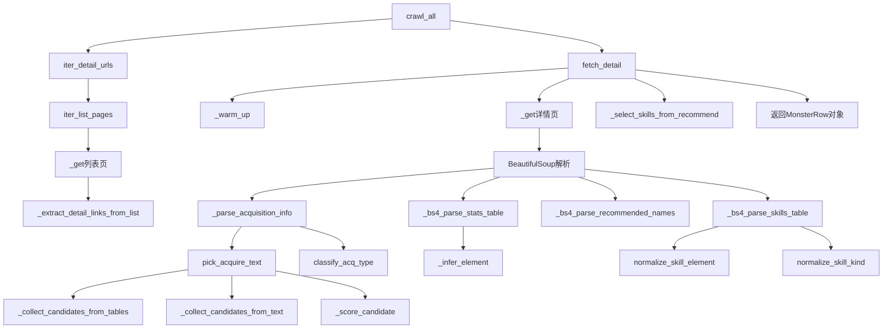

# 文件分析报告：server/app/services/crawler_service.py

## 文件概述
这是一个功能完整的4399卡布西游妖怪大全爬虫服务，专门用于从4399游戏网站爬取卡布西游游戏中的妖怪信息。该文件实现了一个智能化的网络爬虫，能够自动抓取妖怪的基础属性、技能信息、获取方式等详细数据，并对数据进行规范化处理和分类。

## 代码结构分析

### 导入依赖
```python
import re, time, random, json, logging
from dataclasses import dataclass, field
from typing import Dict, List, Generator, Iterable, Optional, Tuple, Set
from urllib.parse import urljoin, urlparse
import requests
from DrissionPage import SessionPage
from bs4 import BeautifulSoup, Tag
from bs4.dammit import UnicodeDammit
```

### 全局变量和常量
- `log`: 日志记录器
- `_INT`: 数字匹配正则表达式
- `_WS`: 空白字符正则表达式
- `_HEADER_WORDS`: 表格头部关键词集合

### 配置和设置
- `ACQ_KEYWORDS`: 获取渠道相关关键词列表，包含"获得方式"、"获取方式"等40多个关键词
- `POS_WORDS`: 正面获取方式关键词，如"获得"、"挑战"、"副本"等
- `NEGATIVE_TOKENS`: 无效值标识符，如"无"、"未知"、"暂无"等
- `BLOCK_PHRASES`: 需要过滤的干扰内容短语
- `CANON_ELEM_MAP`/`CANON_KIND_MAP`: 技能元素/类型规范化映射表
- `DATE_RE`/`ANCHOR_HEAD_RE`: 日期和获取方式锚点正则表达式

## 函数详细分析

### 函数概览表
| 函数名 | 用途 | 输入参数 | 返回值 | 复杂度 |
|--------|------|----------|--------|--------|
| `_to_int` | 字符串转整数 | `s: str` | `Optional[int]` | O(1) |
| `_clean` | 清理字符串空白 | `s: str` | `str` | O(n) |
| `_abs` | 构建绝对URL | `base: str, href: str` | `str` | O(1) |
| `_is_detail_link` | 判断是否为详情页链接 | `href: str` | `bool` | O(1) |
| `normalize_skill_element` | 规范化技能元素 | `e: Optional[str]` | `Optional[str]` | O(1) |
| `normalize_skill_kind` | 规范化技能类型 | `k: Optional[str]` | `Optional[str]` | O(1) |
| `_acq_clean` | 获取信息文本清理 | `x: str` | `str` | O(n) |
| `_is_negative_value` | 判断是否为无效值 | `text: str` | `bool` | O(1) |
| `_bad_block` | 判断是否为干扰块 | `text: str` | `bool` | O(m) |
| `pick_main_container` | 选择页面主容器 | `soup: BeautifulSoup` | `Tag` | O(1) |
| `_trim_acq_phrase` | 修剪获取方式短语 | `t: str` | `str` | O(n) |
| `_score_candidate` | 为获取候选项评分 | `text: str` | `int` | O(n) |
| `_collect_candidates_from_tables` | 从表格收集候选项 | `scope: Tag` | `List[Dict]` | O(n²) |
| `_collect_candidates_from_text` | 从文本收集候选项 | `scope: Tag` | `List[Dict]` | O(n²) |
| `pick_acquire_text` | 选择最佳获取方式文本 | `soup: BeautifulSoup` | `str` | O(n²) |
| `classify_acq_type` | 分类获取方式类型 | `acq_text: str` | `Tuple[Optional[str], Optional[bool]]` | O(m) |

### 函数详细说明

**核心解析函数：**
- `_to_int(s)`: 使用正则表达式从字符串中提取整数值，用于解析属性数值
- `_clean(s)`: 清理字符串中的多余空白字符，统一格式化
- `_acq_clean(x)`: 专门用于清理获取方式文本的特殊字符和编码问题

**URL和链接处理：**
- `_abs(base, href)`: 使用urljoin构建绝对URL路径
- `_is_detail_link(href)`: 检测链接是否指向妖怪详情页面

**数据规范化函数：**
- `normalize_skill_element/kind`: 将技能的元素和类型统一规范化，如"特"→"特殊"
- `_trim_acq_phrase`: 智能修剪获取方式文本，去除冗余信息
- `_score_candidate`: 使用启发式算法为获取方式候选项评分

**HTML解析辅助：**
- `pick_main_container`: 智能选择页面主要内容容器
- `_collect_candidates_from_tables/text`: 从不同HTML结构中提取获取方式候选信息

**分类识别：**
- `classify_acq_type`: 使用正则表达式模式匹配，将获取方式分类为"BOSS宠物"、"兑换/商店"、"活动获取宠物"等类型

## 类详细分析

### 类概览表
| 类名 | 用途 | 主要属性 | 主要方法 | 继承关系 |
|------|------|----------|----------|----------|
| `SkillRow` | 技能数据模型 | `name, level, element, kind, power, description` | `__init__` | `@dataclass` |
| `MonsterRow` | 妖怪数据模型 | `name, element, hp, speed, attack, defense, magic, resist` | `__init__` | `@dataclass` |
| `Kabu4399Crawler` | 主爬虫类 | `sp, throttle_range, max_retries, timeout` | `crawl_all, fetch_detail` | 无 |

### 类详细说明

**SkillRow 数据类：**
- 功能：表示妖怪的技能信息
- 核心属性：技能名称、等级、元素、类型、威力、描述
- 设计模式：使用dataclass装饰器简化数据类定义

**MonsterRow 数据类：**
- 功能：完整的妖怪信息模型
- 核心属性：基础信息（名称、元素）、六围属性（体力、速度、攻击、防御、法术、抗性）
- 扩展信息：获取方式、技能列表、推荐配招等
- 使用`field(default_factory=list)`处理列表类型的默认值

**Kabu4399Crawler 核心爬虫类：**
- 功能：实现完整的4399卡布西游爬虫逻辑
- 初始化参数：节流范围、最大重试次数、超时时间、请求头
- 核心特性：
  - 使用DrissionPage和BeautifulSoup双引擎解析
  - 智能节流机制防止被封IP
  - 自动重试机制提高成功率
  - 多策略HTML解析确保数据完整性

**主要方法分析：**
- `_warm_up()`: 预热连接，获取必要的Cookie
- `_get(url)`: 基础GET请求，包含重试和节流逻辑
- `_extract_detail_links_from_list()`: 从列表页提取详情页链接
- `iter_list_pages()`: 生成器，遍历所有妖怪列表页
- `iter_detail_urls()`: 生成器，获取所有详情页URL
- `_infer_element()`: 多策略推断妖怪元素类型
- `_parse_skills_table()`: 解析技能表格数据
- `_bs4_parse_stats_table()`: 使用BeautifulSoup解析属性表格
- `fetch_detail(url)`: 核心方法，抓取单个妖怪的完整信息
- `crawl_all()`: 顶层遍历方法，批量抓取所有妖怪数据

## 函数调用流程图


## 变量作用域分析

**全局作用域变量：**
- 常量定义：`ACQ_KEYWORDS`, `POS_WORDS`, `NEGATIVE_TOKENS`等配置常量
- 正则表达式：`_INT`, `_WS`, `DATE_RE`等编译后的正则对象
- 映射表：`CANON_ELEM_MAP`, `CANON_KIND_MAP`用于数据规范化

**类级别作用域：**
- `Kabu4399Crawler`类中的常量：`BASE`, `ROOT`, `CANDIDATE_SLUGS`
- 类属性映射：`SLUG2ELEM`, `ELEM_TOKENS`用于元素类型推断

**方法级别作用域：**
- 临时变量：各解析方法中的`soup`, `tables`, `rows`等HTML解析对象
- 循环变量：`for`循环中的迭代变量如`tr`, `td`, `skill`
- 返回值构建：`out`, `candidates`, `skills`等收集结果的列表

## 函数依赖关系

**核心依赖链：**
1. `crawl_all` → `fetch_detail` → 各解析方法
2. `fetch_detail` → `_bs4_parse_*` 系列方法 → 数据清理函数
3. `_parse_acquisition_info` → `pick_acquire_text` → 候选收集函数 → 评分函数

**数据流转路径：**
- HTML原始数据 → BeautifulSoup解析 → 表格/文本提取 → 数据清理 → 规范化 → MonsterRow对象

**辅助函数依赖：**
- 所有解析方法都依赖`_clean`, `_to_int`等基础工具函数
- 获取方式解析依赖复杂的文本处理函数链
- 技能解析依赖规范化函数确保数据一致性

**错误处理和容错：**
- 多层try-catch确保爬虫稳定性
- 多种解析策略提供备选方案
- 智能评分机制选择最优数据源

该文件展现了成熟的网络爬虫设计思路，通过多策略解析、智能数据清理、自动分类等技术，实现了对复杂网站结构的适应性抓取。