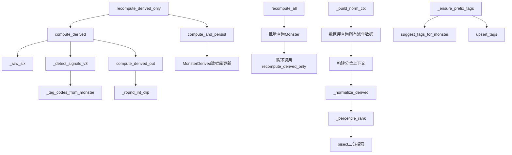

# 文件分析报告：server/app/services/derive_service.py

## 文件概述
这是妖怪派生属性计算服务，实现了基于妖怪基础六维属性和标签信息的新五轴战斗能力评估系统。该服务将传统的体力、攻击、防御、法术、速度、抗性六围属性转换为更具战术意义的五轴评估体系：体防、体抗、削防抗、削攻法、特殊战术，为游戏中的妖怪定位和策略分析提供科学依据。

## 代码结构分析

### 导入依赖
```python
import bisect
from typing import Dict, Tuple, List, Optional
from sqlalchemy.orm import Session
from sqlalchemy import select
from ..models import Monster, MonsterDerived
from .tags_service import suggest_tags_for_monster
from .monsters_service import upsert_tags
```

### 全局变量和常量
- `NEW_KEYS`: 新五轴属性名称列表，定义了计算输出的五个维度

### 配置和设置
- 五轴评估体系：体防、体抗、削防抗、削攻法、特殊战术
- 分值范围：0-120的整数评分系统
- 信号权重：基于标签的能力信号权重配置

## 函数详细分析

### 函数概览表
| 函数名 | 用途 | 输入参数 | 返回值 | 复杂度 |
|--------|------|----------|--------|--------|
| `_raw_six` | 提取妖怪六围属性 | `monster: Monster` | `Tuple[float, ...]` | O(1) |
| `_round_int_clip` | 数值四舍五入裁剪 | `v: float, hi: int` | `int` | O(1) |
| `_tag_codes_from_monster` | 提取标签代码 | `monster: Monster` | `List[str]` | O(n) |
| `_detect_signals_v3` | 检测能力信号 | `monster: Monster` | `Dict[str, float]` | O(n) |
| `compute_derived` | 计算派生属性原始值 | `monster: Monster` | `Dict[str, float]` | O(n) |
| `compute_derived_out` | 计算派生属性整数值 | `monster: Monster` | `Dict[str, int]` | O(n) |
| `_percentile_rank` | 计算百分位排名 | `sorted_vals: List[int], v: float` | `float` | O(log n) |
| `_build_norm_ctx` | 构建规范化上下文 | `db: Session` | `Dict[str, List[int]]` | O(n) |
| `_normalize_derived` | 规范化派生值 | `derived_int: Dict, norm_ctx: Dict` | `Dict[str, float]` | O(k) |
| `compute_and_persist` | 计算并持久化 | `db: Session, monster: Monster` | `MonsterDerived` | O(n) |
| `_ensure_prefix_tags` | 确保前缀标签 | `db: Session, monster: Monster` | `None` | O(n) |
| `recompute_derived_only` | 仅重算派生属性 | `db: Session, monster: Monster` | `MonsterDerived` | O(n) |
| `recompute_all` | 全库重算 | `db: Session` | `int` | O(n²) |

### 函数详细说明

**基础数据提取函数：**
- `_raw_six(monster)`: 安全提取妖怪的六维基础属性，处理空值和类型转换
- `_tag_codes_from_monster(monster)`: 从妖怪关联的标签中提取规范化代码（buf_/deb_/util_前缀）
- `_round_int_clip(v, hi)`: 将浮点数四舍五入并限制在0-120范围内

**信号检测与分析：**
- `_detect_signals_v3(monster)`: 核心信号检测函数，基于标签代码识别29种不同的战斗能力信号
  - 生存信号：治疗、护盾、减伤、反伤、免疫、净化等11种
  - 抑制信号：降防、降抗、破甲、降攻、封技等9种
  - 资源/非常规信号：PP消耗、中毒、禁疗、疲劳等9种

**派生属性计算：**
- `compute_derived(monster)`: 新五轴原始值计算的核心函数
  - 体防轴：0.45×体力 + 0.35×防御 + 0.10×抗性 + 生存信号权重
  - 体抗轴：0.45×体力 + 0.35×抗性 + 0.10×防御 + 抗异常信号权重
  - 削防抗轴：基于破甲、降防、降抗信号，包含联合加成机制
  - 削攻法轴：基于降攻、降法、封技信号
  - 特殊轴：基于PP压制、中毒、禁疗等非常规战术信号

**数据规范化：**
- `_percentile_rank(sorted_vals, v)`: 使用二分搜索计算百分位排名
- `_build_norm_ctx(db)`: 从数据库构建所有妖怪的五轴分布样本
- `_normalize_derived()`: 将0-120的绝对分值转换为0-100的相对百分位

**持久化与批处理：**
- `compute_and_persist()`: 计算派生属性并写入数据库
- `recompute_derived_only()`: 单个妖怪的派生属性重算
- `recompute_all()`: 全库批量重算，用于算法升级后的数据迁移

## 类详细分析

### 类概览表
该文件主要包含函数定义，没有自定义类，但大量使用了以下外部类：
| 类名 | 来源 | 用途 | 关键方法 |
|------|------|------|----------|
| `Monster` | `models` | 妖怪实体 | 属性访问 |
| `MonsterDerived` | `models` | 派生属性实体 | 五轴属性设置 |
| `Session` | `sqlalchemy.orm` | 数据库会话 | 查询和持久化 |

### 类详细说明

**Monster类使用模式：**
- 读取基础六维属性：hp, speed, attack, defense, magic, resist
- 访问关联标签：通过monster.tags获取标签信息
- 关联派生对象：通过monster.derived访问MonsterDerived实例

**MonsterDerived类操作：**
- 五轴属性设置：body_defense, body_resist, debuff_def_res, debuff_atk_mag, special_tactics
- 元数据记录：formula版本、inputs参数、weights权重、signals信号
- 时间戳维护：updated_at自动更新

## 函数调用流程图


## 变量作用域分析

**模块级作用域：**
- `NEW_KEYS`: 全局常量，定义五轴属性名称
- 导入的模块和类：Session, Monster, MonsterDerived等

**函数级作用域：**
- **计算函数**：`hp, speed, attack, defense, magic, resist`基础属性变量
- **信号函数**：`codes`标签代码集合，各种`has_code`布尔判断结果
- **派生计算**：`body_defense_base`, `body_defense_sig`等中间计算变量
- **规范化函数**：`sorted_vals`, `samples`等统计分析变量

**闭包和lambda作用域：**
- `has_code(*keys)`内部函数：检查标签代码存在性
- 权重配置：各种信号的数值权重系数

## 函数依赖关系

**核心计算依赖链：**
1. `recompute_derived_only` → `compute_derived` → `_detect_signals_v3` → `_tag_codes_from_monster`
2. `compute_derived` → `_raw_six` (基础属性提取)
3. `compute_derived_out` → `compute_derived` → `_round_int_clip`

**数据库操作依赖：**
- `compute_and_persist` 依赖SQLAlchemy Session进行ORM操作
- `_build_norm_ctx` 依赖数据库查询构建统计上下文
- `recompute_all` 依赖批量数据库操作

**外部服务依赖：**
- `tags_service.suggest_tags_for_monster`: 标签建议服务
- `monsters_service.upsert_tags`: 标签更新服务
- 这些依赖仅在可选的`_ensure_prefix_tags`功能中使用

**算法设计特点：**
- **权重驱动**：基于经验设定的信号权重系数
- **联合加成**：削防抗轴中的多信号协同加成机制
- **分段计算**：基础属性+信号加成的分层计算模式
- **边界处理**：0-120范围限制和空值安全处理

**性能优化考虑：**
- 使用`bisect`模块优化百分位计算（O(log n)复杂度）
- 批量操作支持全库重算
- 惰性规范化（可选的百分位转换）

该服务体现了游戏数值设计的复杂性，通过科学的权重配置和多维度评估，将复杂的战斗机制量化为易于理解和比较的五轴评分体系。