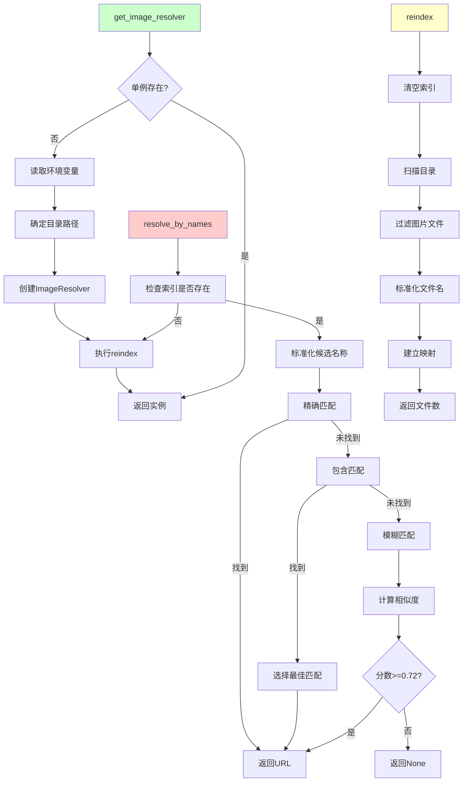
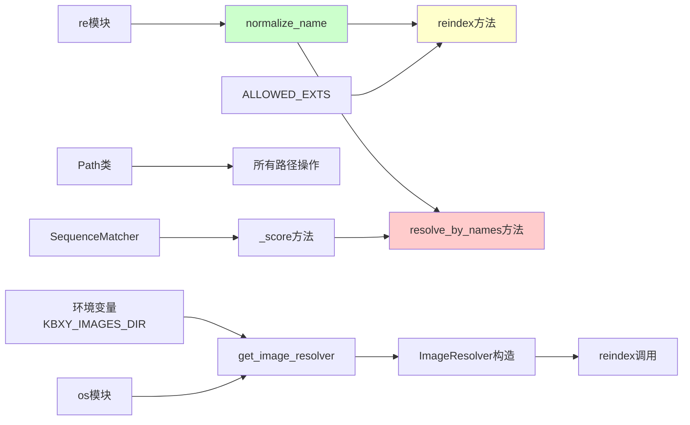

# 文件分析报告：server/app/services/image_service.py

## 文件概述

image_service.py是一个专门处理图片资源解析和匹配的服务模块，主要用于为怪物数据自动匹配对应的图片文件。该模块实现了智能的图片匹配算法，支持精确匹配、包含匹配和模糊相似度匹配等多种策略，并提供了完整的图片资源管理功能。

## 代码结构分析

### 导入依赖

```python
from __future__ import annotations
import os, re
from pathlib import Path
from typing import Dict, Optional, List, Tuple
from difflib import SequenceMatcher
```

该模块依赖Python标准库的路径处理、正则表达式、类型注解和字符串相似度算法。

### 全局变量和常量

```python
ALLOWED_EXTS = {".jpg", ".jpeg", ".png", ".gif", ".webp"}
_resolver: Optional[ImageResolver] = None
```

- `ALLOWED_EXTS`: 支持的图片文件扩展名集合
- `_resolver`: 全局单例ImageResolver实例

### 配置和设置

模块使用环境变量`KBXY_IMAGES_DIR`配置图片目录路径，默认使用项目相对路径`server/images/monsters`。

## 函数详细分析

### 函数概览表

| 函数名 | 类型 | 主要功能 | 复杂度 |
|--------|------|----------|--------|
| normalize_name | 工具函数 | 名称归一化处理 | 低 |
| get_image_resolver | 工厂函数 | 获取单例解析器 | 低 |

### 函数详细说明

#### 工具函数

**normalize_name(s: str) -> str**
- 功能：对文件名或怪物名进行标准化处理
- 处理步骤：
  1. 去除首尾空白并转小写
  2. 移除常见标点符号和特殊字符
  3. 仅保留中英文字母和数字
- 正则表达式：使用Unicode范围`\u4e00-\u9fa5`处理中文字符
- 返回：清理后的标准化字符串
- 复杂度：O(n)，n为字符串长度

**get_image_resolver() -> ImageResolver**
- 功能：获取全局ImageResolver单例实例
- 配置优先级：
  1. 环境变量`KBXY_IMAGES_DIR`
  2. 默认路径`server/images/monsters`
- 初始化：自动执行目录扫描和索引建立
- 单例模式：确保整个应用生命周期内只有一个实例

## 类详细分析

### 类概览表

| 类名 | 类型 | 主要功能 | 方法数量 |
|------|------|----------|----------|
| ImageResolver | 服务类 | 图片资源解析和匹配 | 5 |

### 类详细说明

**ImageResolver类**

该类是整个图片服务的核心，实现了完整的图片资源管理和智能匹配功能。

#### 构造函数
```python
def __init__(self, dir_path: Path, public_mount: str = "/media/monsters")
```
- `dir_path`: 图片文件存储的物理目录路径
- `public_mount`: 前端访问的公共URL路径前缀
- `_index`: 内部索引字典，映射标准化名称到文件名

#### 核心方法

**reindex() -> int**
- 功能：扫描目录并重建文件索引
- 处理逻辑：
  1. 清空现有索引
  2. 遍历目录中的所有文件
  3. 过滤支持的图片格式
  4. 提取文件名并标准化
  5. 建立映射关系
- 冲突处理：后扫描的文件覆盖先扫描的文件
- 返回值：索引中的文件数量
- 容错性：自动创建不存在的目录

**resolve_by_names(names: List[str]) -> Optional[str]**
- 功能：根据候选名称列表查找最佳匹配的图片
- 参数：多个候选名称（如怪物名、别名等）
- 匹配策略（按优先级）：
  1. **精确匹配**：标准化后完全一致
  2. **包含匹配**：名称包含于文件名，或文件名包含于名称
  3. **模糊匹配**：使用相似度算法，阈值0.72
- 返回：完整的前端可访问URL路径，找不到返回None

**_score(a: str, b: str) -> float**
- 功能：计算两个字符串的相似度
- 算法：使用`difflib.SequenceMatcher`
- 返回：0.0-1.0之间的相似度分数
- 用途：模糊匹配阶段的相似度计算

## 函数调用流程图



## 变量作用域分析

### 模块级作用域
- `ALLOWED_EXTS`: 常量集合，定义支持的图片格式
- `_resolver`: 全局单例变量
- `normalize_name`: 工具函数，可被外部模块调用
- `get_image_resolver`: 工厂函数，提供单例访问接口

### 类级作用域
- `ImageResolver`: 主要服务类
- 实例变量：`dir_path`, `public_mount`, `_index`
- 实例方法：具有完整的类内部访问权限

### 方法级作用域
- **reindex**: 局部变量包括路径遍历和文件处理临时变量
- **resolve_by_names**: 复杂的匹配逻辑，多层嵌套的局部作用域
- **normalize_name**: 简单的字符串处理，局部变量生命周期短

## 函数依赖关系



### 外部依赖
- **标准库依赖**: pathlib.Path, difflib.SequenceMatcher, re, os
- **环境配置**: KBXY_IMAGES_DIR环境变量
- **文件系统**: 图片文件存储目录

### 内部依赖
- ImageResolver类依赖normalize_name函数
- 单例模式确保全局状态一致性
- 方法间通过实例变量共享状态

## 数据流分析

### 初始化流程
1. **环境检测**: 读取配置确定图片目录
2. **目录扫描**: 遍历并索引所有有效图片文件
3. **索引构建**: 建立标准化名称到文件名的映射

### 查询流程
1. **输入处理**: 接收多个候选名称
2. **名称标准化**: 统一处理所有候选名称
3. **分层匹配**: 按精确度递减的顺序尝试匹配
4. **结果返回**: 返回最佳匹配的公共URL

### 匹配策略
- **精确匹配**: 最高优先级，保证准确性
- **包含匹配**: 处理部分匹配的情况
- **模糊匹配**: 兜底策略，处理名称变体

## 错误处理

### 异常处理策略
- **路径不存在**: 自动创建目录，优雅降级
- **权限问题**: 依赖操作系统的文件访问控制
- **文件格式错误**: 通过扩展名过滤，忽略无效文件

### 容错机制
- **空输入处理**: normalize_name对空字符串返回空字符串
- **索引缺失**: resolve_by_names自动触发重新索引
- **匹配失败**: 返回None而非抛出异常

## 性能分析

### 时间复杂度
- **reindex**: O(n)，n为目录中的文件数
- **精确匹配**: O(1)，利用字典查找
- **包含匹配**: O(n×m)，n为索引大小，m为候选名称数
- **模糊匹配**: O(n×m×k)，k为字符串比较复杂度

### 空间复杂度
- **索引存储**: O(n)，n为有效图片文件数
- **临时变量**: O(m)，m为候选名称数

### 优化策略
- **单例模式**: 避免重复索引构建
- **懒加载**: 仅在需要时触发reindex
- **早期退出**: 找到精确匹配立即返回

## 扩展性评估

### 优势
- **格式扩展**: 易于添加新的图片格式支持
- **匹配算法**: 可以插入新的匹配策略
- **配置灵活**: 支持环境变量配置
- **单例设计**: 全局状态管理清晰

### 扩展点
- **多目录支持**: 可扩展为支持多个图片目录
- **缓存机制**: 可添加文件修改时间检测
- **异步处理**: 可改造为异步IO模式
- **批量操作**: 支持批量匹配优化

### 改进建议
- **配置文件**: 替代硬编码的相似度阈值
- **日志记录**: 添加调试和监控信息
- **指标统计**: 记录匹配成功率和性能指标

## 代码质量评估

### 优点
- **类型注解完整**: 提供良好的IDE支持和文档价值
- **单一职责**: 专注于图片资源管理
- **算法分层**: 清晰的匹配策略优先级
- **容错性强**: 处理各种边界情况

### 潜在问题
- **硬编码常量**: 相似度阈值0.72应该可配置
- **性能考虑**: 大目录下的模糊匹配可能较慢
- **并发安全**: 单例模式在多线程环境下需要考虑同步

### 维护建议
- 添加单元测试覆盖各种匹配场景
- 考虑增加性能监控和日志记录
- 文档补充使用示例和最佳实践

## 文档完整性

### 函数文档
- normalize_name有详细的功能说明
- 主要方法都有docstring描述
- 复杂的匹配逻辑有内联注释

### 使用示例
该模块的典型使用场景：
- 怪物数据关联图片资源
- 动态图片URL生成
- 批量图片匹配和验证

### 注意事项
- 需要确保图片目录的读取权限
- 文件名标准化可能影响匹配精度
- 相似度阈值需要根据实际数据调整
- 单例模式要求谨慎处理并发访问