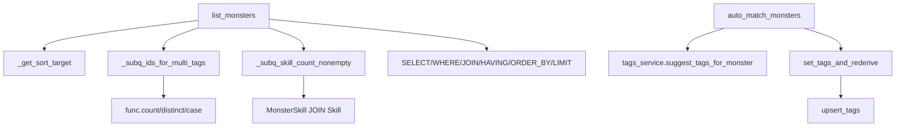

# 文件分析报告：monsters_service.py

## 文件概述
monsters_service.py 是系统的核心业务逻辑文件，主要负责怪物数据的查询、过滤、排序和批量操作功能。该文件实现了复杂的多维度查询系统，支持标签筛选（AND/OR逻辑）、元素/职业过滤、收藏分组、技能修复检测等高级功能，是整个怪物管理系统的数据访问层核心。

## 代码结构分析

### 导入依赖
```python
from __future__ import annotations
from typing import List, Tuple, Optional, Dict, Any
from sqlalchemy.orm import Session
from sqlalchemy import select, func, asc, desc, outerjoin, case, distinct, or_
from ..models import Monster, Tag, MonsterSkill, Skill, CollectionItem
```

### 全局变量和常量
无全局变量定义，使用纯函数式设计模式。

### 配置和设置

- 支持原始六维排序：HP、速度、攻击、防御、魔法、抗性
- 支持六维总和排序的多种别名

## 函数详细分析

### 函数概览表

| 函数名 | 类型 | 参数数量 | 主要功能 |
|--------|------|----------|----------|
| `_get_sort_target` | 工具函数 | 1 | 解析排序字段和JOIN需求 |
| `_subq_ids_for_multi_tags` | 子查询构建 | 2 | 构建多标签AND/OR查询 |
| `_subq_skill_count_nonempty` | 子查询构建 | 0 | 构建技能修复检测查询 |
| `list_monsters` | 核心查询 | 13 | 多维度怪物列表查询 |
| `upsert_tags` | 标签管理 | 2 | 标签批量创建和获取 |
| `set_tags_and_rederive` | 业务操作 | 4 | 设置标签并执行相关更新 |
| `auto_match_monsters` | 批量操作 | 2 | 自动匹配标签的批量处理 |

### 函数详细说明

#### 查询构建函数组
- **_get_sort_target(sort: str)**：解析排序字段和排序需求
- **_subq_ids_for_multi_tags**：构建复杂的标签AND/OR逻辑查询，使用HAVING子句实现精确匹配
- **_subq_skill_count_nonempty**：构建技能修复检测的子查询，统计非空技能数量

#### 核心业务函数
- **list_monsters**：系统最复杂的查询函数，支持多维度过滤（文本搜索、元素、职业、标签逻辑、获取类型、新类型标记、技能修复检测、收藏分组）
- **upsert_tags**：智能标签管理，支持批量创建不存在的标签并返回实体列表
- **set_tags_and_rederive**：高级业务操作，结合标签设置和相关计算
- **auto_match_monsters**：批量自动标签匹配，支持全量和指定ID列表处理

## 类详细分析

### 类概览表
本文件无类定义，完全采用函数式编程风格。

### 类详细说明
N/A - 该文件使用纯函数式架构，通过数据库Session和参数传递实现状态管理。

## 函数调用流程图


## 变量作用域分析

### 模块级作用域
- 导入的模型类：Monster, Tag, MonsterDerived, MonsterSkill, Skill, CollectionItem
- SQLAlchemy查询构建器：select, func, asc, desc, outerjoin, case, distinct, or_
- 类型提示：List, Tuple, Optional, Dict, Any

### 函数级作用域
- **list_monsters**：复杂的查询构建变量（base_stmt, rows_stmt, multi_subq, skills_cnt_subq等）
- **_get_sort_target**：排序字段映射字典（derived_map, raw_map）
- **_subq_ids_for_multi_tags**：标签逻辑处理变量（names_all, names_any, cnt_all, cnt_any）
- **auto_match_monsters**：批量处理状态变量（success, failed, details）

### 临时变量管理
代码中大量使用临时变量进行复杂查询的步骤化构建，特别是在多条件查询和子查询组合中。

## 函数依赖关系

### 外部依赖
- **SQLAlchemy ORM**：完整的查询构建和数据库操作能力
- **数据模型**：Monster, Tag, MonsterSkill, Skill, CollectionItem
- **服务模块**：tags_service（标签建议）

### 内部依赖关系
1. **list_monsters** → **_get_sort_target, _subq_ids_for_multi_tags, _subq_skill_count_nonempty**（查询构建）
2. **set_tags_and_rederive** → **upsert_tags**（标签管理）

4. **auto_match_monsters** → **tags_service.suggest_tags_for_monster**（标签建议）
5. **auto_match_monsters** → **set_tags_and_rederive**（标签设置）

### 数据流方向
- 查询参数验证 → 子查询构建 → 主查询组合 → 排序和分页 → 结果返回
- 批量操作：ID列表处理 → 逐个实体操作 → 错误捕获 → 统计汇总
- 标签操作：标签规范化 → 数据库同步 → 事务提交