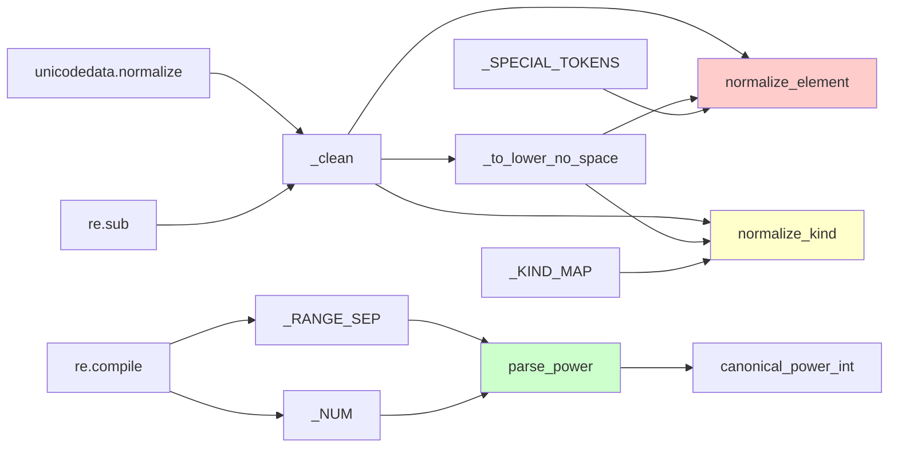

# 文件分析报告：server/app/services/normalization.py

## 文件概述

normalization.py是一个专门处理数据标准化的工具模块，主要用于统一和清理技能数据中的元素、类型、威力等字段。该模块提供了一套完整的数据规范化函数，确保从不同来源导入的数据能够保持一致的格式和标准，是整个数据处理流程中的重要组成部分。

## 代码结构分析

### 导入依赖

```python
from __future__ import annotations
import re
import unicodedata
from typing import Optional, Tuple
```

该模块依赖Python标准库的正则表达式、Unicode处理和类型注解功能，无外部依赖。

### 全局变量和常量

```python
__all__ = ["normalize_element", "normalize_kind", "parse_power", "canonical_power_int"]
_SPECIAL_TOKENS = {"特", "特殊", "无", "無", "无属性", "无系", "—", "-", "*"}
_KIND_MAP = {...}  # 详细的类型映射字典
_RANGE_SEP = re.compile(r"\s*(?:-|~|～|至|to)\s*", re.I)
_NUM = re.compile(r"\d+")
```

- `__all__`: 明确导出的公共函数列表
- `_SPECIAL_TOKENS`: 表示"特殊"或"无属性"的各种表示方式
- `_KIND_MAP`: 技能类型的标准化映射表
- `_RANGE_SEP`: 匹配威力范围分隔符的正则表达式
- `_NUM`: 提取数字的正则表达式

### 配置和设置

模块采用函数式设计，所有配置都通过常量定义，支持中英文混合输入的标准化处理。

## 函数详细分析

### 函数概览表

| 函数名 | 类型 | 主要功能 | 复杂度 |
|--------|------|----------|--------|
| _clean | 内部工具 | 基础文本清理和标准化 | 低 |
| _to_lower_no_space | 内部工具 | 转小写并去空格 | 低 |
| normalize_element | 公共接口 | 元素/属性标准化 | 中 |
| normalize_kind | 公共接口 | 技能类型标准化 | 中 |
| parse_power | 公共接口 | 威力值解析 | 高 |
| canonical_power_int | 工具函数 | 提取标准威力值 | 低 |

### 函数详细说明

#### 内部工具函数

**_clean(s: Optional[str]) -> str**
- 功能：基础文本清理和标准化
- 处理步骤：
  1. Unicode NFKC标准化（统一全角/半角字符）
  2. 去除首尾空白和控制字符
  3. 压缩多个连续空格为单个空格
- 返回：清理后的标准字符串
- 空值处理：None输入返回空字符串

**_to_lower_no_space(s: str) -> str**
- 功能：转为小写并去除所有空格
- 用途：用于不区分大小写和空格的键值比较
- 处理：链式调用_clean函数后进行转换

#### 元素标准化函数

**normalize_element(value: Optional[str]) -> Optional[str]**
- 功能：标准化技能的元素/属性字段
- 处理规则：
  1. **特殊值识别**：将"特"、"无"、"无属性"等统一为"特殊"
  2. **英文兼容**：支持"none"、"null"等英文输入
  3. **原文保留**：无法识别的值保持原文（已标准化）
- 返回：标准化后的元素名称或None
- 设计理念：保守处理，避免错误转换

#### 技能类型标准化函数

**normalize_kind(value: Optional[str]) -> Optional[str]**
- 功能：标准化技能的物理/法术/特殊类型
- 映射规则：
  - **物理类型**：物、物理、普攻、近战、physical → "物理"
  - **法术类型**：法、法术、技能、法攻、magic、spell → "法术"
  - **特殊类型**：特、特殊、变化、辅助、状态、support → "特殊"
- 拼音兼容：支持wuli、fashu、te等拼音输入
- 回退策略：无法识别时保留原文

#### 威力解析函数

**parse_power(value) -> Tuple[Optional[int], Optional[int], Optional[int], str]**
- 功能：解析复杂的威力值表示
- 支持格式：
  - **单一数值**：120、"120"
  - **范围表示**：90-120、90~120、90至120
  - **不等式**：≥120、≤120、120以上、120以下
  - **模糊表示**：约120、大约120
- 返回值：`(low, high, canonical, raw)`
  - `low`: 最小威力值
  - `high`: 最大威力值
  - `canonical`: 用于唯一键的标准值
  - `raw`: 原始输入字符串
- 算法逻辑：
  1. 数值提取：使用正则表达式找出所有数字
  2. 范围判断：识别分隔符确定是否为范围
  3. 边界处理：分析上下界关键词
  4. 标准化：区间以最小值作为canonical

**canonical_power_int(...) -> Optional[int]**
- 功能：从parse_power结果中提取用于数据库唯一键的整数值
- 优先级：canonical > low > None
- 用途：确保数据库中技能记录的唯一性标识

## 类详细分析

### 类概览表

该模块采用纯函数式设计，没有定义类。

### 类详细说明

无类定义。所有功能通过函数实现，确保无状态和线程安全。

## 函数调用流程图

```mermaid
graph TD
    A[输入数据] --> B{数据类型}
    
    B -->|元素/属性| C[normalize_element]
    C --> D[_clean清理]
    D --> E[_to_lower_no_space标准化]
    E --> F{特殊值匹配}
    F -->|匹配| G[返回"特殊"]
    F -->|不匹配| H[返回原文]
    
    B -->|技能类型| I[normalize_kind]
    I --> J[_clean清理]
    J --> K[_to_lower_no_space标准化]
    K --> L{映射表匹配}
    L -->|匹配| M[返回标准类型]
    L -->|不匹配| N[拼音兼容检查]
    N -->|匹配| M
    N -->|不匹配| O[返回原文]
    
    B -->|威力值| P[parse_power]
    P --> Q{输入类型}
    Q -->|数字| R[直接处理]
    Q -->|字符串| S[正则提取数字]
    S --> T{范围分隔符}
    T -->|存在| U[解析范围]
    T -->|不存在| V[单值处理]
    V --> W{边界关键词}
    W -->|上界| X[设置high]
    W -->|下界| Y[设置low]
    W -->|无| Z[设置单值]
    U --> AA[返回范围结果]
    R --> AA
    X --> AA
    Y --> AA
    Z --> AA
    
    AA --> BB[canonical_power_int]
    BB --> CC[提取标准值]
    
    style C fill:#ffcccc
    style I fill:#ffffcc
    style P fill:#ccffcc
```

## 变量作用域分析

### 模块级作用域
- `__all__`: 导出控制列表
- 映射常量：`_SPECIAL_TOKENS`, `_KIND_MAP`
- 正则表达式：`_RANGE_SEP`, `_NUM`
- 公共函数：对外提供的标准化接口

### 函数级作用域
- **normalize_element/normalize_kind**: 简单的变量作用域，主要是输入处理和查找逻辑
- **parse_power**: 复杂的局部变量管理，包括数字列表、匹配结果等
- **内部工具函数**: 作用域清晰，无副作用

### 数据流作用域
- 输入数据在函数间通过参数传递
- 中间结果通过返回值传递
- 无全局状态修改，确保函数纯度

## 函数依赖关系



### 外部依赖
- **标准库依赖**: re, unicodedata模块
- **无第三方依赖**: 保持模块的轻量性和可移植性

### 内部依赖
- 工具函数被多个标准化函数复用
- 常量定义支持多个函数的映射逻辑
- 函数间通过组合实现复杂功能

## 数据流分析

### 标准化流程
1. **输入接收**: 接受各种格式的原始数据
2. **基础清理**: 使用_clean进行Unicode和空白处理
3. **格式统一**: 转小写、去空格进行比较
4. **模式匹配**: 使用映射表或正则表达式识别
5. **结果输出**: 返回标准化后的数据或原文

### 威力解析流程
1. **类型检测**: 区分数字和字符串输入
2. **数字提取**: 使用正则表达式找出所有数值
3. **结构分析**: 识别范围、边界等语义结构
4. **结果构造**: 组装low、high、canonical三元组

## 错误处理

### 异常处理策略
- **输入容错**: 对None和空字符串进行安全处理
- **格式容错**: 无法识别的格式保留原文而非报错
- **类型容错**: parse_power支持多种输入类型

### 数据验证
- **边界检查**: 威力范围解析时确保low <= high
- **格式验证**: 通过正则表达式确保数字提取的准确性
- **一致性检查**: 标准化结果符合预期格式

## 性能分析

### 时间复杂度
- **基础标准化**: O(n)，n为字符串长度
- **映射查找**: O(1)，基于字典查找
- **正则匹配**: O(n)，n为输入字符串长度
- **威力解析**: O(n)，主要是正则表达式处理

### 空间复杂度
- **映射表存储**: O(k)，k为映射项数量
- **临时变量**: O(n)，n为输入数据大小
- **正则对象**: 编译后缓存，O(1)空间复用

### 优化特点
- **预编译正则**: 避免重复编译开销
- **常量映射**: 快速查找避免多次字符串比较
- **早期退出**: 匹配成功后立即返回

## 扩展性评估

### 优势
- **映射可配置**: 易于添加新的标准化规则
- **模块化设计**: 每个函数职责单一，易于扩展
- **国际化支持**: Unicode处理支持多语言
- **格式兼容**: 支持多种输入格式和表示方法

### 扩展点
- **新元素类型**: 扩展_SPECIAL_TOKENS和处理逻辑
- **新技能分类**: 扩展_KIND_MAP映射表
- **新威力格式**: 扩展parse_power的正则表达式
- **新语言支持**: 增加其他语言的关键词映射

### 改进建议
- **配置外部化**: 将映射表移到配置文件
- **性能监控**: 添加处理时间和成功率统计
- **日志记录**: 记录无法识别的输入用于改进

## 代码质量评估

### 优点
- **类型注解完整**: 提供清晰的接口定义
- **函数式设计**: 无副作用，易于测试和维护
- **文档字符串**: 主要函数都有详细说明
- **自检机制**: 包含基本的断言测试

### 代码风格
- **命名规范**: 函数和变量命名清晰明确
- **结构清晰**: 逻辑分层，从简单到复杂
- **注释充分**: 复杂逻辑有详细的内联注释

### 测试覆盖
- **自检断言**: 文件末尾包含基本测试用例
- **边界情况**: 处理了空值、特殊字符等边界情况
- **典型场景**: 覆盖了常见的数据格式变体

## 文档完整性

### 函数文档
- normalize_element和normalize_kind有清晰的规则说明
- parse_power有详细的格式支持列表
- 内部函数有简要的功能描述

### 使用示例
该模块的典型使用场景：
- 数据导入时的预处理
- 用户输入的标准化
- 数据库查询的一致性保证

### 注意事项
- Unicode标准化可能影响某些特殊字符
- 映射规则需要根据实际数据调整
- 威力范围解析的语义可能需要业务确认
- 保守的标准化策略避免数据丢失但可能产生重复