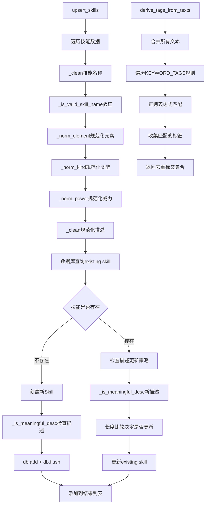

# 文件分析报告：server/app/services/skills_service.py

## 文件概述
这是技能数据处理服务，负责技能信息的标准化、验证、标签生成和数据库操作。该服务实现了基于技能描述的智能标签提取、技能属性规范化以及高效的批量upsert操作，为整个妖怪技能系统提供了数据处理的核心功能。

## 代码结构分析

### 导入依赖
```python
import re
from typing import List, Tuple, Iterable, Set, Optional
from sqlalchemy.orm import Session
from sqlalchemy import select
from ..models import Skill
```

### 全局变量和常量
- `KEYWORD_TAGS`: 技能描述关键词到标签的映射规则列表（20个映射规则）
- `TRIVIAL_DESCS`: 无意义描述文本集合，用于过滤空洞的技能描述

### 配置和设置
- 关键词匹配采用正则表达式模式
- 支持中文游戏技能描述的语言特性
- 技能唯一性基于四元组：`(name, element, kind, power)`

## 函数详细分析

### 函数概览表
| 函数名 | 用途 | 输入参数 | 返回值 | 复杂度 |
|--------|------|----------|--------|--------|
| `_clean` | 字符串清理 | `s: Optional[str]` | `str` | O(1) |
| `_is_meaningful_desc` | 判断描述是否有意义 | `s: str` | `bool` | O(n) |
| `_is_valid_skill_name` | 验证技能名称有效性 | `name: str` | `bool` | O(n) |
| `derive_tags_from_texts` | 从文本提取标签 | `texts: Iterable[str]` | `Set[str]` | O(nm) |
| `_norm_element` | 标准化技能元素 | `elem: Optional[str]` | `Optional[str]` | O(1) |
| `_norm_kind` | 标准化技能类型 | `kind: Optional[str]` | `Optional[str]` | O(1) |
| `_norm_power` | 标准化技能威力 | `power: Optional[int/str]` | `Optional[int]` | O(1) |
| `upsert_skills` | 批量插入或更新技能 | `db: Session, items: List[Tuple]` | `List[Skill]` | O(n²) |

### 函数详细说明

**文本处理与验证函数：**
- `_clean(s)`: 安全的字符串清理函数，处理None值并去除首尾空白
- `_is_meaningful_desc(s)`: 智能判断技能描述是否有意义
  - 过滤无效值：空字符串、"无"、"暂无"、数字等
  - 长度判断：至少6个字符或包含标点符号
  - 关键词检测：包含游戏术语如"提高"、"降低"、"回复"等
- `_is_valid_skill_name(name)`: 验证技能名称的有效性
  - 必须包含中文或英文字母
  - 排除纯数字、连字符等无意义符号

**智能标签生成：**
- `derive_tags_from_texts(texts)`: 核心标签提取函数
  - 合并多个文本为统一字符串（用分号连接）
  - 应用20种预定义的正则表达式规则
  - 识别战斗相关的关键能力：先手、驱散、净化、加速、控制等
  - 返回去重的标签集合

**数据规范化函数：**
- `_norm_element(elem)`: 技能元素标准化
  - 简单的字符串清理，空串转None
  - 为后续扩展预留映射空间
- `_norm_kind(kind)`: 技能类型规范化
  - 统一同义词：物攻→物理、法攻→法术、变化→特殊
  - 保持原有值的保守策略
- `_norm_power(power)`: 技能威力规范化
  - 支持int和str类型输入
  - 使用正则表达式提取数字值
  - 无效输入返回None

**核心业务逻辑：**
- `upsert_skills(db, items)`: 批量技能插入更新的核心函数
  - 采用四元组唯一键：`(name, element, kind, power)`
  - 智能描述更新策略：新描述更有意义或更长时才覆盖
  - 返回所有处理成功的Skill实体，供上层关系绑定使用

## 类详细分析

### 类概览表
该文件主要包含函数定义，没有自定义类，但大量使用了以下外部类：
| 类名 | 来源 | 用途 | 关键操作 |
|------|------|------|----------|
| `Skill` | `models` | 技能实体模型 | 属性设置、数据库操作 |
| `Session` | `sqlalchemy.orm` | 数据库会话 | 查询、插入、更新 |

### 类详细说明

**Skill模型的使用模式：**
- 四元组唯一性约束：name, element, kind, power
- 描述字段的智能更新策略
- 与数据库的ORM映射关系

**Session的操作模式：**
- 使用select语句进行精确查询
- scalar_one_or_none()方法处理唯一性查询
- add()和flush()用于新建实体并获取主键

## 函数调用流程图


## 变量作用域分析

**模块级作用域：**
- `KEYWORD_TAGS`: 全局常量，定义了20种技能描述到标签的映射规则
- `TRIVIAL_DESCS`: 全局常量，定义了无意义描述的判断标准

**函数级作用域：**
- **upsert_skills函数内**：
  - `results`: 累积成功处理的Skill实体列表
  - `name, element, kind, power, desc`: 循环中的技能属性变量
  - `stmt`: SQL查询语句对象
  - `skill`: 查询结果或新建的Skill实体
- **derive_tags_from_texts函数内**：
  - `merged`: 合并后的文本字符串
  - `tags`: 累积标签的集合
  - `pat, tag`: 循环中的正则模式和对应标签

**正则表达式作用域：**
- 编译后的正则对象在KEYWORD_TAGS中预定义
- 运行时通过re.search()进行模式匹配

## 函数依赖关系

**核心处理流程依赖：**
1. `upsert_skills` → 数据验证函数 → 规范化函数 → 数据库操作
2. `derive_tags_from_texts` → `KEYWORD_TAGS`配置 → 正则表达式匹配

**数据验证依赖链：**
- `_is_valid_skill_name` 依赖正则表达式进行名称有效性检查
- `_is_meaningful_desc` 依赖`TRIVIAL_DESCS`和正则模式进行描述质量评估

**规范化依赖链：**
- `_norm_element`, `_norm_kind`, `_norm_power` 依赖`_clean`进行基础清理
- `_norm_power` 额外依赖正则表达式进行数字提取

**数据库依赖：**
- 依赖SQLAlchemy ORM进行数据库操作
- 使用Skill模型的唯一约束进行冲突检测

**配置驱动的设计特点：**
- **关键词映射**：通过KEYWORD_TAGS配置实现可扩展的标签识别
- **同义词处理**：通过字典映射统一不同表达方式
- **质量控制**：多层验证确保数据质量
- **智能更新**：基于内容质量的描述更新策略

**性能优化考虑：**
- 批量处理减少数据库交互次数
- 预编译正则表达式提高匹配效率
- 智能跳过无效数据减少无用操作

该服务体现了数据处理服务的最佳实践，通过配置驱动、智能验证、批量处理等技术，实现了高质量、高效率的技能数据标准化处理。